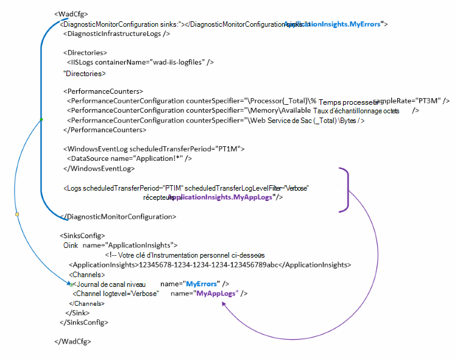

<properties
   pageTitle="Configurer les Diagnostics Azure pour envoyer des données Application analyse | Microsoft Azure"
   description="Mettre à jour la configuration publique Azure Diagnostics pour envoyer des données analyse de l’Application."
   services="multiple"
   documentationCenter=".net"
   authors="sbtron"
   manager="douge"
   editor="" />
<tags
   ms.service="application-insights"
   ms.devlang="na"
   ms.topic="article"
   ms.tgt_pltfrm="na"
   ms.workload="na"
   ms.date="12/15/2015"
   ms.author="saurabh" />

# Configurer les Diagnostics Azure pour envoyer des données analyse d’Application

Diagnostics de Windows Azure stocke les données dans les tables de stockage Azure.  Toutefois, vous pouvez également toutes les barre verticale ou un sous-ensemble de données d’analyse de l’Application en configurant des « récepteurs » et « canaux » dans votre configuration lors de l’utilisation d’extension Azure Diagnostics 1.5 ou version ultérieure.

Cet article décrit comment créer la configuration pour l’extension Azure Diagnostics publique afin que son est configuré pour envoyer des données analyse de l’Application.

## Configuration d’Application perspectives comme un récepteur

L’extension diagnostics de Windows Azure 1,5 présente la **<SinksConfig>** élément dans la configuration du publique. Cette opération définit le supplémentaires *récepteur* où les données Azure diagnostics peuvent être envoyées. Vous pouvez spécifier les détails de la ressource Application Insights dans laquelle vous souhaitez envoyer les données de diagnostic Azure dans le cadre du présent **<SinksConfig>**.
Exemple **SinksConfig** ressemble à ceci :  

    <SinksConfig>
        <Sink name="ApplicationInsights">
          <ApplicationInsights>{Insert InstrumentationKey}</ApplicationInsights>
          <Channels>
            <Channel logLevel="Error" name="MyTopDiagData"  />
            <Channel logLevel="Verbose" name="MyLogData"  />
          </Channels>
        </Sink>
      </SinksConfig>

Pour l’élément **récepteur de** l’attribut *name* spécifie une valeur de chaîne qui sera utilisée par le renvoi aurait le récepteur.
L’élément **ApplicationInsights** spécifie clé instrumentation de la ressource de perspectives Application laquelle seront envoyées les données de diagnostic Azure. Si vous ne disposez d’une ressource Application perspectives, voir [créer une nouvelle ressource Application perspectives](./application-insights/app-insights-create-new-resource.md) pour plus d’informations sur la création d’une ressource et l’obtention de la clé d’instrumentation.

Si vous développez un projet de Service Cloud avec Azure SDK 2,8 cette touche instrumentation est remplie automatiquement dans la configuration du publique en fonction du paramètre de configuration du service **APPINSIGHTS_INSTRUMENTATIONKEY** lors de la compression le projet de service cloud. Voir [Utiliser Application analyse avec Azure Diagnostics pour résoudre les problèmes de Service Cloud](./cloud-services/cloud-services-dotnet-diagnostics-applicationinsights.md).

L’élément de **canaux** vous permet de définir un ou plusieurs éléments **d’un canal** pour les données qui seront envoyées au récepteur. Le canal se comporte comme un filtre et vous pouvez sélectionner des niveaux de journal spécifique envoyer au récepteur souhaité. Par exemple vous pouvez recueillir les fichiers journaux détaillés et les envoyer vers le stockage, mais vous pouvez choisir de définir un canal avec un niveau de journalisation d’erreur et lorsque vous envoyez des journaux via que les journaux d’erreur uniquement canal seront envoyés à ce récepteur.
D’un **canal** l’attribut *name* est utilisé pour faire référence unique à ce canal.
L’attribut *loglevel* vous permet de spécifier le niveau de journalisation qui permet du canal. Les niveaux de journal disponibles dans l’ordre des informations plus minimum sont
 - Commentaires
 - Informations
 - Avertissement
 - Erreur
 - Critique

## Envoyer des données vers le récepteur de perspectives d’Application
Une fois que le récepteur d’analyse de l’Application a été défini vous pouvez envoyer des données à ce récepteur en ajoutant l’attribut *récepteur* aux éléments sous le nœud **DiagnosticMonitorConfiguration** . Ajout de l’élément *récepteurs* à chaque nœud indique que les données collectées à partir de ce nœud et n’importe quel nœud sous envoi au récepteur spécifié.

Par exemple, si vous souhaitez envoyer toutes les données collectées par les diagnostics de Windows Azure vous pouvez ajouter l’attribut *récepteur* directement au nœud **DiagnosticMonitorConfiguration** . Définir la valeur des *récepteurs* le nom de récepteur qui a été spécifié dans le **SinkConfig**.

    <DiagnosticMonitorConfiguration overallQuotaInMB="4096" sinks="ApplicationInsights">

Si vous souhaitez envoyer les journaux d’erreur uniquement l’analyse des applications récepteur puis vous pouvez définir la valeur *récepteurs* au nom récepteur suivi par le nom du canal séparé par un point («. »). Par exemple, pour envoyer les journaux d’erreur uniquement l’analyse des applications récepteur d’utiliser le canal MyTopDiagdata qui a été défini dans la SinksConfig ci-dessus.  

    <DiagnosticMonitorConfiguration overallQuotaInMB="4096" sinks="ApplicationInsights.MyTopDiagdata">

Si vous voulez uniquement envoyer les journaux d’application détaillée analyse de l’Application vous ajouteriez puis l’attribut *récepteurs* vers le nœud **journaux** .

    <Logs scheduledTransferPeriod="PT1M" scheduledTransferLogLevelFilter="Verbose" sinks="ApplicationInsights.MyLogData"/>

Vous pouvez également inclure plusieurs récepteurs dans la configuration à différents niveaux dans la hiérarchie. Dans ce cas le récepteur spécifié au niveau supérieur de la hiérarchie joue un paramètre global et celle spécifiée à l’élément individuel élément comportements comme une substitution de ce paramètre global.    

Voici un exemple complet du fichier de configuration public qui envoie toutes les erreurs Insights Application (spécifiée au niveau du nœud **DiagnosticMonitorConfiguration** ) et les journaux de niveau plus détaillés pour les journaux d’Application (spécifiée au niveau du nœud **journaux** ).

    <WadCfg>
      <DiagnosticMonitorConfiguration overallQuotaInMB="4096"
           sinks="ApplicationInsights.MyTopDiagData"> <!-- All info below sent to this channel -->
        <DiagnosticInfrastructureLogs />
        <PerformanceCounters>
          <PerformanceCounterConfiguration counterSpecifier="\Processor(_Total)\% Processor Time" sampleRate="PT3M" sinks="ApplicationInsights.MyLogData/>
          <PerformanceCounterConfiguration counterSpecifier="\Memory\Available MBytes" sampleRate="PT3M" />
          <PerformanceCounterConfiguration counterSpecifier="\Web Service(_Total)\Bytes Total/Sec" sampleRate="PT3M" />
        </PerformanceCounters>
        <WindowsEventLog scheduledTransferPeriod="PT1M">
          <DataSource name="Application!*" />
        </WindowsEventLog>
        <Logs scheduledTransferPeriod="PT1M" scheduledTransferLogLevelFilter="Verbose"
                sinks="ApplicationInsights.MyLogData"/> <!-- This specific info sent to this channel -->
      </DiagnosticMonitorConfiguration>

    <SinksConfig>
        <Sink name="ApplicationInsights">
          <ApplicationInsights>{Insert InstrumentationKey}</ApplicationInsights>
          <Channels>
            <Channel logLevel="Error" name="MyTopDiagData"  />
            <Channel logLevel="Verbose" name="MyLogData"  />
          </Channels>
        </Sink>
      </SinksConfig>
    </WadCfg>

Il existe certaines limitations importantes de cette fonctionnalité

- Canaux sont uniquement destinés à travailler avec pas les compteurs de performance et de type journal. Si vous spécifiez un canal avec un élément de compteur de performances que sont ignorée.
- Le niveau de journalisation pour un canal ne peut pas dépasser le niveau de journalisation pour ce qui est collecté par les diagnostics de Windows Azure. Par exemple : vous ne pouvez pas recueillir les erreurs dans le journal de l’Application dans l’élément journaux et tentent d’envoyer des commentaires journaux au récepteur d’aperçu de l’Application. L’attribut *scheduledTransferLogLevelFilter* doit toujours collecter égale ou plus de journaux que les journaux que vous essayez d’envoyer à un récepteur.
- Impossible d’envoyer des données blob collectées par extension diagnostics de Windows Azure analyse de l’Application. Par exemple rien spécifiée sous le nœud *répertoires* . Pour blocage exporte le vidage réel sera toujours envoyé aux stockage blob et uniquement une notification que le vidage a été généré sera envoyée aux analyses de l’Application.

## Étapes suivantes

- Utiliser [PowerShell](./cloud-services/cloud-services-diagnostics-powershell.md) pour activer l’extension diagnostics de Windows Azure pour votre application. 
- Utilisez [Visual Studio](vs-azure-tools-diagnostics-for-cloud-services-and-virtual-machines.md) pour activer l’extension diagnostics de Windows Azure pour votre application
