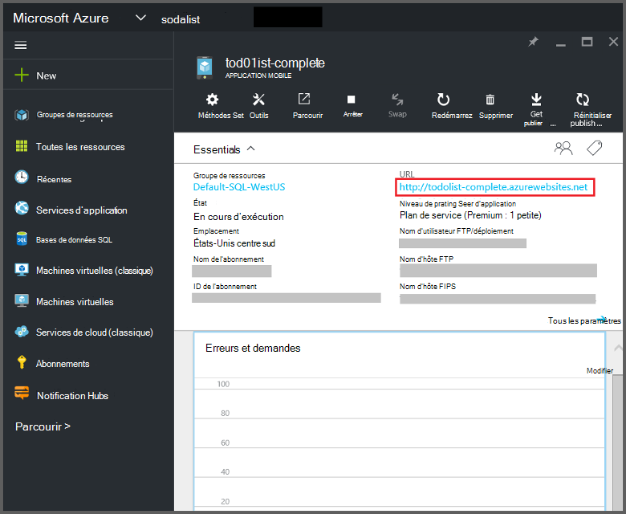
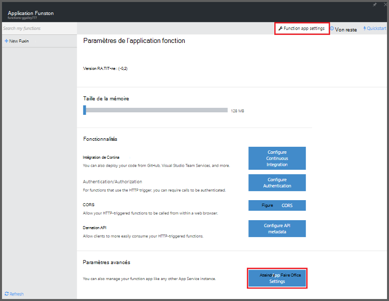
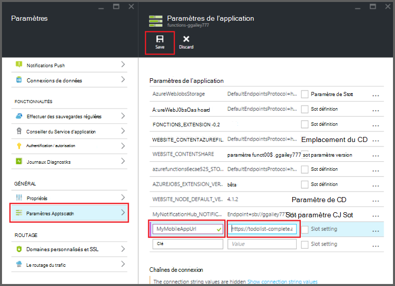

<properties
    pageTitle="Liaisons fonctions Mobile applications Azure | Microsoft Azure"
    description="Comprendre l’utilisation des liaisons applications Mobile Azure dans des fonctions Azure."
    services="functions"
    documentationCenter="na"
    authors="ggailey777"
    manager="erikre"
    editor=""
    tags=""
    keywords="Azure fonctionne, fonctions, traitement des événements, cluster dynamique, architecture sans serveur"/>

<tags
    ms.service="functions"
    ms.devlang="multiple"
    ms.topic="reference"
    ms.tgt_pltfrm="multiple"
    ms.workload="na"
    ms.date="08/30/2016"
    ms.author="glenga"/>

# Liaisons fonctions Mobile applications Azure

[AZURE.INCLUDE [functions-selector-bindings](../../includes/functions-selector-bindings.md)]

Cet article explique comment configurer et liaisons d’applications Mobile Azure code dans des fonctions Azure. 

[AZURE.INCLUDE [intro](../../includes/functions-bindings-intro.md)] 

Azure Application Service Mobile applications vous permet d’exposer les données de point de terminaison de table pour les clients mobiles. Ces mêmes données sous forme de tableau peuvent être utilisées avec les deux d’entrée et de sortie liaisons dans les fonctions Azure. Étant donné que schéma dynamique pris en charge, une application mobile du serveur principal Node.js est idéale pour exposer les données sous forme de tableau pour une utilisation avec vos fonctions. Schéma dynamique est activée par défaut et doit être désactivé dans une application mobile production. Pour plus d’informations sur les points de terminaison de tableau dans un serveur principal Node.js, voir [vue d’ensemble : opérations sur la table](../app-service-mobile/app-service-mobile-node-backend-how-to-use-server-sdk.md#TableOperations). Dans les applications mobiles, le système principal Node.js prend en charge dans portail navigation et la modification des tables. Pour plus d’informations, voir [dans portail modification](../app-service-mobile/app-service-mobile-node-backend-how-to-use-server-sdk.md#in-portal-editing) dans la rubrique Node.js SDK. Lorsque vous utilisez une application mobile du serveur principal .NET avec fonctions Azure, vous devez mettre à jour manuellement votre modèle de données comme requis par votre fonction. Pour plus d’informations sur les points de terminaison de tableau dans une application mobile du serveur principal .NET, voir [Comment : définir un contrôleur de table](../app-service-mobile/app-service-mobile-dotnet-backend-how-to-use-server-sdk.md#define-table-controller) dans la rubrique .NET principal SDK. 

## Créer une variable d’environnement pour l’URL de votre serveur principal application mobile

Liaisons applications Mobile nécessitent actuellement vous permet de créer une variable d’environnement qui renvoie l’URL de la version serveur application mobile lui-même. Cette URL sont accessibles dans le [portail Azure](https://portal.azure.com) localisez votre application mobile et ouvrez la carte.

Pour définir cette URL comme une variable d’environnement dans votre application de la fonction :

1. Dans votre application de la fonction dans le [portail de fonctions Azure](https://functions.azure.com/signin), cliquez sur **paramètres de l’application fonction** > **accédez à paramètres du Service d’application**. 

    

2. Dans votre application de la fonction, cliquez sur **tous les paramètres**, faites défiler jusqu'à **paramètres de l’Application**, puis sous type de **paramètres de l’application** d’un nouveau **nom** pour la variable d’environnement, collez l’URL dans la **valeur**, en prenant soin à utiliser le jeu de HTTPS, puis cliquez sur **Enregistrer** et fermer la carte de l’application de fonction pour retourner dans le portail de fonctions.   

    

Vous pouvez maintenant définir cette nouvelle variable d’environnement en tant que le champ de *connexion* dans vos liaisons.

## Utiliser une clé d’API pour sécuriser l’accès à vos points de terminaison de table applications Mobile.

Dans les fonctions Azure, liaisons table mobile vous permettent de spécifier une clé d’API, ce qui correspond à un secret partagé qui peut être utilisé pour empêcher tout accès indésirable à partir des applications différent de vos fonctions. Applications Mobile n’a pas de prise en charge intégrée pour l’authentification par clé API. Toutefois, vous pouvez implémenter une clé de l’API dans votre application mobile du serveur principal Node.js en suivant les exemples dans [Azure Application Service Mobile applications système principal une clé API de mise en œuvre](https://github.com/Azure/azure-mobile-apps-node/tree/master/samples/api-key). Vous pouvez même implémenter une clé API dans une [application mobile .NET principal](https://github.com/Azure/azure-mobile-apps-net-server/wiki/Implementing-Application-Key).

>[AZURE.IMPORTANT] Cette clé API ne doit pas être distribuée avec vos clients de l’application mobile, il doit être uniquement distribué en toute sécurité aux clients côté service, comme les fonctions Azure. 

## Liaison de saisie Azure applications Mobile

Liaisons d’entrée peuvent charger un enregistrement à partir d’un point de terminaison table mobile et passez directement à votre liaison. L’enregistrement QU'ID est déterminé en fonction du déclencheur ayant appelé la fonction. Dans une fonction c#, toutes les modifications apportées à l’enregistrement sont envoyées automatiquement vers la table lorsque la fonction a quitté avec succès.

#### Function.JSON pour la liaison d’entrée applications Mobile

Le fichier *function.json* prend en charge les propriétés suivantes :

- `name`: Nom variable utilisé dans le code de la fonction du nouvel enregistrement.
- `type`: Salle type doit être définie sur *mobileTable*.
- `tableName`: La table dans laquelle le nouvel enregistrement est créé.
- `id`: L’ID de l’enregistrement à récupérer. Prend en charge cette propriété liaisons semblables à `{queueTrigger}`, qui utilise la valeur de chaîne du message file d’attente en tant que l’enregistrement identifiant.
- `apiKey`: Chaîne qui est le paramètre d’application qui spécifie la clé API facultative pour l’application mobile. Ceci est obligatoire lorsque votre application mobile utilise une clé d’API pour limiter l’accès client.
- `connection`: Chaîne qui est le nom de la variable d’environnement dans les paramètres de l’application qui spécifie l’URL de votre serveur principal de l’application mobile.
- `direction`: Direction, qui doit être définie sur *dans*la liaison.

Exemple de fichier *function.json* :

    {
      "bindings": [
        {
          "name": "record",
          "type": "mobileTable",
          "tableName": "MyTable",
          "id" : "{queueTrigger}",
          "connection": "My_MobileApp_Url",
          "apiKey": "My_MobileApp_Key",
          "direction": "in"
        }
      ],
      "disabled": false
    }

#### Exemple de code Azure applications Mobile d’un déclencheur c# file d’attente

Selon la function.json exemple ci-dessus, le récupère liaison d’entrée l’enregistrement à partir d’un Apps Mobile table point de terminaison de l’ID qui correspond à la chaîne de message file d’attente et les transmet au paramètre *d’enregistrement* . Lorsque l’enregistrement n’est pas trouvé, le paramètre est null. L’enregistrement est puis mis à jour avec la nouvelle valeur de *texte* lors de la fermeture de la fonction.

    #r "Newtonsoft.Json"    
    using Newtonsoft.Json.Linq;
    
    public static void Run(string myQueueItem, JObject record)
    {
        if (record != null)
        {
            record["Text"] = "This has changed.";
        }    
    }

#### Exemple de code Azure applications Mobile d’un déclencheur file d’attente Node.js

Selon la function.json exemple ci-dessus, le récupère liaison d’entrée l’enregistrement à partir d’un Apps Mobile table point de terminaison de l’ID qui correspond à la chaîne de message file d’attente et les transmet au paramètre *d’enregistrement* . Dans les fonctions Node.js, les enregistrements mis à jour ne sont pas envoyées à la table. Cet exemple de code écrit l’enregistrement récupéré dans le journal.

    module.exports = function (context, input) {    
        context.log(context.bindings.record);
        context.done();
    };

## Liaison de sortie des applications mobiles Azure

Votre fonction peut écrire un enregistrement sur un point de terminaison de table applications Mobile à l’aide d’une liaison de sortie. 

#### liaison de sortie Function.JSON pour les applications mobiles

Le fichier function.json prend en charge les propriétés suivantes :

- `name`: Nom variable utilisé dans le code de la fonction du nouvel enregistrement.
- `type`: Type de liaison doit être définie sur *mobileTable*.
- `tableName`: La table dans laquelle le nouvel enregistrement est créé.
- `apiKey`: Chaîne qui est le paramètre d’application qui spécifie la clé API facultative pour l’application mobile. Ceci est obligatoire lorsque votre application mobile utilise une clé d’API pour limiter l’accès client.
- `connection`: Chaîne qui est le nom de la variable d’environnement dans les paramètres de l’application qui spécifie l’URL de votre serveur principal de l’application mobile.
- `direction`: Direction liaison, qui doit être définie à *Déconnecter*.

Exemple function.json :

    {
      "bindings": [
        {
          "name": "record",
          "type": "mobileTable",
          "tableName": "MyTable",
          "connection": "My_MobileApp_Url",
          "apiKey": "My_MobileApp_Key",
          "direction": "out"
        }
      ],
      "disabled": false
    }

#### Exemple de code Azure applications Mobile d’un déclencheur c# file d’attente

Cet exemple de code c# insère un nouvel enregistrement dans un point de terminaison du tableau applications Mobile avec une propriété *Text* dans la table spécifiée dans la liaison ci-dessus.

    public static void Run(string myQueueItem, out object record)
    {
        record = new {
            Text = $"I'm running in a C# function! {myQueueItem}"
        };
    }

#### Exemple de code Azure applications Mobile d’un déclencheur file d’attente Node.js

Cet exemple de code Node.js insère un nouvel enregistrement dans un point de terminaison du tableau applications Mobile avec une propriété *text* dans la table spécifiée dans la liaison ci-dessus.

    module.exports = function (context, input) {
    
        context.bindings.record = {
            text : "I'm running in a Node function! Data: '" + input + "'"
        }   
    
        context.done();
    };

## Étapes suivantes

[AZURE.INCLUDE [next steps](../../includes/functions-bindings-next-steps.md)]
