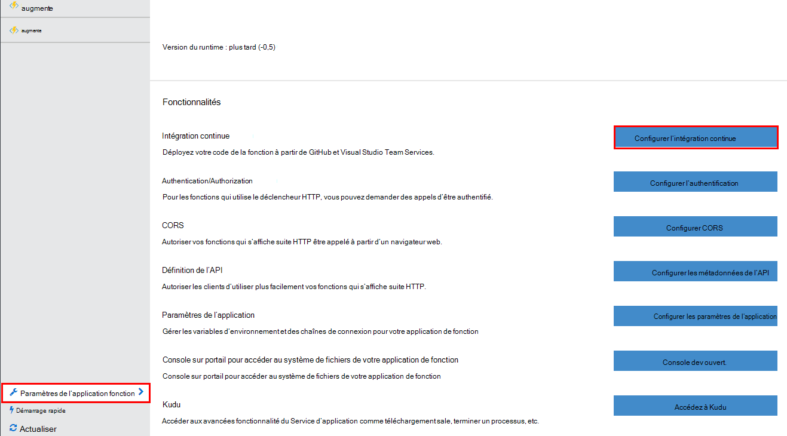
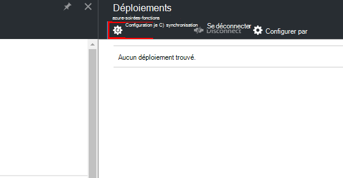
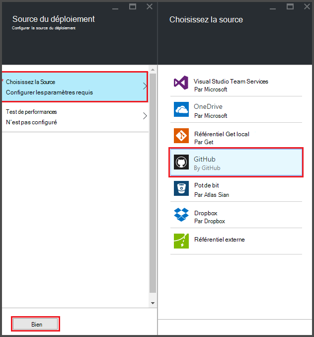
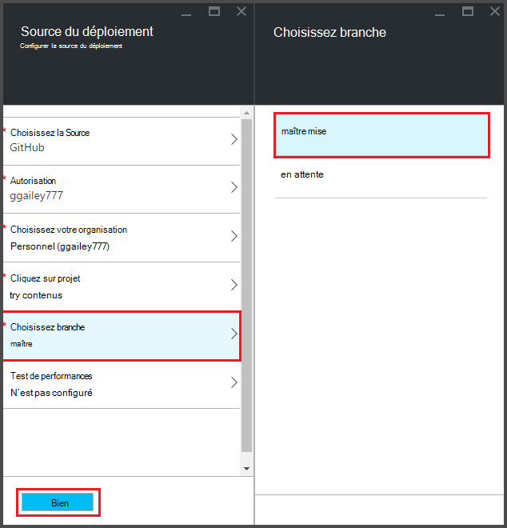
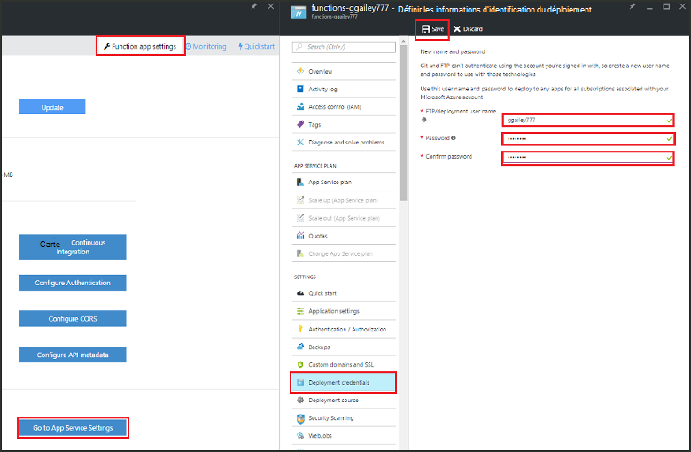
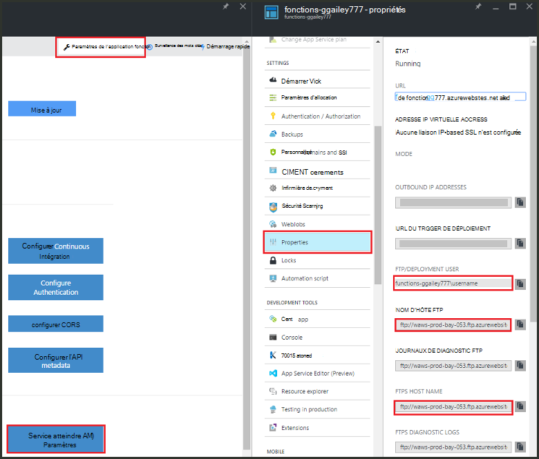
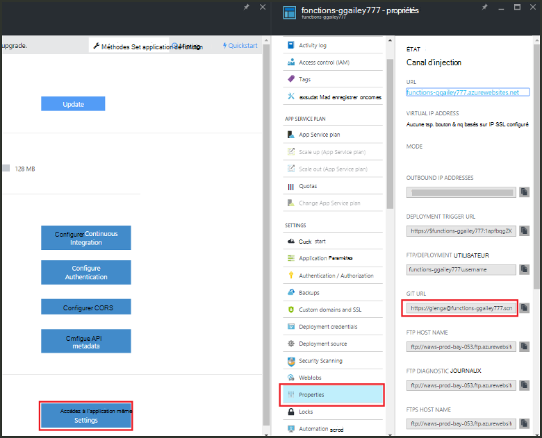

<properties
   pageTitle="Déploiement continue pour les fonctions Azure | Microsoft Azure"
   description="Installations continue déploiement d’Azure Application Service permet de publier vos fonctions Azure."
   services="functions"
   documentationCenter="na"
   authors="ggailey777"
   manager="erikre"
   editor=""
   tags=""
   />

<tags
   ms.service="functions"
   ms.devlang="multiple"
   ms.topic="article"
   ms.tgt_pltfrm="multiple"
   ms.workload="na"
   ms.date="09/25/2016"
   ms.author="glenga"/>

# Déploiement continue pour les fonctions d’Azure 

Fonctions Azure facilite la configuration du déploiement continue de votre application de la fonction. Fonctions exploite Azure Application Service intégration à BitBucket, Dropbox, GitHub et Visual Studio Team Services (VSTS) pour activer un flux de travail de déploiement continue où Azure extrait les mises à jour à votre code fonctions lorsqu’elles sont publiées à un de ces services. Si vous débutez dans Azure fonctions, démarrer avec [Vue d’ensemble des fonctions Azure](functions-overview.md).

Déploiement continue est une option intéressante pour les projets dans laquelle plusieurs et intégrés de dons fréquents. Il vous permet également de garder le contrôle de source sur votre code de fonctions. Les sources de déploiement suivantes sont actuellement prises en charge :

+ [Bitbucket](https://bitbucket.org/)
+ [Dropbox](https://bitbucket.org/)
+ [Mis en pension local GIT](../app-service-web/app-service-deploy-local-git.md)
+ Mis en pension externes GIT
+ [GitHub]
+ Mercurienne mis en pension externes
+ [OneDrive](https://onedrive.live.com/)
+ Visual Studio Team Services

Déploiements sont configurés sur une base de l’application de fonction. Après l’activation de déploiement continue, accès au code de la fonction dans le portail est défini sur *en lecture seule*.

## Configuration requise de déploiement continue

Vous devez disposer votre source du déploiement configuré et votre code de fonctions dans la source du déploiement avant de vous déploiement continue configuration correcte. Dans un déploiement de l’application fonction donnée, chaque fonction se trouve dans un sous-répertoire nommé, le nom du répertoire est le nom de la fonction. Cette structure de dossier est pour l’essentiel le code de votre site. 

[AZURE.INCLUDE [functions-folder-structure](../../includes/functions-folder-structure.md)]

## Déploiement continue de mise en place

Utilisez la procédure suivante pour configurer un déploiement continu pour une application de fonction existant :

1. Dans votre application de la fonction dans le [portail de fonctions Azure](https://functions.azure.com/signin), cliquez sur **paramètres de l’application fonction** > **configurer l’intégration continue** > **le programme d’installation**.

    
    
    
    
    Vous pouvez également accéder à la carte déploiements de démarrage rapide pour les fonctions en cliquant sur **Démarrer à partir du contrôle de source**.

2. Dans la carte déploiements, cliquez sur **Choisir les sources**, puis Fill-in les informations de votre source de déploiement choisie, puis cliquez sur **OK**.

    

Après avoir configuré déploiement continue, tous les fichiers de modifications dans votre source du déploiement sont copiés dans l’application de la fonction et un déploiement de site complet est déclenché. Le site est redéployé mise à jour des fichiers de la source.

##Options de déploiement

Voici quelques scénarios typiques :

+ 

###Création d’un déploiement intermédiaire

Fonction applications ne prend encore en charge les emplacements de déploiement. Toutefois, vous pouvez toujours gérer les déploiements intermédiaires et de production distincts à l’aide de l’intégration continue.

La procédure à suivre pour configurer et utiliser d’un déploiement intermédiaire ressemble généralement à ceci :

1. Créez deux applications fonction dans votre abonnement, une pour le code de production et l’autre pour la mise en attente. 

2. Créer une source de déploiement, si vous n’en avez pas déjà. Nous allons utiliser [GitHub].
 
3. Pour votre application de fonction production, suivez les étapes ci-dessus de **déploiement continue de mise en place** et définir la branche déploiement à la branche maître de votre mis en pension GitHub.

    

4. Répétez cette étape pour l’application de fonction intermédiaire, mais cette fois-ci Choisissez la branche intermédiaire dans votre mis en pension GitHub. Si votre source du déploiement ne prend pas en charge le branchement, utilisez un autre dossier.
 
5. Mettre à jour votre code dans la branche ou le dossier intermédiaire, puis vérifiez que ces modifications sont reflétées dans le déploiement intermédiaire.

6. Après le test, fusionner les modifications provenant de la branche intermédiaire dans la branche principale. Cela déclenche déploiement à l’application de la fonction production. Si votre source du déploiement ne prend pas en charge les branches, remplacer les fichiers dans le dossier de production avec les fichiers du dossier intermédiaire.

###Déplacer des fonctions existantes au déploiement continue

Lorsque vous avez des fonctions existantes que vous avez créées et conservées dans le portail, vous devez télécharger vos fichiers de code fonction existant à l’aide de FTP ou le référentiel Git local avant de vous pouvez déploiement continue configuration comme décrit ci-dessus. Vous pouvez le faire dans les paramètres du Service d’application pour votre application de la fonction. Une fois vos fichiers sont téléchargés, vous pouvez les télécharger sur votre source du déploiement continue choisie.

>[AZURE.NOTE]Après avoir configuré l’intégration continue, vous serez n’est plus en mesure de modifier vos fichiers source dans le portail de fonctions.

####Comment : configurer les informations d’identification de déploiement
Vous pouvez télécharger des fichiers à partir de votre application de la fonction, vous devez configurer vos informations d’identification pour accéder au site, vous pouvez faire à partir du portail. Informations d’identification sont définies au niveau de l’application de la fonction.

1. Dans votre application de la fonction dans le [portail de fonctions Azure](https://functions.azure.com/signin), cliquez sur **paramètres de l’application fonction** > **accédez à paramètres du Service d’application** > **informations d’identification de déploiement**.

    

2. Tapez un nom d’utilisateur et mot de passe, puis cliquez sur **Enregistrer**. Vous pouvez désormais utiliser ces informations d’identification pour accéder à votre application de la fonction à partir de FTP ou la mis en pension Git intégrés.

####Comment : télécharger des fichiers à l’aide de FTP

1. Dans votre application de la fonction dans le [portail de fonctions Azure](https://functions.azure.com/signin), cliquez sur **paramètres de l’application fonction** > **accédez à paramètres du Service d’application** > **Propriétés** et copiez les valeurs pour **FTP/déploiement utilisateur**, **Nom d’hôte FTP**et **Envoie via FTP Host Name**.  
**Utilisateur/déploiement FTP** doivent être entrées qu’elles sont affichées dans le portail, y compris le nom de l’application afin de fournir du contexte approprié pour le serveur FTP.

    
    
2. À partir de votre client FTP, utilisez les informations de connexion que vous avez recueilli pour vous connecter à votre application et télécharger les fichiers sources pour vos fonctions.

####Comment : télécharger des fichiers à l’aide du référentiel Git local

1. Dans votre application de la fonction dans le [portail de fonctions Azure](https://functions.azure.com/signin), cliquez sur **paramètres de l’application fonction** > **configurer l’intégration continue** > **le programme d’installation**.

2. Dans la carte déploiements, cliquez sur **Choisir les sources**, **référentiel Git Local**, puis cliquez sur **OK**.
 
3. Cliquez sur **accéder aux paramètres du Service d’application** > **Propriétés** et notez la valeur de Git URL. 
    
    

4. Dupliquer les mis en pension sur votre ordinateur local à l’aide d’une ligne de commande prenant en charge Git ou votre outil Git favori. La commande cloner Git ressemble à ceci :

        git clone https://username@my-function-app.scm.azurewebsites.net:443/my-function-app.git

5. Récupérer des fichiers à partir de votre application de la fonction à la cloner sur votre ordinateur local, comme dans l’exemple suivant :

        git pull origin master

    Si nécessaire, fournir le nom d’utilisateur et mot de passe de votre déploiement de l’application de fonction.  

[GitHub]: https://github.com/
