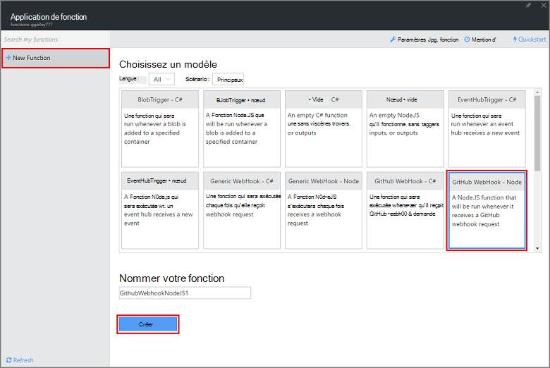
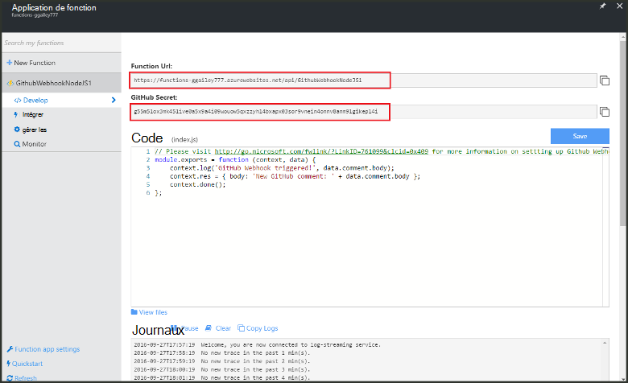
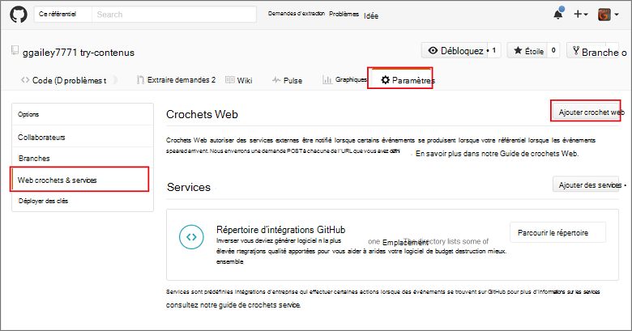
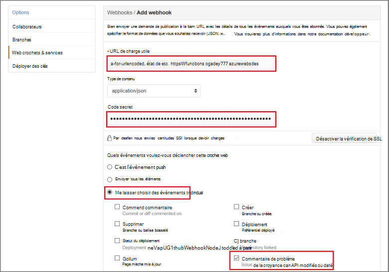

<properties
   pageTitle="Créer un crochet web ou une fonction Azure API | Microsoft Azure"
   description="Utilisez les fonctions Azure pour créer une fonction qui est appelée par une API ou WebHook appeler."
   services="azure-functions"
   documentationCenter="na"
   authors="ggailey777"
   manager="erikre"
   editor=""
   tags=""
   />

<tags
   ms.service="functions"
   ms.devlang="multiple"
   ms.topic="get-started-article"
   ms.tgt_pltfrm="multiple"
   ms.workload="na"
   ms.date="08/30/2016"
   ms.author="glenga"/>
   
# Créer un webhook ou une fonction d’API Azure

Fonctions Azure est un événement par l’effort, cluster à la demande qui permet de vous permettent de créer planifiée ou déclenchée unités de code implémentée dans divers langages de programmation. Pour en savoir plus sur les fonctions d’Azure, consultez la [Vue d’ensemble des fonctions Azure](functions-overview.md).

Cette rubrique vous montre comment créer une fonction Node.js qui est appelée par un webhook GitHub. La nouvelle fonction base sur un modèle prédéfini dans le portail Azure fonctions est créée. Vous pouvez également visionner une courte vidéo pour voir comment ces étapes sont effectuées dans le portail.

## Regarder la vidéo

La vidéo suivante montrent comment effectuer les étapes de base dans ce didacticiel 

[AZURE.VIDEO create-a-web-hook-or-api-azure-function]

##Créer une fonction qui s’affiche suite webhook à partir du modèle

Une application de la fonction héberge l’exécution de vos fonctions dans Azure. Avant de pouvoir créer une fonction, vous devez avoir un compte Azure actif. Si vous n’avez pas déjà un compte Azure, [les comptes gratuits sont disponibles](https://azure.microsoft.com/free/). 

1. Accédez au [portail de fonctions Azure](https://functions.azure.com/signin) et se connecter avec votre compte Azure.

2. Si vous avez une application de la fonction existante à utiliser, sélectionnez à partir de **vos applications de fonction** puis cliquez sur **Ouvrir**. Pour créer une nouvelle application de fonction, tapez un **nom** unique pour votre nouvelle application de la fonction ou accepter celui généré, sélectionnez votre **région**par défaut, puis cliquez sur **créer + prise en main**. 

3. Dans votre application de la fonction, cliquez sur **+ nouvelle fonction** > **GitHub Webhook - nœud** > **créer**. Cela crée une fonction dont le nom par défaut est basé sur le modèle spécifié. 

     

4. Dans **développer**, notez l’exemple de fonction express.js dans la fenêtre de **Code** . Cette fonction reçoit une demande de GitHub d’un webhook de commentaire problème, ouvre le texte du problème et envoie une réponse à le webhook en tant que `New GitHub comment: <Your issue comment text>`.

     

5. Copiez les valeurs de la **Fonction URL** et le **Code GitHub Secret** . Vous aurez besoin lorsque vous créez la webhook dans GitHub. 

6. Faites défiler vers le bas jusqu'à **exécuter**, notez le corps JSON prédéfini de commentaire problème dans le corps de la requête, puis cliquez sur **exécuter**. 
 
    Vous pouvez toujours tester une nouvelle fonction basée sur le modèle directement dans l’onglet **développer** en fournissant les prévu corps données JSON et en cliquant sur le bouton **exécuter** . Dans ce cas, le modèle comporte un corps prédéfini pour un commentaire de problème. 
 
Ensuite, vous allez créer la webhook réel dans votre référentiel GitHub.

##Configurer la webhook

1. Dans GitHub, accédez à un référentiel que vous possédez ; Cela inclut les référentiels auxquels vous avez dupliquée.
 
2. Cliquez sur **paramètres** > **Webhooks et services** > **webhook ajouter**.

       

3. Collez votre fonction URL et le code secret dans **URL charge utile** et **Secret**, puis cliquez sur **me laisser sélectionnez des événements individuels**, sélectionnez **problème commentaire** et cliquez sur **Ajouter webhook**.

     

À ce stade, la webhook GitHub est configuré pour déclencher votre fonction lors de l’ajout d’un nouveau commentaire de problème.  
À présent, il est temps pour le tester.

##Test de la fonction

1. Dans votre mis en pension GitHub, ouvrez l’onglet **problèmes** dans une nouvelle fenêtre de navigateur, cliquez sur **Nouveau numéro**, tapez un titre, puis cliquez sur **Envoyer nouveau problème**. Vous pouvez également ouvrir un problème existant.

2. Dans le numéro, tapez un commentaire, puis cliquez sur **le commentaire**. À ce stade, vous pouvez revenir à votre nouveau webhook dans GitHub et sous voir **Livraison récentes** qu’une demande de webhook a été envoyée et que le corps de réponse est `New GitHub comment: <Your issue comment text>`.

3. Dans le portail de fonctions, faites défiler jusqu'à les journaux, voir déclenchement de la fonction et la valeur `New GitHub comment: <Your issue comment text>` écrit dans les journaux de diffusion en continu.

##Étapes suivantes

Voir les rubriques suivantes pour plus d’informations sur les fonctions Azure.

+ [Référence du développeur fonctions Azure](functions-reference.md)  
Guide de référence programmeur de codage de fonctions.
+ [Test des fonctions Azure](functions-test-a-function.md)  
Décrit les différents outils et techniques pour tester vos fonctions.
+ [Comment mettre à l’échelle des fonctions Azure](functions-scale.md)  
Traite des offres de service disponibles avec les fonctions Azure, y compris le plan de services dynamique et comment choisir l’offre de droite.  

[AZURE.INCLUDE [Getting Started Note](../../includes/functions-get-help.md)]
