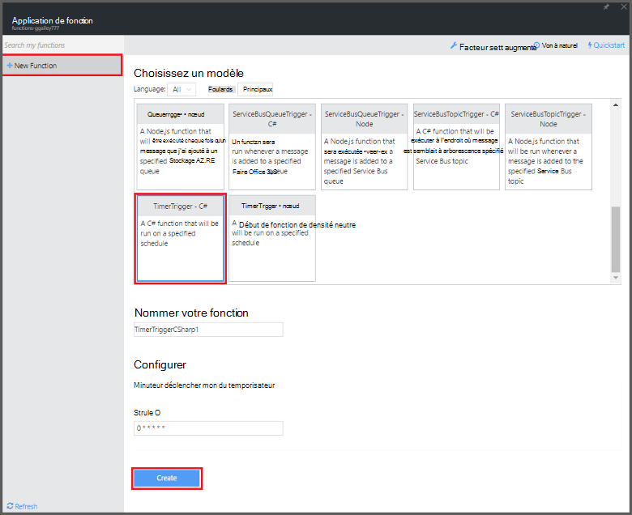

<properties
   pageTitle="Créer une fonction de traitement des événements | Microsoft Azure"
   description="Utilisez les fonctions Azure créer une fonction c# qui s’exécute selon une horloge de l’événement."
   services="functions"
   documentationCenter="na"
   authors="ggailey777"
   manager="erikre"
   editor=""
   tags=""
   />

<tags
   ms.service="functions"
   ms.devlang="multiple"
   ms.topic="get-started-article"
   ms.tgt_pltfrm="multiple"
   ms.workload="na"
   ms.date="09/25/2016"
   ms.author="glenga"/>
   
# Créer un événement fonction Azure de traitement

Fonctions Azure est un événement par l’effort, cluster à la demande qui permet de vous permettent de créer planifiée ou déclenchée unités de code implémentée dans divers langages de programmation. Pour en savoir plus sur les fonctions d’Azure, consultez la [Vue d’ensemble des fonctions Azure](functions-overview.md).

Cette rubrique vous montre comment créer une nouvelle fonction dans c# qui s’exécute basée sur une horloge événement pour ajouter des messages à une file d’attente de stockage. 

## Conditions préalables 

Avant de pouvoir créer une fonction, vous devez avoir un compte Azure actif. Si vous n’avez pas déjà un compte Azure, [les comptes gratuits sont disponibles](https://azure.microsoft.com/free/).

## Créer une fonction qui s’affiche suite minuteur à partir du modèle

Une application de la fonction héberge l’exécution de vos fonctions dans Azure. Avant de pouvoir créer une fonction, vous devez avoir un compte Azure actif. Si vous n’avez pas déjà un compte Azure, [les comptes gratuits sont disponibles](https://azure.microsoft.com/free/). 

1. Accédez au [portail de fonctions Azure](https://functions.azure.com/signin) et se connecter avec votre compte Azure.

2. Si vous avez une application de la fonction existante à utiliser, sélectionnez à partir de **vos applications de fonction** puis cliquez sur **Ouvrir**. Pour créer une nouvelle application de fonction, tapez un **nom** unique pour votre nouvelle application de la fonction ou accepter celui généré, sélectionnez votre **région**par défaut, puis cliquez sur **créer + prise en main**. 

3. Dans votre application de la fonction, cliquez sur **+ nouvelle fonction** > **TimerTrigger - c#** > **créer**. Cela crée une fonction dont le nom par défaut est exécuté sur la planification par défaut de toutes les minutes. 

    

4. Dans votre nouvelle fonction, cliquez sur l’onglet **intégrer** > **Nouvelle sortie** > **File d’attente de stockage Azure** > **Sélectionnez**.

    

5. Dans la **file d’attente de stockage Azure sortie**, sélectionnez une **connexion de compte de stockage**, ou créer un nouveau, puis cliquez sur **Enregistrer**. 

    

6. Dans l’onglet **développer** , remplacez le script c# existant dans la fenêtre de **Code** par le code suivant :

        using System;
        
        public static void Run(TimerInfo myTimer, out string outputQueueItem, TraceWriter log)
        {
            // Add a new scheduled message to the queue.
            outputQueueItem = $"Ping message added to the queue at: {DateTime.Now}.";
            
            // Also write the message to the logs.
            log.Info(outputQueueItem);
        }

    Ce code ajoute un nouveau message dans la file d’attente avec la date et l’heure lorsque la fonction est exécutée.

7. Cliquez sur **Enregistrer** et regarder les fenêtres **journaux** pour l’exécution de fonction suivante.

8. (Facultatif) Naviguez vers le compte de stockage et vérifiez que les messages sont ajoutés à la file d’attente.

9. Revenez à l’onglet **intégrer** et modifier le champ Calendrier `0 0 * * * *`. La fonction maintenant s’exécute chaque heure. 

Il s’agit d’un très simplifié liaison de sortie exemple d’un déclencheur minuteur et une file d’attente de stockage. Pour plus d’informations, voir [fonctions Azure minuteur déclencheur](functions-bindings-timer.md) et les rubriques [fonctions Azure déclencheurs et des liaisons pour le stockage Azure](functions-bindings-storage.md) .

##Étapes suivantes

Voir les rubriques suivantes pour plus d’informations sur les fonctions Azure.

+ [Référence du développeur fonctions Azure](functions-reference.md)  
Guide de référence programmeur permettant aux fonctions et de définir des déclencheurs et des liaisons.
+ [Test des fonctions Azure](functions-test-a-function.md)  
Décrit les différents outils et techniques pour tester vos fonctions.
+ [Comment mettre à l’échelle des fonctions Azure](functions-scale.md)  
Traite des offres de service disponibles avec les fonctions Azure, y compris le plan de services dynamique et comment choisir l’offre de droite.  

[AZURE.INCLUDE [Getting Started Note](../../includes/functions-get-help.md)]
