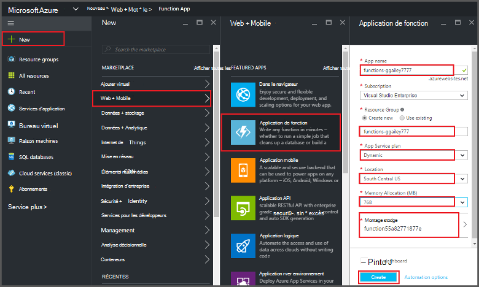
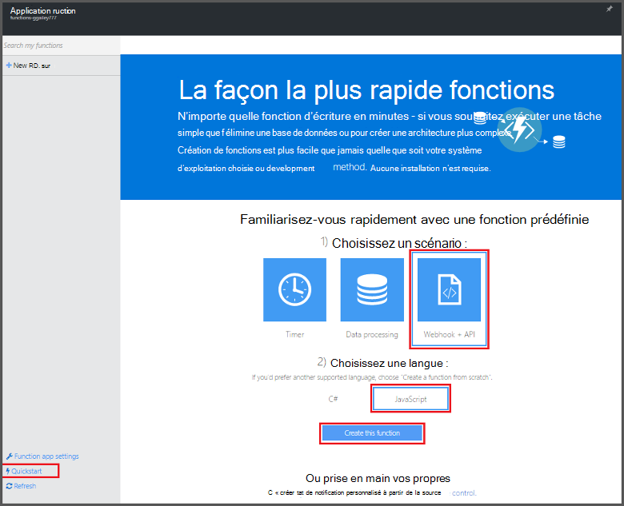
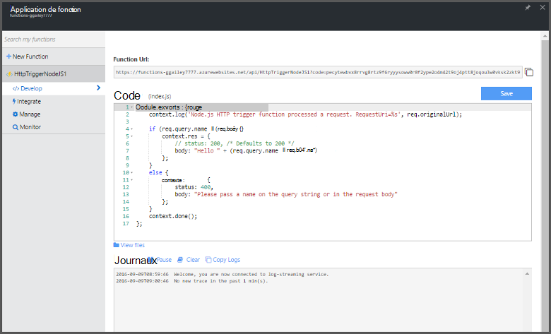

<properties
   pageTitle="Créer une fonction à partir du portail Azure | Microsoft Azure"
   description="Créer votre première fonction Azure, une application sans serveur, en moins de deux minutes."
   services="functions"
   documentationCenter="na"
   authors="ggailey777"
   manager="erikre"
   editor=""
   tags=""
/>

<tags
   ms.service="functions"
   ms.devlang="multiple"
   ms.topic="article"
   ms.tgt_pltfrm="multiple"
   ms.workload="na"
   ms.date="09/08/2016"
   ms.author="glenga"/>

#Créer une fonction à partir du portail Azure

##Vue d’ensemble
Fonctions Azure est un événement par l’effort, cluster à la demande étend la plateforme Azure application existant avec les fonctionnalités pour implémenter le code déclenchée par des événements qui se produisent dans d’autres services Azure, SaaS produits et systèmes locaux. Les fonctions Azure vos applications mettre à l’échelle en fonction de la demande et que vous payez uniquement pour les ressources que vous utilisez. Azure active de fonctions vous permettent de créer planifiée ou déclenchée unités de code activée dans divers langages de programmation. Pour en savoir plus sur les fonctions d’Azure, consultez la [Vue d’ensemble des fonctions Azure](functions-overview.md).

Cette rubrique vous montre comment utiliser le portail Azure pour créer un simple « Bonjour tout le monde » Node.js Azure fonction qui est appelé par un déclencheur d’HTTP. Avant de pouvoir créer une fonction dans le portail Azure, vous devez créer explicitement une application de la fonction dans le Service d’application Azure. Pour que l’application de la fonction créée automatiquement pour vous, voir [l’autre didacticiel de démarrage rapide de fonctions Azure](functions-create-first-azure-function.md), qui est une expérience de démarrage rapide plus simple et inclut une vidéo.

##Créer une application de fonction

Une application de la fonction héberge l’exécution de vos fonctions dans Azure. Suivez ces étapes pour créer une application de la fonction dans le portail Azure.

Avant de pouvoir créer votre première fonction, vous devez avoir un compte Azure actif. Si vous n’avez pas déjà un compte Azure, [les comptes gratuits sont disponibles](https://azure.microsoft.com/free/).

1. Accédez au [portail Azure](https://portal.azure.com) et se connecter avec votre compte Azure.

2. Cliquez sur **+ Nouveau** > **Web + Mobile** > **Fonction application**, sélectionnez votre **abonnement**, tapez un **nom de l’application** unique qui identifie votre application de la fonction, puis spécifiez les paramètres suivants :

    + **[Groupe de ressources](../azure-portal/resource-group-portal.md/)**: sélectionnez **Créer nouveau** et entrez un nom pour votre nouveau groupe de ressources. Vous pouvez également choisir un groupe de ressources existant, mais vous ne pourrez pas créer un plan de Service d’application dynamique pour votre application de la fonction.
    + **[Plan de services d’application](../app-service/azure-web-sites-web-hosting-plans-in-depth-overview.md)**: choisissez *dynamiques* ou *classique*. 
        + **Dynamique**: le type de plan par défaut pour les fonctions Azure. Lorsque vous choisissez un plan dynamique, vous devez également choisir l' **emplacement** et définir l' **Allocation de mémoire** (en Mo). Pour plus d’informations sur l’allocation de mémoire impact sur les coûts, voir [fonctions Azure tarifs](https://azure.microsoft.com/pricing/details/functions/). 
        + **Classique**: un plan de services d’application classique, vous devez créer un **plan/emplacement du Service d’application** ou sélectionnez-en un. Ces paramètres déterminent l' [emplacement, fonctionnalités, des coûts et ressources de calcul](https://azure.microsoft.com/pricing/details/app-service/) associé à votre application.  
    + **Compte de stockage**: chaque application fonction nécessite un compte de stockage. Vous pouvez choisir un compte de stockage existant ou créez-en un. 

    

3. Cliquez sur **créer** mise en service et déployer la nouvelle application de fonction.  

À présent que l’application de la fonction est configurée, vous pouvez créer votre première fonction.

## Créer une fonction

Ces étapes créent une fonction à partir de démarrage rapide pour les fonctions Azure.

1. Dans l’onglet de **démarrage rapide** , cliquez sur **WebHook + API** et **JavaScript**, puis cliquez sur **créer une fonction**. Une nouvelle fonction Node.js prédéfinie est créée. 

    

2. (Facultatif) À ce stade dans le démarrage rapide, vous pouvez choisir de suivre une visite guidée rapide des fonctionnalités de fonctions Azure dans le portail.   Une fois que vous avez terminé ou ignoré la visite guidée, vous pouvez tester votre nouvelle fonction à l’aide du déclencheur HTTP.

##Test de la fonction

Dans la mesure où les Démarrages rapides Azure fonctions contiennent le code fonctionnel, vous pouvez immédiatement tester votre nouvelle fonction.

1. Dans l’onglet **développer** , passez en revue la fenêtre de **Code** et notez que ce code Node.js attend une demande HTTP avec une valeur de *nom* passée dans le corps du message ou dans une chaîne de requête. Lorsque la fonction s’exécute, cette valeur est renvoyée dans le message de réponse.

    

2. Faites défiler jusqu'à la zone de texte **corps de requête** , remplacez la valeur de la propriété *name* votre nom, puis cliquez sur **exécuter**. Vous voyez que l’exécution est déclenchée par une requête HTTP de test, les informations sont écrites dans les journaux de diffusion en continu et la réponse « hello » s’affiche dans la **sortie**. 

3. Pour déclencher l’exécution de la même fonction à partir d’une autre fenêtre de navigateur ou tab, copiez la valeur de **Fonction URL** à partir de l’onglet **développer** et collez-le dans une barre d’adresse du navigateur, puis ajoutez la valeur de chaîne de requête `&name=yourname` et appuyez sur ENTRÉE. Les mêmes informations sont écrites dans les journaux et le navigateur affiche la réponse « hello » comme avant.

##Étapes suivantes

Ce démarrage rapide montre l’exécution d’une simple d’une fonction qui s’affiche suite HTTP simple. Voir les rubriques suivantes pour plus d’informations sur l’utilisation de la puissance des fonctions Azure dans vos applications.

+ [Référence du développeur fonctions Azure](functions-reference.md)  
Guide de référence programmeur permettant aux fonctions et de définir des déclencheurs et des liaisons.
+ [Test des fonctions Azure](functions-test-a-function.md)  
Décrit les différents outils et techniques pour tester vos fonctions.
+ [Comment mettre à l’échelle des fonctions Azure](functions-scale.md)  
Traite des offres de service disponibles avec les fonctions Azure, y compris le plan de services dynamique et comment choisir l’offre de droite. 
+ [Quel est le Service d’application Azure ?](../app-service/app-service-value-prop-what-is.md)  
Fonctions Azure utilise la plateforme Azure Application Service pour les fonctionnalités principales, tels que les déploiements, variables d’environnement et diagnostics. 

[AZURE.INCLUDE [Getting Started Note](../../includes/functions-get-help.md)]
