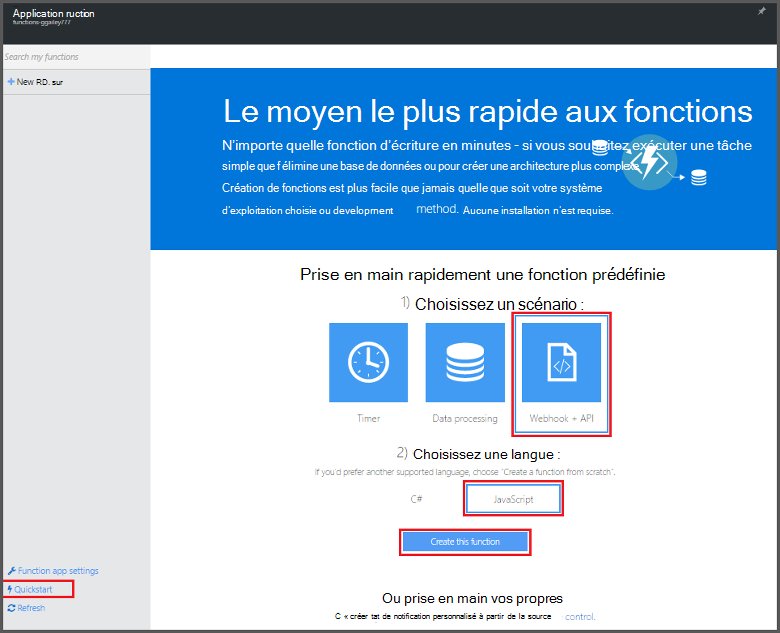
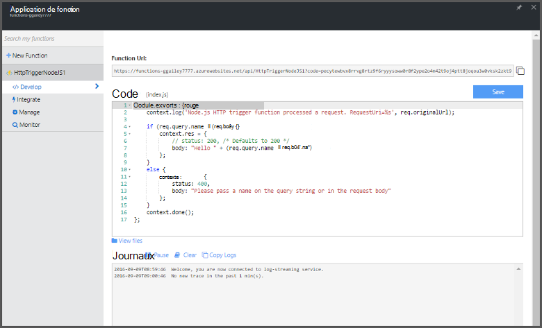

<properties
   pageTitle="Créer votre première fonction Azure | Microsoft Azure"
   description="Créer votre première fonction Azure, une application sans serveur, en moins de deux minutes."
   services="functions"
   documentationCenter="na"
   authors="ggailey777"
   manager="erikre"
   editor=""
   tags=""
/>

<tags
   ms.service="functions"
   ms.devlang="multiple"
   ms.topic="hero-article"
   ms.tgt_pltfrm="multiple"
   ms.workload="na"
   ms.date="09/08/2016"
   ms.author="glenga"/>

#Créer votre première fonction Azure

##Vue d’ensemble
Fonctions Azure est un événement par l’effort, cluster à la demande étend la plateforme Azure application existant avec les fonctionnalités pour implémenter le code déclenchée par des événements qui se produisent dans d’autres services Azure, SaaS produits et systèmes locaux. Les fonctions Azure vos applications mettre à l’échelle en fonction de la demande et que vous payez uniquement pour les ressources que vous utilisez. Azure active de fonctions vous permettent de créer planifiée ou déclenchée unités de code activée dans divers langages de programmation. Pour en savoir plus sur les fonctions d’Azure, consultez la [Vue d’ensemble des fonctions Azure](functions-overview.md).

Cette rubrique vous montre comment utiliser démarrage rapide pour les fonctions Azure dans le portail pour créer une fonction simple Node.js « Bonjour » qui est appelée par un déclencheur d’HTTP. Vous pouvez également visionner une courte vidéo pour voir comment ces étapes sont effectuées dans le portail.

## Regarder la vidéo

La vidéo suivante montrent comment effectuer les étapes de base dans ce didacticiel. 

[AZURE.VIDEO create-your-first-azure-function-simple]

##Créer une fonction de démarrage rapide

Une application de la fonction héberge l’exécution de vos fonctions dans Azure. Suivez ces étapes pour créer une nouvelle application de la fonction ainsi que la nouvelle fonction. La nouvelle fonction application est créée avec une configuration par défaut. Pour obtenir un exemple montrant comment créer de manière explicite votre application de la fonction, voir [l’autre didacticiel de démarrage rapide de fonctions Azure](functions-create-first-azure-function-azure-portal.md).

Avant de pouvoir créer votre première fonction, vous devez avoir un compte Azure actif. Si vous n’avez pas déjà un compte Azure, [les comptes gratuits sont disponibles](https://azure.microsoft.com/free/).

1. Accédez au [portail de fonctions Azure](https://functions.azure.com/signin) et se connecter avec votre compte Azure.

2. Tapez un **nom** unique pour votre nouvelle application de la fonction ou accepter celui généré, sélectionnez votre **région**par défaut, puis cliquez sur **créer + prise en main**. 

3. Dans l’onglet de **démarrage rapide** , cliquez sur **WebHook + API** et **JavaScript**, puis cliquez sur **créer une fonction**. Une nouvelle fonction Node.js prédéfinie est créée. 

    

4. (Facultatif) À ce stade dans le démarrage rapide, vous pouvez choisir de suivre une visite guidée rapide des fonctionnalités de fonctions Azure dans le portail.   Une fois que vous avez terminé ou ignoré la visite guidée, vous pouvez tester votre nouvelle fonction à l’aide du déclencheur HTTP.

##Test de la fonction

Dans la mesure où les Démarrages rapides Azure fonctions contiennent le code fonctionnel, vous pouvez immédiatement tester votre nouvelle fonction.

1. Dans l’onglet **développer** , passez en revue la fenêtre de **Code** et notez que ce code Node.js attend une demande HTTP avec une valeur de *nom* passée dans le corps du message ou dans une chaîne de requête. Lorsque la fonction s’exécute, cette valeur est renvoyée dans le message de réponse.

    

2. Faites défiler jusqu'à la zone de texte **corps de requête** , remplacez la valeur de la propriété *name* votre nom, puis cliquez sur **exécuter**. Vous verrez que l’exécution est déclenchée par une requête HTTP de test, les informations sont écrites dans les journaux de diffusion en continu et la réponse « hello » s’affiche dans la **sortie**. 

3. Pour déclencher l’exécution de la même fonction à partir d’une autre fenêtre de navigateur ou tab, copiez la valeur de **Fonction URL** à partir de l’onglet **développer** et collez-le dans une barre d’adresse du navigateur, puis ajoutez la valeur de chaîne de requête `&name=yourname` et appuyez sur ENTRÉE. Les mêmes informations sont écrites dans les journaux et le navigateur affiche la réponse « hello » comme avant.

##Étapes suivantes

Ce démarrage rapide montre l’exécution d’une simple d’une fonction qui s’affiche suite HTTP simple. Voir les rubriques suivantes pour plus d’informations sur tirant parti de la puissance des fonctions Azure dans vos applications.

+ [Référence du développeur fonctions Azure](functions-reference.md)  
Guide de référence programmeur permettant aux fonctions et de définir des déclencheurs et des liaisons.
+ [Test des fonctions Azure](functions-test-a-function.md)  
Décrit les différents outils et techniques pour tester vos fonctions.
+ [Comment mettre à l’échelle des fonctions Azure](functions-scale.md)  
Traite des offres de service disponibles avec les fonctions Azure, y compris le plan de services dynamique et comment choisir l’offre de droite. 
+ [Quel est le Service d’application Azure ?](../app-service/app-service-value-prop-what-is.md)  
Fonctions Azure s’appuie sur la plateforme Azure Application Service pour les fonctionnalités principales, tels que les déploiements, variables d’environnement et diagnostics. 

[AZURE.INCLUDE [Getting Started Note](../../includes/functions-get-help.md)]
