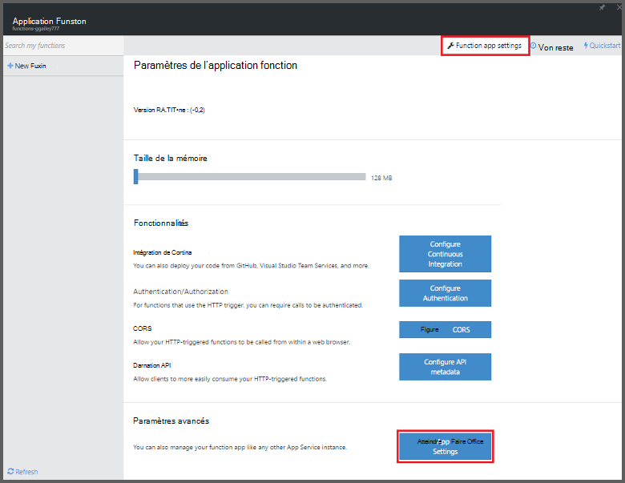

<properties
   pageTitle="Fonctions Azure permet d’effectuer une tâche planifiée nettoyage | Microsoft Azure"
   description="Utilisez les fonctions Azure créer une fonction c# qui s’exécute selon une horloge de l’événement."
   services="functions"
   documentationCenter="na"
   authors="ggailey777"
   manager="erikre"
   editor=""
   tags=""
   />

<tags
   ms.service="functions"
   ms.devlang="multiple"
   ms.topic="article"
   ms.tgt_pltfrm="multiple"
   ms.workload="na"
   ms.date="09/26/2016"
   ms.author="glenga"/>
   
# Utilisez les fonctions Azure pour effectuer une tâche de nettoyage planifiée

Cette rubrique vous montre comment utiliser les fonctions Azure pour créer une nouvelle fonction dans c# qui s’exécute selon une horloge événement pour nettoyer des lignes dans une table de base de données. La nouvelle fonction base sur un modèle prédéfini dans le portail Azure fonctions est créée. Pour prendre en charge ce scénario, vous devez également définir une chaîne de connexion de base de données sous forme d’un Service d’application dans l’application de la fonction. 

## Conditions préalables 

Avant de pouvoir créer une fonction, vous devez avoir un compte Azure actif. Si vous n’avez pas déjà un compte Azure, [les comptes gratuits sont disponibles](https://azure.microsoft.com/free/).

Cette rubrique montre une commande Transact-SQL qui s’exécute une opération de nettoyage en bloc dans une table nommée *TodoItems* dans une base de données SQL. Ce tableau TodoItems même est créé lorsque vous effectuez le [didacticiel de démarrage rapide Azure Application Service Mobile applications](../app-service-mobile/app-service-mobile-ios-get-started.md). Vous pouvez également utiliser une base de données exemple si vous choisissez d’utiliser une autre table, vous devez modifier la commande.

Vous pouvez obtenir la chaîne de connexion utilisée par une application Mobile principale dans le portail avec **tous les paramètres** > **paramètres de l’Application** > **chaînes de connexion** > **Afficher les valeurs de chaîne de connexion** > **MS_TableConnectionString**. Vous pouvez également obtenir la chaîne de connexion directement à partir d’une base de données SQL dans le portail avec **tous les paramètres** > **Propriétés** > **afficher des chaînes de connexion de base de données** > **ADO.NET (authentification SQL)**.

Ce scénario utilise une opération en bloc par rapport à la base de données. Pour que votre fonction processus CRUD tâches individuelles dans un tableau applications Mobile, vous devez utiliser liaison Table Mobile.

## Définir une chaîne de connexion de base de données SQL dans l’application de fonction

Une application de la fonction héberge l’exécution de vos fonctions dans Azure. Il est recommandé de stocker les chaînes de connexion et d’informations confidentielles dans vos paramètres de l’application de fonction. Cela empêche divulgation accidentelle lorsque votre code de la fonction extrémités-up dans un mis en pension quelque part. 

1. Accédez au [portail de fonctions Azure](https://functions.azure.com/signin) et se connecter avec votre compte Azure.

2. Si vous avez une application de la fonction existante à utiliser, sélectionnez à partir de **vos applications de fonction** puis cliquez sur **Ouvrir**. Pour créer une nouvelle application de fonction, tapez un **nom** unique pour votre nouvelle application de la fonction ou accepter celui généré, sélectionnez votre **région**par défaut, puis cliquez sur **créer + prise en main**. 

3. Dans votre application de la fonction, cliquez sur **paramètres de l’application fonction** > **accédez à paramètres du Service d’application**. 

    

4. Dans votre application de la fonction, cliquez sur **tous les paramètres**, faites défiler vers le bas jusqu'à **paramètres de l’Application**, puis sous type de **chaînes de connexion** `sqldb_connection` **nom**, coller la chaîne de connexion dans **valeur**, cliquez sur **Enregistrer**, puis fermez la carte d’application de fonction pour retourner dans le portail de fonctions.

    

À présent, vous pouvez ajouter le code de fonction c# qui se connecte à votre base de données SQL.

## Créer une fonction qui s’affiche suite minuteur à partir du modèle

1. Dans votre application de la fonction, cliquez sur **+ nouvelle fonction** > **TimerTrigger - c#** > **créer**. Cela crée une fonction dont le nom par défaut est exécuté sur la planification par défaut de toutes les minutes. 

    

2. Dans le volet de **Code** de l’onglet **développer** , ajoutez les références d’assemblage suivantes en haut du code fonction existant :

        #r "System.Configuration"
        #r "System.Data"

3. Ajoutez le code suivant `using` instructions pour la fonction :

        using System.Configuration;
        using System.Data.SqlClient;
        using System.Threading.Tasks; 

4. Remplacez la fonction **exécuter** existante par le code suivant :

        public static async Task Run(TimerInfo myTimer, TraceWriter log)
        {
            var str = ConfigurationManager.ConnectionStrings["sqldb_connection"].ConnectionString;
            using (SqlConnection conn = new SqlConnection(str))
            {
                conn.Open();
                var text = "DELETE from dbo.TodoItems WHERE Complete='True'";
                using (SqlCommand cmd = new SqlCommand(text, conn))
                {
                    // Execute the command and log the # rows deleted.
                    var rows = await cmd.ExecuteNonQueryAsync();
                    log.Info($"{rows} rows were deleted");
                }
            }
        }

5. Cliquez sur **Enregistrer**, regardez les fenêtres **journaux** pour l’exécution de fonction suivante, puis notez le nombre de lignes supprimées de la table TodoItems.

6. (Facultatif) À l’aide de l' [application de démarrage rapide d’applications Mobile](../app-service-mobile/app-service-mobile-ios-get-started.md), marquer des éléments supplémentaires comme « terminé » puis revenez à la fenêtre **journaux** et Espion le même nombre de lignes supprimées par la fonction pendant l’exécution suivante. 

##Étapes suivantes

Voir les rubriques suivantes pour plus d’informations sur les fonctions Azure.

+ [Référence du développeur fonctions Azure](functions-reference.md)  
Guide de référence programmeur permettant aux fonctions et de définir des déclencheurs et des liaisons.
+ [Test des fonctions Azure](functions-test-a-function.md)  
Décrit les différents outils et techniques pour tester vos fonctions.
+ [Comment mettre à l’échelle des fonctions Azure](functions-scale.md)  
Traite des offres de service disponibles avec les fonctions Azure, y compris le plan de services dynamique et comment choisir l’offre de droite.  

[AZURE.INCLUDE [Getting Started Note](../../includes/functions-get-help.md)]