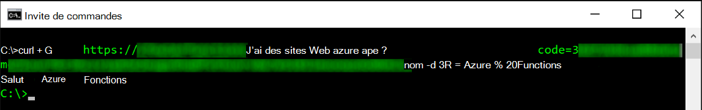
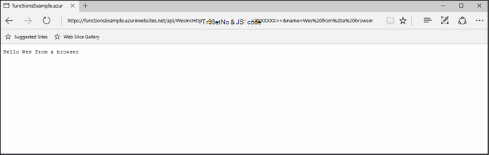
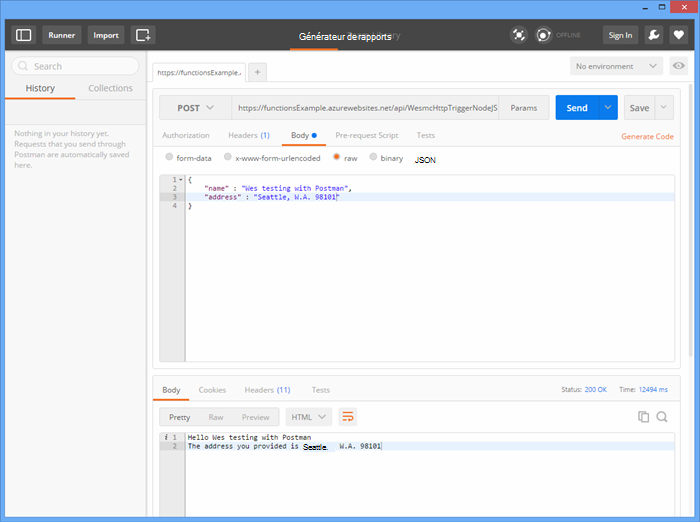
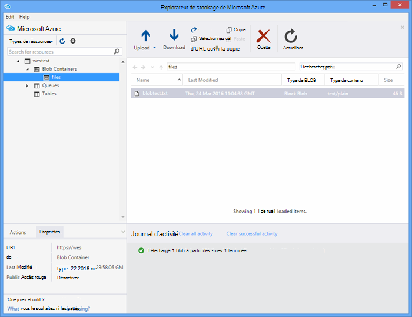

<properties
   pageTitle="Test des fonctions Azure | Microsoft Azure"
   description="Testez vos fonctions Azure à l’aide de Postman, ourlée et Node.js."
   services="functions"
   documentationCenter="na"
   authors="wesmc7777"
   manager="erikre"
   editor=""
   tags=""
   keywords="Azure fonctions, fonctions, traitement de l’événement, webhooks, cluster dynamique, sans serveur architecture, test"/>

<tags
   ms.service="functions"
   ms.devlang="multiple"
   ms.topic="article"
   ms.tgt_pltfrm="multiple"
   ms.workload="na"
   ms.date="08/19/2016"
   ms.author="wesmc"/>

# Test des fonctions Azure

## Vue d’ensemble

Dans ce didacticiel, nous allons découvrir différentes approches au test des fonctions. Nous allons définir une fonction de déclenchement http qui accepte les entrées via un paramètre de chaîne de requête ou le corps de la requête. Le code du modèle par défaut **HttpTrigger Node.js fonction** prend en charge un `name` paramètre de chaîne de requête. Nous allons ajouter également code pour prendre en charge ce paramètre avec `address` informations pour l’utilisateur dans le corps de la requête.

## Créer une fonction pour le test

Pour la plupart de ce didacticiel, nous allons utiliser une version du modèle **HttpTrigger Nodejs fonction** qui est disponible lorsque vous créez une nouvelle fonction légèrement modifiée.  Vous pouvez consulter la [créer votre premier didacticiel Azure fonction](functions-create-first-azure-function.md) si vous avez besoin d’aide pour créer une nouvelle fonction.  Choisissez le modèle de **HttpTrigger Nodejs fonction** lors de la création de la fonction de test dans le [Portail Azure].

Le modèle de fonction par défaut est fondamentalement une hello world fonction qui renvoie le nom du paramètre de chaîne de requête corps ou une requête, `name=<your name>`.  Nous met à jour le code pour vous permettre également à fournir le nom et une adresse en tant que contenu JSON dans le corps de la requête. Puis, la fonction renverra ces précédent pour le client lorsqu’elles sont disponibles.   

Mettre à jour de la fonction avec le code suivant que nous utiliserons pour le test :

    module.exports = function(context, req) {
        context.log("Node.js HTTP trigger function processed a request. RequestUri=%s", req.originalUrl);
        context.log("Request Headers = " + JSON.stringify(req.headers));    
    
        if (req.query.name || (req.body && req.body.name)) {
            if (typeof req.query.name != "undefined") {
                context.log("Name was provided as a query string param..."); 
                ProcessNewUserInformation(context, req.query.name);
            }
            else {
                context.log("Processing user info from request body..."); 
                ProcessNewUserInformation(context, req.body.name, req.body.address);
            }
        }
        else {
            context.res = {
                status: 400,
                body: "Please pass a name on the query string or in the request body"
            };
        }
        context.done();
    };
    
    function ProcessNewUserInformation(context, name, address)
    {    
        context.log("Processing User Information...");            
        context.log("name = " + name);            
        echoString = "Hello " + name;
        
        if (typeof address != "undefined")
        {
            echoString += "\n" + "The address you provided is " + address;
            context.log("address = " + address);            
        }
        
        context.res = {
                // status: 200, /* Defaults to 200 */
                body: echoString
            };
    }

## Tester une fonction avec des outils

### Tester bouclé

Souvent lorsque vous testez le logiciel, il n’est pas nécessaire rechercher les plus de la ligne de commande pour aider à déboguer votre application, il n’est pas différente avec des fonctions.

Pour tester la fonction ci-dessus, copiez l' **Url de la fonction** à partir du portail. Il aura la forme suivante : 

    https://<Your Function App>.azurewebsites.net/api/<Your Function Name>?code=<your access code>
    
Il s’agit de l’Url pour le déclenchement de votre fonction, nous pouvons le tester à l’aide de la commande cURL sur la ligne de commande pour effectuer une opération Get (`-G` ou `--get`) demande par rapport à notre fonction :

    curl -G https://<Your Function App>.azurewebsites.net/api/<Your Function Name>?code=<your access code>
    
Cet exemple ci-dessus, un paramètre de chaîne de requête qui peut être passé en tant que données (`-d`) dans la commande cURL :

    curl -G https://<Your Function App>.azurewebsites.net/api/<Your Function Name>?code=<your access code> -d name=<Enter a name here>
    
Appuyez sur entrée et vous verrez le résultat de la fonction sur la ligne de commande.

Dans la fenêtre **journaux** portail, sortie similaire à ce qui suit est enregistrée lors de l’exécution de la fonction :

    2016-04-05T21:55:09  Welcome, you are now connected to log-streaming service.
    2016-04-05T21:55:30.738 Function started (Id=ae6955da-29db-401a-b706-482fcd1b8f7a)
    2016-04-05T21:55:30.738 Node.js HTTP trigger function processed a request. RequestUri=https://functionsExample.azurewebsites.net/api/HttpTriggerNodeJS1?code=XXXXXXX&name=Azure Functions
    2016-04-05T21:55:30.738 Function completed (Success, Id=ae6955da-29db-401a-b706-482fcd1b8f7a)

### Effectuez un test avec un navigateur

Vous pouvez tester les fonctions qui ne nécessitent des paramètres, ou uniquement besoin de paramètres de chaîne de requête, à l’aide d’un navigateur.

Pour tester la fonction que nous définis ci-dessus, copiez l' **Url de la fonction** à partir du portail. Il aura la forme suivante :

    https://<Your Function App>.azurewebsites.net/api/<Your Function Name>?code=<your access code>

Ajouter la `name` paramètre de chaîne de requête comme suit, à l’aide d’un nom réel pour le `<Enter a name here>` espace réservé.

    https://<Your Function App>.azurewebsites.net/api/<Your Function Name>?code=<your access code>&name=<Enter a name here>

Collez l’URL dans votre navigateur et vous devez obtenir une réponse similaire à ce qui suit.

Dans la fenêtre **journaux** portail, sortie similaire à ce qui suit est enregistrée lors de l’exécution de la fonction :

    2016-03-23T07:34:59  Welcome, you are now connected to log-streaming service.
    2016-03-23T07:35:09.195 Function started (Id=61a8c5a9-5e44-4da0-909d-91d293f20445)
    2016-03-23T07:35:10.338 Node.js HTTP trigger function processed a request. RequestUri=https://functionsExample.azurewebsites.net/api/WesmcHttpTriggerNodeJS1?code=XXXXXXXXXX==&name=Wes from a browser
    2016-03-23T07:35:10.338 Request Headers = {"cache-control":"max-age=0","connection":"Keep-Alive","accept":"text/html","accept-encoding":"gzip","accept-language":"en-US"}
    2016-03-23T07:35:10.338 Name was provided as a query string param.
    2016-03-23T07:35:10.338 Processing User Information...
    2016-03-23T07:35:10.369 Function completed (Success, Id=61a8c5a9-5e44-4da0-909d-91d293f20445)

### Testez avec Postman

L’outil recommandé pour tester la plupart de vos fonctions est Postman. Pour installer Postman, voir [Obtenir Postman](https://www.getpostman.com/). Postman permet de contrôler beaucoup d’autres attributs d’une requête HTTP.

> [AZURE.TIP] Utiliser le Client reste dans lesquels vous êtes à l’aise. Voici quelques alternatives à Postman :  
> 
> * [Fiddler](http://www.telerik.com/fiddler)  
> * [Patte](https://luckymarmot.com/paw)  

Pour tester la fonction avec un corps de demande de Postman : 

1. Lancez Postman à partir du bouton **d’applications** dans le coin supérieur gauche de l’angle d’une fenêtre de navigateur Chrome.
2. Copiez votre **Fonction Url** et collez-la dans Postman. Il inclut le paramètre de chaîne de requête de code d’accès.
3. Modifier la méthode HTTP **POST**.
4. Cliquez sur **corps** > **brute** et ajoutez le corps de la requête JSON similaire à ce qui suit :

        {
            "name" : "Wes testing with Postman",
            "address" : "Seattle, W.A. 98101"
        }

5. Cliquez sur **Envoyer**.

Voici une illustration test de l’exemple de fonction simple écho dans ce didacticiel. 

Dans la fenêtre **journaux** portail, sortie similaire à ce qui suit est enregistrée lors de l’exécution de la fonction :

    2016-03-23T08:04:51  Welcome, you are now connected to log-streaming service.
    2016-03-23T08:04:57.107 Function started (Id=dc5db8b1-6f1c-4117-b5c4-f6b602d538f7)
    2016-03-23T08:04:57.763 Node.js HTTP trigger function processed a request. RequestUri=https://functions841def78.azurewebsites.net/api/WesmcHttpTriggerNodeJS1?code=XXXXXXXXXX==
    2016-03-23T08:04:57.763 Request Headers = {"cache-control":"no-cache","connection":"Keep-Alive","accept":"*/*","accept-encoding":"gzip","accept-language":"en-US"}
    2016-03-23T08:04:57.763 Processing user info from request body...
    2016-03-23T08:04:57.763 Processing User Information...
    2016-03-23T08:04:57.763 name = Wes testing with Postman
    2016-03-23T08:04:57.763 address = Seattle, W.A. 98101
    2016-03-23T08:04:57.795 Function completed (Success, Id=dc5db8b1-6f1c-4117-b5c4-f6b602d538f7)
    
### Tester un déclencheur d’objets blob à l’aide de l’Explorateur d’espace de stockage

Vous pouvez tester une fonction déclencheur blob à l’aide de [Microsoft Azure stockage Explorer](http://storageexplorer.com/).

1. Dans le [Portail Azure] pour votre application de fonctions, créez une nouvelle c#, F # ou nœud blob déclencheur fonction. Définir le chemin d’accès pour contrôler le nom de votre conteneur blob. Par exemple :

        files

2. Cliquez sur le **+** bouton pour sélectionner ou créer le compte de stockage que vous souhaitez utiliser. Puis cliquez sur **créer**.

3. Créer un fichier texte contenant le texte suivant et enregistrez-le :

        A text file for blob trigger function testing.

4. Exécutez [Microsoft Azure stockage Explorer](http://storageexplorer.com/) et connectez-vous au conteneur blob dans le compte de stockage en cours d’analyse.

5. Cliquez sur le bouton **Télécharger** et téléchargez le fichier texte.

    

    Le code de la fonction par défaut blob déclencheur signalera le traitement du blob dans les journaux :

        2016-03-24T11:30:10  Welcome, you are now connected to log-streaming service.
        2016-03-24T11:30:34.472 Function started (Id=739ebc07-ff9e-4ec4-a444-e479cec2e460)
        2016-03-24T11:30:34.472 C# Blob trigger function processed: A text file for blob trigger function testing.
        2016-03-24T11:30:34.472 Function completed (Success, Id=739ebc07-ff9e-4ec4-a444-e479cec2e460)

## Tester une fonction au sein de fonctions

### Tester à l’aide du portail de fonctions bouton Exécuter

Le portail fournit un bouton **exécuter** qui vous permet de procéder à des tests limités. Vous pouvez fournir un corps de la requête en utilisant le bouton exécuter mais vous ne pouvez pas fournir les paramètres de chaîne de requête ou mettre à jour les en-têtes de demande.

Tester la fonction déclencheur HTTP que nous avons créé précédemment en ajoutant une chaîne JSON similaire à ce qui suit dans le champ **demande corps** , puis cliquez sur le bouton **exécuter** .

    {
        "name" : "Wes testing Run button",
        "address" : "USA"
    } 

Dans la fenêtre **journaux** portail, sortie similaire à ce qui suit est enregistrée lors de l’exécution de la fonction :

    2016-03-23T08:03:12  Welcome, you are now connected to log-streaming service.
    2016-03-23T08:03:17.357 Function started (Id=753a01b0-45a8-4125-a030-3ad543a89409)
    2016-03-23T08:03:18.697 Node.js HTTP trigger function processed a request. RequestUri=https://functions841def78.azurewebsites.net/api/wesmchttptriggernodejs1
    2016-03-23T08:03:18.697 Request Headers = {"connection":"Keep-Alive","accept":"*/*","accept-encoding":"gzip","accept-language":"en-US"}
    2016-03-23T08:03:18.697 Processing user info from request body...
    2016-03-23T08:03:18.697 Processing User Information...
    2016-03-23T08:03:18.697 name = Wes testing Run button
    2016-03-23T08:03:18.697 address = USA
    2016-03-23T08:03:18.744 Function completed (Success, Id=753a01b0-45a8-4125-a030-3ad543a89409)

### Effectuez un test avec un déclencheur du temporisateur

Certaines fonctions ne peut pas être réellement tester avec les outils mentionnés précédemment. Par exemple, une file d’attente déclencheur fonction qui s’exécute lorsqu’un message est déplacé dans [Le stockage Azure file d’attente](../storage/storage-dotnet-how-to-use-queues.md). Vous pouvez toujours écrire du code pour déplacer un message dans votre file d’attente et un exemple dans un projet console est fourni ci-dessous. Cependant, il existe une autre approche, que vous pouvez utiliser pour tester directement avec des fonctions.  

Vous pouvez utiliser un déclencheur minuteur configuré avec une file d’attente liaison de sortie. Ce code du déclencheur minuteur pu puis écrire les messages de test dans la file d’attente. Cette section guidera via un exemple. 

Pour plus d’informations sur l’utilisation des liaisons avec Azure fonctions, voir la [référence du développeur fonctions Azure](functions-reference.md). 

#### Créer déclencheur file d’attente de test

Pour illustrer cette approche, nous allons tout d’abord créer une fonction de déclenchement file d’attente que nous voulons tester une file d’attente nommée `queue-newusers`. Cette fonction traite des informations de nom et l’adresse d’un nouvel utilisateur supprimé dans le stockage Azure file d’attente. 

> [AZURE.NOTE] Si vous utilisez un nom de file d’attente différente, vérifiez que le nom que vous utilisez est conforme aux règles de [dénomination files d’attente et les métadonnées](https://msdn.microsoft.com/library/dd179349.aspx) .  Dans le cas contraire, vous obtenez un code d’état HTTP 400 : demande incorrecte. 

1. Dans le [Portail Azure] pour votre application de fonctions, cliquez sur **Nouvelle fonction** > **QueueTrigger - c#**.
2. Entrez le nom de la file d’attente soit contrôlé par la fonction file d’attente 

        queue-newusers 

3. Cliquez sur le **+** bouton (Ajouter) pour sélectionner ou créer le compte de stockage que vous souhaitez utiliser. Puis cliquez sur **créer**.
4. Laissez cette fenêtre de navigateur portail ouverte afin de vous pouvez contrôler les entrées du journal pour le code de modèle de fonction file d’attente par défaut.

#### Créer un déclencheur minuteur pour supprimer un message dans la file d’attente

1. Ouvrez le [Portail Azure] dans une nouvelle fenêtre de navigateur et accédez à votre application de la fonction.
2. Cliquez sur **nouvelle fonction** > **TimerTrigger - c#**. Entrer une expression cron pour définir la fréquence à laquelle le code du minuteur s’exécutera test de votre fonction file d’attente. Puis cliquez sur **créer**. Si vous souhaitez que le test s’exécute toutes les 30 secondes, vous pouvez utiliser l' [expression CRON](https://wikipedia.org/wiki/Cron#CRON_expression)suivante :

        */30 * * * * *

2. Cliquez sur l’onglet **intégrer** pour votre nouveau déclencheur minuteur.
3. Sous **sortie**, cliquez sur le bouton **+ nouvelle sortie** . Cliquez ensuite sur **file d’attente** et le bouton **Sélectionner** .
4. Notez le nom que vous utilisez pour l' **objet du message file d’attente** , vous utiliserez dans le code de la fonction minuteur.

        myQueue

4. Entrez le nom de file d’attente où sera envoyé le message : 

        queue-newusers 

3. Cliquez sur le **+** bouton (Ajouter) pour sélectionner le compte de stockage que vous avez déjà utilisé avec le déclencheur file d’attente. Cliquez sur **Enregistrer**.
4. Cliquez sur l’onglet **développer** votre déclencheur minuteur.
5. Vous pouvez utiliser le code suivant pour la fonction timer c# dans la mesure où vous avez utilisé le même nom d’objet file d’attente message ci-dessus. Puis cliquez sur **Enregistrer**

        using System;
        
        public static void Run(TimerInfo myTimer, out String myQueue, TraceWriter log)
        {
            String newUser = 
            "{\"name\":\"User testing from C# timer function\",\"address\":\"XYZ\"}";
        
            log.Verbose($"C# Timer trigger function executed at: {DateTime.Now}");   
            log.Verbose($"{newUser}");   
            
            myQueue = newUser;
        }

À ce stade c# timer, fonction s’exécutera toutes les 30 secondes si vous avez utilisé l’exemple d’expression cron. Les journaux de la fonction timer signalera chaque exécution :

    2016-03-24T10:27:02  Welcome, you are now connected to log-streaming service.
    2016-03-24T10:27:30.004 Function started (Id=04061790-974f-4043-b851-48bd4ac424d1)
    2016-03-24T10:27:30.004 C# Timer trigger function executed at: 3/24/2016 10:27:30 AM
    2016-03-24T10:27:30.004 {"name":"User testing from C# timer function","address":"XYZ"}
    2016-03-24T10:27:30.004 Function completed (Success, Id=04061790-974f-4043-b851-48bd4ac424d1)

Dans la fenêtre du navigateur pour la fonction file d’attente, vous verrez le chaque message en cours de traitement :

    2016-03-24T10:27:06  Welcome, you are now connected to log-streaming service.
    2016-03-24T10:27:30.607 Function started (Id=e304450c-ff48-44dc-ba2e-1df7209a9d22)
    2016-03-24T10:27:30.607 C# Queue trigger function processed: {"name":"User testing from C# timer function","address":"XYZ"}
    2016-03-24T10:27:30.607 Function completed (Success, Id=e304450c-ff48-44dc-ba2e-1df7209a9d22)
    
## Tester une fonction avec Code

### Tester une fonction déclencheur HTTP avec Code : Node.js

Vous pouvez utiliser le code Node.js pour exécuter une requête http pour tester votre fonction Azure. 

Veillez à configurer :

- La `host` dans les options de demande à votre hôte de l’application de fonction
- Votre nom de la fonction dans la `path`.
- Votre code d’accès (`<your code>`) dans le `path`.

Exemple de code :

    var http = require("http");
    
    var nameQueryString = "name=Wes%20Query%20String%20Test%20From%20Node.js";
    
    var nameBodyJSON = {
        name : "Wes testing with Node.JS code",
        address : "Dallas, T.X. 75201"
    };
    
    var bodyString = JSON.stringify(nameBodyJSON);
    
    var options = {
      host: "functions841def78.azurewebsites.net",
      //path: "/api/HttpTriggerNodeJS2?code=sc1wt62opn7k9buhrm8jpds4ikxvvj42m5ojdt0p91lz5jnhfr2c74ipoujyq26wab3wk5gkfbt9&" + nameQueryString,
      path: "/api/HttpTriggerNodeJS2?code=sc1wt62opn7k9buhrm8jpds4ikxvvj42m5ojdt0p91lz5jnhfr2c74ipoujyq26wab3wk5gkfbt9",
      method: "POST",
      headers : {
          "Content-Type":"application/json",
          "Content-Length": Buffer.byteLength(bodyString)
        }    
    };
    
    callback = function(response) {
      var str = ""
      response.on("data", function (chunk) {
        str += chunk;
      });
    
      response.on("end", function () {
        console.log(str);
      });
    }
    
    var req = http.request(options, callback);
    console.log("*** Sending name and address in body ***");
    console.log(bodyString);
    req.end(bodyString);

Résultat :

    C:\Users\Wesley\testing\Node.js>node testHttpTriggerExample.js
    *** Sending name and address in body ***
    {"name" : "Wes testing with Node.JS code","address" : "Dallas, T.X. 75201"}
    Hello Wes testing with Node.JS code
    The address you provided is Dallas, T.X. 75201
        
Dans la fenêtre **journaux** portail, sortie similaire à ce qui suit est enregistrée lors de l’exécution de la fonction :

    2016-03-23T08:08:55  Welcome, you are now connected to log-streaming service.
    2016-03-23T08:08:59.736 Function started (Id=607b891c-08a1-427f-910c-af64ae4f7f9c)
    2016-03-23T08:09:01.153 Node.js HTTP trigger function processed a request. RequestUri=http://functionsExample.azurewebsites.net/api/WesmcHttpTriggerNodeJS1/?code=XXXXXXXXXX==
    2016-03-23T08:09:01.153 Request Headers = {"connection":"Keep-Alive","host":"functionsExample.azurewebsites.net"}
    2016-03-23T08:09:01.153 Name not provided as query string param. Checking body...
    2016-03-23T08:09:01.153 Request Body Type = object
    2016-03-23T08:09:01.153 Request Body = [object Object]
    2016-03-23T08:09:01.153 Processing User Information...
    2016-03-23T08:09:01.215 Function completed (Success, Id=607b891c-08a1-427f-910c-af64ae4f7f9c)
    

### Tester une fonction déclencheur file d’attente avec Code : C# #

Nous avons vu que vous pouvez tester un déclencheur file d’attente à l’aide de code pour supprimer un message dans votre file d’attente. L’exemple suivant repose le code c# figurant dans le didacticiel [mise en route d’espace de stockage Azure file d’attente](../storage/storage-dotnet-how-to-use-queues.md) . Code pour d’autres langues est également disponible sur ce lien.

Pour tester ce code dans une application console que vous devez :

- [Configurer votre chaîne de connexion de stockage dans le fichier app.config](../storage/storage-dotnet-how-to-use-queues.md#setup-a-storage-connection-string).
- Ce code accepte le nom et l’adresse d’un nouvel utilisateur en tant qu’arguments de ligne de commande lors de l’exécution. Passer un `name` et `address` en tant que paramètres à l’application. Par exemple,`C:\myQueueConsoleApp\test.exe "Wes testing queues" "in a console app"`

Exemple c# de code :

    static void Main(string[] args)
    {
        string name = null;
        string address = null;
        string queueName = "queue-newusers";
        string JSON = null;

        if (args.Length > 0)
        {
            name = args[0];
        }
        if (args.Length > 1)
        {
            address = args[1];
        }

        // Retrieve storage account from connection string
        CloudStorageAccount storageAccount = CloudStorageAccount.Parse(ConfigurationManager.AppSettings["StorageConnectionString"]);

        // Create the queue client
        CloudQueueClient queueClient = storageAccount.CreateCloudQueueClient();

        // Retrieve a reference to a queue
        CloudQueue queue = queueClient.GetQueueReference(queueName);

        // Create the queue if it doesn't already exist
        queue.CreateIfNotExists();

        // Create a message and add it to the queue.
        if (name != null)
        {
            if (address != null)
                JSON = String.Format("{{\"name\":\"{0}\",\"address\":\"{1}\"}}", name, address);
            else
                JSON = String.Format("{{\"name\":\"{0}\"}}", name);
        }

        Console.WriteLine("Adding message to " + queueName + "...");
        Console.WriteLine(JSON);

        CloudQueueMessage message = new CloudQueueMessage(JSON);
        queue.AddMessage(message);
    }

Dans la fenêtre du navigateur pour la fonction file d’attente, vous verrez le chaque message en cours de traitement :

    2016-03-24T10:27:06  Welcome, you are now connected to log-streaming service.
    2016-03-24T10:27:30.607 Function started (Id=e304450c-ff48-44dc-ba2e-1df7209a9d22)
    2016-03-24T10:27:30.607 C# Queue trigger function processed: {"name":"Wes testing queues","address":"in a console app"}
    2016-03-24T10:27:30.607 Function completed (Success, Id=e304450c-ff48-44dc-ba2e-1df7209a9d22)

<!-- URLs. -->

[Portail Azure]: https://portal.azure.com
