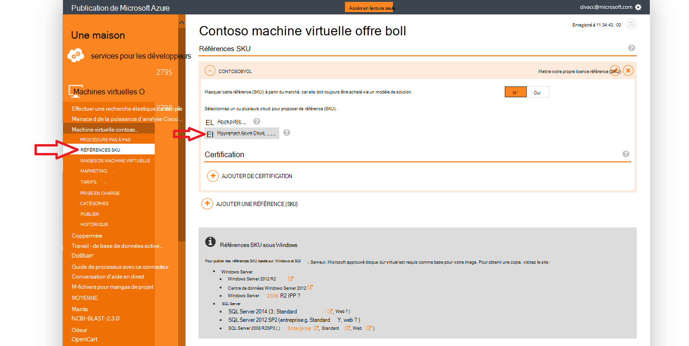

<properties
            pageTitle="Documentation pour le gouvernement Azure | Microsoft Azure"
            description="Cela fournit une comparaison des fonctionnalités et des conseils sur le développement d’applications pour le gouvernement Azure."
            services="Azure-Government"
            cloud="gov"
            documentationCenter=""
            authors="tsingh"
            manager="asimm"
            editor=""/>
 
<tags    ms.service="multiple"
            ms.devlang="na"
            ms.topic="article"
            ms.tgt_pltfrm="na"
            ms.workload="azure-government"
            ms.date="10/20/2016"
            ms.author="zakramer;tsingh;divacc"/> 

# Pour le gouvernement Azure Marketplace
Pour les partenaires d’informations sur vos offres de publication à la Azure Marketplace pour gouvernement, Découvrez les détails ci-dessous.

## Publication
>[AZURE.NOTE] Si vous n’êtes pas un partenaire Azure certifié Marketplace existant, suivez les étapes [ici](../marketplace-publishing/marketplace-publishing-getting-started.md) avant de poursuivre.

### Étape 1  
Ouvrez une session sur [https://publish.windowsazure.com](https://publish.windowsazure.com)

### Étape 2
Cliquez sur l’offre que vous souhaitez publier

### Étape 3
Cliquez sur **références SKU** et cliquez sur la zone Azure pour le gouvernement Cloud

>[AZURE.NOTE] Références SKU mettre votre propre licence (BYOL) seulement est prises en charge.  Cette option n’est pas disponible pour les éditions de paiement (PayG).

### Étape 4
Cliquez sur le + lien Certification Ajouter pour ajouter des liens vers tout certification pour votre offre.

### Étape 5
Demande d’un compte d’évaluation dans le cloud Microsoft Azure pour le gouvernement pour vous permettent de tester votre image dans le portail de publication : [https://azuregov.microsoft.com/trial/azuregovtrial](https://azuregov.microsoft.com/trial/azuregovtrial)

Vous avez reçu en tant que partenaire qui gère US entités fédérales, d’état, locales ou communautaires sont vérifiés et confirmation est fournie par courrier électronique.  Votre compte d’évaluation seront disponibles dans est 3-5 jours ouvrés.

### Étape 6
Cliquez sur Publier, puis cliquez sur Push mis en œuvre. 

Vous devrez entrer un abonnement autorisés qui a accès à l’intermédiaire proposer. Entrez l’ID de l’abonnement de votre compte d’évaluation pour le gouvernement Azure récemment acquise.

### Étape 7
Une fois que l’offre est transféré avec succès, vous pouvez tester votre image en vous connectant à [https://portal.azure.us](https://portal.azure.us) à l’aide de votre compte d’évaluation pour le gouvernement Azure.

### Étape 8
Une fois que vous avez validé votre image à l’aide de l’abonnement d’évaluation, vous pouvez rendre l’offre disponible live en cliquant sur Publier et demander l’approbation pour accéder à la production. 

## Étapes suivantes

Pour des informations supplémentaires et des mises à jour, abonnez-vous au [Blog de Microsoft Azure pour le gouvernement](https://blogs.msdn.microsoft.com/azuregov/).
