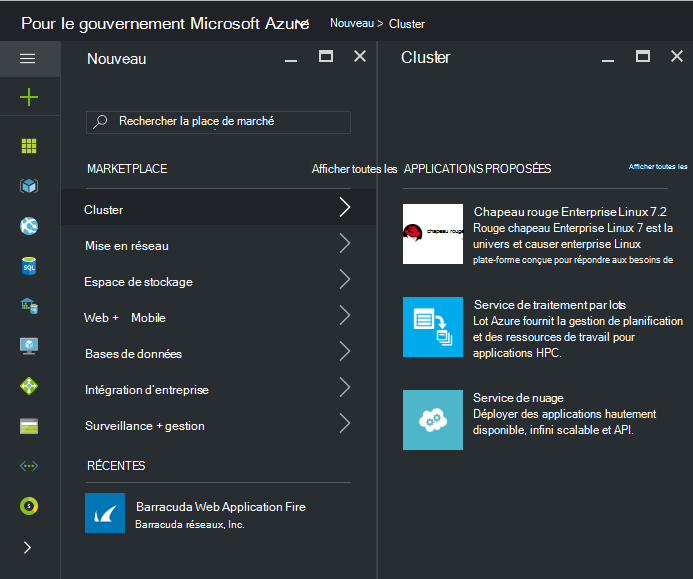
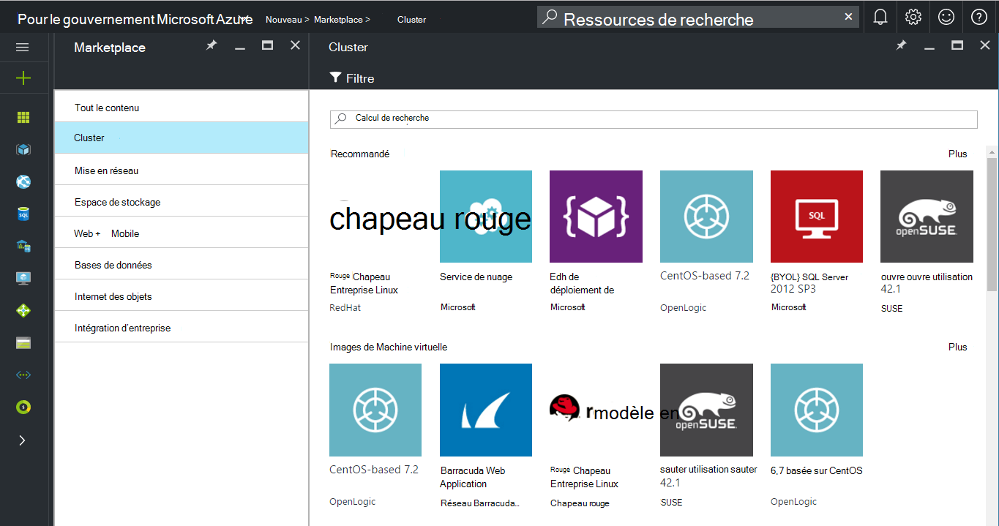
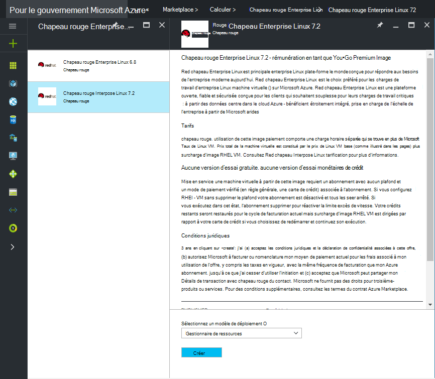
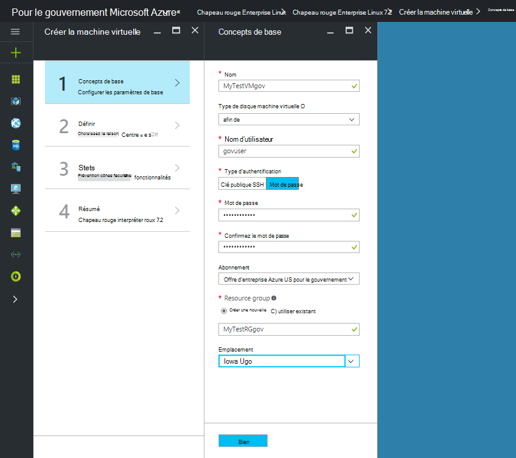
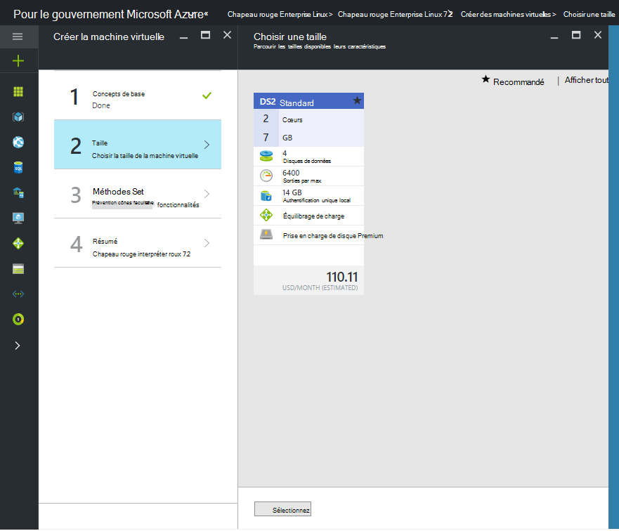

 <properties
    pageTitle="Documentation pour le gouvernement Azure | Microsoft Azure"
    description="Cela fournit une comparaison des fonctionnalités et des conseils sur le développement d’applications pour le gouvernement Azure."
    services="Azure-Government"
    cloud="gov"
    documentationCenter=""
    authors="VybavaRamadoss"
    manager="asimm"
    editor=""/>

<tags   ms.service="multiple"
    ms.devlang="na"
    ms.topic="article"
    ms.tgt_pltfrm="na"
    ms.workload="azure-government"
    ms.date="10/20/2016"
    ms.author="zakramer;vybavar"/>

# Azure Marketplace pour le gouvernement
La Azure Marketplace est disponible pour le gouvernement Azure avec une liste d’images à partir de notre éditeurs marketplace mis à jour. 

## Variantes
Voici quelques considérations lorsque vous utilisez Azure Marketplace pour le gouvernement :

- Seules les images mettre votre propre licence (BYOL) sont disponibles. Impossible d’accéder à toutes les images qui requièrent transaction achat via Azure Marketplace
- Seul un sous-ensemble des images est actuellement disponible par rapport à la place de marché public. Vous pouvez consulter la liste des images disponibles [ici](../azure-government-image-gallery.md) 
- Avant de configurer une image, votre administrateur d’entreprise doit activer achats Marketplace pour votre abonnement Azure
  - Connectez-vous au portail comme administrateur d’entreprise
  - Accédez à *Gérer*
  - Sous *Détails du serveur d’inscription* , cliquez sur l’icône de crayon en regard de l’élément de ligne *Azure Marketplace*
  - Activer ou désactiver la *Activé/désactivé* le cas échéant
  - Cliquez sur *Enregistrer*

>[AZURE.NOTE] Si vous êtes intéressé par rendre vos images disponibles dans Azure pour le gouvernement reportez-vous aux [instructions d’intégration de partenaire](documentation-government-manage-marketplace-partners.md) pour plus d’informations.

### Étape 1
Lancer la place de marché

  

### Étape 2
Parcourir les différents produits pour trouver le bon.

L’éditeur marketplace fournit une liste de certification dans le cadre de la description de produit pour vous aider à faire le bon choix. 

### Étape 3
Choisissez un product\image

### Étape 4
Démarrez le flux de créer, puis entrez les paramètres requis pour le déploiement

>[AZURE.NOTE] Dans la liste déroulante emplacement, seuls les emplacements pour le gouvernement Azure sont visibles

### Étape 5
Observez tarifs

### Étape 6
Effectuer toutes les étapes, puis cliquez sur Ok pour démarrer le processus de mise en service

## Étapes suivantes

Pour des informations supplémentaires et des mises à jour, abonnez-vous au [Blog de Microsoft Azure pour le gouvernement](https://blogs.msdn.microsoft.com/azuregov/).
