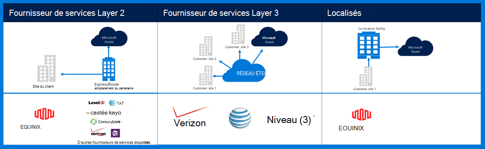
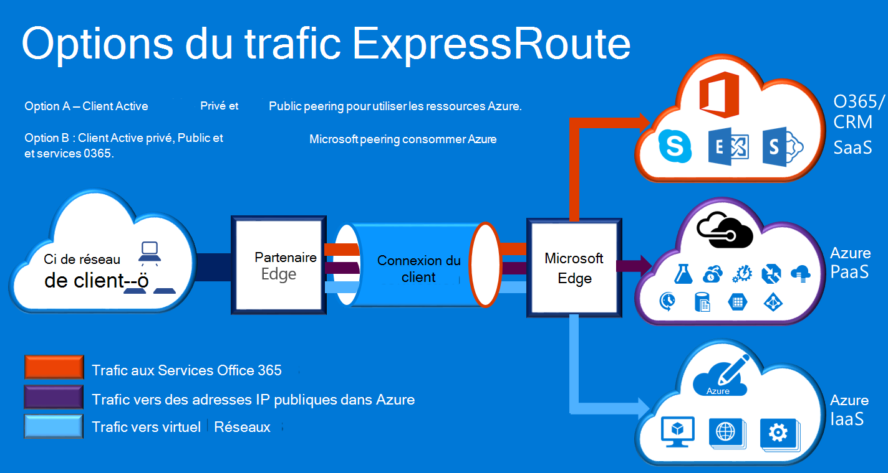

<properties
    pageTitle="Documentation présentée sous d’Azure Governmenmt | Microsoft Azure"
    description="Cela fournit une comparaison des fonctionnalités et des conseils pour la connectivité privée à e pour le gouvernement"
    services="Azure-Government"
    cloud="gov" 
    documentationCenter=""
    authors="ryansoc"
    manager="zakramer"
    editor=""/>

<tags
    ms.service="multiple"
    ms.devlang="na"
    ms.topic="article"
    ms.tgt_pltfrm="na"
    ms.workload="azure-government"
    ms.date="09/28/2016"
    ms.author="ryansoc"/>

#  Mise en réseau pour le gouvernement Azure

##  ExpressRoute (privé Connectivity)

ExpressRoute est généralement disponible dans Azure pour le gouvernement. Pour plus d’informations (y compris les partenaires et peering emplacements), consultez la <a href="https://azure.microsoft.com/en-us/documentation/services/expressroute/">documentation publique ExpressRoute </a>.

###  Variantes

ExpressRoute est généralement disponibles (disponible depuis) dans Azure pour le gouvernement. 

- Clients pour le gouvernement se connectent à une capacité physiquement isolée via une connexion dédiée pour le gouvernement Azure (et pour le gouvernement) ExpressRoute (restauration d’urgence)

- Et pour le gouvernement Azure offre une disponibilité accrue et durabilité grâce à plusieurs paires de région trouve un minimum de 500 miles cm 

- Par défaut toute la connectivité restauration d’urgence Azure et pour le gouvernement est configuré actif redondants prenant en charge de rupture et offre une capacité de circuit jusqu'à 10 G (50 Mo est plus petit)

- Emplacements de restauration d’urgence et pour le gouvernement Azure fournissent voies optimisées (le plus court sauts, faible latence, haute performance, etc.) pour les clients et les régions geo redondants Azure et pour le gouvernement

- La connexion privée restauration d’urgence et pour le gouvernement Azure n’utilise pas, parcourir ou dépendent d’Internet

- Azure infrastructure physique et logique et pour le gouvernement est physiquement dédié séparé et l’accès est limité à des personnes US

- Microsoft possède et utilise toute infrastructure Fibre entre Azure et pour le gouvernement régions et répondre à la restauration d’urgence et pour le gouvernement Azure-Me emplacements

- Restauration d’urgence et pour le gouvernement Azure fournit la connectivité aux services cloud Microsoft Azure, Office 365 et CRM

### Considérations relatives à la

Il existe deux services de base qui fournissent la connectivité réseau privé dans Azure pour le gouvernement : VPN (-sites pour une organisation classique) et ExpressRoute.

Azure ExpressRoute sert à créer des connexions entre les centres de données pour le gouvernement Azure et votre infrastructure sur site ou dans un environnement colocation. ExpressRoute connexions ne passent pas par le biais d’Internet public — ils offrent davantage de fiabilité, de vitesses et de latence inférieur que les connexions Internet typiques. Dans certains cas, à l’aide de connexions ExpressRoute pour transférer des données entre sur les systèmes de site et Azure rendements significatives avantages de coûts.   

Avec ExpressRoute, vous établissez des connexions à Azure à un emplacement ExpressRoute (par exemple, une fonctionnalité de fournisseur Exchange), ou vous connecter directement à Azure à partir de votre réseau étendu existant (par exemple, un multi-protocole étiqueter changement (MPLS) VPN, fournie par un fournisseur de service de réseau).

    

Pour les services de réseau prendre en charge les solutions et les applications du client pour le gouvernement Azure, il est fortement recommandé que ExpressRoute (privé connectivity) est activée pour vous connecter à Azure pour le gouvernement. Si les connexions VPN sont utilisées, doivent être considérés :

- Les clients doivent contacter son autorisation officielle/agence pour déterminer si la connectivité privée ou un autre mécanisme de connexion sécurisée est requis et d’identifier des restrictions supplémentaires à prendre en compte.

- Clients devraient décider si vous imposent que le réseau privé virtuel de site à est routé via une zone de connectivité privé.

- Les clients doivent obtenir un circuit MPLS ou VPN avec un fournisseur d’accès sous licence connectivité privé.

Tous les clients qui utilisent une architecture de connectivité privé doivent valider qu’une implémentation appropriée est établie et conservée pour la connexion client à la passerelle réseau/Internet (GN / je) bord du point de démarcation routeur pour Azure gouvernement. De même, votre organisation doit établir la connectivité réseau entre votre environnement local et le point de démarcation routeur passerelle réseau/client (GN/C) bord pour Azure gouvernement.

## Étapes suivantes

Pour des informations supplémentaires et des mises à jour, veuillez vous inscrire à la <a href="https://blogs.msdn.microsoft.com/azuregov/">Blog de Microsoft Azure pour le gouvernement.</a>
