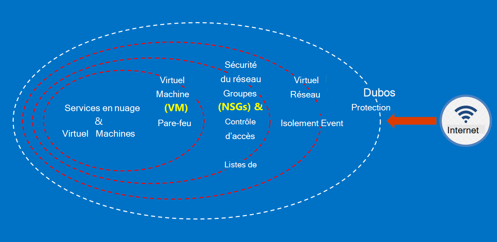

<properties
    pageTitle="Documentation pour le gouvernement Azure | Microsoft Azure"
    description="Cela fournit une comparaison des fonctionnalités et des recommandations sur le développement d’applications pour le gouvernement Azure"
    services="Azure-Government"
    cloud="gov" 
    documentationCenter=""
    authors="ryansoc"
    manager="zakramer"
    editor=""/>

<tags
    ms.service="multiple"
    ms.devlang="na"
    ms.topic="article"
    ms.tgt_pltfrm="na"
    ms.workload="azure-government"
    ms.date="08/25/2016"
    ms.author="ryansoc"/>

#  Vue d’ensemble de la Documentation pour le gouvernement Azure

##  Introduction à la Documentation pour le gouvernement Azure

Ce site décrit les fonctionnalités des services [Microsoft Azure pour le gouvernement](https://azure.microsoft.com/features/gov/) et fournit des instructions générales pour tous les clients. Avant d’inclure plus précisément les données régulées dans votre abonnement pour le gouvernement Azure, vous devez vous familiariser avec les fonctionnalités pour le gouvernement Azure et contactez votre équipe de compte si vous avez des questions.

Vous devez faire référence à la [Page Microsoft Azure approbation centre de conformité](http://www.microsoft.com/en-us/TrustCenter/Compliance/default.aspx) pour obtenir des informations sur les services pour le gouvernement Azure couverts par la réglementation et accréditations spécifiques. Services Microsoft supplémentaires peuvent également être disponibles, mais ne sont pas dans le cadre des services pour le gouvernement Azure couverts et ne sont pas traités par ce document. Services pour le gouvernement Azure peuvent également vous autorise à utiliser une variété de ressources supplémentaires, applications ou services qui sont fournies par des tiers — ou par Microsoft sous des termes différents de stratégies d’utilisation et de confidentialité, qui ne sont pas inclus dans le cadre de ce document. Vous êtes responsable de consulter les termes de toutes les ces offres « module complémentaire », tels que les offres Marketplace, pour vous assurer qu’elles répondent à vos besoins en matière de conformité.

Pour le gouvernement Azure est accessible aux entités qui gèrent les données qui se trouve sous certaines réglementations gouvernementales et conditions (par exemple, NIST 800.171 (DIB), ITAR, administration fiscale 1075, DoD L4 et CJIS) où utilisation du gouvernement Azure doit respecter les réglementations. Les clients pour le gouvernement Azure sont soumis à validation d’éligibilité.

Entités des questions sur les conditions d’éligibilité pour Azure gouvernement doivent consulter leur équipe compte.

##  Principes pour sécuriser les données client dans Azure pour le gouvernement

Pour le gouvernement Azure fournit une plage de fonctionnalités et services que vous pouvez utiliser pour créer des solutions de cloud pour répondre à vos besoins de données réglée/contrôlée. Une solution client compatible est rien d’autre que l’implémentation des fonctionnalités pour le gouvernement Azure de prédéfinies, associée à une pratique de sécurité solides données efficace.
Lorsque vous hébergez une solution dans Azure pour le gouvernement, Microsoft gère la plupart de ces exigences au niveau de l’infrastructure cloud.

Le diagramme suivant montre le modèle de défense en profondeur Azure. Par exemple, Microsoft fournit infrastructure cloud base DDOS, ainsi que des fonctionnalités de client, telles que des appareils de sécurité d’application spécifique au client que DDoS a besoin.

Cette page décrit les principes fondamentaux pour la sécurisation de vos Services et applications, fournissant des instructions et des recommandations sur la façon d’appliquer les principes ; en d’autres termes, comment clients doivent utiliser actives pour le gouvernement Azure afin de respecter les obligations et les responsabilités nécessaires pour une solution qui gère les informations ITAR.

Les principes pour sécuriser les données client sont :
* Protection des données à l’aide de chiffrement
* Gérer les secrets
* Isolement limiter l’accès aux données

##  Protection des données client à l’aide de chiffrement

Réduire les risques et les obligations légales êtes au volant le focus et l’importance de chiffrement des données croissant. Utiliser une mise en œuvre de chiffrement efficaces pour améliorer les mesures de sécurité réseau et des applications en cours et réduire le risque global de votre environnement cloud.

### Chiffrement inactives
Le chiffrement des données inactives s’applique à la protection du contenu client dans le stockage de disque. Il existe plusieurs manières que cela peut se produire :

### Chiffrement de Service de stockage

Chiffrement de Service de stockage Azure est activé au niveau du compte de stockage, ce qui crée de bloc BLOB et des objets BLOB de page en cours de chiffrement automatiquement lors de l’écriture au stockage Azure. Lorsque vous lisez les données à partir du stockage Azure, il sera déchiffré avant d’être retourné par le service de stockage. Cela permet de protéger vos données sans avoir à modifier ou ajouter du code à toutes les applications.

### Chiffrement de disque Azure
Utilisation du chiffrement disque Azure pour chiffrer les disques du système d’exploitation et données utilisée par une Machine virtuelle Azure. Intégration avec l’archivage sécurisé de clé Azure vous donne de contrôle et permet de gérer les clés de chiffrement de disque.

### Chiffrement côté client
Chiffrement côté client est intégré à Java et les bibliothèques de client de stockage .NET, qui peuvent utiliser Azure clé l’archivage sécurisé API, ce qui en fait plus simple à implémenter. L’archivage sécurisé de clé Azure permet d’obtenir l’accès aux secrets dans l’archivage sécurisé de clé Azure pour des individus spécifiques à l’aide d’Azure Active Directory.

### Chiffrement lors des transferts

Le chiffrement base disponible pour la connectivité au gouvernement Azure prend en charge le protocole de sécurité TLS (Transport Level) 1.2 et de certificats X.509. Fédérales informations Standard FIPS (Processing) algorithmes de chiffrement de niveau 1 140-2 sont également utilisés pour les connexions de réseau infrastructure entre centres de données pour le gouvernement Azure.  Windows Server 2012 R2 et Windows 8-plus machines virtuelles et les partages Azure peuvent utiliser PME 3.0 pour le chiffrement entre la machine virtuelle et le partage de fichiers. Utilisation du chiffrement côté Client pour chiffrer les données avant qu’il est transféré dans le stockage dans une application cliente et pour déchiffrer les données après celui-ci est transféré à partir d’espace de stockage.

### Meilleures pratiques pour le chiffrement

* Machines virtuelles IaaS : Utilisation du chiffrement disque Azure. Activer le chiffrement de Service de stockage pour chiffrer les fichiers de disque dur virtuel qui sont utilisés pour sauvegarder ces disques dans le stockage Azure, mais cela chiffre uniquement les données nouvellement écrites. Cela signifie que, si vous créez une machine virtuelle, puis activez le chiffrement de Service de stockage sur le compte de stockage qui contient le fichier de disque dur virtuel, seules les modifications seront chiffrées, pas le fichier de disque dur virtuel d’origine.
* Chiffrement côté client : Il s’agit de la méthode la plus sûre pour chiffrer vos données, car elle chiffre avant de voies et chiffre les données au repos. Toutefois, elle ne requiert que vous ajouter du code à vos applications à l’aide de stockage, vous souhaiterez pas faire. Dans ce cas, vous pouvez utiliser HTTPs pour vos données échangées et chiffrement de Service de stockage pour chiffrer les données au reste. Chiffrement côté client implique également la charge plus sur le client, vous devez tenir compte de vos plans extensibilité élevées, surtout si vous êtes le chiffrement et transfert d’un grand nombre de données.

Pour plus d’informations sur les options de chiffrement dans Azure voir le [Guide de sécurité de stockage](/storage-security-guide).

##  Protection des données client en gérant Secrets

Gestion des clés sécurisée est indispensable pour la protection des données dans le cloud. Les clients doivent visent à simplifier la gestion de clés et conservez le contrôle des clés utilisées par les services et d’applications cloud pour chiffrer les données.

### Meilleures pratiques pour la gestion des Secrets

* Utiliser l’archivage sécurisé clé pour réduire les risques de secrets l’exposition via les fichiers de configuration codé en dur, des scripts, ou dans le code source. L’archivage sécurisé clé Azure chiffre touches (par exemple, les clés de chiffrement pour le chiffrement de disque Azure) et secrets (par exemple, les mots de passe), en les stockant dans FIPS 140-2 niveau 2 validées modules de sécurité matérielle (HSM). Pour assurance ajouté, vous pouvez importer ou générer des clés dans ces HSM.
* Modèles et le code de l’application doivent contenir uniquement les références URI aux secrets (ce qui signifie que les réels secrets ne sont pas dans le code, de configuration ou de code source référentiels). Cela empêche les attaques de phishing clés sur pensions internes ou externes, telles que les extractions-robots dans GitHub.
* Utiliser les contrôles RBAC forts au sein de l’archivage sécurisé clé. Si un opérateur approuvé quitte la société ou transferts à un nouveau groupe au sein de la société, elles doivent être bloquées ne soient en mesure d’accéder les secrets.  

Pour plus d’informations, voir [L’archivage sécurisé clé pour Azure pour le gouvernement](/azure-government/azure-government-tech-keyvault)

##  Isolement limiter l’accès aux données

Isolement tout consiste à l’aide de conteneurs, segmentation et frontières pour limiter l’accès aux données aux utilisateurs autorisés, services et applications, uniquement. Par exemple, la séparation entre les clients est un mécanisme de sécurité essentiels pour les plateformes partagé cloud tel que Microsoft Azure. Isolement logique permet d’empêcher un client d’interférer avec les opérations de n’importe quel autre client.

### Environnement isolement
L’environnement pour le gouvernement Azure est une instance physique qui est séparée du reste du réseau de Microsoft. Cela grâce à une série de contrôles logiques et physiques qui sont les suivants : sécurisation d’obstacles physiques à l’aide de caméras et périphériques biométriques.  Utilisation des informations d’identification spécifiques et l’authentification multifacteur par le personnel Microsoft nécessitant un accès logique à l’environnement de production.  Toute infrastructure de service pour le gouvernement Azure se trouve au sein des États-Unis.

#### Isolement par client
Contrôle d’accès réseau met en œuvre Azure et répartition par le biais d’isolement réseau local virtuel, utilisateurs, chargent des programmes d’équilibrage et filtres IP

Les clients peuvent isoler davantage leurs ressources des abonnements, des groupes de ressources, réseaux virtuels et sous-réseaux.

Pour plus d’informations sur isolement dans Microsoft Azure voir la [section isolement du Guide de sécurité Azure](/azure-security-getting-started/#isolation).

Pour des informations supplémentaires et des mises à jour, veuillez vous inscrire à la <a href="https://blogs.msdn.microsoft.com/azuregov/">Blog de Microsoft Azure pour le gouvernement.</a>
