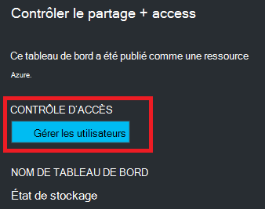

<properties
   pageTitle="Accès de tableau de bord du portail Azure | Microsoft Azure"
   description="Cet article explique comment partager l’accès à un tableau de bord dans le portail Azure."
   services="azure-portal"
   documentationCenter=""
   authors="tfitzmac"
   manager="timlt"
   editor="tysonn"/>

<tags
   ms.service="multiple"
   ms.devlang="NA"
   ms.topic="article"
   ms.tgt_pltfrm="NA"
   ms.workload="na"
   ms.date="08/01/2016"
   ms.author="tomfitz"/>

# Partage de tableaux de bord Azure

Après avoir configuré un tableau de bord, vous pouvez publier et partager avec d’autres utilisateurs de votre organisation. Vous autorisez d’autres personnes à accéder à votre tableau de bord à l’aide de Azure [Contrôle d’accès en fonction de rôle](../active-directory/role-based-access-control-configure.md). Vous affectez un utilisateur ou un groupe d’utilisateurs à un rôle, et ce rôle définit si les utilisateurs peuvent afficher ou modifier le tableau de bord publié. 

Tous les tableaux de bord publiés est implémentées en tant que ressources Azure, ce qui signifie qu’ils existent comme éléments gérables au sein de votre abonnement et sont contenues dans un groupe de ressources.  À partir d’un point de vue du contrôle de l’accès, les tableaux de bord est pas différente de celle d’autres ressources, par exemple une machine virtuelle ou un compte de stockage.

> [AZURE.TIP] Vignettes individuels dans le tableau de bord mettent en œuvre leurs propres exigences de contrôle d’accès basés sur les ressources qu'ils s’affichent.  Par conséquent, vous pouvez créer un tableau de bord qui est partagée largement tout en protégeant les données de mosaïques individuels.

## Présentation du contrôle de l’accès pour les tableaux de bord

Avec le contrôle d’accès basé sur un rôle, vous pouvez affecter des utilisateurs aux rôles à trois niveaux différents d’étendue :

- abonnement
- groupe de ressources
- ressource

Les autorisations que vous attribuez sont héritées d’abonnement vers le bas jusqu'à la ressource. Le tableau de bord publié est une ressource. Par conséquent, vous devrez déjà affectées aux rôles dans l’abonnement qui fonctionne également pour le tableau de bord publié des utilisateurs. 

Voici un exemple.  Imaginons que vous avez un abonnement Azure et les rôles de **propriétaire**, **collaborateur**ou **lecteur** de l’abonnement ont été octroyées à divers membres de votre équipe. Les utilisateurs qui sont les propriétaires et les collaborateurs sont en mesure de la liste, afficher, créer, modifier ou supprimer des tableaux de bord au sein de l’abonnement.  Les utilisateurs qui se trouvent les lecteurs sont en mesure de liste et affichage des tableaux de bord, mais Impossible de modifier ou les supprimer.  Les utilisateurs avec accès en lecture sont en mesure d’apporter des modifications locales à un tableau de bord publié (par exemple, pour résoudre un problème), mais ne sont pas en mesure de publier ces modifications sur le serveur.  Ils auront la possibilité pour faire une copie privée du tableau de bord pour eux-mêmes

Toutefois, vous pouvez aussi affecter des autorisations au groupe de ressources qui contient plusieurs tableaux de bord ou à un tableau de bord individuel. Par exemple, vous pouvez décider qu’un groupe d’utilisateurs doit disposent d’autorisations limitées au sein de l’abonnement, mais meilleur accès à un tableau de bord spécifique. Vous affectez ces utilisateurs à un rôle pour ce tableau de bord. 

## Publier le tableau de bord

Supposons que vous avez terminé la configuration d’un tableau de bord que vous voulez partager avec un groupe d’utilisateurs de votre abonnement. Les étapes suivantes décrivent un groupe personnalisé appelé responsables du stockage, mais vous pouvez nommer votre groupe ce que vous voulez. Pour plus d’informations sur la création d’un groupe Active Directory et en ajoutant des utilisateurs à ce groupe, voir [Gestion des groupes dans Azure Active Directory](../active-directory/active-directory-accessmanagement-manage-groups.md).

1. Dans le tableau de bord, sélectionnez **partager**.

     

2. Avant d’affecter access, vous devez publier le tableau de bord. Par défaut, le tableau de bord sera publiée à un groupe de ressources nommé **tableaux de bord**. Sélectionnez **Publier**.

     

Votre tableau de bord est désormais publié. Si les autorisations héritées de l’abonnement ne conviennent pas, vous n’avez pas besoin de rien faire plus. D’autres utilisateurs de votre organisation seront en mesure d’accéder et de modifier le tableau de bord en fonction de leur rôle au niveau d’abonnement. Toutefois, pour ce didacticiel, nous allons affecter un groupe d’utilisateurs à un rôle pour ce tableau de bord.

## Affectation d’accès à un tableau de bord

1. Après la publication du tableau de bord, sélectionnez **Gérer les utilisateurs**.

     

2. Vous verrez une liste des utilisateurs existants qui disposent déjà d’un rôle pour ce tableau de bord. Votre liste des utilisateurs existants sera différente de l’image ci-dessous. Il est probable les affectations sont héritées de l’abonnement. Pour ajouter un nouvel utilisateur ou un groupe, sélectionnez **Ajouter**.

     

3. Sélectionnez le rôle qui représente les autorisations que vous voulez accorder. Dans cet exemple, sélectionnez **collaborateur**.

     

4. Sélectionnez l’utilisateur ou le groupe que vous souhaitez attribuer le rôle. Si vous ne voyez pas l’utilisateur ou groupe recherchée dans la liste, utilisez la zone de recherche. Votre liste des groupes disponibles varient selon les groupes que vous avez créé dans votre annuaire Active Directory.

      

5. Lorsque vous avez terminé d’ajouter des utilisateurs ou des groupes, sélectionnez **OK**. 

6. La nouvelle affectation est ajoutée à la liste des utilisateurs. Notez que son **accès** est répertorié en tant que **attribuées** et non **hérité**.

     

## Étapes suivantes

- Pour obtenir la liste des rôles, voir [RBAC : rôles intégrés](../active-directory/role-based-access-built-in-roles.md).
- Pour en savoir plus sur la gestion des ressources, consultez [ressources Azure gérer via le portail](resource-group-portal.md).