<properties
   pageTitle="Tableaux de bord du portail Azure | Microsoft Azure"
   description="Cet article explique comment créer et modifier des tableaux de bord dans le portail Azure."
   services="azure-portal"
   documentationCenter=""
   authors="sewatson"
   manager="timlt"
   editor="tysonn"/>

<tags
   ms.service="multiple"
   ms.devlang="NA"
   ms.topic="article"
   ms.tgt_pltfrm="NA"
   ms.workload="na"
   ms.date="09/06/2016"
   ms.author="sewatson"/>

# Créer et partager des tableaux de bord dans le portail Azure

Vous pouvez créer plusieurs tableaux de bord et les partager avec d’autres personnes ayant accès à vos abonnements Azure.  Ce billet parcourt les notions de base de création/modification, la publication et la gestion de l’accès aux tableaux de bord.

## Personnalisation des tableaux de bord et cartes

Depuis le lancement de tableaux de bord il y a quelques mois, il a été une baisse du nombre dans les personnalisations de cartes et une augmentation rapide dans les personnalisations de tableau de bord. Cette tendance de l’utilisation fort indique que vous préférez personnalisation des tableaux de bord sur les cartes. Pour prendre en charge cette tendance, nous entraîne la suppression la possibilité de personnaliser les cartes et dédier nos efforts à l’amélioration des fonctionnalités de tableau de bord. Si vous avez personnalisé une carte, votre personnalisation va bientôt être supprimée. Pour conserver la personnalisation, épingler les vignettes personnalisées à un tableau de bord. Simplement avec le bouton droit de la vignette, puis sélectionnez **épingler au tableau de bord** comme le montre l’image suivante.

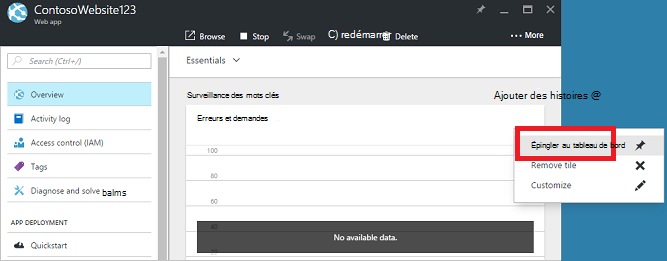

## Créer un tableau de bord

Pour créer un tableau de bord, sélectionnez le bouton **nouveau tableau de bord** en regard du nom du tableau de bord actuel.  

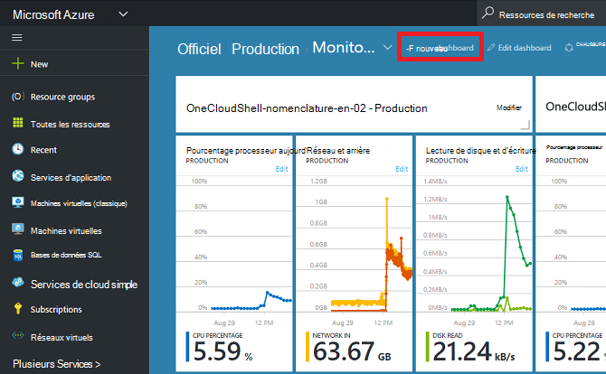

Cette action crée un tableau de bord de nouveau, vide, privé et vous place en mode de personnalisation dans laquelle vous pouvez nommer votre tableau de bord et ajouter ou réorganiser des vignettes.  Dans ce mode, la galerie réductible vignette permet d’accéder via le menu de navigation gauche.  La galerie vignette vous permet de rechercher des vignettes pour vos ressources Azure de diverses façons : vous pouvez parcourir par [groupe de ressources](../azure-resource-manager/resource-group-overview.md#resource-groups), par type de ressource, par une [balise](../resource-group-using-tags.md)ou en recherchant la ressource par son nom.  

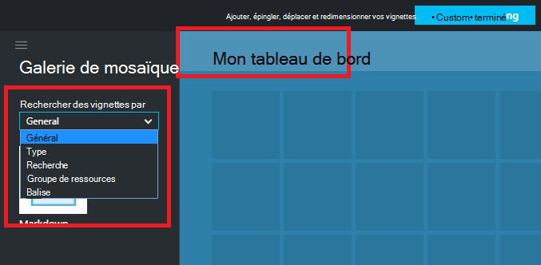

Ajouter des vignettes en les faisant glisser vers la surface de tableau de bord à l’endroit souhaité.

Il existe une nouvelle catégorie appelée **Général** pour les mosaïques qui ne sont pas associés à une ressource particulière.  Dans cet exemple, nous épinglez la vignette démarque.  Cette vignette vous permet d’ajouter du contenu personnalisé à votre tableau de bord.  La vignette prend en charge au format texte brut, [syntaxe démarque](https://daringfireball.net/projects/markdown/syntax)et un nombre limité de HTML.  (Pour la sécurité, vous ne pouvez pas effectuer les actions comme injection `<script>` balises ou utiliser certaine élément style de feuille de style CSS peut interférer avec le portail.) 

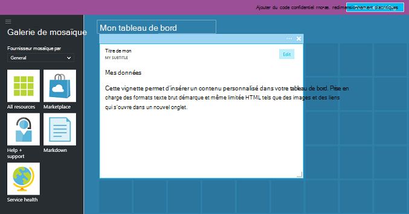

## Modifier un tableau de bord

Après avoir créé votre tableau de bord, vous pouvez épingler vignettes à partir de la galerie vignette ou la représentation de la vignette de cartes. Nous allons épingler la représentation de notre groupe de ressources. Vous pouvez soit code confidentiel lorsque vous naviguez sur l’élément, ou à partir de la carte de groupe de ressources. Les deux approches entraînent l’épinglage la représentation mosaïque de groupe de ressources.

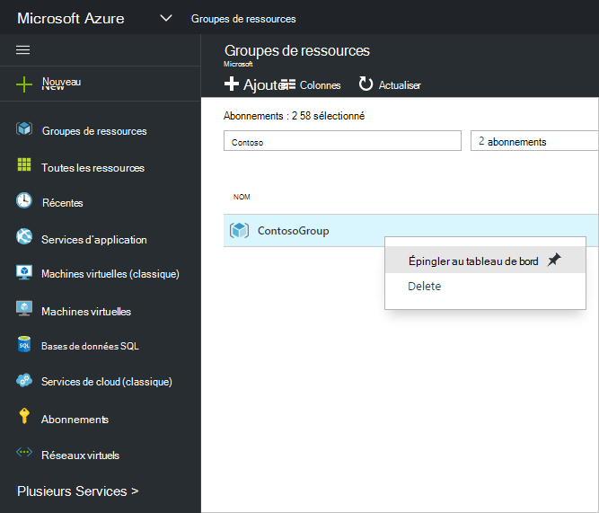

Après avoir épinglé l’élément, il apparaît sur votre tableau de bord.

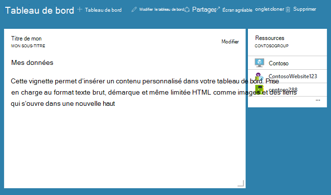

À présent que nous avons une vignette démarque et un groupe de ressources épinglées au tableau de bord, nous pouvons redimensionner et réorganiser les mosaïques des images dans une disposition appropriée.

En plaçant le curseur et sélection de « … » ou avec le bouton droit sur une vignette, vous pouvez voir toutes les commandes contextuelles pour cette vignette. Par défaut, il existe deux éléments :

1. **Détacher du tableau de bord** – supprime la vignette du tableau de bord
2.  **Personnaliser** – saisit personnaliser mode

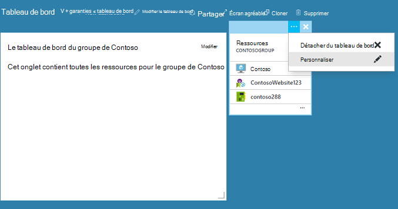

En sélectionnant Personnaliser, vous pouvez redimensionner et réorganiser les mosaïques. Pour redimensionner une vignette, sélectionnez la nouvelle taille dans le menu contextuel, comme le montre l’image suivante.

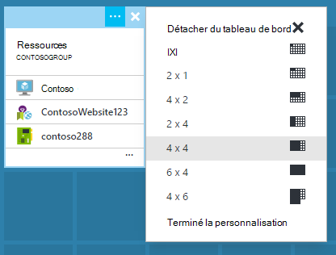

Ou, si la vignette prend en charge n’importe quelle taille, vous pouvez faire glisser le coin inférieur droit de la taille souhaitée.

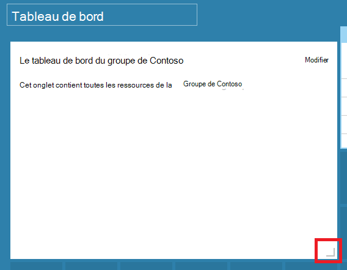

Après redimensionnement de mosaïques, permet d’afficher le tableau de bord.

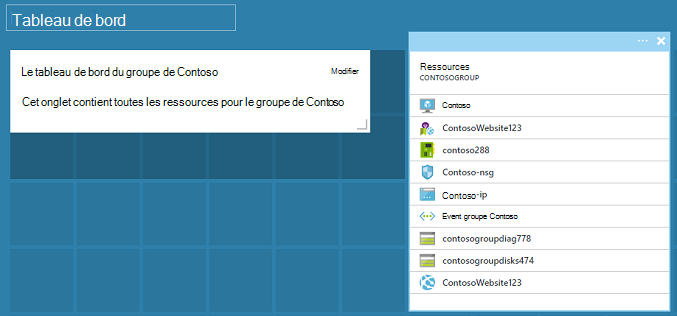

Une fois que vous avez terminé de personnaliser un tableau de bord, sélectionnez simplement le **fait de personnalisation** pour quitter personnaliser le mode ou avec le bouton droit et sélectionnez **terminé la personnalisation** dans le menu contextuel.

## Publier un tableau de bord et de gérer le contrôle d’accès

Lorsque vous créez un tableau de bord, il est privé par défaut, ce qui signifie que vous êtes la seule personne qui peut la voir.  Pour rendre visible aux autres, utilisez le bouton **partage** qui s’affiche en parallèle avec les autres commandes de tableau de bord.

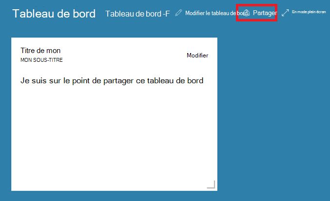

Vous êtes invité à choisir un abonnement et un groupe de ressources pour votre tableau de bord à publier à. Pour intégrer en toute transparence des tableaux de bord dans le réseau, nous avons mis en œuvre des tableaux de bord partagé en tant que ressources Azure (de sorte que vous ne pouvez pas partager en tapant une adresse de messagerie).  Accès aux informations affichées par la plupart des vignettes dans le portail sont régis par [Rôle Azure en fonction de contrôle d’accès](../active-directory/role-based-access-control-configure.md ). À partir d’un point de vue du contrôle de l’accès, des tableaux de bord partagé diffèrent pas une machine virtuelle ou un compte de stockage.  

Imaginons que vous avez un abonnement Azure et de membres de votre équipe ont reçu les rôles de **propriétaire**, **collaborateur**ou **lecteur** de l’abonnement.  Les utilisateurs qui sont les propriétaires et les collaborateurs sont en mesure de la liste, afficher, créer, modifier ou supprimer des tableaux de bord au sein de cet abonnement.  Les utilisateurs qui se trouvent les lecteurs sont en mesure de liste et affichage des tableaux de bord, mais Impossible de modifier ou les supprimer.  Utilisateurs avec accès en lecture sont en mesure d’apporter des modifications locales à un tableau de bord partagé, mais ne sont pas en mesure de publier ces modifications sur le serveur.  Toutefois, ils peuvent faire une copie privée du tableau de bord pour leur usage.  Comme toujours, des vignettes dans le tableau de bord mettent en œuvre leurs propres règles de contrôle d’accès basés sur les ressources que lorsqu’elles correspondent au.  

Pour faciliter la tâche, expérience publication du portail vous guide vers un modèle de l’endroit où vous placez les tableaux de bord dans un groupe de ressources appelé **tableaux de bord**.  

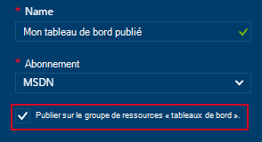

Vous pouvez également choisir de publier un tableau de bord à un groupe de ressources.  Le contrôle d’accès pour ce tableau de bord représente le contrôle d’accès du groupe de ressources.  Utilisateurs pouvant gérer les ressources dans ce groupe de ressources également ont accès pour les tableaux de bord.

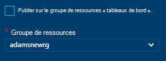

Après la publication de votre tableau de bord, le volet de contrôle **partage + access** sera actualiser et affiche des informations sur le tableau de bord publié, ainsi qu’un lien pour gérer l’accès utilisateur au tableau de bord.  Ce lien ouvre la carte de contrôle d’accès rôle standard utilisé pour gérer l’accès pour n’importe quelle ressource Azure.  Vous pouvez toujours revenir à cet affichage en sélectionnant **partager**.

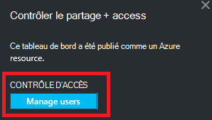

## Étapes suivantes

- Pour gérer les ressources, consultez [ressources Azure gérer via le portail](resource-group-portal.md).
- Pour déployer des ressources, consultez [ressources de déployer des modèles de gestionnaire de ressources et Azure portail](../resource-group-template-deploy-portal.md).