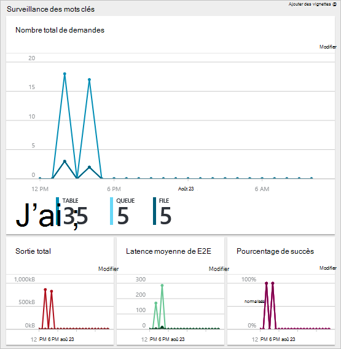

<properties 
    pageTitle="Permet de gérer les ressources Azure Azure portal | Microsoft Azure" 
    description="Utilisez Azure portail et gérer les ressources Azure pour gérer vos ressources. Montre comment utiliser des tableaux de bord pour surveiller les performances." 
    services="azure-resource-manager,azure-portal" 
    documentationCenter="" 
    authors="tfitzmac" 
    manager="timlt" 
    editor="tysonn"/>

<tags 
    ms.service="azure-resource-manager" 
    ms.workload="multiple" 
    ms.tgt_pltfrm="na" 
    ms.devlang="na" 
    ms.topic="article" 
    ms.date="09/12/2016" 
    ms.author="tomfitz"/>

# Gérer les ressources Azure via le portail

> [AZURE.SELECTOR]
- [PowerShell Azure](../powershell-azure-resource-manager.md)
- [Azure infrastructure du langage commun](../xplat-cli-azure-resource-manager.md)
- [Portail](resource-group-portal.md) 
- [API REST](../resource-manager-rest-api.md)

Cette rubrique indique comment utiliser le [portail Azure](https://portal.azure.com) avec [Le Gestionnaire de ressources Azure](../azure-resource-manager/resource-group-overview.md) pour gérer vos ressources Azure. Pour savoir comment déployer des ressources à partir du portail, consultez [ressources de déploiement avec les modèles de gestionnaire de ressources et Azure portal](../resource-group-template-deploy-portal.md).

Pour l’instant, pas chaque service prend en charge le portail ou le Gestionnaire de ressources. Pour ces services, vous devez utiliser le [portail classique](https://manage.windowsazure.com). Pour l’état de chaque service, voir [graphique Azure disponibilité du portail](https://azure.microsoft.com/features/azure-portal/availability/).

## Gérer les groupes de ressources

1. Pour afficher tous les groupes de ressources dans votre abonnement, cliquez sur **groupes de ressources**.

    

1. Pour créer un groupe de ressources vide, sélectionnez **Ajouter**.

    

1. Fournir un nom et un emplacement pour le nouveau groupe de ressources. Sélectionnez **créer**.

    

1. Vous devrez peut-être sélectionnez **Actualiser** pour afficher le groupe de ressources créées récemment.

    

1. Pour personnaliser les informations affichées pour vos groupes de ressources, sélectionnez **les colonnes**.

    

1. Sélectionnez les colonnes à ajouter, puis **mise à jour**.

    

1. Pour savoir comment déployer des ressources à votre nouveau groupe de ressources, consultez [ressources de déployer des modèles de gestionnaire de ressources et Azure portail](../resource-group-template-deploy-portal.md).

1. Pour accéder rapidement à un groupe de ressources, vous pouvez épingler la carte à votre tableau de bord.

    

1. Le tableau de bord affiche le groupe de ressources et à ses ressources. Vous pouvez sélectionner les groupes de ressources ou une de ses ressources permettant d’accéder à l’élément.

    

## Ressources de balise

Vous pouvez appliquer des balises à des groupes de ressources et des ressources pour organiser logiquement vos ressources. Pour plus d’informations sur l’utilisation des balises, voir [en utilisant des balises pour organiser vos ressources Azure](../resource-group-using-tags.md).

[AZURE.INCLUDE [resource-manager-tag-resource](../../includes/resource-manager-tag-resources.md)]

## Contrôler les ressources

Lorsque vous sélectionnez une ressource, la carte de ressources présente des graphiques par défaut et tables permettant de contrôler ce type de ressource.

1. Sélectionnez une ressource et notez la section **surveillance** . Il inclut les graphiques pertinents pour le type de ressource. L’image suivante montre la valeur par défaut analyse des données pour un compte de stockage.

    

1. Vous pouvez épingler une section de la cuillère à votre tableau de bord en sélectionnant les points de suspension (...), au-dessus de la section. Vous pouvez également personnaliser la taille de la section dans la carte ou le supprimer complètement. L’image suivante montre comment épingler, personnaliser ou supprimer la section du processeur et la mémoire.

    

1. Après avoir épinglé la section au tableau de bord, vous verrez le résumé du tableau de bord. Et, sélectionnez-la, immédiatement vous permet d’accéder à plus d’informations sur les données.

    

1. Pour personnaliser entièrement les données que vous surveillez via le portail, accédez à votre tableau de bord par défaut, puis sélectionnez **nouveau tableau de bord**.

    

1. Donnez un nom à votre tableau de bord et faites glisser les vignettes sur le tableau de bord. Les mosaïques sont filtrées par différentes options.

    

     Pour en savoir plus sur l’utilisation des tableaux de bord, voir [Création et partage de tableaux de bord dans le portail Azure](azure-portal-dashboards.md).

## Gérer les ressources

Dans la carte pour une ressource, vous consultez les options de gestion de la ressource. Le portail présente des options de gestion pour ce type de ressource particulière. Les commandes de gestion s’affichent en haut de la cuillère ressource et sur le côté gauche.

À partir de ces options, vous pouvez effectuer les opérations, telles que le démarrage et l’arrêt d’une machine virtuelle ou reconfigurer les propriétés de la machine virtuelle.

## Déplacer des ressources

Si vous avez besoin déplacer des ressources d’un autre groupe de ressources ou d’un autre abonnement, voir [déplacer des ressources à nouveau groupe de ressources ou d’abonnement](../resource-group-move-resources.md).

## Ressources du verrouillage

Vous pouvez verrouiller un abonnement, groupe de ressources ou ressource pour empêcher d’autres utilisateurs de votre organisation à partir d’accidentellement en supprimant ou modifiant les ressources critiques. Pour plus d’informations, consultez [ressources de verrouillage avec le Gestionnaire de ressources Azure](../resource-group-lock-resources.md).

[AZURE.INCLUDE [resource-manager-lock-resources](../../includes/resource-manager-lock-resources.md)]

## Afficher votre abonnement et des coûts

Vous pouvez afficher les informations sur votre abonnement et les coûts reportées pour toutes vos ressources. Sélectionnez **les abonnements** et l’abonnement que vous voulez afficher. Vous devrez uniquement un abonnement à sélectionner.

Dans la carte de l’abonnement, vous voyez un taux d’avancement.

Et répartition des coûts par type de ressource.

## Modèle d’exportation

Après avoir configuré votre groupe de ressources, vous souhaiterez peut-être afficher le modèle de gestionnaire de ressources du groupe de ressources. Exporter le modèle offre deux avantages :

1. Vous pouvez facilement automatiser les déploiements à venir de la solution, car le modèle contient toute l’infrastructure complète.

2. Vous pouvez vous familiariser avec la syntaxe de modèle en recherchant à la Notation JSON (JavaScript Object) qui représente votre solution.

Pour des instructions détaillées, voir [Exporter le Gestionnaire de ressources Azure modèle à partir de ressources existantes](../resource-manager-export-template.md).

## Supprimer le groupe de ressources ou des ressources

Suppression d’un groupe de ressources supprime toutes les ressources qu’il contient. Vous pouvez également supprimer les ressources individuelles d’un groupe de ressources. Vous voulez vous devez faire preuve de prudence lorsque vous supprimez un groupe de ressources car il peut y avoir des ressources dans d’autres groupes de ressources qui y sont liées. Gestionnaire de ressources ne supprime pas les ressources liées, mais ils ne peuvent pas fonctionner correctement sans les ressources attendues.

## Étapes suivantes

- Pour afficher les journaux d’audit, voir [Auditer opérations avec le Gestionnaire de ressources](../resource-group-audit.md).
- Pour résoudre les erreurs de déploiement, voir [déploiements de groupe de ressources de résolution des problèmes avec Azure portail](../resource-manager-troubleshoot-deployments-portal.md).
- Pour déployer des ressources à partir du portail, consultez [ressources de déployer des modèles de gestionnaire de ressources et Azure portail](../resource-group-template-deploy-portal.md).
- Pour gérer l’accès aux ressources, voir [utiliser les affectations de rôle pour gérer l’accès à vos ressources abonnement Azure](../active-directory/role-based-access-control-configure.md).

