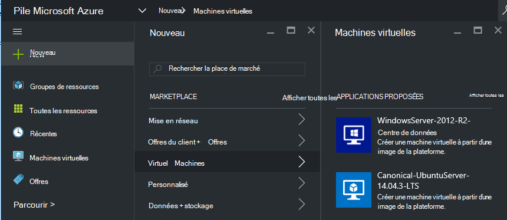
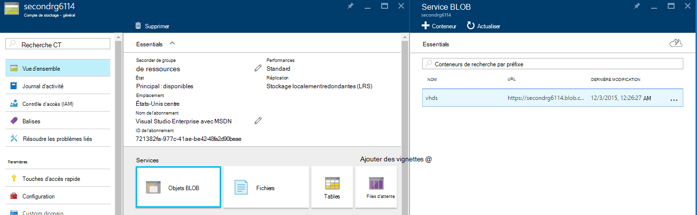
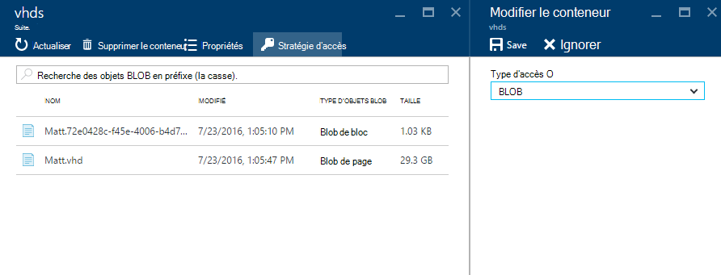
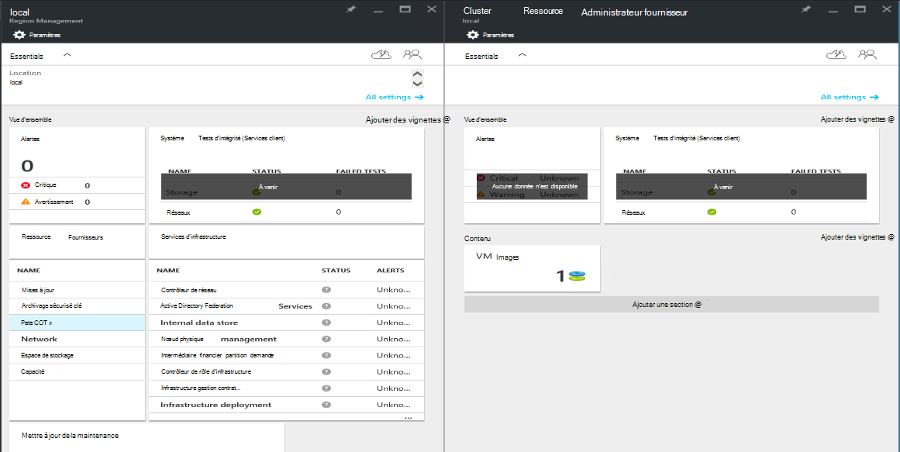
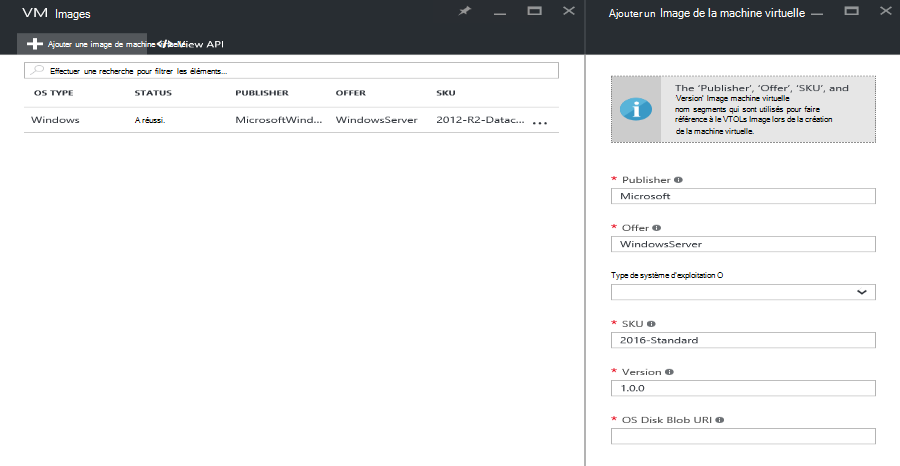

<properties
    pageTitle="Ajout d’une image de la machine virtuelle à pile Azure | Microsoft Azure"
    description="Ajouter Windows ou Linux VM image personnalisée de votre organisation pour les clients à utiliser"
    services="azure-stack"
    documentationCenter=""
    authors="mattmcg"
    manager="darmour"
    editor=""/>

<tags
    ms.service="azure-stack"
    ms.workload="na"
    ms.tgt_pltfrm="na"
    ms.devlang="na"
    ms.topic="get-started-article"
    ms.date="09/26/2016"
    ms.author="mattmcg"/>

# <a name="make-a-custom-virtual-machine-image-available-in-azure-stack"></a>Créer une image personnalisée machine virtuelle disponibles dans la pile d’Azure


Pile Azure permet aux administrateurs d’effectuer des images de machine virtuelle, tel que disque dur virtuel personnalisé de leur organisation, disponible à leurs clients. Images pouvant être référencées par le Gestionnaire de ressources Azure modèles ou ajoutés à l’interface utilisateur Marketplace Azure avec la création d’un élément Marketplace. Une image de Windows Server 2012 R2 est incluse par défaut dans la version d’évaluation technique pile Azure.

> [AZURE.NOTE] Images de machine virtuelle avec des éléments Marketplace peuvent être déployés en sélectionnant **Nouveau** dans l’interface utilisateur, puis en sélectionnant la catégorie **Machines virtuelles** . Machine virtuelle image sont répertoriés.


## <a name="add-a-vm-image-to-marketplace-with-powershell"></a>Ajouter une image de la machine virtuelle à Marketplace avec PowerShell

Si l’image de la machine virtuelle disque dur virtuel n’est disponible localement sur la console de machine virtuelle (ou un autre périphérique externe connecté), procédez comme suit :

1. Préparer une image de disque dur virtuel de système d’exploitation Windows ou Linux au format de disque dur virtuel (pas VHDX).
    -   Pour les images de Windows, l’article [télécharger une image machine virtuelle Windows Azure pour les déploiements du Gestionnaire de ressources](virtual-machines-windows-upload-image.md) contient des instructions de préparation d’image dans la section **préparer le disque dur virtuel pour le téléchargement** .
    -   Pour les images Linux, suivez les étapes pour préparer l’image ou utiliser une image existante Azure pile Linux comme décrit dans l’article [machines virtuelles déployer Linux pile Azure](azure-stack-linux.md).

2. Cloner le [référentiel Azure pile outils](https://aka.ms/azurestackaddvmimage), puis les importer le module **ComputeAdmin**

    ```powershell
    Import-Module .\ComputeAdmin\AzureStack.ComputeAdmin.psm1
    ```

3. Ajouter une image machine virtuelle en appelant l’applet de commande Add-VMImage.
    -  Inclure le publisher, offre, référence (SKU) et la version de l’image de la machine virtuelle. Ces paramètres sont utilisés par les modèles de gestionnaire de ressources Azure qui font référence à l’image de la machine virtuelle.
    -  Spécifiez osType comme Windows ou Linux.
    -  Inclure votre ID client Azure Active Directory dans l’écran * &lt;myaadtenant&gt;*. onmicrosoft.com.
    - Voici un appel exemple du script :

    ```powershell
       Add-VMImage -publisher "Canonical" -offer "UbuntuServer" -sku "14.04.3-LTS" -version "1.0.0" -osType Linux -osDiskLocalPath 'C:\Users\AzureStackAdmin\Desktop\UbuntuServer.vhd' -tenantID <myaadtenant>.onmicrosoft.com
    ```

    > [AZURE.NOTE] L’applet de commande demande des informations d’identification pour l’ajout de l’image de la machine virtuelle. Fournir des informations d’identification Azure Active Directory, l’administrateur telles que serviceadmin@ * &lt;myaadtenant&gt;*. onmicrosoft.com, à l’invite.  

La commande effectue les opérations suivantes :
- Authentifie à l’environnement Azure pile
- Télécharge le disque dur virtuel local vers un compte de stockage temporaire nouvellement créé
- Ajoute l’image machine virtuelle vers le référentiel image machine virtuelle
- Crée un élément Marketplace

Pour vérifier que la commande a été correctement exécuté, accéder à Marketplace dans le portail et vérifiez que l’image de la machine virtuelle est disponible dans la catégorie **Machines virtuelles** .

> 

Voici une description des paramètres de la commande.


| Paramètre | Description |
|----------| ------------ |
|**tenantID** | Votre ID de client Azure Active Directory dans l’écran * &lt;AADTenantID*. onmicrosoft.com&gt;. |
|**Publisher** | Segment publisher nom de l’Image machine virtuelle utilisateurs utilisation lors du déploiement de l’image. Un exemple est « Microsoft ». N’incluez pas un espace ou autres caractères spéciaux dans ce champ.|
|**offre** | Le segment nom offre de l’Image machine virtuelle utilisateurs utilisation lors du déploiement de l’image de la machine virtuelle. Par exemple, « Windows Server ». N’incluez pas un espace ou autres caractères spéciaux dans ce champ. |
| **référence (SKU)** | Segment de nom de référence (SKU) de l’Image machine virtuelle utilisateurs utilisation lors du déploiement de l’image de la machine virtuelle. Par exemple, « Datacenter2016 ». N’incluez pas un espace ou autres caractères spéciaux dans ce champ. |
|**Version** | La version de l’Image machine virtuelle utilisateurs utilisation lors du déploiement de l’image de la machine virtuelle. Cette version est au format * \#.\#. \#*. Par exemple, « 1.0.0 ». N’incluez pas un espace ou autres caractères spéciaux dans ce champ.|
| **osType** | L’osType de l’image doit être « Windows » ou « Linux ». |
|**osDiskLocalPath** | Le chemin d’accès local sur le disque du système d’exploitation disque dur virtuel que vous téléchargez comme une image de machine virtuelle à pile Azure. |
|**dataDiskLocalPaths**| Tableau facultatif des chemins d’accès locales pour les disques de données qui peuvent être téléchargés dans le cadre de l’image de la machine virtuelle.|
|**CreateGalleryItem**| Indicateur booléen qui détermine si vous souhaitez créer un élément dans Marketplace. La valeur par défaut est défini sur true.|
|**titre**| Le nom d’affichage d’élément Marketplace. La valeur par défaut est défini pour être le Sku offre Publisher de l’image de la machine virtuelle.|
|**Description**| La description de l’élément Marketplace. |
|**osDiskBlobURI**| Vous pouvez également ce script accepte également un stockage d’objets Blob URI pour osDisk.|
|**dataDiskBlobURIs**| Vous pouvez également ce script accepte également un tableau de stockage d’objets Blob MU pour l’ajout de disques de données à l’image.|


## <a name="add-a-vm-image-through-the-portal"></a>Ajouter une image de machine virtuelle via le portail

> [AZURE.NOTE] Cette méthode requiert la création de l’élément Marketplace séparément.

Une condition d’images est qu’ils peuvent être référencées par un stockage d’objets Blob URI. Préparer une image de disque dur virtuel système d’exploitation Windows ou Linux au format de disque dur virtuel (pas VHDX), puis puis téléchargez l’image dans un compte de stockage dans Azure ou dans une pile Azure. Si votre image est déjà téléchargé vers stockage Blob Azure ou pile Azure, vous pouvez ignorer cette étape.

Suivez les étapes de l’article [télécharger une image machine virtuelle Windows Azure pour les déploiements du Gestionnaire de ressources](https://azure.microsoft.com/documentation/articles/virtual-machines-windows-upload-image/) à l’étape **à télécharger l’image de la machine virtuelle à votre compte de stockage**. Gardez à l’esprit les points suivants :

-   Pour une image Linux, suivez les instructions pour préparer l’image, ou utiliser une image existante Azure pile Linux comme décrit dans l’article [machines virtuelles déployer Linux pile Azure](azure-stack-linux.md).

- Il est plus efficace de télécharger une image au stockage d’objets Blob Azure pile qu’à Azure Blob storage parce qu’il faut moins de temps pour pousser l’image de la machine virtuelle vers le référentiel d’images pile Azure. Tout en suivant les instructions de téléchargement, veillez à remplacer par l’étape [PowerShell authentifier avec Microsoft Azure pile](azure-stack-deploy-template-powershell.md) de l’étape « Login to Azure ».

- Prenez note du stockage Blob URI où vous téléchargez l’image. Il présente comme suit : * &lt;storageAccount&gt;/&lt;blobContainer&gt;/&lt;targetVHDName&gt;*.vhd

2.  Pour rendre le blob de manière anonyme accessible, accédez au conteneur blob de compte de stockage où l’image de la machine virtuelle disque dur virtuel a été téléchargé dans **Blob** , puis sélectionnez **Stratégie d’accès**. Si vous le souhaitez, vous pouvez à la place générer une signature d’un accès partagé pour le conteneur et l’inclure dans le cadre du blob URI.





1.  Connectez-vous à pile Azure en tant qu’administrateur. Accédez à la **gestion de la région**. Puis, sous **RPs**, sélectionnez **Calculer un fournisseur de ressources** > **Machine virtuelle Images** > **Ajouter.**

    

2.  Sur la carte suivante, entrez les publisher, offre, référence (SKU) et version de l’image de la machine virtuelle. Ces segments nom font référence à l’image de la mémoire virtuelle dans le Gestionnaire de ressources Azure modèles. Veillez à sélectionner **osType** correctement. Pour **osDiskBlobURI**, entrez l’URI où l’image a été téléchargé à l’étape 1. Cliquez sur **créer** pour commencer la création de l’Image de la machine virtuelle.

    

3.  Le statut d’Image de la machine virtuelle devient « Réussite » lorsque l’image est ajouté.

4.  Clients peuvent déployer l’Image de la machine virtuelle en spécifiant la publisher, offre, référence (SKU) et version de l’image de la machine virtuelle dans un modèle de gestionnaire de ressources Azure. Pour rendre l’image de machine virtuelle plus facilement disponible pour la consommation client dans l’interface utilisateur, il est préférable de [créer un élément Marketplace](azure-stack-create-and-publish-marketplace-item.md).
