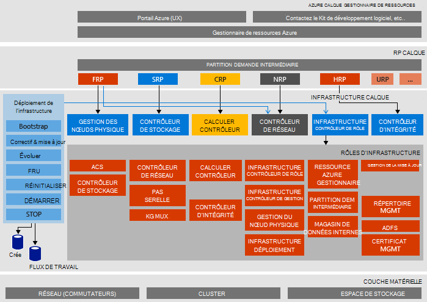

<properties
    pageTitle="Architecture de Microsoft Azure pile preuve de Concept (du contact) | Microsoft Azure"
    description="Afficher l’architecture de Microsoft Azure pile du contact."
    services="azure-stack"
    documentationCenter=""
    authors="heathl17"
    manager="byronr"
    editor=""/>

<tags
    ms.service="azure-stack"
    ms.workload="na"
    ms.tgt_pltfrm="na"
    ms.devlang="na"
    ms.topic="article"
    ms.date="10/25/2016"
    ms.author="helaw"/>

# Architecture de Microsoft Azure pile du contact

Le contrôle du concept pile Azure est un déploiement d’un nœud de Azure pile Technical Preview 2. Tous les composants sont installés sur des machines virtuelles s’exécutant sur un ordinateur hôte unique. 

## Diagramme d’architecture logique
Le diagramme suivant illustre l’architecture logique de la pile de Azure du contact et ses composants.

## Machine virtuelle rôles
Le contrôle du concept pile Azure propose des services à l’aide d’ordinateurs virtuels suivants sur l’hôte du contact :

 - **MAS ACS01** Machine virtuelle qui héberge les services de stockage Azure pile.

 - **MAS ADFS01** Machine virtuelle Active Directory Federation Services d’hébergement.  Cet ordinateur virtuel n’est pas utilisé dans Technical Preview 2.  

 - **MAS ASQL01**  Machine virtuelle fournissant un magasin de données interne pour les rôles d’infrastructure pile Azure.  

 - **MAS BGPNAT01** Machine virtuelle agissant comme un routeur de bordure et fournit des fonctions NAT et VPN pour pile Azure.

 - **MAS-CA01** Machine virtuelle fournissant des services autorité de certificat pour les services de rôle Azure pile.

 - **MAS CON01** Machine virtuelle disponible pour les développeurs pour l’installation de PowerShell, Visual Studio et autres outils.

 - **MAS DC01** Machine virtuelle services d’hébergement DNS, d’Active Directory et DHCP de Microsoft Azure pile.

 - **MAS GWY01** Machine virtuelle fournir bord passerelle des services tels que des connexions de site à site VPN pour les réseaux de client.

 - **MAS NC01**  Machine virtuelle contrôleur de réseau, qui gère les services de réseau Azure pile d’hébergement.  

 - **MAS SLB01**  Machine virtuelle fournit des services dans Azure pile pour les clients et les services d’infrastructure Azure pile d’équilibrage de charge.  

 - **MAS SUS01**  Virtuel ordinateur hébergeant Windows Server Update Services et permet de fournir des mises à jour des autres machines virtuelles pile Azure.

 - **MAS WAS01**  Machine virtuelle d’hébergement de portail et services Azure le Gestionnaire de ressources.

 - **MAS XRP01** Machine virtuelle qui héberge les fournisseurs de ressources principales de Microsoft Azure pile, y compris les fournisseurs de ressources informatiques, de réseau et de stockage.

## Services de stockage
Services de stockage dans le système d’exploitation sur l’hôte physique sont les suivantes :

 - **Service ACS Blob** Azure service cohérentes stockage Blob, qui fournit des services de stockage blob et table.

 - **SoFS** Serveur de fichiers horizontale.

 - **Réf CSV** Fichier résistant système Cluster Volume partagé.

 - **Disque virtuel**, **Espace de stockage**et **Stockage espaces Direct** sont la technologie de stockage sous-jacente correspondantes dans Windows Server pour activer le fournisseur de ressources de Microsoft Azure pile core stockage.

## Étapes suivantes

[Déploiement d’Azure pile](azure-stack-deploy.md)

[Premières scénarios à essayer](azure-stack-first-scenarios.md)

