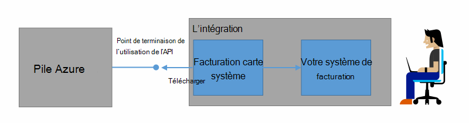
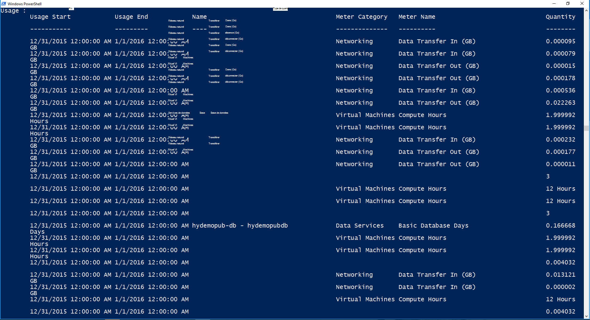

<properties
    pageTitle="Facturation client et refacturation dans une pile Azure | Microsoft Azure"
    description="Découvrez comment récupérer les informations de l’utilisation de ressources de pile Azure."
    services="azure-stack"
    documentationCenter=""
    authors="AlfredoPizzirani"
    manager="byronr"
    editor=""/>

<tags
    ms.service="azure-stack"
    ms.workload="na"
    ms.tgt_pltfrm="na"
    ms.devlang="na"
    ms.topic="article"
    ms.date="10/18/2016"
    ms.author="alfredop"/>

# Facturation client et refacturation dans Azure pile

Maintenant que vous utilisez pile Azure, il est judicieux de réflexion concernant le suivi de l’utilisation. Fournisseurs de services s’appuient sur les informations d’utilisation pour facturer leurs clients et à comprendre le coût de fournir des services.
Les entreprises, trop, généralement effectuer le suivi de l’utilisation par département.

Pile Azure n’est pas un système de facturation. Il ne facture vos clients pour les ressources qu’ils utilisent. Mais, pile Azure a l’infrastructure pour collecter et agréger des données d’utilisation pour chaque fournisseur de ressources unique. Vous pouvez accéder à ces données et exporter vers un système de facturation en utilisant une carte de facturation ou l’exporter vers un outil décisionnel comme Microsoft Power BI.

## Quelles informations d’utilisation puis-je rechercher et comment ?

Fournisseurs de ressources pile Azure génèrent des enregistrements d’utilisation à des intervalles horaires. Les enregistrements indiquent la durée de chaque ressource qui a été consommée et type d’abonnement consommées la ressource. Ces données sont stockées. Vous pouvez accéder aux données via l’API REST.

Un administrateur du service pouvez récupérer des données d’utilisation pour tous les abonnements client. Clients individuels peuvent extraire uniquement leurs propres informations.

Enregistrements de l’utilisation avec des informations sur le stockage, le réseau et l’utilisation de cluster. Pour une liste des mètres, voir [cet article](azure-stack-usage-related-faq.md).

## Récupérer des informations sur l’utilisation

Pour générer des enregistrements, il est essentiel que vous avez des ressources en cours d’exécution et activement à l’aide du système. Si vous ne savez pas si vous disposez des ressources en cours d’exécution, dans la pile Azure Marketplace déployer, puis exécutez une machine virtuelle (). Aperçu de la machine virtuelle surveillance carte pour vous assurer qu’il est en cours d’exécution.

Nous vous conseillons d’exécuter les applets de commande Windows PowerShell pour afficher les données d’utilisation.
PowerShell appelle les API de l’utilisation des ressources.

1.  [Installer et configurer Azure PowerShell](https://azure.microsoft.com/en-us/documentation/articles/powershell-install-configure/).

2.  Pour vous connecter au Gestionnaire de ressources Azure, utilisez l’applet de commande PowerShell **Login AzureRmAccount**.

3.  Pour sélectionner l’abonnement que vous avez utilisé pour créer des ressources, tapez **Get-AzureRmSubscription – SubscriptionName « votre Sub » jusqu'à » | Sélectionnez AzureRmSubscription**.

4.  Pour récupérer les données, utilisez l’applet de commande PowerShell [**Get-UsageAggregates**](https://msdn.microsoft.com/en-us/library/mt619285.aspx).
    Si les données d’utilisation sont disponibles, il est renvoyé dans PowerShell, comme dans l’exemple suivant. PowerShell renvoie 1 000 lignes de l’utilisation par appel.
    Vous pouvez utiliser l’argument *continuation* pour extraire les ensembles de lignes au-delà de la première 1 000. Pour plus d’informations sur les données d’utilisation, consultez la [référence de l’API de l’utilisation de ressources](azure-stack-provider-resource-api.md).

    

## Étapes suivantes

[Utilisation des ressources fournisseur API](azure-stack-provider-resource-api.md)

[Utilisation des ressources API du client](azure-stack-tenant-resource-usage-api.md)

[Forum aux questions sur liés à l’utilisation](azure-stack-usage-related-faq.md)
