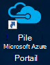
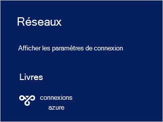

<properties
    pageTitle="Se connecter à pile Azure | Microsoft Azure"
    description="Découvrez comment connecter Azure pile"
    services="azure-stack"
    documentationCenter=""
    authors="ErikjeMS"
    manager="byronr"
    editor=""/>

<tags
    ms.service="azure-stack"
    ms.workload="na"
    ms.tgt_pltfrm="na"
    ms.devlang="na"
    ms.topic="get-started-article"
    ms.date="10/18/2016"
    ms.author="erikje"/>

# <a name="connect-to-azure-stack"></a>Se connecter à pile Azure
Pour gérer les ressources, vous devez vous connecter à l’ordinateur Azure pile du contact. Vous pouvez utiliser une des options de connexion suivantes :

 - Bureau à distance : permet à un seul utilisateur simultané de se connecter rapidement à partir de l’ordinateur du contact.
 - Réseau privé virtuel (VPN) : permet à plusieurs utilisateurs simultanément de se connecter à partir de clients en dehors de l’infrastructure Azure pile (nécessite une configuration).

## <a name="connect-with-remote-desktop"></a>Connexion Bureau à distance
Avec une connexion Bureau à distance, un seul utilisateur simultané pouvez travailler avec du portail de gestion des ressources. Vous pouvez également utiliser les outils sur l’ordinateur virtuel MAS CON01.

1.  Connectez-vous à l’ordinateur physique Azure pile du contact.

2.  Ouvrez une connexion Bureau à distance et connectez-vous à MAS CON01. Entrez **AzureStack\AzureStackAdmin** comme le nom d’utilisateur et le mot de passe d’administration que vous avez fourni pendant l’installation de pile Azure.  

3.  Sur le bureau MAS CON01, double-cliquez sur **Microsoft Azure pile Portal** icône (https://portal.azurestack.local/) pour ouvrir le [portail](azure-stack-key-features.md#portal).

    

4.  Connectez-vous en utilisant les informations d’identification Azure Active Directory spécifiées pendant l’installation.

## <a name="connect-with-vpn"></a>Se connecter avec VPN
Connexions de réseau privé virtuel permettent à plusieurs utilisateurs simultanés se connecter à partir de clients en dehors de l’infrastructure pile Azure. Vous pouvez utiliser le portail pour gérer à leurs. Vous pouvez également utiliser des outils, tels que Visual Studio et PowerShell, sur votre client local.

1.  Installez le module AzureRM à l’aide de la commande suivante :
   
    ```PowerShell
    Install-Module -Name AzureRm -RequiredVersion 1.2.6 -Scope CurrentUser
    ```   
   
2. Télécharger les scripts Azure pile outils.  Ces fichiers peuvent être téléchargés en naviguant vers le [référentiel GitHub](https://github.com/Azure/AzureStack-Tools)ou en exécutant le script Windows PowerShell suivant en tant qu’administrateur de support :
    
    >[AZURE.NOTE]  Les étapes suivantes requièrent PowerShell 5.0.  Pour vérifier votre version, exécutez $PSVersionTable.PSVersion et comparer la version « Principale ».  

    ```PowerShell
       
       #Download the tools archive
       invoke-webrequest https://github.com/Azure/AzureStack-Tools/archive/master.zip -OutFile master.zip

       #Expand the downloaded files. 
       expand-archive master.zip -DestinationPath . -Force

       #Change to the tools directory
       cd AzureStack-Tools-master
    ````

3.  Dans la même session PowerShell, accédez au dossier **se connecter** et importer le module AzureStack.Connect.psm1 :

    ```PowerShell
    cd Connect
    import-module .\AzureStack.Connect.psm1
    ```

4.  Pour créer la connexion Azure pile VPN, exécutez Windows PowerShell suivante. Avant d’exécuter, remplir le mot de passe administrateur et les champs d’adresse hôte pile Azure. 
    
    ```PowerShell
    #Change the IP Address below to match your Azure Stack host
    $hostIP = "<HostIP>"

    # Change password below to reference the password provided for administrator during Azure Stack installation
    $Password = ConvertTo-SecureString "<Admin Password>" -AsPlainText -Force

    # Add Azure Stack One Node host & CA to the trusted hosts on your client computer
    Set-Item wsman:\localhost\Client\TrustedHosts -Value $hostIP -Concatenate
    Set-Item wsman:\localhost\Client\TrustedHosts -Value mas-ca01.azurestack.local -Concatenate  

    # Update Azure Stack host address to be the IP Address of the Azure Stack POC Host
    $natIp = Get-AzureStackNatServerAddress -HostComputer $hostIP -Password $Password

    # Create VPN connection entry for the current user
    Add-AzureStackVpnConnection -ServerAddress $natIp -Password $Password

    # Connect to the Azure Stack instance. This command (or the GUI steps in step 5) can be used to reconnect
    Connect-AzureStackVpn -Password $Password 
    ```

5. Lorsque vous y êtes invité, faire confiance à l’hôte de pile Azure.

6. Lorsque vous y êtes invité, installer un certificat (l’invite s’affiche derrière la fenêtre de la session Powershell).

7. Pour tester la connexion au portail, dans un navigateur Internet, accédez à *https://portal.azurestack.local*.

8. Pour consulter et gérer les connexions pile Azure, utilisez **réseaux** sur votre client :

    

>[AZURE.NOTE] Cette connexion VPN ne fournit pas de connectivité aux machines virtuelles ou d’autres ressources. Pour plus d’informations sur la connectivité à des ressources, voir [Une connexion VPN nœud](azure-stack-create-vpn-connection-one-node-tp2.md)


## <a name="next-steps"></a>Étapes suivantes
[Premières tâches](azure-stack-first-scenarios.md)

[Installer et se connecter avec PowerShell](azure-stack-connect-powershell.md)

[Installer et se connecter avec infrastructure du langage commun](azure-stack-connect-cli.md)


