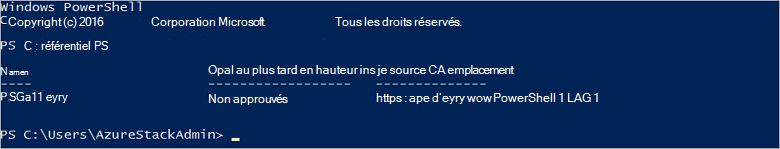

<properties
    pageTitle="Se connecter à Azure pile avec PowerShell | Microsoft Azure"
    description="Découvrez comment gérer la pile Azure avec PowerShell"
    services="azure-stack"
    documentationCenter=""
    authors="HeathL17"
    manager="byronr"
    editor=""/>

<tags
    ms.service="azure-stack"
    ms.workload="na"
    ms.tgt_pltfrm="na"
    ms.devlang="na"
    ms.topic="article"
    ms.date="10/19/2016"
    ms.author="helaw"/>

# Installer PowerShell et se connecter à la pile d’Azure
Dans ce guide, nous passez en revue les étapes de connexion à pile Azure avec PowerShell. Une fois terminé, ces étapes peuvent également vous aider à gérer et déployer des ressources.

## Installer les applets de commande PowerShell de pile d’Azure

1.  Applets de commande AzureRM sont installés à partir de la galerie de PowerShell. Pour commencer, ouvrez une PowerShell Console sur MAS CON01 et exécutez la commande suivante pour renvoyer une liste de référentiels PowerShell disponibles :

        Get-PSRepository

      

2.  Exécutez la commande suivante pour installer le module AzureRM :

        Install-Module -Name AzureRM -RequiredVersion 1.2.6 -Scope CurrentUser

    >[AZURE.NOTE] *-Étendue CurrentUser* est facultative. Si vous voulez plus grande que l’utilisateur a accès aux modules, utilisez une invite de commandes avec élévation de privilèges et laissez désactiver le paramètre de *l’étendue* .

3.  Pour confirmer l’installation de modules AzureRM, exécutez les commandes suivantes :

        Get-Command -Module AzureRM.AzureStackAdmin

## Se connecter à pile Azure
Un module est disponible au téléchargement qui gère la configuration de la connexion de PowerShell à pile Azure pour vous.  Visitez [Azure pile Tools](http://aka.ms/ConnectToAzureStackPS) pour le module et des étapes supplémentaires. 

## Récupérer une liste des abonnements
Dans cette section, vous vérifiez applets de commande PowerShell sont exécutent auprès de pile Azure en récupérant et en sélectionnant un abonnement à utiliser.

Exécutez la commande suivante pour récupérer la liste des abonnements Azure pile correspondant à votre compte :

    Get-AzureRmSubscription

## Étapes suivantes
[Déployer des modèles avec PowerShell](azure-stack-deploy-template-powershell.md)

[Se connecter avec Azure infrastructure du langage commun](azure-stack-connect-cli.md)

[Déployer des modèles avec Visual Studio](azure-stack-deploy-template-visual-studio.md)

