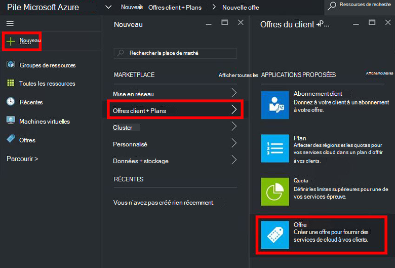
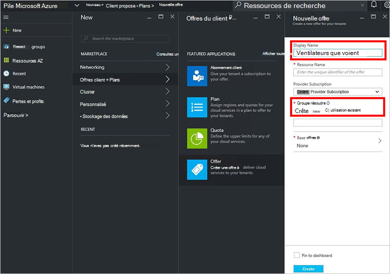
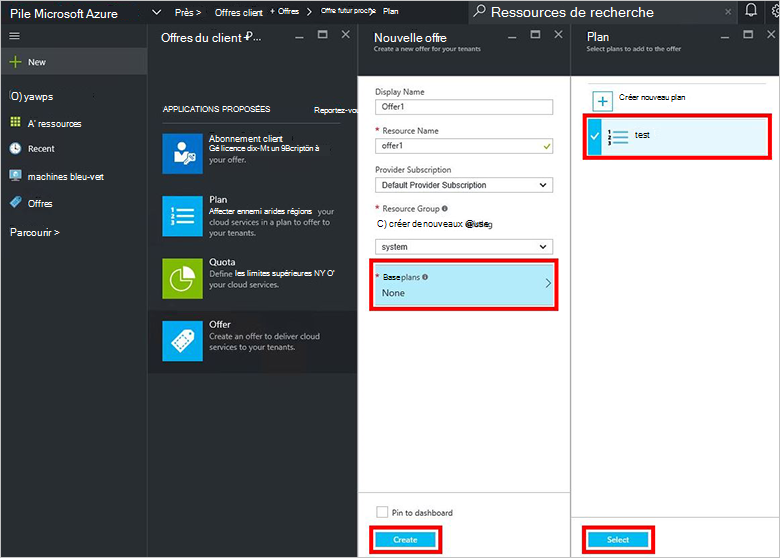
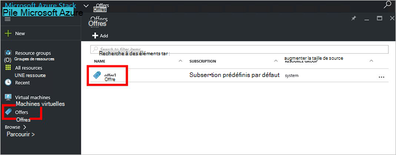
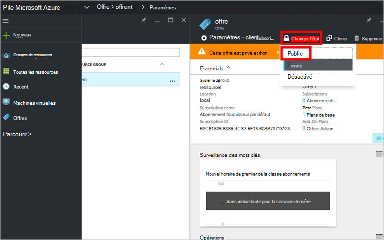

<properties
    pageTitle="Créer une offre dans Azure pile | Microsoft Azure"
    description="En tant qu’un administrateur de service, apprenez à créer une offre pour vos clients dans une pile Azure."
    services="azure-stack"
    documentationCenter=""
    authors="ErikjeMS"
    manager="byronr"
    editor=""/>

<tags
    ms.service="azure-stack"
    ms.workload="na"
    ms.tgt_pltfrm="na"
    ms.devlang="na"
    ms.topic="get-started-article"
    ms.date="09/26/2016"
    ms.author="erikje"/>

# Créer une offre dans Azure pile

[Offre](azure-stack-key-features.md#services-plans-offers-and-subscriptions) sont des groupes d’une ou plusieurs offres fournisseurs présentent aux clients à acheter ou s’y abonner. Ce document vous montre comment créer une offre qui inclut le [plan que vous avez créé](azure-stack-create-plan.md) dans la dernière étape. Cette offre permet aux abonnés mise en service des machines virtuelles.

1.  [Connectez-vous](azure-stack-connect-azure-stack.md#log-in-as-a-service-administrator) au portail en tant qu’un administrateur de service, puis cliquez sur **Nouveau** > **client offre + Plans** > **proposer**.
    

2.  Dans la carte **Nouvelle offre** , entrez **Nom d’affichage** et le **Nom de la ressource**, puis sélectionnez un **Groupe de ressources**nouvelle ou existante. Le nom complet est le nom convivial de l’offre. Seul l’administrateur peut voir le nom de la ressource. Il s’agit du nom administrateurs utilisent avec l’offre en tant que gestionnaire de ressources Azure ressource.

    

3.  Cliquez sur **la Base de plans** et, dans la carte **planifier** , sélectionnez les plans que vous voulez inclure dans l’offre, puis cliquez sur **Sélectionner**. Cliquez sur **créer** pour créer l’offre.

    
    
4. **Offre** , puis cliquez sur l’offre que vous venez de créer.

    

5.  Cliquez sur **Changer l’état**, puis cliquez sur **Public**.
  
    

Offres doivent être rendues publiques pour les clients obtenir la vue complète lors de l’abonnement. Offres peuvent être :

- **Public**: Visible aux clients.

- **Privé**: visible uniquement aux administrateurs de service. Utile lors de la rédaction de l’offre ou offre, ou si l’administrateur de service souhaitez vous conformer approuver chaque abonnement.

- **Retrait de fonctionnalité**: fermé aux nouveaux abonnés. L’administrateur de service peut utiliser désactivé pour empêcher les abonnements futurs, mais laisser abonnés actuels intact.

Modifications apportées à l’offre ne sont pas visibles d’emblée pour le client. Pour afficher les modifications, vous devrez peut-être déconnexion/connexion pour afficher le nouvel abonnement dans le sélecteur d’abonnement « » lors de la création de groupes de ressources/ressources.

## Étapes suivantes

[S’abonner à une offre et puis fournir une machine virtuelle](azure-stack-subscribe-plan-provision-vm.md)
