<properties
    pageTitle="Créer un plan dans une pile Azure | Microsoft Azure"
    description="En tant qu’un administrateur de service, créez un plan qui vous permet de machines virtuelles de mise en service abonnés."
    services="azure-stack"
    documentationCenter=""
    authors="ErikjeMS"
    manager="byronr"
    editor=""/>

<tags
    ms.service="azure-stack"
    ms.workload="na"
    ms.tgt_pltfrm="na"
    ms.devlang="na"
    ms.topic="get-started-article"
    ms.date="09/26/2016"
    ms.author="erikje"/>

# Créer un plan dans la pile d’Azure

[Plans](azure-stack-key-features.md#services-plans-offers-and-subscriptions) sont des regroupements d’un ou plusieurs services. En tant que fournisseur, vous pouvez créer des plans d’offrir à vos clients. À son tour, vos clients s’abonner à vos offres à utiliser les offres et services qu’ils comprennent. Cet exemple montre comment créer un plan qui inclut le cluster, du réseau et les fournisseurs de ressources de stockage. Cette offre permet aux abonnés mise en service des machines virtuelles.

1.  Dans un navigateur internet, accédez à https://portal.azurestack.local.

2.  [Connectez-vous](azure-stack-connect-azure-stack.md#log-in-as-a-service-administrator) au portail pile Azure en tant qu’un administrateur de service et entrez vos informations d’identification d’administrateur de service (le compte que vous avez créé à l’étape 5 de la section [exécuter le script PowerShell](azure-stack-run-powershell-script.md) ), puis cliquez sur **se connecter**.

    Les administrateurs de service peuvent créer des offres et des plans et gérer les utilisateurs.

3.  Pour créer un plan et offre clients peuvent s’abonner à, cliquez sur **Nouveau** > **client offre + Plans** > **Plan**.

    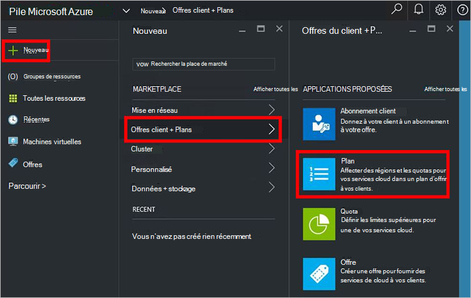

4.  Dans la carte **Nouveau Plan** , renseignez les champs **Nom d’affichage** et **Nom de la ressource**. Le nom complet est le nom convivial de l’offre que voient les clients. Seul l’administrateur peut voir le nom de la ressource. Il s’agit du nom administrateurs utilisent avec le plan en tant que gestionnaire de ressources Azure ressource.

    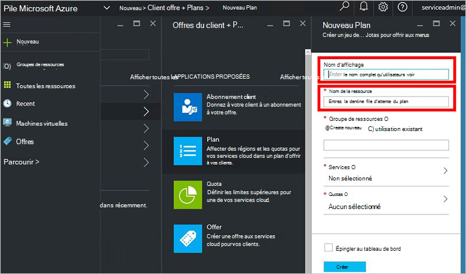

5.  Créer un **Groupe de ressources**, ou sélectionnez une existante, comme un conteneur pour le plan (par exemple, « OffersAndPlans »)

    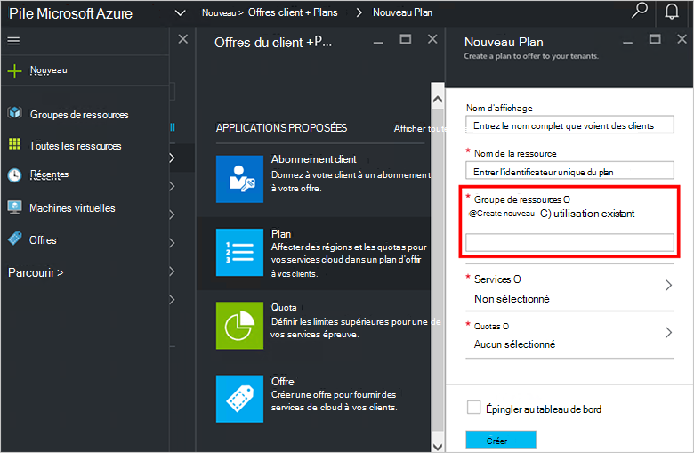

6.  Cliquez sur **Services**, sélectionnez **Microsoft.Compute**, **Microsoft.Network**et **Microsoft.Storage**, puis cliquez sur **Sélectionner**.

    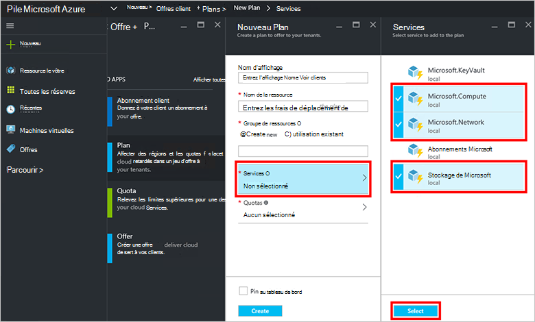

7.  Cliquez sur **les Quotas**, cliquez sur **Microsoft.Storage (local)**, puis sélectionnez le quota par défaut ou cliquez sur **Créer nouveau quota** pour personnaliser le quota.

    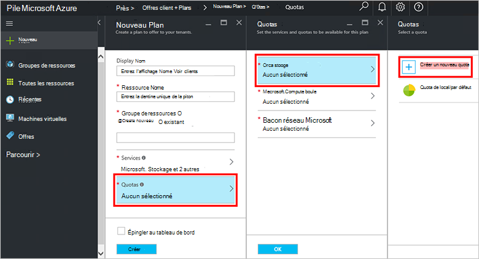

8.  Tapez un nom pour le quota et cliquez sur **Paramètres de Quota**, définissez les valeurs de quota et cliquez sur **OK**, puis cliquez sur **créer**.

    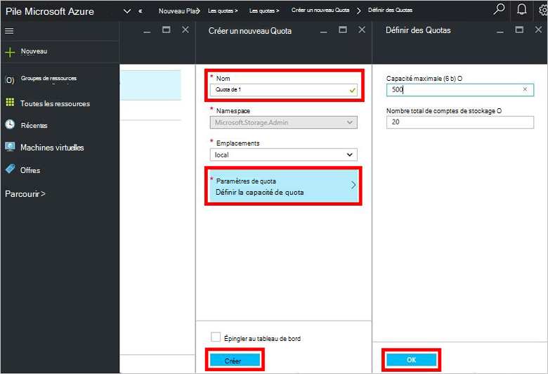

9. Cliquez sur **Microsoft.Network (local)**, puis sélectionnez le quota par défaut ou cliquez sur **Créer nouveau quota** pour personnaliser le quota.

    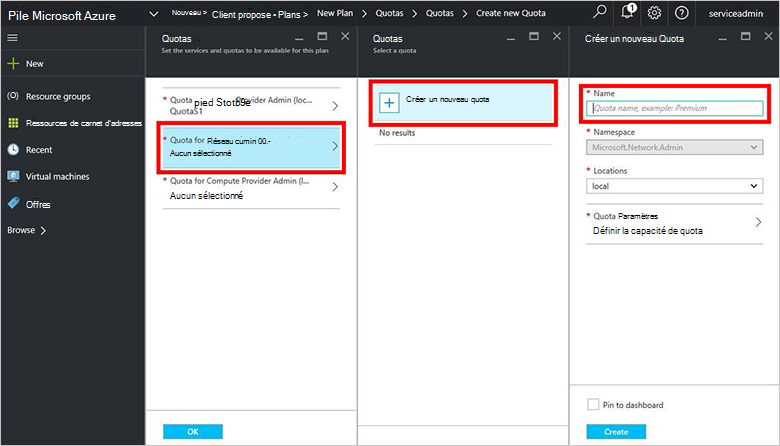

10. Tapez un nom pour le quota et cliquez sur **Paramètres de Quota**, définissez les valeurs de quota et cliquez sur **OK**, puis cliquez sur **créer**.

    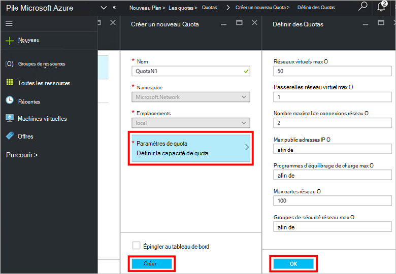

11. Cliquez sur **Microsoft.Compute (local)**, puis sélectionnez le quota par défaut ou cliquez sur **Créer nouveau quota** pour personnaliser le quota.

    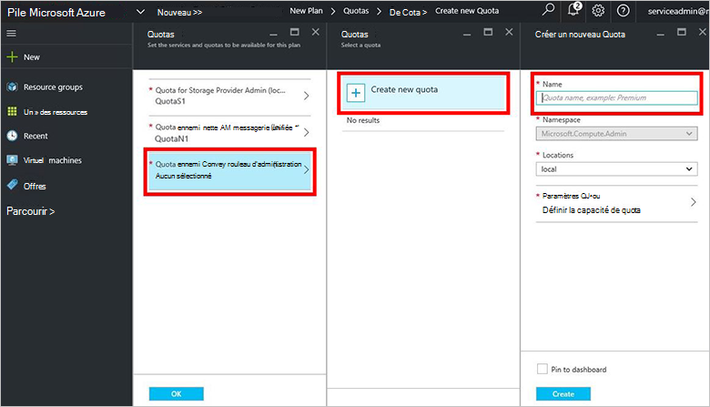

12.  Tapez un nom pour le quota et cliquez sur **Paramètres de Quota**, définissez les valeurs de quota et cliquez sur **OK**, puis cliquez sur **créer**.

    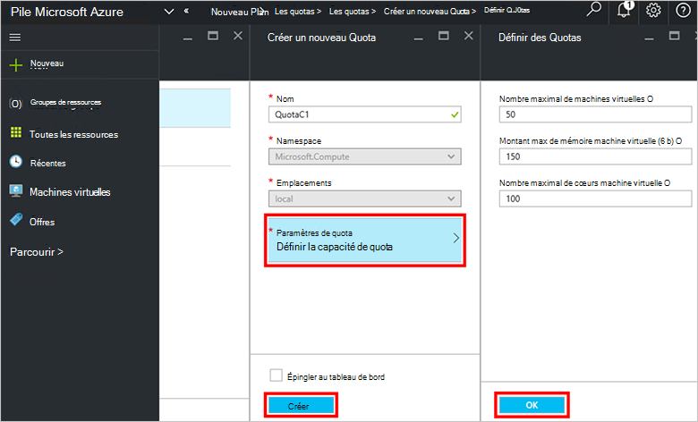

13. Dans la carte **les Quotas** , cliquez sur **OK**et puis, dans la carte de la **Nouvelle offre** , cliquez sur **créer** pour créer le plan.

    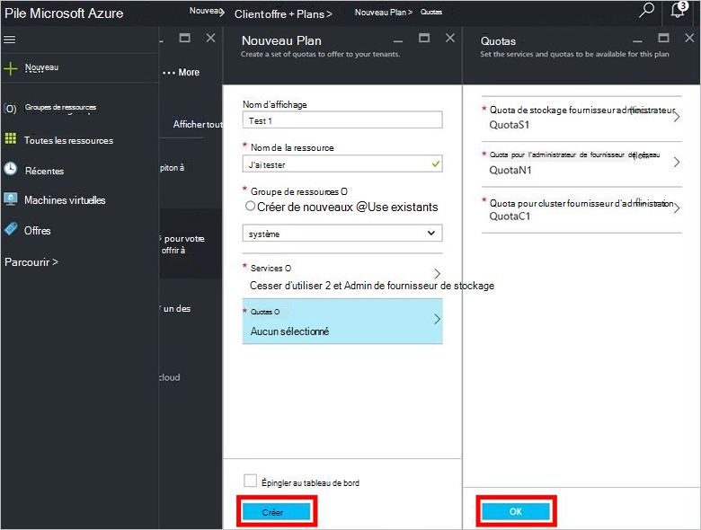

14. Pour afficher votre nouvelle offre, cliquez sur **toutes les ressources**, puis recherchez le plan et cliquez sur son nom.

    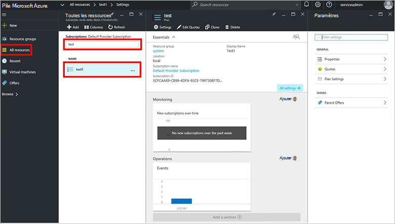

## Étapes suivantes

[Créer une offre](azure-stack-create-offer.md)
