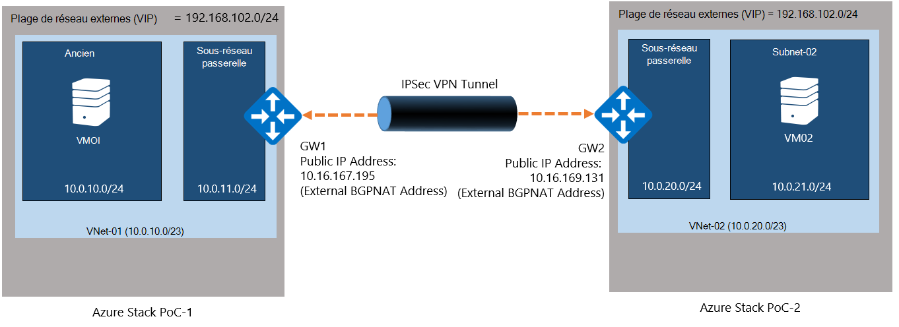
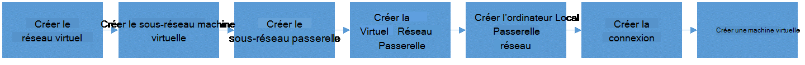
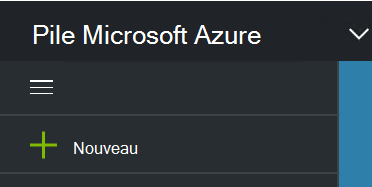
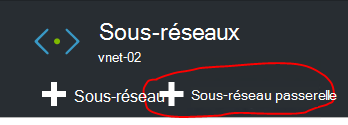
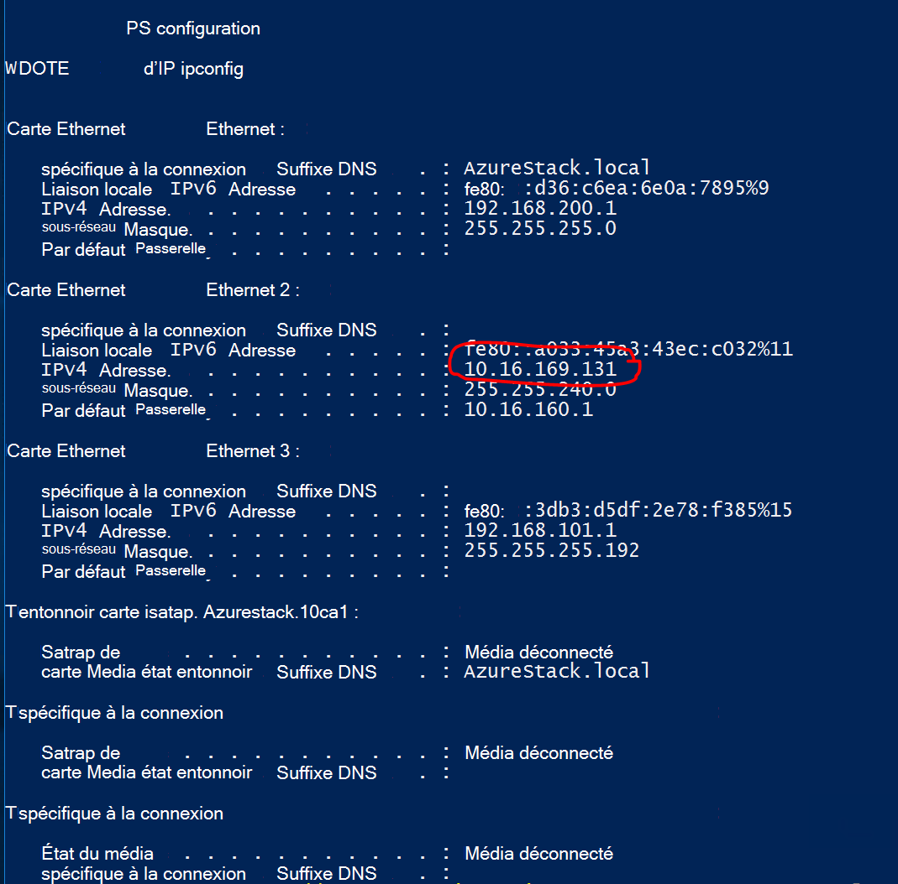
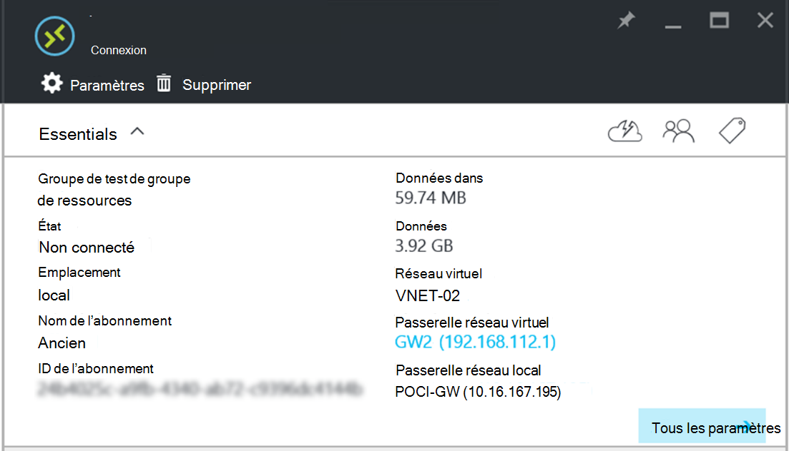

<properties
    pageTitle="Créer une connexion VPN de Site à Site entre deux réseaux virtuels dans différents environnements de démonstration de pile Azure | Microsoft Azure"
    description="Procédure pas à pas qui permettra à un administrateur de cloud créer une connexion de Site à Site VPN entre les deux environnements de démonstration un nœud dans TP2."
    services="azure-stack"
    documentationCenter=""
    authors="ScottNapolitan"
    manager="darmour"
    editor=""/>

<tags
    ms.service="azure-stack"
    ms.workload="na"
    ms.tgt_pltfrm="na"
    ms.devlang="na"
    ms.topic="get-started-article"
    ms.date="09/26/2016"
    ms.author="scottnap"/>

# Créer une connexion VPN de Site à Site entre deux réseaux virtuels dans des environnements différents Azure pile du contact

## Vue d’ensemble

Cet article vous explique comment procéder pour créer une connexion VPN Site à Site entre deux réseaux virtuels dans deux environnements Azure pile preuve de Concept (du contact) distincts. L’objectif du présent est d’aider les personnes qui sont l’évaluation de Site à passerelles comprennent comment configurer des connexions VPN entre réseaux virtuels dans les deux déploiements Azure pile différentes.  En procédant ainsi, vous allez comprendre comment fonctionnent les passerelles VPN dans Azure pile.

>[AZURE.NOTE] Ce document s’applique spécifiquement pour le contrôle du concept Azure pile TP2.

### Diagramme de connexion

Voici un diagramme qui montre que notre configuration doit ressembler à quand nous avons terminé.

### Avant de commencer

Pour terminer cette configuration, vous devez les éléments suivants pour vérifiez que vous utilisez les éléments suivants avant de commencer.

-   Deux serveurs qui répondent à la configuration matérielle du contact Azure pile définie par les [Conditions préalables au déploiement Azure pile](azure-stack-deploy.md)et les conditions préalables définies par ce document.

-   Le Package de déploiement de version d’évaluation technique 2 pile Azure.

## Déployer les environnements du contact

Vous allez déployer les deux environnements Azure pile du contact pour terminer cette configuration.

-   Pour chaque du contact que vous déployez, vous pouvez simplement suivre les instructions de déploiement détaillées dans l’article [Déployer Azure pile démonstration](azure-stack-run-powershell-script.md).
    Nous fera référence à chaque environnement du contact dans ce document générique comme POC1 et POC2.

## Configurer des Quotas pour le cluster, de réseau et de stockage

Vous devez configurer des Quotas pour cluster, de réseau et de stockage afin que ces services peuvent être associés à un Plan et puis une offre utilisateurs peut s’abonner à.

>[AZURE.NOTE] Vous devez effectuer ces étapes pour chaque environnement Azure pile du contact.

L’expérience à créer des Quotas pour les Services a changé de TP1. La procédure à suivre pour créer des Quotas dans TP2, visitez <http://aka.ms/mas-create-quotas>. Vous pouvez accepter les paramètres par défaut pour tous les paramètres de quota pour cet exercice.

## Créer un Plan et offre

[Plans](azure-stack-key-features.md) sont des regroupements d’un ou plusieurs services. En tant que fournisseur, vous pouvez créer des plans d’offrir à vos clients. À son tour, vos clients s’abonner à vos offres à utiliser les offres et services qu’ils comprennent.

>[AZURE.NOTE] Vous devez effectuer ces étapes pour chaque environnement Azure pile du contact.

1.  Tout d’abord créer un Plan. Pour ce faire, vous pouvez suivre les étapes décrites dans l’article [créer un Plan](azure-stack-create-plan.md) .

2.  Créer une offre suivant les étapes décrites dans [créer une offre dans Azure pile](azure-stack-create-offer.md).

3.  Connectez-vous au portail en tant qu’administrateur client et [s’abonner à l’offre que vous avez créé] (azure-pile-s’abonner-plan-prestation-vm.md.

## Créer les ressources réseau dans contact 1

Nous allons maintenant pour créer les ressources, que nous devons définir notre configuration. Les étapes suivantes illustrent ce que nous allons faire. Ces instructions présentera comment créer des ressources via le portail, mais la même chose peut être accomplie via PowerShell.

### Connectez-vous en tant qu’un client

Un administrateur du service peut connectez-vous en tant qu’un client pour tester les plans, les offres et les abonnements que leurs clients peuvent utiliser. Si vous n’avez pas encore, [créer un compte client](azure-stack-add-new-user-aad.md) avant de vous connecter.

### Créer le réseau virtuel & sous-réseau machine virtuelle

1.  Connectez-vous en utilisant un compte client.

2.  Dans le portail Azure, cliquez sur l’icône **Nouveau** .

     
3.  Dans le menu Marketplace, sélectionnez **mise en réseau** .

4.  Cliquez sur l’élément de **réseau virtuel** dans le menu.

5.  Cliquez sur le bouton **créer** dans la partie inférieure de la cuillère description de la ressource. Entrez les valeurs suivantes dans les champs appropriés en fonction de ce tableau.

  	| **Champ**             | **Valeur** |
  	|----------------------- | ------ |
  	| Nom                  |vnet-01 |
  	| Espace d’adressage         | 10.0.10.0/23 |
  	| Nom du sous-réseau           | sous-réseau-01 |
  	| Plage d’adresses sous-réseau  | 10.0.10.0/24 |

6.  Vous devriez voir l’abonnement que vous avez créé précédemment renseignée dans le champ **abonnement** .

7.  Groupe de ressources, vous pouvez créer un nouveau groupe de ressources ou si vous disposez déjà d’un, sélectionnez utiliser un existant.

8.  Vérifiez l’emplacement par défaut.

9.  Cliquez sur le bouton **créer** .

### Créer le sous-réseau passerelle

1.  Ouvrez la ressource réseau virtuelles que vous venez de créer (Vnet-01) dans le tableau de bord.

2.  Sur la carte de paramètres, sélectionnez sous-réseaux

3.  Cliquez sur le bouton **Sous-réseau passerelle** pour ajouter un sous-réseau passerelle au réseau virtuel.

     
4.  Le nom du sous-réseau est défini sur **GatewaySubnet** par défaut.
    Passerelle sous-réseaux sont spéciales et doivent avoir ce nom spécifique pour fonctionner correctement.

5.  Dans le champ **plage d’adresses** , entrez **10.0.11.0/24**.

6.  Cliquez sur le bouton **créer** pour créer le sous-réseau passerelle.

### Création de la passerelle réseau virtuel

1.  Dans le portail Azure, cliquez sur l’icône **Nouveau** .

    

2.  Dans le menu Marketplace, sélectionnez **mise en réseau** .

3.  Sélectionnez **passerelle réseau virtuelle** dans la liste des ressources du réseau.

4.  Examinez la description et cliquez sur **créer**.

5.  Dans le champ **nom** , tapez **GW1**.

6.  Cliquez sur l’élément de **réseau virtuel** pour choisir un réseau virtuel.
    Sélectionnez **Vnet-01** dans la liste.

7.  Cliquez sur l’élément de menu **adresse IP publique** . Lorsque la carte d’adresse IP public choisir s’ouvre, cliquez sur le bouton Créer un.

8.  Dans le champ **nom** , entrez **GW1 PiP** et cliquez sur **Ok.**

9.  Le **type de passerelle** doit avoir **VPN** activée par défaut. Conservez ce paramètre.

10. Le **type de VPN** doit avoir **basée sur l’itinéraire** sélectionné par défaut.
    Conservez ce paramètre.

11. Vérifier **l’abonnement** et **l’emplacement** sont corrects. Vous pouvez épingler la ressource au tableau de bord si vous le souhaitez. Cliquez sur **créer**.

### Création de la passerelle réseau Local

La ressource de passerelle réseau Local est un peu étrange dans notre scénario.
Il est la même ressource que vous trouvez dans Azure, cependant dans Azure, il est généralement destiné à représenter un périphérique physique, locales que vous utiliseriez pour vous connecter à la passerelle réseau virtuel dans Azure. Dans notre exemple, les deux extrémités de la connexion sont passerelles réseau réellement virtuel !

Permet de réflexion plus générique est que la ressource de passerelle réseau Local est toujours destiné à indiquer la passerelle à l’autre extrémité de la connexion à distance. En raison de la façon dont le contrôle du concept a été conçu, nous devons réellement Indiquez l’adresse de la carte réseau externe sur la VM NAT de l’autre du contact en tant que l’adresse IP de la passerelle réseau Local. Nous allons créer puis mappages NAT sur le NAT VM pour vous assurer que les deux extrémités sont correctement connectées.

### Obtenir l’adresse IP de la carte externe de NAT VM

1.  Se connecter à la machine physique pile Azure pour POC2.

2.  [Touche Windows] + R pour ouvrir le menu **exécuter** , tapez **mstsc** et appuyez sur ENTRÉE.

3.  Dans le champ **ordinateur** , entrez le nom **MAS BGPNAT01** et cliquez sur le bouton **se connecter** .

4.  Cliquez sur le Menu Démarrer avec le bouton droit sur PowerShell et sélectionnez **Exécuter en tant qu’administrateur**.

5.  Type de **IPConfig/all**.

6.  Recherchez la carte Ethernet qui est connecté à votre réseau sur site, puis prenez note de l’adresse IPv4 lié à cette carte. Dans mon environnement, il est **10.16.167.195** mais vôtres seront soit différente.

7.  Enregistrez cette adresse. Voici ce que nous allons utiliser comme l’adresse IP de la ressource de passerelle réseau Local que nous créer dans POC1.

### Créer la ressource de passerelle réseau Local

1.  Se connecter à la machine physique pile Azure pour POC1.

2.  Dans le champ **ordinateur** , entrez le nom **MAS CON01** , puis cliquez sur le bouton **se connecter** .

3.  Dans le portail Azure, cliquez sur l’icône **Nouveau** .

    

4.  Dans le menu Marketplace, sélectionnez **mise en réseau** .

5.  Sélectionnez **passerelle réseau local** dans la liste des ressources.

6.  Dans le champ **nom** , entrez **POC2-GW**.

7.  Nous ne connaissez pas l’adresse IP de notre passerelle d’autres encore, mais c’est OK parce que nous puissions y revenir et modifier ultérieurement. Pour l’instant, entrez **10.16.167.195** dans le **champ adresse IP**.

8.  Dans le champ **Espace d’adressage** Entrez l’espace d’adressage de Vnet que nous allons créer dans POC2. Cela va agir en **10.0.20.0/23** alors entrez cette valeur.

9.  Vérifiez que votre **abonnement**, le **Groupe de ressources** et **l’emplacement** sont corrects et cliquez sur **créer**.

### Créer la connexion

1.  Dans le portail Azure, cliquez sur l’icône **Nouveau** .

     

2.  Dans le menu Marketplace, sélectionnez **mise en réseau** .

3.  Sélectionnez la **connexion** dans la liste des ressources.

4.  Dans la carte de paramètres **simple** , choisissez **Site-à-site (IPSec)** comme **type de connexion**.

5.  Sélectionnez **l’abonnement**, un **Groupe de ressources** et un **emplacement** , puis cliquez sur **Ok**.

6.  Dans la carte de **paramètres** , choisissez la **Passerelle réseau virtuel** (**GW1**) que vous avez créée.

7.  Choisissez la **local** **Passerelle réseau** (**POC2-GW**) que vous avez créé précédemment.

8.  Dans le champ **Nom de la connexion** , entrez **POC1 POC2**.

9.  Dans le champ de **Clé partagé (PSK)** entrez **12345**. Cliquez sur **Ok**.

### Créer une machine virtuelle

Pour valider des données en déplacement via la connexion VPN, vous devez machines virtuelles pour envoyer et recevoir des données dans chaque du contact. Nous allons créer une machine virtuelle dans POC1 maintenant et placez-le sur notre sous-réseau machine virtuelle dans notre réseau virtuel.

1. Dans le portail Azure, cliquez sur l’icône  **Nouveau** .

     

2.  Sélectionnez **Machines virtuelles** à partir du menu Marketplace.

3.  Dans la liste des images de machine virtuelle, sélectionnez l’image de **Windows Server 2012 R2 centre de données** .

4.  Sur la carte **Concepts de base** , dans le champ **nom** , entrez la valeur **VM01**.

5.  Entrez un nom d’utilisateur valide et un mot de passe. Vous allez utiliser ce compte pour se connecter à la machine virtuelle après que qu’il a été créé.

6.  Fournir un **abonnement**, un **Groupe de ressources** et un **emplacement** , puis sur **Ok**.

7.  Sur la carte de la **taille** , sélectionnez une taille de la mémoire virtuelle pour cette instance, puis sur **Sélectionner**.

8.  Sur la carte de paramètres, vous pouvez accepter les paramètres par défaut, assurez-vous que le réseau virtuel sélectionné est **VNET-01** et le sous-réseau est défini sur **10.0.10.0/24**. Cliquez sur **Ok**.

9.  Vérifiez les paramètres de la carte de **Résumé** , cliquez sur **Ok**.

## Créer les ressources réseau dans contact 2

### Connectez-vous en tant qu’un client

Un administrateur du service peut connectez-vous en tant qu’un client pour tester les plans, les offres et les abonnements que leurs clients peuvent utiliser. Si vous n’avez pas encore, [créer un compte client](azure-stack-add-new-user-aad.md) avant de vous connecter.

### Créer le réseau virtuel & sous-réseau machine virtuelle

1. Connectez-vous en utilisant un compte client.

2. Dans le portail Azure, cliquez sur l’icône  **Nouveau** .

     

3.  Dans le menu Marketplace, sélectionnez **mise en réseau** .

4.  Cliquez sur l’élément de **réseau virtuel** dans le menu.

5.  Cliquez sur le bouton **créer** dans la partie inférieure de la cuillère description de la ressource. Entrez les valeurs suivantes pour les champs appropriés indiqués dans le tableau ci-dessous.

  	|**Champ**              |**Valeur** |
  	| ----------------------|----------|
  	| Nom                  | vnet-02 |
  	| Espace d’adressage         | 10.0.20.0/23 |
  	| Nom du sous-réseau           | sous-réseau-02 |
  	| Plage d’adresses sous-réseau  | 10.0.20.0/24 |

6.  Vous devriez voir l’abonnement que vous avez créé précédemment renseignée dans le champ **abonnement** .

7.  Groupe de ressources, vous pouvez créer un nouveau groupe de ressources ou si vous disposez déjà d’un, sélectionnez utiliser un existant.

8.  Vérifiez **l’emplacement**du par défaut. Si vous le souhaitez, vous pouvez épingler le réseau virtuel au tableau de bord pour y accéder facilement.

9.  Cliquez sur le bouton **créer** .

### Créer le sous-réseau passerelle

1.  Ouvrez la ressource de réseau virtuelles que vous avez créé (**Vnet-02**) du tableau de bord.

2.  Dans la carte de **paramètres** , sélectionnez **sous-réseaux.**

3.  Cliquez sur le bouton **Sous-réseau passerelle** pour ajouter un sous-réseau passerelle au réseau virtuel.

     

4.  Le nom du sous-réseau est défini sur **GatewaySubnet** par défaut.
    Passerelle sous-réseaux sont spéciales et doivent avoir ce nom spécifique pour fonctionner correctement.

5.  Dans le champ **plage d’adresses** , entrez **10.0.20.0/24**.

6.  Cliquez sur le bouton **créer** pour créer le sous-réseau passerelle.

### Création de la passerelle réseau virtuel

1. Dans le portail Azure, cliquez sur l’icône  **Nouveau** .

     

2.  Dans le menu Marketplace, sélectionnez **mise en réseau** .

3.  Sélectionnez **passerelle réseau virtuelle** dans la liste des ressources du réseau.

4.  Examinez la description et cliquez sur **créer**.

5.  Dans le champ **nom** tapez **cassettes numériques GW2**.

6.  Cliquez sur l’élément de **réseau virtuel** pour choisir un réseau virtuel.
    Sélectionnez **Vnet-02** dans la liste.

7.  Cliquez sur l’élément de menu **adresse IP publique** . Lorsque la carte d’adresse IP public choisir s’ouvre, cliquez sur le bouton Créer un.

8.  Dans le champ **nom** , entrez **Cassettes numériques GW2 PiP** et cliquez sur **Ok.**

9.  Le **type de passerelle** doit avoir **VPN** activée par défaut. Conservez ce paramètre.

10. Le **type de VPN** doit avoir **basée sur l’itinéraire** sélectionné par défaut.
    Conservez ce paramètre.

11. Vérifier **l’abonnement** et **l’emplacement** sont corrects. Vous pouvez épingler la ressource au tableau de bord si vous le souhaitez. Cliquez sur **créer**.

### Création de la passerelle réseau Local

#### Obtenir l’adresse IP de la carte externe de NAT VM

1.  Se connecter à la machine physique pile Azure pour POC1.

2.  Appuyez sur et maintenez [touche Windows] + R pour ouvrir le menu **exécuter** , tapez **mstsc** et appuyez sur entrer.

3.  Dans le champ **ordinateur** , entrez le nom **MAS BGPNAT01** et cliquez sur le bouton **se connecter** .

4.  Cliquez dans le Menu Démarrer avec le bouton droit sur PowerShell et sélectionnez **Exécuter en tant qu’administrateur**.

5.  Type de **IPConfig/all**.

6.  Recherchez la carte Ethernet qui est connecté à votre réseau sur site, puis prenez note de l’adresse IPv4 lié à cette carte. Dans mon environnement il est **10.16.169.131** mais vôtres seront soit différente.

7.  Enregistrez cette adresse. Voici ce que nous utiliserons ultérieurement en tant que l’adresse IP de la ressource de passerelle réseau Local que nous créer dans POC1.

#### Créer la ressource de passerelle réseau Local

1.  Se connecter à la machine physique pile Azure pour POC2.

2.  Dans le champ **ordinateur** , entrez le nom **MAS CON01** et cliquez sur le bouton **se connecter** .

3. Dans le portail Azure, cliquez sur l’icône **Nouveau** .

     

4.  Dans le menu Marketplace, sélectionnez **mise en réseau** .

5.  Sélectionnez **passerelle réseau local** dans la liste des ressources.

6.  Dans le champ **nom** , entrez **POC1-GW**.

7.  Nous devons maintenant l’adresse IP publique, nous vous les avez enregistrés pour la passerelle réseau virtuelle dans POC1. Entrez **10.16.169.131** dans le **champ adresse IP**.

8.  Dans le champ **Espace d’adressage** Entrez l’espace d’adressage **Vnet -** 01 à POC1 - **10.0.0.0/16**.

9.  Vérifiez que votre **abonnement**, le **Groupe de ressources** et **l’emplacement** sont corrects et cliquez sur **créer**.

## Créer la connexion

1. Dans le portail Azure, cliquez sur l’icône  **Nouveau** .

     

2.  Dans le menu Marketplace, sélectionnez **mise en réseau** .

3.  Sélectionnez la **connexion** dans la liste des ressources.

4.  Dans la carte de paramètres **simple** , choisissez **Site-à-site (IPSec)** comme **type de connexion**.

5.  Sélectionnez **l’abonnement**, un **Groupe de ressources** et un **emplacement** , puis cliquez sur **Ok**.

6.  Dans la carte de **paramètres** , choisissez la **Passerelle réseau virtuel** (**GW1**) que vous avez créée.

7.  Choisissez la **local** **Passerelle réseau** (**POC1-GW**) que vous avez créé précédemment.

8.  Dans le champ **Nom de la connexion** , entrez **POC2 POC1**.

9.  Dans le champ de **Clé partagé (PSK)** entrez **12345**. Si vous choisissez une valeur différente, n’oubliez pas qu’il doit correspondre à la valeur de clé partagée que vous avez affecté dans POC1. Cliquez sur **Ok**.

## Créer une machine virtuelle

Créer une machine virtuelle dans POC1 maintenant et placez-le sur notre sous-réseau machine virtuelle dans notre réseau virtuel.

1.  Dans le portail Azure, cliquez sur l’icône **Nouveau** .

     

2.  Sélectionnez **Machines virtuelles** à partir du menu Marketplace.

3.  Dans la liste des images de machine virtuelle, sélectionnez l’image de **Windows Server 2012 R2 centre de données** .

4.  Sur la carte **Concepts de base** , dans le champ **nom** , entrez la valeur **VM02**.

5.  Entrez un nom d’utilisateur valide et un mot de passe. Vous allez utiliser ce compte pour se connecter à la machine virtuelle après que qu’il a été créé.

6.  Fournir un **abonnement**, un **Groupe de ressources** et un **emplacement** , puis sur **Ok**.

7.  Sur la carte de la **taille** , sélectionnez une taille de la mémoire virtuelle pour cette instance, puis sur **Sélectionner**.

8.  Sur la carte de paramètres, vous pouvez accepter les paramètres par défaut, assurez-vous que le réseau virtuel sélectionné est **VNET-02** et le sous-réseau est défini sur **20.0.0.0/24**. Cliquez sur **Ok**.

9.  Vérifiez les paramètres de la carte de **Résumé** , cliquez sur **Ok**.

## Configurer la NAT VM dans chaque du contact pour le parcours de passerelle

Étant donné que le contrôle du concept a été conçu pour être autonome et isolé à partir du réseau sur lequel l’hôte physique est déployé, le réseau VIP « Externes » qui les passerelles sont connectés à n’est pas réellement externe, mais au lieu de cela est masqué derrière un routeur effectuant la traduction d’adresses réseau (NAT). Le routeur est en réalité un Windows Server machine virtuelle (**MAS BGPNAT01**) en exécutant le rôle Routage et accès distant (RRAS) dans l’infrastructure du contact. Nous avons besoin de configurer NAT sur l’ordinateur virtuel MAS BGPNAT01 pour autoriser la connexion VPN de Site à se connecter aux deux extrémités.

>[AZURE.NOTE] Cette configuration est requise pour les environnements du contact uniquement.

### Configurer NAT

Vous devez suivre ces étapes dans les environnements du contact à la fois.

1.  Se connecter à la machine physique pile Azure pour POC1.

2.  Appuyez sur et maintenez [touche Windows] + R pour ouvrir le menu **exécuter** , tapez **mstsc** et appuyez sur entrer.

3.  Dans le champ **ordinateur** , entrez le nom **MAS BGPNAT01** et cliquez sur le bouton **se connecter** .

4.  Cliquez dans le Menu Démarrer avec le bouton droit sur PowerShell et sélectionnez **Exécuter en tant qu’administrateur**.

5.  Type de **IPConfig/all**.

6.  Recherchez la carte Ethernet qui est connecté à votre réseau sur site, puis prenez note de l’adresse IPv4 lié à cette carte. Dans mon environnement, il est **10.16.169.131** (entouré en rouge ci-dessous), mais le vôtre sera soit différente.

     

7.  Entrez la commande PowerShell suivante pour désigner l’adresse NAT externe pour les ports que l’authentification IKE. N’oubliez pas de modifier l’adresse IP à celui qui correspond à votre environnement.

        Add-NetNatExternalAddress -NatName BGPNAT -IPAddress 10.16.169.131 PortStart 499 -PortEnd 501

8. Ensuite, nous allons créer un mappage NAT statique pour mapper l’adresse externe à l’adresse IP publique passerelle pour mapper le port ISAKMP 500 pour la PHASE 1 du tunnel IPSEC.

        Add-NetNatStaticMapping -NatName BGPNAT -Protocol UDP -ExternalIPAddress 10.16.169.131 -InternalIPAddress 192.168.102.1 -ExternalPort 500 -InternalPort 500

9.  Pour finir, nous devrez faire parcours NAT qui utilise le port 4500 pour établir le tunnel IPEC complète sur les périphériques NAT.

         Add-NetNatStaticMapping -NatName BGPNAT -Protocol UDP -ExternalIPAddress 10.16.169.131 -InternalIPAddress 192.168.102.1 -ExternalPort 4500 -InternalPort 4500

10.  Répétez les étapes 1 à 9 dans POC2.

## Tester la connexion

Maintenant que la connexion à un Site a été établie, que nous devons valider que nous pouvons obtenir le trafic qui le traversent. Cette tâche est simple car elle implique simplement la connexion à un des ordinateurs virtuels que nous avons créé dans l’environnement du contact et la machine virtuelle que nous avons créé dans l’environnement d’autres la commande ping. Pour vous assurer que nous mettons le trafic via la connexion à un Site, nous voulons pour vous assurer que nous ping l’adresse IP Direct (fondu) de la machine virtuelle du sous-réseau distant, pas l’adresse IP virtuelle. Pour ce faire, nous nous avons besoin de découvrir les nouveautés de l’adresse de l’autre extrémité de notre connexion.

### Se connecter à la machine virtuelle dans POC1 client

1.  Se connecter à l’ordinateur physique pile Azure pour POC1, puis connectez-vous au portail à l’aide d’un compte client.

3.  Cliquez sur l’icône de **Machines virtuelles** dans la barre de navigation gauche.

4.  Recherchez **VM01** que vous avez créé précédemment dans la liste des machines virtuelles et cliquez dessus.

5. Sur la carte pour la machine virtuelle, cliquez sur **se connecter**.

     

6.  Ouvrez une invite de commande à partir d’à l’intérieur de la machine virtuelle et type **IPConfig/all**.

7.  Recherche l' **Adresse IPv4** dans la sortie et prenez note de celle-ci. Il s’agit de l’adresse que vous sera ping à partir de POC2. Dans cet environnement, l’adresse est **10.0.10.4**, mais dans votre environnement, il peut être différent. Il doit être toutefois comprises dans le sous-réseau **10.0.10.0/24** qui a été créé précédemment.

### Se connecter à la machine virtuelle dans POC2 client

1.  Se connecter à l’ordinateur physique pile Azure pour POC2 et connectez-vous au portail à l’aide d’un compte client.

3.  Cliquez sur l’icône de **Machines virtuelles** dans la barre de navigation gauche.

4.  Recherchez **VM02** que vous avez créé précédemment dans la liste des machines virtuelles et cliquez dessus.

5.  Sur la carte pour la machine virtuelle, cliquez sur **se connecter**.

     

6.  Ouvrez une invite de commande à partir d’à l’intérieur de la machine virtuelle et type **IPConfig/all**.

7.  Vous devriez voir une adresse IPv4 qui se situe dans 10.0.20.0/24. Dans mon laboratoire de test, l’adresse est 10.0.20.4, mais le vôtre peut être différent.

8.  À partir de la machine virtuelle dans POC2 nous souhaite ping la machine virtuelle dans POC1, via le tunnel. Pour ce faire, nous ping fondu que nous avons enregistré à partir de VM01.
    Dans mon laboratoire il s’agit de 10.0.10.4, mais n’oubliez pas de taper l’adresse que vous avez trouvé dans votre laboratoire. Vous devez voir un résultat qui ressemble à ceci.

     

9.  Une réponse à partir de l’ordinateur distant virtuel indique un test réussi ! Vous pouvez fermer la fenêtre machine virtuelle se connecter ou, si vous le souhaitez, essayez d’effectuer certaines autres transferts de données pour tester votre connexion (par exemple, une copie du fichier).

### Statistiques via la connexion de la passerelle de transfert de données de l’affichage

Si vous voulez connaître la quantité de données est passant par votre connexion à un Site, ces informations sont disponibles dans la carte de connexion. Ce test est également un bon moyen pour vérifier que le test ping que vous venez d’envoyer parcouru réellement la connexion VPN.

1.  Tandis que toujours connecté à **ClientVM** dans POC2, connectez-vous au **Portail de Microsoft Azure pile du contact** à l’aide de votre compte client.

2.  Cliquez sur l’élément de menu **Parcourir** et sélectionnez **connexions**.

3.  Cliquez sur la connexion **POC2 POC1** dans la liste.

4.  Sur la carte de connexion, vous pouvez visualiser les statistiques des données dans et des données. Dans l’illustration ci-dessous vous consultez que certains nombres plus grands que ping simplement comptant pour. C’est parce que nous l’avons fait ainsi que certains transferts de fichiers. Vous devriez voir quelques valeurs non nulle.

     
