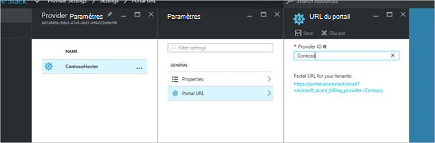

<properties
    pageTitle="Délégation de l’offre de pile Azure | Microsoft Azure"
    description="Apprenez à placer les autres personnes chargé de la création d’offres et inscription des utilisateurs à votre place."
    services="azure-stack"
    documentationCenter=""
    authors="AlfredoPizzirani"
    manager="byronr"
    editor=""/>

<tags
    ms.service="azure-stack"
    ms.workload="na"
    ms.tgt_pltfrm="na"
    ms.devlang="na"
    ms.topic="article"
    ms.date="10/07/2016"
    ms.author="alfredop"/>

#Délégation de l’offre dans la pile d’Azure

En tant qu’un administrateur de service, vous souhaitez souvent placer les autres personnes chargé de la création d’offres et inscription des utilisateurs à votre place. Par exemple, cela peut arriver si vous êtes un fournisseur de services et vous souhaitez revendeurs pour inscrire les clients et les gérer en votre nom. Il peut également se produire dans une entreprise si vous font partie d’un groupe informatique central et souhaitez divisions ou filiales pour vous inscrire à des utilisateurs sans intervention de votre part.

Délégation vous aide à ces tâches, pour vous aider à atteindre et gérer des utilisateurs que vous ne pourrez pas effectuer directement. L’illustration suivante montre un niveau de délégation, mais Azure pile prend en charge plusieurs niveaux. Fournisseurs déléguées peuvent à son tour déléguer à d’autres fournisseurs, jusqu'à cinq niveaux.

Les administrateurs peuvent déléguer la création d’offres et clients à d’autres utilisateurs à l’aide de la fonctionnalité de délégation.

##Rôles et les étapes de délégation

Pour mieux comprendre délégation, n’oubliez pas qu’il existe trois rôles impliqués :

-   L' **administrateur de service** gère l’infrastructure Azure pile crée un modèle d’offre et d’autres personnes à offrir à leurs utilisateurs délégués.

-   Les utilisateurs déléguées sont appelés **déléguée fournisseurs**. Ils peuvent appartenir à d’autres organisations (par exemple, d’autres clients Azure Active Directory).

-   **Les utilisateurs** s’inscrire pour les offres et les utiliser pour gérer leurs charges de travail, la création machines virtuelles, le stockage de données, etc..

Comme le montre l’illustration suivante, il existe deux étapes de configuration de délégation.

1.  Identifier les fournisseurs déléguées. Procédez comme suit en vous abonnant au groupe à l’offre basée sur un programme qui contenait uniquement le service d’abonnements.
    Les utilisateurs abonnés à cette offre acquièrent certaines des fonctionnalités de l’administrateur de service, y compris la possibilité d’étendre les offres et signer des utilisateurs pour les.

2.  Déléguer une offre au fournisseur délégué. Cette offre fonctionne comme un modèle pour que le fournisseur délégué peut proposer. Le fournisseur délégué est maintenant en mesure de prendre l’offre, cliquez sur son nom (mais pas modifier ses services et les quotas) et offrir aux clients.

Pour agir en tant que délégués fournisseurs, les utilisateurs ont besoin établir une relation avec le fournisseur principal ; en d’autres termes, dont elles ont besoin créer un abonnement. Dans ce scénario, cet abonnement identifie les fournisseurs déléguées comme ayant le droit d’offres présentes au nom du fournisseur principal.

Une fois que cette relation est établie, l’administrateur système pouvez déléguer une offre au fournisseur délégué. Le fournisseur délégué est maintenant en mesure de prendre l’offre, renommez-le (mais pas modifier fond) et offrir à ses clients.

Pour établir un fournisseur délégué, une offre de délégué, puis vérifiez que les utilisateurs peuvent s’inscrire pour qu’elle, suivez les instructions dans les sections suivantes.

##Définir des rôles

Pour afficher un fournisseur délégué au travail, vous devez comptes Azure Active Directory supplémentaires en plus de votre compte d’administrateur de service. Si vous n’avez pas les, créer les deux comptes. Les comptes peuvent appartenir à n’importe quel client AAD. Nous fera référence leur comme fournisseur délégué (point de distribution) et l’utilisateur.

| **Rôle** | **Droits d’organisation** |
| -------------------- | ----------------------- |
|  Fournisseur déléguée | Utilisateur |
| Utilisateur | Utilisateur |

##Identifier les fournisseurs de délégué

1.  Se connecter en tant qu’administrateur de service.

2.  Créer l’offre qui permettra de clients devenir délégués fournisseurs. Cela nécessite que vous créez un plan et une offre basés sur lui :

    un.  [Créer un plan](azure-stack-create-plan.md).
        Ce planning doit inclure uniquement le service d’abonnements. Dans cet article, nous utilisons un plan appelé PlanForDelegation.

    b.  [Créer une offre](azure-stack-create-offer.md) 
     en fonction de cette offre. Dans cet article, nous utilisons une offre appelée OfferToDP.

    c.  Une fois que la création de l’offre est terminée, ajoutez l’ID utilisateur du fournisseur délégué comme un client pour cette offre en cliquant sur     **abonnements** &gt; **Ajouter** &gt; **Nouvel abonnement client**.

  

> [AZURE.NOTE]Comme avec toutes les offres pile Azure, vous avez la possibilité de créer des utilisateurs publics et permettant ainsis l’offre s’inscrire à, ou protéger la confidentialité et laisser les administrateur de service à gérer la procédure d’abonnement. Fournisseurs déléguées sont généralement un petit groupe et que vous voulez contrôler les personnes admis, afin de confidentialité de cette offre vous paraîtront dans la plupart des cas.

##Administrateur de service crée l’offre déléguée

Vous avez établi maintenant votre fournisseur déléguée. L’étape suivante consiste à créer le plan et l’offre que vous vous apprêtez à déléguer et qui seront utilisés par vos clients. Vous devez définir cette offre exactement comme vous souhaitez les clients qu’il apparaisse, car le fournisseur délégué ne sera pas en mesure de modifier les offres et il inclut les quotas.

1.  En tant que l’administrateur de service, [créez un plan](azure-stack-create-plan.md) et [une offre](azure-stack-create-offer.md) basés sur lui. Pour cet article, nous utilisons une offre appelée DelegatedOffer.
> [AZURE.NOTE]Cette offre n’a pas besoin d’être rendu public. Il peut être rendu public si vous choisissez, mais, dans la plupart des cas, vous voulez uniquement fournisseurs déléguées à y accéder. Une fois que vous déléguez une offre privée comme décrit dans les étapes suivantes, le fournisseur délégué a accès à celui-ci.

2.  Déléguer l’offre. Accédez à DelegatedOffer, puis dans le volet Paramètres, cliquez sur **Fournisseurs déléguée** &gt; **Ajouter**.

3.  Sélectionnez abonnement du fournisseur déléguée dans la zone de liste déroulante, puis cliquez sur **délégué**.

> 

##Fournisseur déléguée personnalise l’offre

Se connecter en tant que le fournisseur délégué et créer une nouvelle offre à l’aide de l’offre déléguée en tant que modèle.

1.  Cliquez sur **Nouveau** &gt; **client offre + Plans** &gt; **proposer**.

    

2.  Attribuer un nom à l’offre. Ici, nous choisir ResellerOffer. Sélectionnez l’offre déléguée baser sur, puis cliquez sur **créer**.
    
    

    >[AZURE.NOTE] Notez la différence par rapport pour offrir la création comme expérimentés par l’administrateur de service. Le fournisseur délégué ne construit pas l’offre à partir de plans de base et les plans de composant additionnel ; elle uniquement avez le choix entre les offres qui ont été délégués lui et leur apportera pas de modifications.

3. Publier l’offre en cliquant sur **Parcourir** &gt; **offre**, sélectionnez l’offre, puis cliquez sur **Changer l’état**.

4. Le fournisseur délégué expose ces offres via le portail de sa propre URL. Notez que ces offres sont visibles uniquement par le biais de ce portail délégué. Pour rechercher et modifier cette URL :

    un.  Cliquez sur **Parcourir** &gt; **paramètres du fournisseur** &gt; **URL du portail**.

    b.  Modifier l’ID du fournisseur si vous le souhaitez.

    c.  Copier le portail URL vers un autre endroit, tel que le bloc-notes.

    
<!-- -->
Vous avez maintenant terminé la création d’une offre déléguée en tant que délégué fournisseur. Se déconnecter comme fournisseur délégué. Fermez l’onglet de navigateur que vous utilisez.

##S’inscrire à l’offre

1.  Dans une nouvelle fenêtre de navigateur, accédez au portail délégué URL que vous avez enregistrée à l’étape précédente. Connectez-vous au portail en tant qu’utilisateur. Remarque : vous devez utiliser le portail délégué pour cette étape. L’offre déléguée verront pas dans le cas contraire.

2.  Dans le tableau de bord, cliquez sur **obtenir un abonnement**. Vous verrez qu’uniquement les offres déléguées créées par le fournisseur délégué sont présentées à l’utilisateur :

> 

Le processus de délégation offre l’exercice pratique. L’utilisateur peut désormais s’inscrire à cette offre en obtenant un abonnement pour lui.

##Délégation à plusieurs niveaux

Délégation à plusieurs niveaux permet au fournisseur délégué à déléguer l’offre à d’autres entités. Cela permet, par exemple, la création de canaux revendeur plus approfondies, dans laquelle le fournisseur de gestion des livres Azure délégués une offre à un distributeur, qui à son tour délégués revendeur.
Pile Azure prend en charge un maximum de cinq niveaux de délégation.

Pour créer différents niveaux de délégation d’offre, le fournisseur délégué délégués à son tour l’offre au fournisseur suivant. Le processus est le même pour le fournisseur délégué telle qu’elle était définie pour l’administrateur de service (voir [administrateur de Service crée l’offre déléguée](#service-admin-creates-the-delegated-offer)).

##Étapes suivantes
[Mise en service une machine virtuelle](azure-stack-provision-vm.md)
