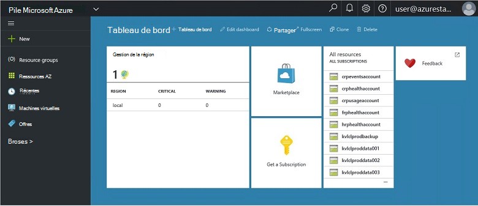
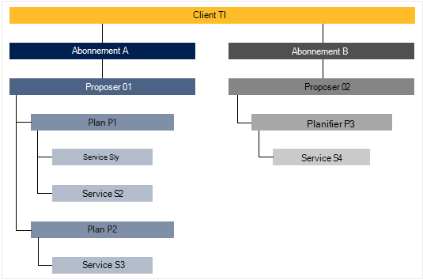

<properties
    pageTitle="Fonctionnalités clés et concepts de pile Azure | Microsoft Azure"
    description="En savoir plus sur les fonctionnalités clés et les concepts de pile Azure."
    services="azure-stack"
    documentationCenter=""
    authors="Heathl17"
    manager="byronr"
    editor=""/>

<tags
    ms.service="azure-stack"
    ms.workload="na"
    ms.tgt_pltfrm="na"
    ms.devlang="na"
    ms.topic="article"
    ms.date="10/25/2016"
    ms.author="helaw"/>

# Fonctionnalités clés et les concepts de pile d’Azure

Si vous débutez avec Microsoft Azure pile, ces termes et les descriptions de fonctionnalités peuvent être utiles.

## Personnages

Il existe deux types d’utilisateurs de Microsoft Azure pile, l’administrateur de service et le client (client).

-  Un **administrateur de service** peut configurer et gérer des fournisseurs de ressources, des offres client, offres, services, les quotas et les prix.
-  Un **client** pose (ou des achats) services offre de l’administrateur de service. Clients pouvant mise en service, surveiller et gérer les services qu’ils abonné, tels que des applications Web, le stockage et Machines virtuelles.

## Portail

Les principales méthodes d’interagir avec Microsoft Azure pile est le portail et PowerShell.

Le portail Microsoft Azure pile est une instance du portail Azure en cours d’exécution sur vos serveurs. Il est un site web qui fournit une expérience de libre-service pour les administrateurs de service et clients avec contrôle d’accès basé sur un rôle (RBAC) à des ressources et capacité cloud, l’activation de déploiement et de développement de services et d’application rapide.

## Régions, services, offres, offres et abonnements

Dans la pile d’Azure, services sont remis à clients à l’aide de régions, des licences, offres et les plans. Clients peuvent s’abonner à plusieurs offres. Offres peuvent avoir une ou plusieurs offres, et offres peuvent avoir un ou plusieurs services.

Exemple de hiérarchie d’abonnements d’un client aux offres, chacune avec différents plans et services.

### Régions
Les régions pile Azure sont un élément de base d’échelle et la gestion.  Une organisation peut avoir plusieurs régions dans lesquelles les ressources disponibles dans chaque région.  Régions peuvent aussi avoir des offres de service différentes disponibles.

### Services

Microsoft Azure pile permet aux fournisseurs d’effectuer un large éventail de services et applications, tels que machines virtuelles SQL Server bases de données, SharePoint, Exchange et plus.

### Offres

Les plans sont des regroupements d’un ou plusieurs services. En tant que fournisseur, vous créez des plans d’offrir à vos clients. À son tour, vos clients s’abonner à vos offres à utiliser les offres et services qu’ils comprennent.

Chaque service ajouté à un plan peut être configuré avec les paramètres de quota pour vous aider à gérer votre capacité cloud. Les quotas peuvent inclure des restrictions telles que les limites de mémoire virtuelle, RAM et processeur et sont appliquées par abonnement de l’utilisateur. Les quotas peuvent être distinguent par emplacement. Par exemple, un plan de services de cluster à partir de la région A peut avoir un quota de deux machines virtuelles, 4 Go de RAM et 10 cœurs d’UC.

Lorsque vous rédigez une offre, l’administrateur de service peut inclure des **plans de base**. Ces offres base sont inclus par défaut lorsqu’un client permet de s’abonner à cette offre. Dès qu’un utilisateur s’est abonnée (et l’abonnement est créé), l’utilisateur a accès à tous les fournisseurs de ressources spécifié dans les plans de base (avec les quotas correspondantes).

L’administrateur de service peut également inclure des **plans composant additionnel** dans une offre. Plans de module complémentaire ne sont pas inclus par défaut dans l’abonnement. Module complémentaire offres sont modes supplémentaires (quotas) disponibles dans une offre un propriétaire de l’abonnement peut ajouter à leurs abonnements.

### Offres

Offres sont des groupes d’une ou plusieurs offres fournisseurs présentent aux clients d’acheter (s’abonner à). Par exemple, proposer Alpha peut contenir Plan A (à partir de 1 et région contenant un ensemble de services de cluster) et Plan B (à partir de la région 2 contenant un ensemble de services de stockage et le réseau).

Une offre est fourni avec un ensemble de plans de base et les administrateurs de service peuvent créer des offres composant additionnel qui peuvent ajouter des clients à son abonnement.

### Abonnements

Un abonnement est comment clients achètent votre offre. Un abonnement est une combinaison d’un client avec une offre. Un client peut être abonné à plusieurs offres. Chaque abonnement s’applique à une offre. Abonnements d’un client déterminent quels plans/services qu’ils peuvent accéder.

Abonnements organiser fournisseurs d’accès et l’utilisation des ressources de cloud et services.

## Gestionnaire de ressources Azure

En utilisant le Gestionnaire de ressources Azure, vous pouvez travailler avec les ressources de votre infrastructure dans un modèle basé sur un modèle, déclaratives.   Il fournit une interface unique que vous pouvez utiliser pour déployer, gérer et analyser les composants de votre solution, tels que machines virtuelles, les comptes de stockage, les applications web et les bases de données. Pour plus d’informations et des recommandations, consultez la [vue d’ensemble du Gestionnaire de ressources Azure](../azure-resource-manager/resource-group-overview.md).

### Groupes de ressources

Groupes de ressources sont des collections de ressources, les services et applications, et chaque ressource a un type, tels que machines virtuelles réseaux virtuels, public adresses IP, comptes de stockage et sites Web. Chaque ressource doit se trouver dans un groupe de ressources et afin que les groupes de ressources aident logiquement organiser les ressources, telles que par la charge de travail ou un emplacement.

Voici quelques points importants à prendre en considération lors de la définition d’un groupe de ressources :

-   Chaque ressource ne peut exister dans un groupe de ressources.

-   Vous déployez, mettre à jour et supprimer des éléments dans un groupe de ressources ensemble. Si une ressource, par exemple un serveur de base de données, doit figurer sur un cycle de déploiement différentes, il convient dans un autre groupe de ressources.

-   Vous pouvez ajouter ou supprimer une ressource à un groupe de ressources à tout moment.

-   Vous pouvez déplacer une ressource à partir d’un groupe de ressources dans un autre groupe.

-   Un groupe de ressources peut contenir des ressources qui résident dans différentes régions.

-   Un groupe de ressources peut servir à portée de contrôle d’accès pour les opérations d’administration.

-   Une ressource peut être liée à une ressource dans un autre groupe de ressources lorsque les deux ressources doivent interagir avec eux, mais ils ne partagent pas le même cycle de vie. Par exemple, plusieurs applications doivent se connecter à une base de données, mais cette base de données ne doit pas être mis à jour ou supprimé au même rythme que les applications.

-   Dans Microsoft Azure pile, ressources telles que les offres et les offres sont également gérés dans des groupes de ressources.

-   Vous pouvez redéployez un groupe de ressources.  Ceci est utile à des fins de test ou développement.  

### Modèles de gestionnaire de ressources Azure

Avec le Gestionnaire de ressources Azure, vous pouvez créer un modèle simple (au format JSON) qui définit le déploiement et la configuration de votre application. Ce modèle est appelé un modèle de gestionnaire de ressources Azure et fournit déclarative pour définir le déploiement. En utilisant un modèle, vous pouvez à plusieurs reprises déployer votre application dans l’ensemble du cycle de vie d’application et font confiance que vos ressources sont déployés dans un état cohérent.

## Fournisseurs de ressources (RPs) — réseau RP, calculer RP, stockage RP

Fournisseurs de ressources sont les services web qui constituent la base de tous les IaaS basée sur Azure et services PaaS. Le Gestionnaire de ressources Azure repose sur différents RPs pour donner accès aux services d’un hébergeur.

Il existe trois RPs principale : réseau, de stockage et de calcul. Chacun de ces RPs vous aide à configurer et contrôler son ressources respectives. Les administrateurs de service peuvent également ajouter des nouveaux fournisseurs de ressource personnalisées.

### Calculer RP

Le fournisseur de ressources de calcul (PRC) permet aux clients de pile Azure créer leurs propres machines virtuelles. Il fournit également des fonctionnalités de l’administrateur de service installer et configurer le fournisseur de ressources pour les clients. Le PRC inclut la possibilité de créer des machines virtuelles, ainsi que les extensions de Machine virtuelle. Le service d’extension Machine virtuelle permet de fournir des fonctions IaaS pour Windows et Linux machines virtuelles.

### Réseau RP

Le fournisseur de ressources réseau (NRP) propose une série de fonctionnalités de mise en réseau définis logiciel (SDN) et virtualisation de fonction réseau (NFV) pour le cloud privé. Ces fonctionnalités sont cohérentes avec le nuage public Azure afin que les modèles d’application peuvent être écrites une seule fois et déployés à la fois dans le nuage public Azure ou local Microsoft Azure pile. Le RP réseau vous donne un contrôle plus précis, balises de métadonnées, la configuration rapide, personnalisation rapide et répétitif et plusieurs interfaces de contrôle (y compris PowerShell, Kit de développement .NET, Node.JS SDK, API basée sur REST). La NRP vous permet de créer des groupes de sécurité logiciel charge les programmes d’équilibrage, adresses IP public, réseau, réseaux virtuels, entre autres.

### Stockage RP

Le RP stockage propose des services de stockage Azure cohérentes quatre : blob, table, file d’attente et la gestion des comptes. Il propose également un service d’administration stockage cloud pour faciliter l’administration du service fournisseur de services de stockage Azure cohérentes. Stockage Azure est suffisamment souple pour stocker et récupérer de grandes quantités de données non structurées, tels que des documents et des fichiers multimédia avec des objets BLOB Azure, données et de NoSQL structurée avec des tableaux Azure. Pour plus d’informations sur le stockage Azure, voir [Introduction à Microsoft Azure stockage](../storage/storage-introduction.md).

#### Stockage d’objets BLOB

Stockage d’objets BLOB stocke n’importe quel jeu de données. Un blob peut être n’importe quel type de texte ou des données binaires, tel qu’un document, un fichier multimédia ou un programme d’installation d’application. Stockage de tables stocke les jeux de données structurées. Stockage de table est un magasin de données de l’attribut key NoSQL, qui permet un développement rapide et accéder rapidement de grandes quantités de données. Stockage de file d’attente fournit une messagerie fiable pour le traitement des flux de travail et pour les communications entre les composants des services en nuage.

Chaque blob est organisée sous un conteneur. Les conteneurs fournissent également un moyen pratique d’affecter des stratégies de sécurité aux groupes d’objets. Un compte de stockage peut contenir un nombre quelconque de conteneurs et un conteneur peut contenir un nombre quelconque d’objets BLOB, jusqu'à la limite de capacité de 500 To du compte de stockage. BLOB storage propose trois types d’objets BLOB, bloquer des objets BLOB, ajoutez des objets BLOB et des objets BLOB de page (disques). Objets BLOB bloc optimisées en continu et le stockage d’objets cloud et sont un bon choix pour le stockage des documents, des fichiers multimédias, des sauvegardes etc.. Ajouter des objets BLOB sont similaires aux objets BLOB bloc, mais optimisées pour les opérations d’ajout. Un blob Ajout pouvant être mis à jour uniquement en ajoutant un nouveau bloc à la fin. Ajouter des objets BLOB sont un bon choix pour les scénarios telles que l’enregistrement, où les nouvelles données doivent être écrites uniquement à la fin de l’objet blob. Page des objets BLOB sont optimisés pour représentant IaaS disques et prenant en charge aléatoire écrit et peut être jusqu'à 1 To. Un réseau machine virtuelle Azure associés IaaS disque est un disque dur virtuel stocké en tant qu’un blob de page.

#### Stockage de table

Stockage de table est stockage de clé/attribut NoSQL de Microsoft : il a une conception sans schémas, rendant différent de bases de données relationnelles traditionnels. Dans la mesure où les schémas manque de banques de données, il est facile d’adapter vos données selon les besoins de votre evolve application. Stockage de table est facile à utiliser, afin que les développeurs peuvent créer rapidement des applications. Stockage de table est un magasin attribut key, ce qui signifie que chaque valeur dans une table est stocké avec un nom de la propriété tapé. Le nom de la propriété peut être utilisé pour filtrer et définir des critères de sélection. Un ensemble de propriétés et leurs valeurs comprennent une entité. Depuis schémas de manque d’espace de stockage de Table, deux entités dans la même table peuvent contenir différents ensembles de propriétés, et ces propriétés peuvent être de différents types. Vous pouvez utiliser le stockage de Table pour stocker les jeux de données flexibles, telles que des données utilisateur pour les applications web, des carnets d’adresses, informations sur les périphériques et tout autre type de métadonnées nécessaires à votre service. Vous pouvez enregistrer un nombre quelconque d’entités dans un tableau, et un compte de stockage peut contenir un nombre quelconque de tables, jusqu'à la capacité maximale du compte de stockage.

#### Stockage de file d’attente
Stockage file d’attente Azure fournit cloud entre les composants d’application de messagerie. Dans la conception d’applications pour échelle, les composants d’application sont souvent découplées, afin qu’ils peuvent faire évoluer indépendamment. File d’attente stockage offre une messagerie asynchrone pour les communications entre les composants d’application, si elles s’exécutent dans le cloud, sur le bureau, sur un serveur local ou sur un appareil mobile. Stockage de file d’attente prend également en charge la gestion des tâches asynchrones et la création de flux de travail de processus.

## Accès contrôle basé sur un rôle

Vous pouvez utiliser RBAC octroyer l’accès au système aux utilisateurs autorisés, les groupes et les services en leur attribuant des rôles au niveau de la ressource, du groupe de ressources ou abonnement. Chaque rôle définit le niveau d’accès qu'un utilisateur, un groupe ou un service comporte des ressources de Microsoft Azure pile.

RBAC Azure comporte trois rôles base qui s’appliquent à tous les types de ressources : propriétaire, collaboration et le lecteur. Propriétaire a un accès complet à toutes les ressources, y compris le droit de l’accès délégué à d’autres personnes. Collaboration peut créer et gérer tous les types de ressources Azure mais ne peut pas accorder l’accès à d’autres personnes. Ressources Azure existantes peut uniquement afficher le lecteur. Le reste des rôles RBAC dans Azure autoriser la gestion des ressources Azure spécifiques. Par exemple, le rôle de collaborateur Machine virtuelle permet la création et la gestion des machines virtuelles mais ne permet pas de gestion du réseau virtuel ou le sous-réseau la machine virtuelle se connecte à.

## Données d’utilisation

Microsoft Azure pile collecte et regroupe les données d’utilisation entre tous les fournisseurs de ressources à fournir un rapport concis par utilisateur. Données peuvent être aussi simples que le nombre de ressources consommées ou aussi complexe que compteurs de performances et les proportions individuels. Les données sont disponibles via l’API REST. Il existe une API client Azure cohérentes, ainsi que fournisseur et délégués fournisseur API pour obtenir des données d’utilisation sur tous les abonnements client. Ces données peuvent servir à intégrer un outil externe ou un service de facturation ou de refacturation.

## Étapes suivantes

[Déploiement d’Azure pile Technical Preview 2 (test)](azure-stack-deploy.md)
