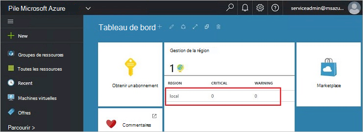
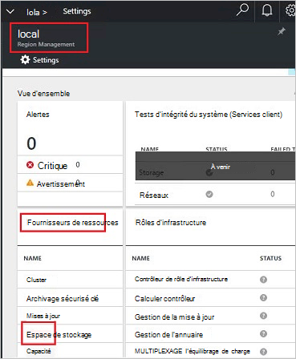
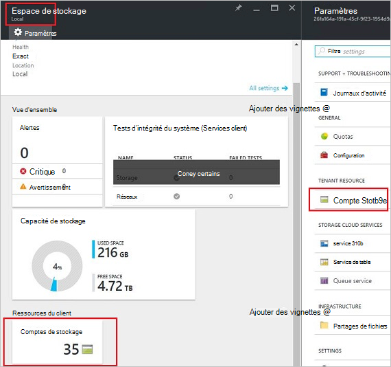
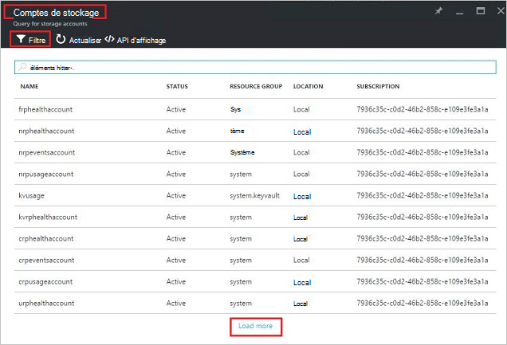
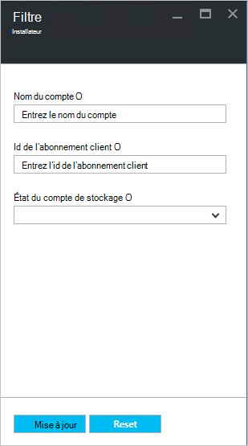
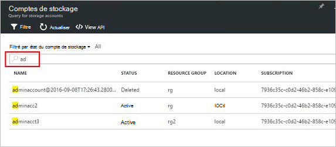
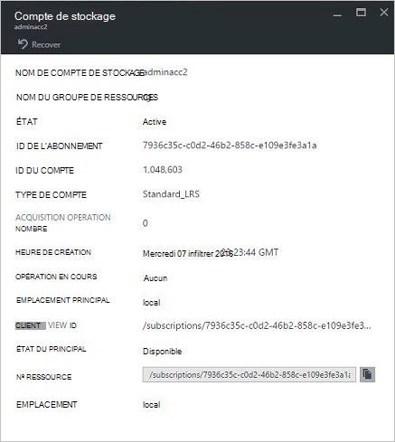
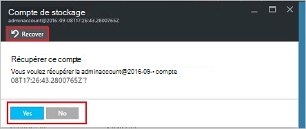
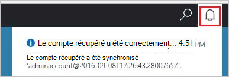
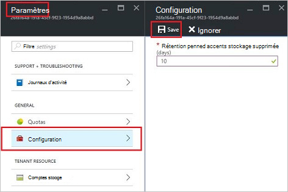

<properties
    pageTitle="Gérer les comptes de stockage Azure pile | Microsoft Azure"
    description="Apprenez à trouver, gérer, récupérer et récupérer des comptes de stockage Azure pile"
    services="azure-stack"
    documentationCenter=""
    authors="AniAnirudh"
    manager="darmour"
    editor=""/>

<tags
    ms.service="azure-stack"
    ms.workload="na"
    ms.tgt_pltfrm="na"
    ms.devlang="na"
    ms.topic="get-started-article"
    ms.date="09/26/2016"
    ms.author="anirudha"/>

# <a name="manage-storage-accounts-in-azure-stack"></a>Gérer les comptes de stockage dans Azure pile

Découvrez comment gérer les comptes de stockage dans la pile Azure pour rechercher, récupérer et utiliser une capacité de stockage en fonction des besoins professionnels.

## <a name="find-a-storage-account"></a>Rechercher un compte de stockage

La liste des comptes de stockage dans la région peut être affichée dans la pile Azure par :

1.  Dans un navigateur internet, accédez à [https://portal.azurestack.local](https://portal.azurestack.local/).

2.  Connectez-vous au portail pile Azure en tant qu’administrateur (en utilisant les informations d’identification que vous avez fourni pendant le déploiement)

3.  Dans le tableau de bord par défaut – Rechercher liste de **gestion de la région** et cliquez sur la zone que vous souhaitez Explorer – **(local**).

    

4.  Sélectionner le **stockage** dans la liste de **Fournisseurs de ressources** .

    

5.  À présent, sur la carte de ressources fournisseur Admin stockage – faites défiler jusqu'à l’onglet « Comptes de stockage » et cliquez dessus.

    
    
    La page qui s’affiche est la liste des comptes de stockage dans cette zone.

    

Par défaut, les 10 premiers comptes sont affichent. Vous pouvez choisir de récupérer des informations supplémentaires en cliquant sur le lien « charger plus » en bas de la liste <br>
OR <br>
Si vous êtes intéressé par un compte de stockage particulier : vous pouvez **filtrer et récupérer les comptes concernés** uniquement.<br>

Pour filtrer les comptes :

1. Cliquez sur le bouton filtre en haut de la carte.

2. Sur la carte de filtre, il vous permet de spécifier le **nom du compte**,  **ID de l’abonnement** ou **état** pour affiner la liste des comptes de stockage à afficher. Utiliser le cas échéant.

3. Cliquez sur Mettre à jour. Actualisez la liste en conséquence.

    

4. Pour rétablir le filtre, cliquez sur le bouton Filtre, effacer les sélections et mettre à jour.

La zone de texte Rechercher, en haut de la carte de liste de comptes de stockage, vous permet de mettre en surbrillance le texte sélectionné dans la liste des comptes. Il s’agit très pratique dans le cas lorsque le nom complet ou l’id n’est pas facilement accessible.<br>
Vous pouvez utiliser financières ici pour aider à trouver le compte que qui vous intéresse.




## <a name="look-at-account-details"></a>Afficher les détails de compte

Une fois que vous avez trouvé les comptes que vous êtes intéressé par l’affichage, vous pouvez cliquer sur le compte pour afficher certains détails. Une nouvelle carte s’ouvre avec les détails du compte comme le type du compte, l’heure de création, emplacement etc..




## <a name="recover-a-deleted-account"></a>Restaurer un compte supprimé

Vous pourrez dans une situation où vous voulez restaurer un compte supprimé.<br>
Dans AzureStack, il existe un moyen très simple pour le faire.

1.  Accédez accédez à la liste des comptes de stockage. [Voir trouver un compte de stockage](#find-a-storage-account)

2.  Recherchez ce compte dans la liste. Vous devrez peut-être filtrer.

3.  Vérifier l’état du compte. Vous devriez voir « supprimer ».

4.  Cliquez sur le compte qui s’ouvre la carte de détails de compte.

5.  En haut de cette carte – recherchez le bouton « Restaurer » et cliquez dessus.

6.  Confirmez en appuyant sur « Oui »

    

7.  La récupération est maintenant en cours... attendre indication si elle a réussi.
    Vous pouvez également cliquer sur l’icône « bell » en haut du portail pour afficher les indications de l’avancement.

    

  Une fois que le compte récupéré est synchronisé avec succès, une pouvez revenir à l’utiliser.

### <a name="some-gotchas"></a>Des problèmes

- Votre compte supprimé affiche l’état en tant que « se déconnecter de rétention ».

  Cela signifie que le compte supprimé a dépassé la période de rétention et ne peut pas être récupérée plus.

- Votre compte supprimé n’affiche pas dans la liste des comptes.

  Cela signifie que le compte supprimé a déjà été inexistant.. Dans ce cas il est impossible de récupérer plus. Voir « récupérer de la capacité » ci-dessous.

## <a name="set-retention-period"></a>Définir une période de rétention

Définition de période de rétention permet à un administrateur spécifier une période de temps en jours (compris entre 0 et 9 999 jours) pendant laquelle n’importe quel compte supprimé potentiellement peut être récupéré. La période de rétention par défaut est définie sur 15 jours. Définition de la valeur « 0 » signifie que n’importe quel compte supprimé est immédiatement déconnecter de rétention et sont marqués pour nettoyage périodique.

Pour modifier la période de rétention –

1.  Dans un navigateur internet, accédez à [https://portal.azurestack.local](https://portal.azurestack.local/).

2.  Connectez-vous au portail pile Azure en tant qu’administrateur (en utilisant les informations d’identification que vous avez fourni pendant le déploiement)

3.  Dans le tableau de bord par défaut – Rechercher liste de **gestion de la région** et cliquez sur la zone que vous souhaitez Explorer – **(local**).

4.  Sélectionner le **stockage** dans la liste de **Fournisseurs de ressources** .

5.  Cliquez sur l’icône Paramètres dans la partie supérieure pour ouvrir la carte de paramètre.

6.  Cliquez sur configuration - période de rétention.

7.  Vous pouvez modifier la valeur et enregistrez-le.

 Cette valeur sera immédiatement efficaces et refléter au sein de votre ensemble de la région.



## <a name="reclaim-capacity"></a>Récupérer de la capacité

Un des effets côté de disposer d’une période de rétention est qu’un compte supprimé continuent à utiliser à la capacité jusqu'à ce qu’il s’agit de se déconnecter de la période de rétention. Maintenant en tant qu’administrateur, que vous devrez peut-être permet de récupérer ce supprimés espace comptes même si la période de rétention n’a pas encore expiré. Pour le moment, vous pouvez utiliser une ligne de commande explicitement remplacer la période de rétention et de récupérer immédiatement de la capacité. Pour le faire :

1.  En supposant que vous avez Azure PowerShell installé et configuré. Dans le cas contraire, suivez les instructions fournies ici : pour installer la dernière version de PowerShell Azure et l’associer à votre abonnement Azure, Découvrez [comment installer et configurer Azure PowerShell](http://azure.microsoft.com/documentation/articles/powershell-install-configure/).
    Pour plus d’informations sur les applets de commande Gestionnaire de ressources Azure, voir [Utilisation de PowerShell Azure avec le Gestionnaire de ressources Azure](http://go.microsoft.com/fwlink/?LinkId=394767)

2.  Exécuter cette applet de commande :

    ```
    PS C:\\>; Clear-ACSStorageAccount -ResourceGroupName system
    -FarmName <your farmname>
    ```

> Pour plus d’informations, reportez-vous à la [documentation de powershell AzureStack](https://msdn.microsoft.com/library/mt637964.aspx)

> [AZURE.NOTE] Cette applet de commande en cours d’exécution opération supprime définitivement le compte et son contenu. Il ne sera plus récupérable. Utilisez avec soin.

