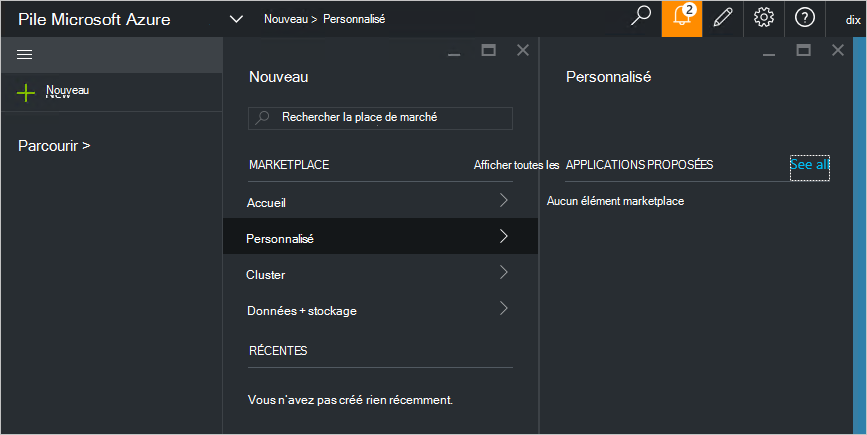

<properties
    pageTitle="Publier un élément marketplace personnalisé dans Azure pile (administrateur de service) | Microsoft Azure"
    description="En tant qu’un administrateur de service, découvrez comment publier un élément marketplace personnalisée dans une pile Azure."
    services="azure-stack"
    documentationCenter=""
    authors="rupisure"
    manager="byronr"
    editor=""/>

<tags
    ms.service="azure-stack"
    ms.workload="na"
    ms.tgt_pltfrm="na"
    ms.devlang="na"
    ms.topic="article"
    ms.date="09/26/2016"
    ms.author="rupisure"/>

# La pile Azure Marketplace

Le marché est un ensemble d’éléments personnalisées pile Azure, tels que des services, des applications et des ressources. C’est l’endroit d'où de clients pour créer de nouvelles ressources et déployer des nouvelles applications. Les administrateurs de service peuvent ajouter des éléments personnalisés à la Marketplace et clients seront visibles aux immédiatement.

Pour ouvrir le marché, cliquez sur **Nouveau**.

Le marché est mis à jour toutes les cinq minutes.

## Éléments Marketplace

Chaque élément Marketplace comporte :

-   Un modèle Azure le Gestionnaire de ressources de mise en service des ressources

-   Métadonnées, comme des chaînes, icônes et autres supports marketing

-   Informations de mise en forme pour afficher l’élément dans le portail

Chaque élément de publication à la place de marché utilise un format appelé le Package de galerie Azure (azpkg). Ressources de déploiement ou runtime (par exemple, code, fichiers zip avec le logiciel ou images de machine virtuelle) doivent être ajoutées à Azure pile séparément, pas dans le cadre de l’élément Marketplace. 

## Étapes suivantes

[Créer et publier un élément marketplace](azure-stack-create-and-publish-marketplace-item.md)
