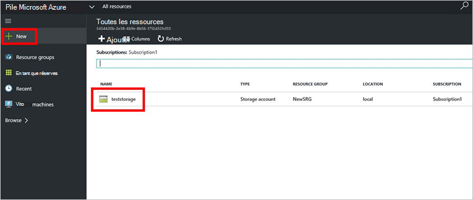

<properties
    pageTitle="Comptes de stockage dans une pile Azure | Microsoft Azure"
    description="Apprenez à créer un compte de stockage Azure pile."
    services="azure-stack"
    documentationCenter=""
    authors="ErikjeMS"
    manager="byronr"
    editor=""/>

<tags
    ms.service="azure-stack"
    ms.workload="na"
    ms.tgt_pltfrm="na"
    ms.devlang="na"
    ms.topic="get-started-article"
    ms.date="09/26/2016"
    ms.author="erikje"/>

# Comptes de stockage dans la pile d’Azure

Comptes de stockage incluent les services Blob et Table et l’espace de noms unique pour vos objets de données de stockage. Par défaut, les données dans votre compte sont disponibles uniquement pour vous, le propriétaire du compte de stockage.

1.  Sur l’ordinateur du contact pile Azure, connectez-vous à `https://portal.azurestack.local` en tant qu' [administrateur](azure-stack-connect-azure-stack.md#log-in-as-a-service-administrator), puis cliquez sur **Nouveau** > **données + stockage** > **compte de stockage**.

    

2.  Dans la carte de **créer un compte de stockage** , tapez un nom pour votre compte de stockage. Créer un **Groupe de ressources**, ou sélectionnez-en un, puis cliquez sur **créer** pour créer le compte de stockage.

    

3. Pour afficher votre nouveau compte de stockage, cliquez sur **toutes les ressources**, puis recherchez le compte de stockage et cliquez sur son nom.

    
    
## Étapes suivantes

[Utiliser des modèles de gestionnaire de ressources Azure](azure-stack-arm-templates.md)

[En savoir plus sur les comptes de stockage Azure](../storage/storage-create-storage-account.md)

[Télécharger le Guide de Validation de stockage Azure cohérentes pile Azure](http://aka.ms/azurestacktp1doc)
