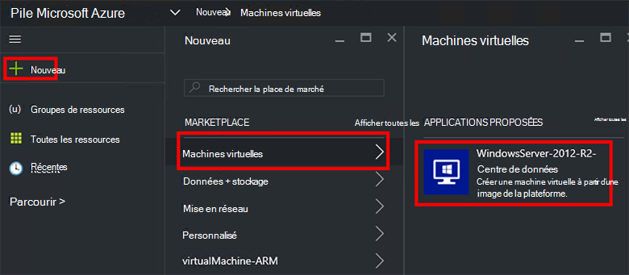
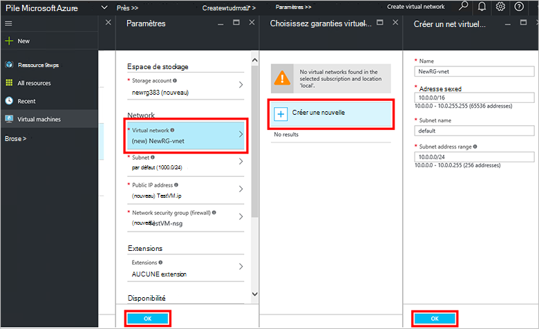
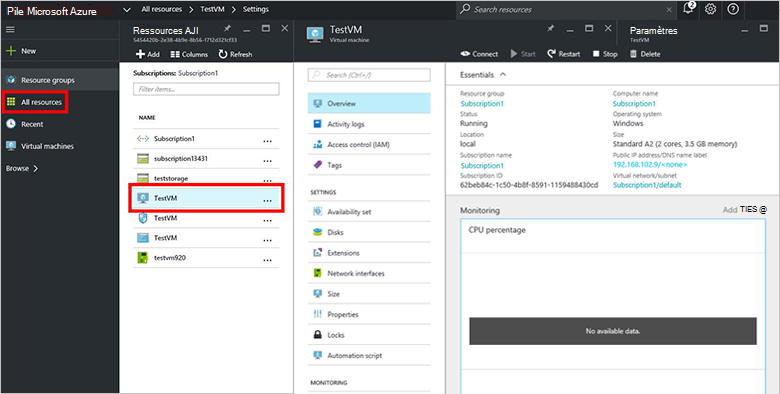

<properties
    pageTitle="Configurer une machine virtuelle dans Azure pile (client) | Microsoft Azure"
    description="Comme un client, découvrez comment configurer une machine virtuelle dans Azure pile."
    services="azure-stack"
    documentationCenter=""
    authors="ErikjeMS"
    manager="byronr"
    editor=""/>

<tags
    ms.service="azure-stack"
    ms.workload="na"
    ms.tgt_pltfrm="na"
    ms.devlang="na"
    ms.topic="get-started-article"
    ms.date="10/12/2016"
    ms.author="erikje"/>

# Mise en service une machine virtuelle

En tant qu’administrateur, vous pouvez créer des machines virtuelles pour évaluer les ressources avant de les proposer dans les plans.

## Mise en service une machine virtuelle

1.  Sur l’ordinateur du contact pile Azure, connectez-vous à `https://portal.azurestack.local` en tant qu' [administrateur](azure-stack-connect-azure-stack.md#log-in-as-a-service-administrator), puis cliquez sur **Nouveau** > **machines virtuelles** > **Windows Server 2012-R2-centre de données**.  

    

2.  Dans la carte **Concepts de base** , tapez un **nom**, **nom d’utilisateur**et **mot de passe**. Pour le **type de disque machine virtuelle**, sélectionnez le **disque dur**. Sélectionnez un **abonnement**. Créer un **groupe de ressources**, ou sélectionnez-en un, puis cliquez sur **OK**.  

3.  Dans la carte de **Choisir une taille** , cliquez sur **Base de A1**, puis cliquez sur **Sélectionner**.  

4.  Dans la carte de **paramètres** , cliquez sur **réseau virtuel**. Dans la carte **réseau virtuel choisir** , cliquez sur **Créer nouveau**. Dans la carte **réseau virtuel créer** , acceptez les paramètres par défaut, puis cliquez sur **OK**. Dans la carte de **paramètres** , cliquez sur **OK**.

    

5.  Dans la carte de **Résumé** , cliquez sur **OK** pour créer la machine virtuelle.  

6. Pour afficher votre nouvelle machine virtuelle, cliquez sur **toutes les ressources**, puis recherchez la machine virtuelle et cliquez sur son nom.

    

## Étapes suivantes

[Comptes de stockage](azure-stack-provision-storage-account.md)
