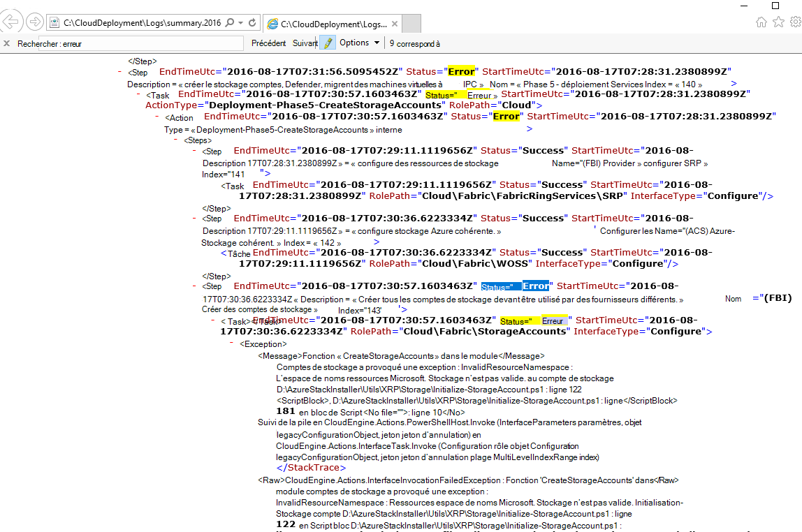
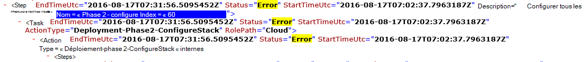

<properties
    pageTitle="Exécutez à nouveau un déploiement d’une étape a échoué | Microsoft Azure"
    description="Si vous rencontrez un problème lors du déploiement, vous pouvez essayer les étapes suivantes pour réexécuter le déploiement à partir de l’endroit où il a échoué."
    services="azure-stack"
    documentationCenter=""
    authors="ErikjeMS"
    manager="byronr"
    editor=""/>

<tags
    ms.service="azure-stack"
    ms.workload="na"
    ms.tgt_pltfrm="na"
    ms.devlang="na"
    ms.topic="get-started-article"
    ms.date="09/26/2016"
    ms.author="erikje"/>
    
# Exécutez à nouveau un déploiement d’une étape a échoué
  
Si vous rencontrez un problème lors du déploiement, vous pouvez essayer les étapes suivantes pour réexécuter le déploiement à partir de l’endroit où il a échoué.

## Rechercher l’échec

Prenez note de l’échec, en particulier la partie qui présente à quelle étape l’appel a échoué. Par exemple,

**2016-08-17 00:30:57 Erreur 1 > 1 > Action : appel d’étape 60.140.143 a échoué. Arrêt de l’appel du plan d’action.**

Il s’agit l’étape de déploiement de l’endroit où vous allez commencer la réexécuter du déploiement.

## Trouver plus de détails sur l’échec

Si vous souhaitez obtenir plus d’informations sur l’erreur, recherchez associé **Résumé. AAAA-MM-DD.tt.N.log.xml** dans le **C:\CloudDeployment\Logs\* * dossier.
Recherchez la chaîne « Erreur », puis suivez vers le bas dans les résultats jusqu'à ce que vous voyiez une grande quantité de texte mis en forme non-XML contenant le message d’erreur (cette section souvent équivaut à la dernière instance de la chaîne « Erreur »). Par exemple :

Vous pouvez également utiliser ces informations pour effectuer le suivi de l’étape réexécuter, suivi les nombres « Index » à partir de cette dernière erreur. Dans l’image ci-dessus, vous pouvez voir (en commençant à partir du bas) : 143, 140 et ensuite si défiler vers le haut, vous verrez 60 :

Cela plaçant toutes les gagnante (maintenant à partir du haut vers le bas), vous obtenez 60.140.143, comme dans la sortie de console PS de l’échec (comme indiqué dans la section « Rechercher l’échec » ci-dessus).

## Exécutez à nouveau le déploiement en une étape spécifique

Maintenant que vous avez l’étape du déploiement a échoué sur, vous pouvez essayer de - réexécuter du déploiement à partir de cette étape.

> [AZURE.IMPORTANT] Les commandes suivantes doivent être exécutées par l’utilisateur approprié, dans le contexte l’échec qui se sont produites. Si l’erreur s’est produite avant l’hôte a été joint au domaine, exécutez les étapes ci-dessous en tant que le compte d’administrateur local. Si l’erreur s’est produite une fois que l’hôte a été joint au domaine, exécutez ces étapes tant qu’administrateur de domaine (azurestack\azurestackadmin).

### Exécuter la commande appeler EceAction

1. À partir d’une console PS avec élévation de privilèges, importer les Modules suivants :

        Import-Module C:\CloudDeployment\CloudDeployment.psd1 -Force
        Import-Module C:\CloudDeployment\ECEngine\EnterpriseCloudEngine.psd1 -Force 

2. Puis exécutez la commande suivante (exemple point situé au-dessus utilisé ici) :

        Invoke-EceAction -RolePath Cloud -ActionType Deployment -Start 60.140.143 -Verbose

3.  Cela ouvrira le déploiement de l’étape identifiée par le - paramètre de début de la commande appeler EceAction

### Résultats d’un - réexécuter/début

Quelle que soit l’option choisie, le déploiement commence à nouveau à partir du - paramètre de démarrage.

1.  Si l’erreur est récupérable, le déploiement continue jusqu'à son terme.

2.  Si le déploiement échoue à nouveau en...
    
    - au même endroit : l’échec est probablement pas récupérable, et une analyse plus poussée est requise.

    - un nouvel emplacement après lequel il a échoué cette fois : vous pouvez essayer de ces mêmes étapes pour obtenir l’élan à nouveau.

    - un nouvel emplacement avant l’endroit où il a échoué cette fois : un autre problème est survenu avec un appel idempotent, ce qui requiert des investigations.

## Étapes suivantes

[Se connecter à pile Azure](azure-stack-connect-azure-stack.md)

