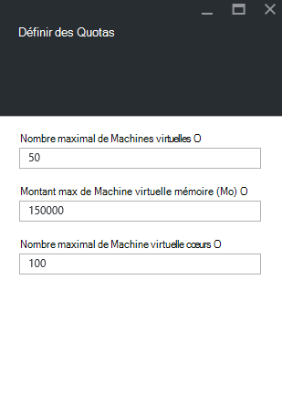

<properties
    pageTitle="Les quotas de pile Azure | Microsoft Azure"
    description="Administrateurs de définir des quotas pour limiter la quantité maximale de ressources clients ayant accès à."
    services="azure-stack"
    documentationCenter=""
    authors="mattmcg"
    manager="byronr"
    editor=""/>

<tags
    ms.service="azure-stack"
    ms.workload="na"
    ms.tgt_pltfrm="na"
    ms.devlang="na"
    ms.topic="get-started-article"
    ms.date="09/26/2016"
    ms.author="mattmcg"/>

# Définir des quotas dans Azure pile

Les quotas de définissent les limites des ressources qui un abonnement client peut mise en service ou consommer. Par exemple, un quota peut permettre à un client créer un maximum de cinq machines virtuelles. Pour ajouter un service à un plan, l’administrateur doit configurer les paramètres de quota pour ce service.

Les quotas peuvent être configurés par service et par emplacement, permettant aux administrateurs de fournir un contrôle précis sur l’utilisation des ressources. Administrateurs peuvent créer une ou plusieurs ressources de quota et associez-les à offres, ce qui signifie qu’ils peuvent fournir des offres différenciées pour leurs services. Les quotas d’un service donné peuvent être créés à partir de la carte d’administration de **Fournisseur de ressources** pour ce service.

Un client qui permet de s’abonner à une offre qui contient plusieurs offres peut utiliser toutes les ressources sont disponibles dans chaque plan.

## Pour créer un quota IaaS

1.  Dans un navigateur, accédez à [https://portal.azurestack.local](https://portal.azurestack.local/).

    Connectez-vous au portail pile Azure en tant qu’administrateur (en utilisant les informations d’identification que vous avez fourni au cours du déploiement).

2.  Sélectionnez **Nouveau**, puis **Quota**.

3.  Sélectionnez le premier service pour lequel vous souhaitez créer un quota. Pour un quota IaaS, procédez comme suit pour les services informatiques, de réseau et de stockage.
Dans cet exemple, nous avons tout d’abord créer un quota pour le service de cluster. Dans la liste **Namespace** , sélectionnez l’espace de noms **Microsoft.Compute.Admin** .

    > 

4.  Choisissez l’emplacement où le quota est défini (par exemple, « local »).

5.  Sur l’élément de **Paramètres de Quota** , cela signifie que **définir la capacité de Quota**. Cliquez sur cet élément pour configurer les paramètres de quota.

6.  Sur la carte de **Définir des Quotas** , vous voyez toutes les ressources de calcul pour laquelle vous pouvez configurer des limites. Chaque type a une valeur par défaut qui est associé. Vous pouvez modifier ces valeurs ou vous pouvez sélectionner le bouton **Ok** en bas de la carte pour accepter les paramètres par défaut.

    > 

7.  Une fois que vous avez configuré les valeurs et cliqué sur **Ok**, l’élément de **Paramètres de Quota** apparaît sous la forme **configuré**. Cliquez sur **Ok** pour créer la ressource de **Quota** .

    Vous devriez voir une notification indiquant que la ressource de quota est créée.

8.   Une fois que le jeu de quota a été créé, vous recevez une notification deuxième. Le quota de service de cluster est prêt à être associé à un plan. Répétez ces étapes avec les services de réseau et de stockage, et vous êtes prêt à créer un plan IaaS !

    >   

## Calculer les types de quota

|**Type**                    |**Valeur par défaut**| **Description**|
|--------------------------- | ------------------------------------|------------------------------------------------------------------|
|Nombre maximal de machines virtuelles   |50|Le nombre maximal de machines virtuelles un abonnement peut créer à cet emplacement. |
|Nombre maximal de cœurs machine virtuelle              |100|Le nombre maximal de cœurs capable de créer un abonnement à cet emplacement (par exemple, une machine virtuelle A3 comporte quatre cœurs).|
|Montant max de mémoire machine virtuelle (Go)         |150|La quantité maximale de RAM qui peut être configurée en mégaoctets (par exemple, une machine virtuelle A1 consomme 1,75 Go de RAM).|

> [AZURE.NOTE] Calculer les quotas ne sont pas appliquées dans cette version d’évaluation technique.

## Types de quota de stockage

|**Élément**                           |**Valeur par défaut**   |**Description**|
|---------------------------------- |------------------- |-----------------------------------------------------------|
|Capacité maximale (Go)              |500                 |Capacité de stockage totale qui peut être utilisée par un abonnement à cet emplacement.|
|Nombre total de comptes de stockage   |20                  |Le nombre maximal de comptes de stockage capable de créer un abonnement à cet emplacement.|

## Types de quota réseau

|**Élément**                                                   |**Valeur par défaut**   |**Description**|
|----------------------------------------------------------| ------------------- |--------------------------------------------------------------------------------------------------------------------------------------------------------------------|
| Adresses IP public max                         |50                  |Le nombre maximal d’adresses IP public capable de créer un abonnement à cet emplacement. |
| Réseaux virtuels max                   |50                  |Le nombre maximal de réseaux virtuels un abonnement peut créer à cet emplacement. |
| Passerelles réseau virtuel max           |1                   |Le nombre maximal de passerelles réseau virtuel (VPN passerelles) qu’un abonnement peut créer à cet emplacement. |
| Nombre maximal de connexions réseau                |2                   |Le nombre maximal de connexions réseau (point à point ou site à) un abonnement peut créer pour toutes les passerelles réseau virtuel à cet emplacement. |
| Programmes d’équilibrage de charge max                     |50                  |Le nombre maximal de programmes d’équilibrage de charge capable de créer un abonnement à cet emplacement. |
| Max cartes réseau                               |100                 |Le nombre maximal d’interfaces réseau capable de créer un abonnement à cet emplacement. |
| Groupes de sécurité réseau max            |50                  |Le nombre maximal de groupes de sécurité réseau capable de créer un abonnement à cet emplacement. |
