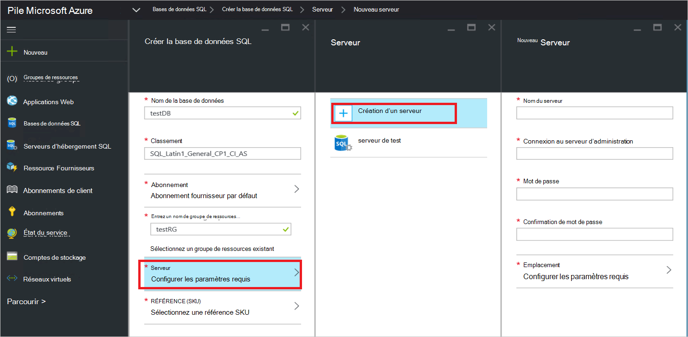

<properties
    pageTitle="Déployer le fournisseur de ressources de SQL Server sur pile Azure | Microsoft Azure"
    description="Procédure détaillée pour déployer une carte de fournisseur SQL Server ressource sur Azure pile."
    services="azure-stack"
    documentationCenter=""
    authors="Dumagar"
    manager="byronr"
    editor=""/>

<tags
    ms.service="multiple"
    ms.workload="na"
    ms.tgt_pltfrm="na"
    ms.devlang="na"
    ms.topic="article"
    ms.date="09/26/2016"
    ms.author="dumagar"/>

# Déployer la carte de fournisseur SQL Server ressource sur pile Azure

> [AZURE.NOTE] Les informations suivantes s’applique uniquement aux déploiements Azure pile TP1.

Utilisez cet article pour suivre les étapes détaillées de configuration de la carte de fournisseur SQL Server ressource dans la pile d’Azure preuve de concept (du contact). Voir [utiliser les bases de données SQL Azure pile](azure-stack-sql-rp-deploy-short.md) pour comprendre architecture et les fonctionnalités de fournisseur de ressources.

## Procédure de configuration avant de déployer

Avant de déployer le fournisseur de ressources, vous devez :

- Avoir une image de Windows Server par défaut avec .NET 3.5
- Désactiver la sécurité renforcée d’Internet Explorer (IE)
- Installer la dernière version de PowerShell Azure

### Créer une image de Windows Server, y compris .NET 3.5

Vous pouvez ignorer cette étape si vous avez téléchargé les bits Azure pile après 2/23/2016, car l’image de Windows Server 2012 R2 base par défaut inclut .NET framework 3.5 dans ce téléchargement et versions ultérieures.

Si vous avez téléchargé avant 23/2/2016, vous devez créer un disque dur virtuel de Windows Server 2012 R2 centre de données avec image .NET 3.5 et jeu est en tant que l’image par défaut dans le référentiel Image plateforme.

### Désactiver Internet Explorer amélioré sécurité et activer les cookies

Pour déployer un fournisseur de ressources, exécutez l’environnement de l’écriture de script intégré PowerShell (ISE) en tant qu’administrateur, vous devez autoriser les cookies et JavaScript dans le profil d’Internet Explorer que vous permet de vous connecter à Azure Active Directory pour les administrateurs et utilisateurs se-ins.

**Pour désactiver Internet Explorer une sécurité améliorée :**

1. Se connecter à l’ordinateur Azure pile preuve de concept (du contact) en tant qu’AzureStack/administrateur et ouvrez le Gestionnaire de serveur.

2. Activer ou désactiver **La Configuration de sécurité renforcée d’Internet Explorer** pour les administrateurs et utilisateurs.

3. Se connecter à la machine virtuelle **ClientVM.AzureStack.local** en tant qu’administrateur et ouvrez le Gestionnaire de serveur.

4. Activer ou désactiver **La Configuration de sécurité renforcée d’Internet Explorer** pour les administrateurs et utilisateurs.

**Pour activer les cookies :**

1. Dans l’écran Démarrer de Windows, cliquez sur **toutes les applications**et cliquez sur **Accessoires de Windows**, avec le bouton droit **d’Internet Explorer**, pointez sur **autres**, puis cliquez sur **Exécuter en tant qu’administrateur**.

2. Si vous y êtes invité, vérifiez la **sécurité recommandé d’utiliser**, puis cliquez sur **OK**.

3. Dans Internet Explorer, cliquez sur les **Outils (icône d’engrenage)** &gt; **options Internet** &gt; onglet **confidentialité** .

4. Cliquez sur **Avancé**vous assurer que les deux boutons **Accepter** sont activées et cliquez sur **OK**, puis cliquez à nouveau sur **OK** .

5. Fermez Internet Explorer et redémarrez PowerShell ISE en tant qu’administrateur.

### Installer une version compatible Azure pile de PowerShell Azure

1. Désinstallez tout PowerShell Azure existant à partir de votre ordinateur Client virtuel.

2. Connectez-vous à l’ordinateur du contact pile Azure en tant qu’administrateur/AzureStack.

3. À l’aide de bureau à distance, connectez-vous à la machine virtuelle **ClientVM.AzureStack.local** en tant qu’administrateur.

4. Ouvrez le panneau de configuration, cliquez sur **désinstaller un programme** &gt; sur **Azure PowerShell** &gt; cliquez sur **désinstaller**.

5. [Téléchargez la dernière PowerShell Azure qui prend en charge Azure pile](http://aka.ms/azstackpsh) et installez-le.

    Après avoir installé PowerShell, vous pouvez exécuter cette vérification script PowerShell pour vous assurer que vous pouvez vous connecter à votre instance Azure pile (une page web de connexion doit apparaître).

## Démarrage du déploiement de fournisseur de ressources PowerShell

1. Connexion Bureau à distance du contact Azure pile à clientVm.AzureStack.Local et connectez-vous en tant qu’azurestack\\azurestackuser.

2. [Télécharger les fichiers binaires SQLRP](http://aka.ms/massqlrprfrsh) le fichier. Vous devrez peut-être supprimer le bloc de sécurité Internet téléchargement en cliquant sur le fichier, sélectionnez **Propriétés** et à partir de l’onglet **Général** , graduations **Débloquer**, **OK**. Ceci ne devrait empêcher exceptions « Impossible de charger fichier ou assembly » liées aux DeploymentTelemetry.dll et les exceptions Trace déploiement ultérieures.

3. Extraire les fichiers à d\\SQLRP.

4. Exécuter le d\\SQLRP\\Bootstrap.cmd fichier en tant qu’administrateur (azurestack\\administrateur).

    Cette action ouvre le fichier Bootstrap.ps1 dans PowerShell ISE.

5. La fenêtre PowerShell ISE issue de chargement, cliquez sur le bouton lecture ou appuyez sur F5.

    

    Deux onglets principaux charge, chacun d’eux contenant tous les scripts et les fichiers que vous devez déployer le fournisseur de ressources.

## Préparer les conditions préalables

Cliquez sur l’onglet **Préparer les conditions préalables** pour :

- Créer des certificats requis
- Télécharger des objets à un compte de stockage sur Azure pile
- Publier des éléments de la galerie

### Créer les certificats requis
Ce script **Nouveau SslCert.ps1** ajoute le \_. Certificat SSL AzureStack.local.pfx à la d\\SQLRP\\conditions préalables\\BlobStorage\\dossier conteneur. Le certificat permet de sécuriser la communication entre le fournisseur de ressources et de l’instance locale du Gestionnaire de ressources Azure.

1. Sous l’onglet principal **Conditions préalables pour les préparer** , cliquez sur l’onglet **Nouveau SslCert.ps1** et l’exécuter.

2. Dans l’invite qui s’affiche, tapez un mot de passe PFX protège la clé privée et **Prenez note de ce mot de passe**. Vous en aurez besoin ultérieurement.

### Télécharger tous les objets dans un compte de stockage sur Azure pile

1. Cliquez sur l’onglet **Téléchargement-Microsoft.Sql-RP.ps1** et l’exécuter.

2. Dans la boîte de dialogue Windows PowerShell de demande d’informations d’identification, tapez les informations d’identification de pile Azure service administrateur.

3. Lorsque vous êtes invité à l’ID de client Azure Active Directory, tapez votre nom de domaine complet du client Azure Active Directory : par exemple, microsoftazurestack.onmicrosoft.com.

    Une fenêtre contextuelle vous invite à fournir les informations d’identification.

    

    > [AZURE.TIP] Si le menu contextuel ne s’affiche pas, vous que soit n’avez pas désactivé Internet Explorer amélioré sécurité pour activer JavaScript sur cet ordinateur et l’utilisateur, ou vous n’avez pas accepté les cookies dans Internet Explorer. Voir [configurer les étapes avant de déployer](#set-up-steps-before-you-deploy).

4. Tapez vos informations d’identification d’administrateur de Service pile Azure, puis sur **Se connecter**.

### Publier des éléments de la galerie pour la création de ressources une version ultérieure

Sélectionnez l’onglet **Publier GalleryPackages.ps1** et l’exécuter. Ce script ajoute deux éléments marketplace à marketplace du portail Azure pile du contact que vous pouvez utiliser pour déployer des ressources de base de données sous forme d’éléments marketplace.

## Déployer des ressources fournisseur machine virtuelle SQL Server

À présent que vous avez préparé le contrôle du concept pile Azure avec les certificats nécessaires et les éléments marketplace, vous pouvez déployer un fournisseur de ressources de SQL Server. Cliquez sur l’onglet **fournisseur déployer SQL** pour :

   - Indiquez les valeurs dans un fichier JSON qui fait référence au processus de déploiement
   - Déployer le fournisseur de ressources
   - Mettre à jour le DNS local
   - Enregistrer la carte de fournisseur de ressources SQL Server

### Indiquez les valeurs dans le fichier JSON

Cliquez sur **Microsoft.Sqlprovider.Parameters.JSON**. Ce fichier comprend les paramètres que le modèle de gestionnaire de ressources Azure doit déployer correctement à pile Azure.

1. Remplissez les paramètres dans le fichier JSON **vide** :

    - Vérifiez que vous fournissez la **adminusername** et **adminpassword** pour le fournisseur de ressources SQL machine virtuelle :

        

    - Vérifiez que vous fournissez le mot de passe pour le paramètre **SetupPfxPassword** que vous avez apportées à une note de l’étape [préparer composants requis](#prepare-prerequisites) :

    

2. Cliquez sur **Enregistrer** pour enregistrer le fichier de paramètres.

### Déployer le fournisseur de ressources

1. Cliquez sur l’onglet **déployer-Microsoft.sql-provider.PS1** et exécuter le script.
2. Tapez le nom de votre client dans Azure Active Directory lorsque vous y êtes invité.
3. Dans la fenêtre contextuelle, envoyez vos informations d’identification d’administration de pile Azure service.

La mise en œuvre complète peut prendre entre 25 et 55 minutes sur certains validation des conceptions pile Azure très utilisées. La procédure la plus longue sera l’extension de Configuration état souhaité (DSC) et l’exécution de PowerShell, ce qui correspond à la dernière étape. Chacun peut prendre 10-25 minutes.

### Mettre à jour le DNS local

1. Cliquez sur l’onglet **Registre-Microsoft.SQL-fqdn.ps1** et exécuter le script.
2. Lorsque vous êtes invité de l’ID de client Azure Active Directory, entrez votre nom de domaine complet du client Azure Active Directory : par exemple, **microsoftazurestack.onmicrosoft.com**.

### Enregistrer le fournisseur de ressources RP SQL##

1. Cliquez sur l’onglet **Registre-Microsoft.SQL-provider.ps1** et exécuter le script.

2. Lorsque vous êtes invité vos informations d’identification, utilisez les valeurs suivantes pour nom d’utilisateur et mot de passe :

   - **sqlRpUsername**
   - **sqlRpPassw0rd**

   > [AZURE.IMPORTANT] Voici les valeurs *littérales* dont vous avez besoin pour taper des informations d’identification à l’invite. Il s’agit pas d’espaces réservés. * *Effectuez *pas* type ** la citer que vous avez enregistrés dans le fichier de paramètres avant de déployer la machine virtuelle.

## Vérifier le déploiement à l’aide du portail de pile Azure

1. Se déconnecter de le ClientVM et vous reconnecter en tant que **AzureStack\AzureStackUser**.

2. Sur le bureau, cliquez sur **Le portail Azure pile du contact** et se connecter au portail en tant que l’administrateur de service.

3. Vérifiez que le déploiement a réussi. Cliquez sur **Parcourir** &gt; **Groupes de ressources** &gt; cliquez sur le groupe de ressources que vous avez utilisé (valeur par défaut est **SQLRP**), puis vérifiez que le composant essentials de la cuillère (moitié supérieure) lit **déploiement a réussi**.

      

4. Vérifiez que l’enregistrement a réussi. Cliquez sur **Parcourir** &gt; **fournisseurs de ressources**, puis recherchez les **SQL Local**:

      

## Fournit la capacité à votre fournisseur de ressources SQL en vous connectant à un serveur SQL d’hébergement

1. Connectez-vous au portail Azure pile du contact en tant qu’un administrateur de service

2. Cliquez sur **les fournisseurs de ressources** &gt; **Local SQL** &gt; **Atteindre la gestion des ressources fournisseur** &gt; **serveurs** &gt; **Ajouter**.

    La carte de **Serveurs hébergeant SQL** est l’endroit où vous pouvez connecter le fournisseur de ressources de SQL Server à réels instances de SQL Server servir de serveur principal de fournisseur de ressources.

    

3. Remplissez le formulaire avec les détails de la connexion de l’instance SQL Server. Par défaut, un serveur SQL préconfiguré appelé « SQLRP » avec le nom d’utilisateur administrateur « sa » et le mot de passe entouré dans le paramètre « adminpassword » dans les paramètres de que JSON est en cours d’exécution sur l’ordinateur virtuel.

## Créer votre première base de données SQL pour tester votre déploiement

1. Connectez-vous au portail Azure pile du contact en tant qu’administrateur de service.

2. Cliquez sur **Parcourir** &gt; **bases de données SQL** &gt; **Ajouter**
  

3. Renseignez le formulaire avec les détails de base de données, notamment un **Nom de serveur**, la **Connexion au serveur d’administration**et le **mot de passe** pour un nouveau *serveur virtuel* dans la carte de **Serveur de nouveau** .

    

    Le serveur virtuel est une construction artificielle. Il ne correspond pas à SQL Server lui-même mais à la place manifestes par le biais du nom d’utilisateur à l’intérieur de la chaîne de connexion, le fournisseur de ressources génère à la fin de ce processus. **Remarque le mot de passe que vous entrez séparément pour le serveur virtuel**. Le portail affichera jamais le mot de passe.

4. Vous êtes invité à choisir un niveau de tarification pour votre base de données.

    

    Niveaux n’est pas implémentées dans cette version, mais leur consommation est suivie par le Gestionnaire de ressources Azure comme un moyen de présenter la différence que vous pouvez créer dans l’application des quotas etc..

5. Envoyer le formulaire et attendez pour le déploiement terminer.

6. Dans la carte résultante, notez que le champ « Chaîne de connexion ». Vous pouvez utiliser cette chaîne dans n’importe quelle application nécessitant un accès SQL Server (par exemple, une application web) dans votre pile Azure.

    

## Étapes suivantes

Essayez d’autres [services PaaS](azure-stack-tools-paas-services.md) tels que le [fournisseur de ressources serveur MySQL](azure-stack-mysql-rp-deploy-short.md) et le [fournisseur de ressources des applications Web](azure-stack-webapps-deploy.md).
