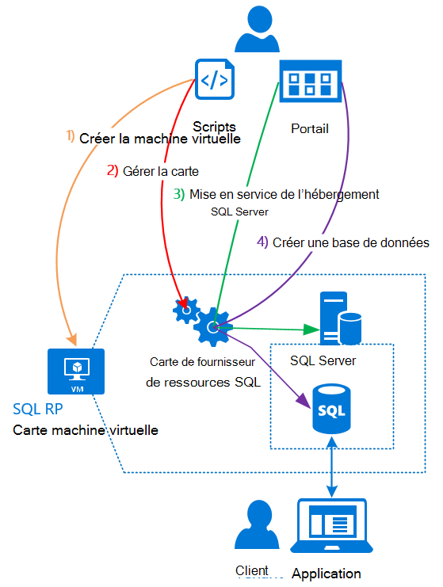

<properties
    pageTitle="À l’aide de bases de données SQL sur pile Azure | Microsoft Azure"
    description="Découvrez comment déployer des bases de données SQL en tant que service dans Azure pile et les étapes à suivre pour déployer la carte de fournisseur de ressources de SQL Server."
    services="azure-stack"
    documentationCenter=""
    authors="Dumagar"
    manager="byronr"
    editor=""/>

<tags
    ms.service="multiple"
    ms.workload="na"
    ms.tgt_pltfrm="na"
    ms.devlang="na"
    ms.topic="article"
    ms.date="09/26/2016"
    ms.author="dumagar"/>

# Utiliser les bases de données SQL sur Azure pile

> [AZURE.NOTE] Les informations suivantes s’applique uniquement aux déploiements Azure pile TP1.

Utiliser la carte de fournisseur de ressources de SQL Server pour exposer des bases de données SQL comme un service de pile Azure. Après avoir installé le fournisseur de ressources, vous et vos utilisateurs pouvant créer des bases de données pour les applications cloud natif, site Web basés sur SQL et les charges de travail basés sur SQL sans avoir à configurer une machine virtuelle () qui héberge SQL Server chaque fois.

Étant donné que le fournisseur de ressources n’a pas toutes les fonctionnalités de base de données SQL Azure pendant la preuve de concept (du contact), cet article commence par une vue d’ensemble de l’architecture de fournisseur de ressources. Vous obtenez un aperçu rapide de la procédure pour configurer le fournisseur de ressources, avec des liens vers les étapes plus détaillées de [déployer la carte de fournisseur de ressources de base de données SQL sur Azure pile du contact](azure-stack-sql-rp-deploy-long.md).

## Architecture de carte de fournisseur de ressources SQL Server
Le fournisseur de ressources n’offre pas la base de données des fonctionnalités de gestion de base de données SQL Azure. Par exemple, des pools élastique de base de données et la possibilité de composer monter et Descendre des performances de base de données à la volée ne sont pas disponibles. Toutefois, le fournisseur de ressources prend en charge le même créer, lire, mise à jour et opérations de suppression (CRUD) qui existe dans la base de données SQL Azure.

Le fournisseur de ressources est composé de trois composants :

- **Carte de fournisseur de ressources SQL machine virtuelle**, qui recouvre le processus de fournisseur de ressources et les serveurs hébergeant SQL Server.
- **Le fournisseur de ressources**qui traite les demandes de mise en service et expose des ressources de base de données.
- **Serveurs qui hébergent SQL Server**, qui permettent la capacité des bases de données.

Le diagramme conceptuel suivant montre ces composants et les étapes qui traversent lorsque vous déployez le fournisseur de ressources, configurez un serveur qui héberge SQL Server et puis créez une base de données.

## Étapes à suivre pour déployer le fournisseur de ressources
Utilisez ces étapes si vous connaissez déjà pile Azure. Si vous souhaitez obtenir plus d’informations, suivez les liens de chaque section ou accéder directement à [déployer la carte de fournisseur de ressources de base de données SQL sur Azure pile du contact](azure-stack-sql-rp-deploy-long.md).

1.  Vérifiez que vous avez effectué toutes les [configurer les étapes avant de déployer](azure-stack-sql-rp-deploy-long.md#set-up-steps-before-you-deploy) le fournisseur de ressources :

  - .NET framework 3.5 est déjà configuré dans l’image de Windows Server base. (Si vous avez téléchargé les bits Azure pile après le 23 février 2016, vous pouvez ignorer cette étape.)
  - [Une version de PowerShell Azure qui est compatible avec Azure pile est installée](http://aka.ms/azStackPsh).
  - Dans paramètres de sécurité Internet Explorer sur ClientVM, [Internet Explorer sécurité renforcée est désactivée et les cookies sont activés](azure-stack-sql-rp-deploy-long.md#Turn-off-IE-enhanced-security-and-enable-cookies).

2. [Téléchargez le fichier binaires SQL Server RP](http://aka.ms/massqlrprfrsh) et extraire vers le ClientVM dans votre pile de Azure du contact.

3. [Exécuter des scripts et bootstrap.cmd](azure-stack-sql-rp-deploy-long.md#Bootstrap-the-resource-provider-deployment-PowerShell-and-Prepare-for-deployment).

    Un ensemble de scripts est regroupé par deux onglets principaux sont ouverts dans l’environnement de l’écriture de script intégré PowerShell (ISE). Exécuter tous les scripts chargés dans l’ordre de gauche à droite dans chaque onglet.

    1. Exécuter des scripts dans l’onglet **préparer** de gauche à droite pour :

        - Créer un certificat générique pour sécuriser les communications entre le fournisseur de ressources et Azure le Gestionnaire de ressources.
        - Télécharger les certificats et tous les autres objets à un compte de stockage pour pile Azure.
        - Publier des packages galerie afin que vous pouvez déployer SQL et ressources via la galerie.

        > [AZURE.IMPORTANT] Si un des scripts se bloque sans raison apparente après avoir effectué votre client Azure Active Directory, vos paramètres de sécurité empêche peut-être une DLL requis pour le déploiement à exécuter. Pour résoudre ce problème, recherchez la Microsoft.AzureStack.Deployment.Telemetry.Dll dans votre dossier de fournisseur de ressources avec le bouton droit dessus et cliquez sur **Propriétés**, puis cochez **Débloquer** dans l’onglet **Général** .

    1. Exécuter des scripts dans l’onglet **déployer** de gauche à droite pour :

        - [Déployer une machine virtuelle](azure-stack-sql-rp-deploy-long.md#Deploy-the-SQL-Server-Resource-Provider-VM) qui héberge votre fournisseur de ressources et SQL Server. Ce script fait référence à un fichier de paramètres JSON, vous devez mettre à jour avec certaines valeurs avant d’exécuter le script.
        - [Enregistrer un enregistrement DNS local](azure-stack-sql-rp-deploy-long.md#Update-the-local-DNS) qui correspond à votre fournisseur de ressources machine virtuelle.
        - [Enregistrer votre fournisseur de ressources](azure-stack-sql-rp-deploy-long.md#Register-the-SQL-RP-Resource-Provider) avec le Gestionnaire de ressources Azure local.

        > [AZURE.IMPORTANT] Tous les scripts part du principe que l’image du système d’exploitation base remplit les conditions préalables (.NET 3.5 est installé, JavaScript et des cookies sur le ClientVM et une version compatible de PowerShell Azure installé). Si vous obtenez des erreurs lors de l’exécution de scripts, vérifiez que vous rempli les conditions préalables.

6. [Se connecter le fournisseur de ressources sur un serveur qui héberge SQL Server](#Provide-capacity-to-your-SQL-Resource-Provider-by-connecting-it-to-a-hosting-SQL-server) dans le portail pile Azure. Cliquez sur **Parcourir** &gt; **fournisseurs de ressources** &gt; **SQLRP** &gt; **Atteindre la gestion des ressources fournisseur** &gt; **serveurs** &gt; **Ajouter**.

    Utilisez « sa » pour nom d’utilisateur et le mot de passe que vous avez utilisé lorsque vous avez déployé le fournisseur de ressources machine virtuelle.

7. Pour [tester votre nouveau fournisseur de ressources de SQL Server](/azure-stack-sql-rp-deploy-long.md#create-your-first-sql-database-to-test-your-deployment), déployer une base de données SQL dans le portail pile Azure. Cliquez sur **créer** &gt; **personnalisé** &gt; **base de données SQL Server**.

Cela doit obtenir votre fournisseur de ressources de SQL Server vers le haut et en exécutant dans environ 45 minutes (selon votre matériel).
