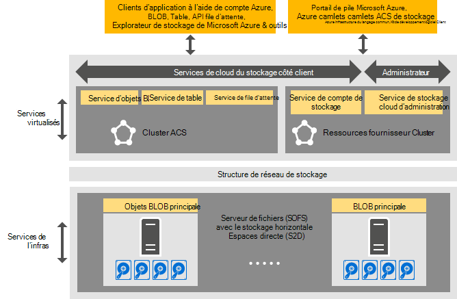

<properties
    pageTitle="Introduction au stockage Azure cohérentes | Microsoft Azure"
    description="En savoir plus sur le stockage Azure cohérente"
    services="azure-stack"
    documentationCenter=""
    authors="AniAnirudh"
    manager="darmour"
    editor=""/>

<tags
    ms.service="azure-stack"
    ms.workload="na"
    ms.tgt_pltfrm="na"
    ms.devlang="na"
    ms.topic="get-started-article"
    ms.date="09/26/2016"
    ms.author="anirudha"/>

# Introduction au stockage Azure cohérente
Stockage Azure cohérente est l’ensemble de stockage cloud services dans Microsoft Azure pile. Stockage Azure cohérentes fournit blob, table, file d’attente et de fonctionnalités de gestion de compte avec une sémantique Azure cohérente. Il fournit également des fonctionnalités pour aider à un administrateur de cloud de gérer les services de stockage. Cet article présente le stockage Azure cohérentes et explique comment les services en nuage stockage dans Azure pile probablement idéal pour compléter la puissantes [fonctionnalités de stockage défini par le logiciel dans Windows Server 2016](https://blogs.technet.microsoft.com/windowsserver/2016/04/14/ten-reasons-youll-love-windows-server-2016-5-software-defined-storage/).

Stockage Azure cohérentes offre plusieurs catégories de fonctionnalité :

- **Objets BLOB**: page objets BLOB, bloquer des objets BLOB et ajouter des objets BLOB avec   [blob Azure cohérente](https://msdn.microsoft.com/library/azure/dd179355.aspx#Anchor_1) 
   comportement

- **Tables**: entités, partitions et autres propriétés de table   [Azure cohérentes](https://msdn.microsoft.com/library/azure/dd179355.aspx#Anchor_3) table
   comportement

- **Files d’attente**: files d’attente avec   [Azure cohérentes file d’attente](https://msdn.microsoft.com/library/azure/dd179355.aspx#Anchor_2) et messages fiables et permanentes
   comportement

- **Comptes**: gestion des ressources stockage compte avec   [compte Azure cohérente](https://azure.microsoft.com/documentation/articles/storage-create-storage-account/) 
   comportement pour les comptes de stockage à usage général sa mise en service via le [modèle de déploiement d’Azure le Gestionnaire de ressources](https://azure.microsoft.com/documentation/articles/resource-manager-deployment-model/)

- **Administration**: gestion des services de stockage interne de stockage client NOT et Azure cohérente (mentionnés dans d’autres articles)

## Architecture de stockage Azure cohérente

Figure 1. Stockage Azure cohérentes : affichage de solutions

## Stockage Azure cohérentes virtualisé clusters et services

Dans l’architecture de stockage Azure cohérentes, tous les client ou les services de stockage accessible à l’administrateur sont virtualisés. Autrement dit, ils s’exécutent dans service hautement disponible, gérés par le fournisseur que machines virtuelles basées sur la fonctionnalité [Hyper-V](https://technet.microsoft.com/library/dn765471.aspx) dans [Windows Server 2016](http://www.microsoft.com/server-cloud/products/windows-server-2016/).
Bien que les ordinateurs virtuels sont hautement disponibles basés sur la technologie [Basculement Windows Server](https://technet.microsoft.com/library/dn765474.aspx) , les services de stockage virtualisé Azure cohérentes eux-mêmes sont services groupé invité, hautement disponibles basées sur la [technologie Azure Service TISSU](http://azure.microsoft.com/campaigns/service-fabric/).

Stockage Azure cohérente utilise deux groupes de tissu de Service dans un déploiement d’Azure pile.
Le service de fournisseur de ressources de stockage est déployé sur un cluster de Service tissu (« cluster RP ») qui est également partagé par d’autres services de fournisseur de ressources notions de base. Le reste du stockage virtualisé services Business data chemin d’accès, y compris les objets Blob, Table et file d’attente--services qui sont hébergés sur un deuxième cluster tissu de Service (« cluster stockage Azure cohérente »).

## Service BLOB et stockage défini par le logiciel

Le Blob service revenir terminer, quant à eux, s’exécute directement sur les nœuds du cluster [Serveur de fichiers horizontale](https://technet.microsoft.com/library/hh831349.aspx) . Dans l’architecture de solution pile Azure, serveur de fichiers horizontale est basé sur le [Stockage espaces Direct](https://technet.microsoft.com/library/mt126109.aspx)-cluster de basculement de base, sans partage. Figure 1 présente les services de composant stockage Azure cohérentes principales et son modèle de déploiement distribué. Comme vous le voir dans le diagramme, stockage Azure cohérentes participe avec les fonctions de stockage défini par le logiciel existantes dans Windows Server 2016. Aucun matériel spécial est requis pour le stockage Azure cohérentes au-delà de ces exigences de plateforme Windows Server.

## Ferme de stockage

Ferme de stockage est la collection de l’infrastructure de stockage, les ressources et services principaux qui offrent ensemble côté client et côté administrateur des services de stockage Azure cohérente dans un déploiement d’Azure pile. Plus précisément, ferme de stockage comprend les éléments suivants :

- Matériel de stockage (par exemple, nœuds de serveur de fichiers horizontale, disques)

- Ressources du tissu stockage (par exemple, partages de PME)

- Services de Service TISSU liés au stockage (par exemple, Blob point de terminaison service désactiver le cluster stockage Azure cohérente)

- Services liés au stockage qui s’exécutent sur des nœuds de serveur de fichiers horizontale (par exemple, le service Blob)

## Scénarios d’utilisation du stockage IaaS et PaaS

Objets BLOB page stockage Azure cohérentes, comme dans Azure, fournissent des disques virtuels dans toute infrastructure en tant qu’une activité de service (IaaS) scénarios :

- Créer une machine virtuelle en utilisant le disque du système d’exploitation personnalisé dans un blob de page

- Créer une machine virtuelle à l’aide de l’image du système d’exploitation personnalisée dans un blob de page

- Créer une machine virtuelle à l’aide d’une image Azure Marketplace dans un nouveau blob de page

- Créer une machine virtuelle à l’aide d’un disque vierge dans un nouveau blob de page

De même, pour plate-forme comme un scénario de service (PaaS), des objets BLOB Azure cohérente du bloc stockage, ajouter des objets BLOB, files d’attente, et les tableaux fonctionnent comme dans Azure.

## Rôles d’utilisateur

Stockage Azure cohérente est utile pour les deux rôles d’utilisateur :

- Propriétaires d’applications, y compris les développeurs et les grandes entreprises. Ils n’ont plus à mettre à jour ou déployer deux versions d’une application et les scripts qu’effectuer la même tâche dans un nuage public et un nuage/privé hébergé dans un centre de données. Stockage Azure cohérentes fournit des services de stockage via API REST, SDK, applet de commande et Azure pile portail.

- Fournisseurs de services, y compris informatiques, de l’entreprise qui déploiement et gérer les services en nuage stockage partagé, basée sur Microsoft Azure pile.

## Étapes suivantes

- [Stockage azure cohérentes : différences et considérations] (azure-pile-acs-différences-tp2.md)
