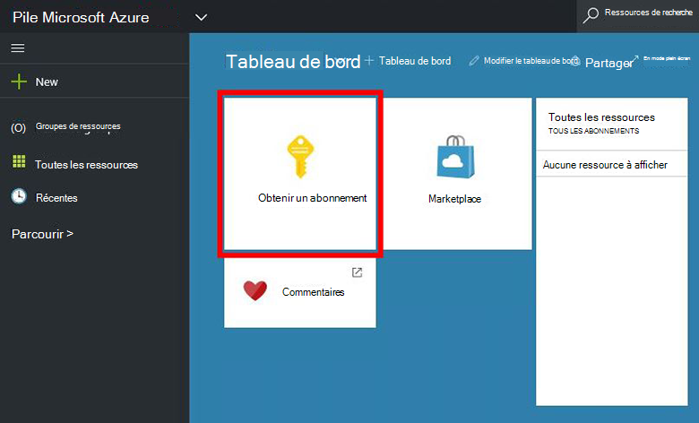
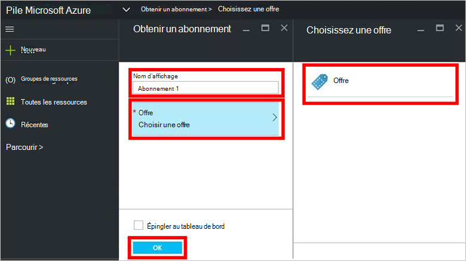
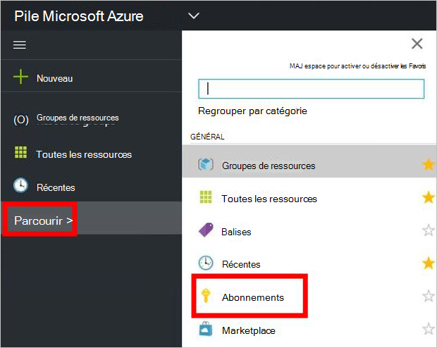

<properties
    pageTitle="S’abonner à une offre et puis fournir une machine virtuelle dans Azure pile (client) | Microsoft Azure"
    description="Comme un client, découvrez comment vous abonner à une offre et puis fournir une machine virtuelle dans Azure pile."
    services="azure-stack"
    documentationCenter=""
    authors="ErikjeMS"
    manager="byronr"
    editor=""/>

<tags
    ms.service="azure-stack"
    ms.workload="na"
    ms.tgt_pltfrm="na"
    ms.devlang="na"
    ms.topic="get-started-article"
    ms.date="09/26/2016"
    ms.author="erikje"/>

# S’abonner à une offre

À présent que vous avez [créé une offre](azure-stack-create-offer.md), testez que vos clients peuvent créer un abonnement.

1.  Sur l’ordinateur du contact pile Azure, connectez-vous à `https://portal.azurestack.local` comme [un client](azure-stack-connect-azure-stack.md#log-in-as-a-tenant) et cliquez sur **obtenir un abonnement**.

    

2.  Dans le champ **Nom complet** , tapez un nom pour votre abonnement et cliquez sur **proposer**, cliquez sur une des offres dans la carte de **Choisir une offre** , puis cliquez sur **créer**.

    

4.  Pour afficher l’abonnement que vous avez créé, cliquez sur **Parcourir**, cliquez sur **abonnements**, puis cliquez sur votre nouvel abonnement.  

    

Après que vous être inscrit à l’offre, actualisez le portail pour voir quels services sont partie du nouvel abonnement.

## Étapes suivantes

[Mise en service une machine virtuelle](azure-stack-provision-vm.md)
