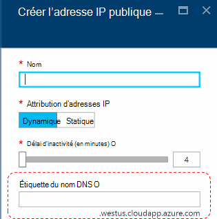
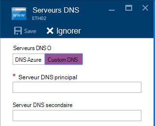
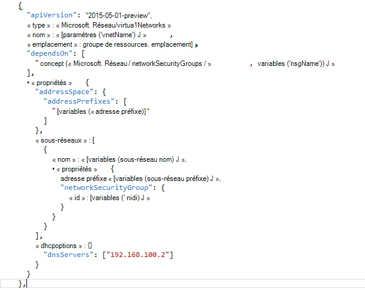

<properties
    pageTitle="Présentation de DNS dans la pile Azure TP2 | Microsoft Azure"
    description="Présentation des nouvelles fonctionnalités et fonctionnalités dans Azure pile TP2"
    services="azure-stack"
    documentationCenter=""
    authors="ScottNapolitan"
    manager="darmour"
    editor=""/>

<tags
    ms.service="azure-stack"
    ms.workload="na"
    ms.tgt_pltfrm="na"
    ms.devlang="na"
    ms.topic="get-started-article"
    ms.date="09/26/2016"
    ms.author="scottnap"/>

# Présentation des IDN pour pile d’Azure
================================

les IDN sont une nouveauté de technologie Preview 2 pour pile Azure qui permet de vous aider à résoudre les noms DNS externes (par exemple, http://www.bing.com).
Il vous permet également d’enregistrer des noms de réseau virtuel interne. En procédant ainsi, vous pouvez résoudre machines virtuelles sur le même réseau virtuel par nom plutôt que par adresse IP, sans avoir à fournir personnalisées entrées du serveur DNS.

Il est quelque chose qui a toujours été là dans Azure, mais il est désormais disponible dans Windows Server 2016 et Azure pile, trop.

Que faire les IDN ?
------------------

Avec les IDN dans une pile Azure, vous obtenez les fonctions suivantes, sans avoir à spécifier des entrées personnalisées du serveur DNS.

-   Partagé des services de résolution de noms DNS pour les charges de travail client.

-   Service DNS faisant autorité pour la résolution de noms et l’enregistrement DNS au sein du réseau virtuel client.

-   Service DNS récursives pour la résolution de noms Internet à partir d’ordinateurs virtuels client. Clients n’avez plus besoin spécifier des entrées DNS personnalisées pour résoudre les noms Internet (par exemple, www.bing.com).

Vous pouvez toujours mettre votre propre DNS et utiliser les serveurs DNS personnalisés si vous voulez. Mais à présent, si vous souhaitez simplement à être en mesure de résoudre DNS Internet noms et s’y connecter à d’autres machines virtuelles dans le même réseau virtuel, vous n’avez pas besoin de préciser et qu’il fonctionnera.

Ce que les IDN ne fait pas ?
---------------------

Quels les IDN n’autorise pas vous permettent d’effectuer consiste à créer un enregistrement DNS pour un nom qui peut être résolu à partir de l’extérieur du réseau virtuel.

Dans Azure, vous avez la possibilité de spécifier une étiquette de nom DNS qui peut être associée à une adresse IP publique. Vous pouvez choisir l’étiquette (préfixe), mais Azure choisit le suffixe, qui est basé sur la région dans lequel vous créez l’adresse IP.

Dans l’image ci-dessus, Azure créera un « A » enregistrement dans le système DNS pour l’étiquette de nom DNS spécifiée sous la zone **westus.cloudapp.azure.com**. Le préfixe et le suffixe dans l’ensemble composent un domaine nom complet (FQDN) qui peut être résolu à partir de n’importe où sur l’Internet public.

Dans le protocole TP2, pile Azure prend uniquement en charge les IDN pour l’enregistrement de nom interne, afin qu’il ne peut pas effectuer les opérations suivantes.

-   Créer un enregistrement DNS sous une zone DNS hébergé existante (par exemple, azurestack.local).

-   Créer une zone DNS (par exemple, Contoso.com).

-   Créer un enregistrement sous votre propre zone DNS personnalisée.

-   Prend en charge l’achat de noms de domaine.

Modifications dans le système DNS à partir d’Azure pile TP1
-----------------------------------

Dans la version Preview de technologie 1 (TP1) de pile Azure, que vous deviez fournir les serveurs DNS personnalisés si vous voulez être en mesure de résoudre des hôtes par nom plutôt que par adresse IP. Cela signifie que si vous avez créé un réseau virtuel ou une machine virtuelle, que vous deviez fournir au moins une entrée du serveur DNS. Pour l’environnement du contact TP1, cela signifie entrer l’adresse IP du serveur DNS de tissu du contact, à savoir 192.168.200.2.

Si vous avez créé une machine virtuelle via le portail, que vous deviez sélectionnez **Custom DNS** dans le réseau virtuel ou les paramètres de la carte ethernet.

Dans le protocole TP2, vous pouvez sélectionner DNS Azure et n’avez pas besoin spécifier les entrées du serveur DNS personnalisées.

Si vous avez créé une machine virtuelle via un modèle avec votre propre image, vous devez ajouter la propriété **DHCPOptions** et le serveur DNS afin d’obtenir le DNS nommez résolution fonctionne correctement. L’image suivante montre ce que cela était.

Dans le protocole TP2, vous n’avez plus besoin effectuer ces modifications à vos modèles machine virtuelle pour autoriser vos ordinateurs virtuels résoudre les noms Internet. Ils doivent collaborer uniquement.