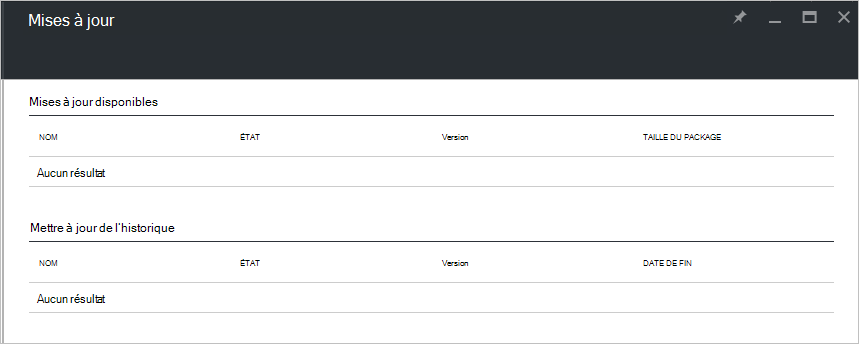

<properties
    pageTitle="Mises à jour dans la pile Azure | Microsoft Azure"
    description="En savoir plus sur les mises à jour dans la pile d’Azure"
    services="azure-stack"
    documentationCenter=""
    authors="HeathL17"
    manager="byronr"
    editor=""/>

<tags
    ms.service="azure-stack"
    ms.workload="na"
    ms.tgt_pltfrm="na"
    ms.devlang="na"
    ms.topic="article"
    ms.date="09/26/2016"
    ms.author="Helaw"/>

# Gestion des mises à jour dans la pile d’Azure
Technical Preview 2 présente un aperçu de l’expérience de gestion des mises à jour de la pile Azure.  Dans cette rubrique, vous devez accéder au nœud mises à jour.  

## Carte de mises à jour
1.  Pour accéder à la carte de mises à jour, cliquez sur **Parcourir** , puis sur **mises à jour**.

2.  Cliquez sur l’emplacement **local** .

3.  Vous consultez un écran répertoriant les mises à jour disponibles et mettre à jour de l’historique.  Dans Technical Preview 2, aucune mise à jour ne sera disponible pour l’installation.  

    

## Étapes suivantes
- [Comprendre l’Architecture de contact pile Azure](azure-stack-architecture.md)      
- [Comprendre les conditions préalables au déploiement](azure-stack-deploy.md)
- [Déploiement d’Azure pile](azure-stack-run-powershell-script.md)
 
    
  

  

