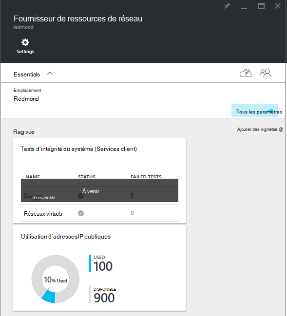
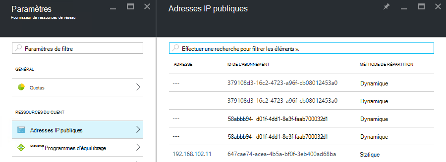

<properties
    pageTitle="Affichage de consommation d’adresse IP publique dans TP2 | Microsoft Azure"
    description="Les administrateurs peuvent visualiser la consommation d’adresses IP publiques dans une zone"
    services="azure-stack"
    documentationCenter=""
    authors="ScottNapolitan"
    manager="darmour"
    editor=""/>

<tags
    ms.service="azure-stack"
    ms.workload="na"
    ms.tgt_pltfrm="na"
    ms.devlang="na"
    ms.topic="get-started-article"
    ms.date="09/26/2016"
    ms.author="scottnap"/>

# Afficher la consommation adresse IP publique dans Azure pile TP2

En tant qu’un administrateur de service, vous pouvez afficher le nombre d’adresses IP publiques qui ont été affectés à des clients, le nombre d’adresses IP publiques qui sont toujours disponibles pour l’allocation et le pourcentage d’adresses IP publiques qui vous a été attribué à cet emplacement.

La vignette de **L’utilisation des adresses IP Public** affiche le nombre total d’adresses IP publiques qui ont été consommées sur tous les groupes d’adresses IP publics sur le tissu, si elles ont été utilisés pour client instances IaaS VM, services d’infrastructure tissu ou publics ressources d’adresses IP qui ont été explicitement créés par les clients.

L’objectif de cette vignette est pour donner aux administrateurs Azure pile une idée du nombre total d’adresses IP publiques qui ont été consommées à cet emplacement. Cela permet aux administrateurs de déterminer si elles sont exécutées faibles de cette ressource.

Dans la carte de **paramètres** , l’élément de menu **Des adresses IP publiques** sous **ressources client** répertorie uniquement ces adresses IP publiques qui ont été *explicitement créés par les clients*. Dès lors, le nombre d’adresses IP publiques sur l' **Utilisation d’adresse IP publique** vignette **utilisé (s)** est toujours différent de (supérieur à) le numéro sur la vignette **d’Adresses IP publiques** sous **ressources client**.

## Afficher les informations de l’utilisation d’adresse IP publique

Pour afficher le nombre total d’adresses IP publiques qui ont été utilisés dans la région :

1.  Dans le portail pile Azure, cliquez sur **Parcourir**et sélectionnez **Les fournisseurs de ressources**.

2.  Dans la liste des **Fournisseurs de ressources**, sélectionnez **Administrateur de fournisseur de ressources réseau**.

3.  Vous pouvez également cliquer sur **Parcourir | Emplacements** et sélectionnez l’emplacement où vous souhaitez afficher dans la liste. Puis, sur la vignette de **Fournisseurs de ressources** , sélectionnez **Administrateur de fournisseur de ressources réseau**.

4.  La carte de lancement de **Fournisseur de ressources réseau** affiche la vignette de **L’utilisation des adresses IP Public** dans la section **vue d’ensemble** .

N’oubliez pas que le nombre **utilisé (s)** représente le nombre d’adresses IP public adresses à partir de l’adresse IP publique toutes les adresses des pools à cet emplacement affectés. Le nombre **disponible** représente le nombre d’adresses IP public adresses à partir de l’adresse IP publique toutes les adresses des pools qui n’ont pas été affectées et sont toujours disponibles. Le nombre **% utilisé (s)** représente le nombre d’adresses utilisées ou affectées sous forme de pourcentage du nombre total d’IP public adresses dans l’adresse IP publique toutes les adresses des pools à cet emplacement.

## Afficher les adresses IP publiques qui ont été créés par les abonnements client

Pour afficher une liste d’adresses IP publiques qui ont été explicitement créés par les abonnements client d’une région spécifique, accédez à la carte de **paramètres** de l' **Administrateur de fournisseur de ressources de réseau**et sélectionnez **Les adresses IP publiques**.

Vous pouvez remarquer que certaines adresses IP publiques qui ont été attribuées dynamiquement apparaissent dans la liste mais ne disposent pas d’une adresse associée encore. C’est parce que la ressource d’adresse a été créée dans le fournisseur de ressources réseau, mais pas dans le contrôleur de réseau encore.

Contrôleur de réseau n’affecte pas une adresse à cette ressource jusqu'à ce qu’il est effectivement lié à une interface, une carte réseau (carte réseau), un équilibrage de charge ou une passerelle réseau virtuel. Lorsque l’adresse IP est lié à une interface, le contrôleur de réseau attribue une adresse IP, et il apparaît dans le champ **adresse** .

## Afficher la public d’informations récapitulative table des adresses IP

Il existe un nombre de différents cas dans lequel les adresses IP publiques sont affectées qui déterminent si l’adresse apparaît dans une liste ou d’une autre.

| **Casse d’affectation adresse IP publique** | **Apparaît dans le résumé d’utilisation** | **Apparaît dans la liste d’adresses IP public client** |
| ------------------------------------- | ----------------------------| ---------------------------------------------- |
| Adresse IP public dynamique non encore affectée à un équilibrage de charge ou de carte réseau (temporaire) | N° | Oui |
| Adresse IP public et dynamique affectée à un équilibrage de charge ou de carte réseau. | Oui | Oui |
| Adresse IP public et statique affectée à un équilibrage de charge ou de carte réseau client. | Oui | Oui |
| Adresse IP public et statique affectée à un point de terminaison du service infrastructure tissu. | Oui | N° |
| Adresse IP publique créée instances IaaS VM implicitement et utilisée pour NAT sortant sur le réseau virtuel. Ceux-ci sont créés en coulisses chaque fois qu’un client crée une instance de machine virtuelle afin que les ordinateurs virtuels peuvent envoyer des informations sur Internet. | Oui | N° |
