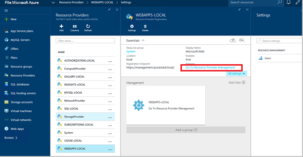
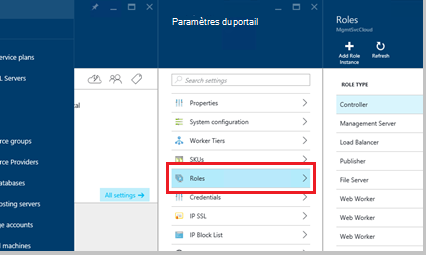
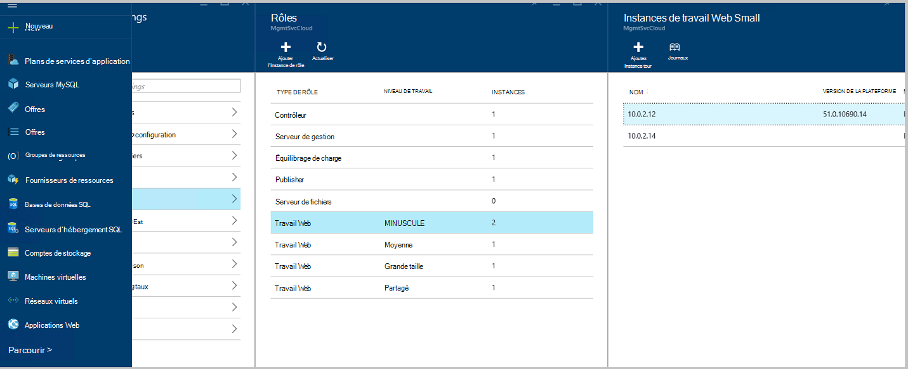
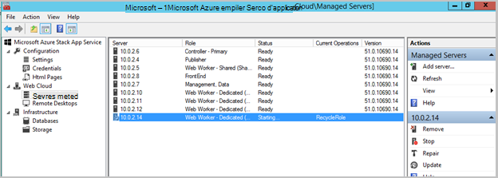
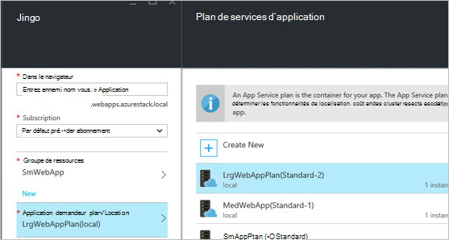
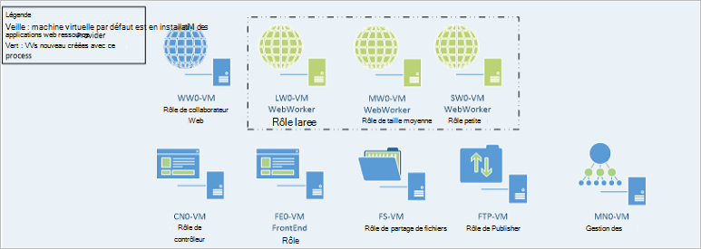

<properties
    pageTitle="Applications Web ajouter d’autres Web collaborateur rôles | Microsoft Azure"
    description="Instructions détaillées pour suivre l’évolution Azure pile Web App"
    services="azure-stack"
    documentationCenter=""
    authors="kathm"
    manager="slinehan"
    editor=""/>

<tags
    ms.service="azure-stack"
    ms.workload="app-service"
    ms.tgt_pltfrm="na"
    ms.devlang="na"
    ms.topic="article"
    ms.date="09/26/2016"
    ms.author="kathm"/>

#   <a name="web-apps-adding-more-web-worker-roles"></a>Applications Web : Ajout de plusieurs rôles de travail web

> [AZURE.NOTE] Les informations suivantes s’applique uniquement aux déploiements Azure pile TP1.

Ce document fournit des instructions sur la mise à l’échelle des rôles de travail web Web Apps. Il contient des étapes de création des rôles de travail web supplémentaires pour prendre en charge les offres d’applications web de toute taille.

Pile Azure prend en charge les déploiements d’application web gratuites et partagé. Pour ajouter d’autres types, vous devez ajouter d’autres rôles de travail web.

Si vous n’êtes pas sûr de ce qui a été déployé avec l’installation d’applications Web par défaut, vous pouvez consulter des informations supplémentaires [ici](azure-stack-webapps-overview.md).

Les étapes suivantes sont requises pour les rôles de travail web échelle :

1.  [Créer une nouvelle machine virtuelle](#step-1-create-a-new-vm-to-support-the-new-instance-size)

2.  [Configurer la machine virtuelle](#step-2-configure-the-virtual-machine)

3.  [Configurer le rôle de collaborateur web dans le portail Azure pile](#step-3-configure-the-web-worker-role-in-the-azure-stack-portal)

4.  [Configurer les offres de service d’application](#step-4-configure-app-service-plans)

##<a name="step-1-create-a-new-vm-to-support-the-new-instance-size"></a>Étape 1 : Créer un nouvel ordinateur virtuel pour prendre en charge la nouvelle taille de l’instance

Créer une machine virtuelle comme décrit dans [cet article](azure-stack-provision-vm.md), garantissant que les sélections suivantes sont effectuées :

 - Nom d’utilisateur et mot de passe : fournir les mêmes nom d’utilisateur et mot de passe fourni lorsque vous avez installé les applications Web.

 - Abonnement : Utilisez l’abonnement de fournisseur par défaut.

 - Groupe de ressources : choisissez **AppService Local**.

> [AZURE.NOTE]Stocker les ordinateurs virtuels pour les rôles de travail dans le même groupe de ressources que les applications Web application est déployée sur. (Cela est recommandé pour cette version.)

##<a name="step-2-configure-the-virtual-machine"></a>Étape 2 : Configurer la Machine virtuelle

Une fois le déploiement terminé, la configuration suivante est nécessaire pour prendre en charge le rôle de collaborateur web :

1.  Ouvrir le Gestionnaire de serveur sur l’ordinateur hôte, puis cliquez sur **Outils** &gt; **Manager HyperV**.

2.  Se connecter à l’aide du protocole RDP (Remote Desktop) pour le nouvel ordinateur virtuel que vous avez créé à l’étape 1. Le nom du serveur se trouve dans le volet Résumé lorsque chaque machine virtuelle est sélectionnée.

3.  Ouvrez la session PowerShell en cliquant sur le bouton **Démarrer** et en tapant PowerShell. Avec le bouton droit **PowerShell.exe**, puis sélectionnez **Exécuter en tant qu’administrateur** pour ouvrir PowerShell en mode administrateur.

4.  Copiez-collez chaque des commandes suivantes (une à la fois) dans la fenêtre PowerShell, puis appuyez sur entrer :

    ```netsh advfirewall firewall set rule group="File and Printer Sharing" new enable=Yes```
    ```netsh advfirewall firewall set rule group="Windows Management Instrumentation (WMI)" new enable=yes```
    ```reg add HKLM\\SOFTWARE\\Microsoft\\Windows\\CurrentVersion\\Policies\\system /v LocalAccountTokenFilterPolicy /t REG\_DWORD /d 1 /f```

5.  Redémarrez l’ordinateur virtuel.

> [AZURE.NOTE]Remarque : Il s’agit des configuration minimale requise pour les applications Web. Ils sont les paramètres par défaut de l’image Windows 2012 R2 inclus avec Azure pile. Les instructions ont été fournies pour référence future et aux personnes qui utilisent une autre image.

##<a name="step-3-configure-the-web-worker-role-in-the-azure-stack-portal"></a>Étape 3 : Configurer le rôle de collaborateur web dans le portail Azure pile

1.  Ouvrez le portail en tant que l’administrateur du service sur **ClientVM**.

2.  Accédez à des **fournisseurs de ressources** &gt; **WEBAPP LOCAL**.

    
 
3.  Cliquez sur **Atteindre la gestion des ressources de fournisseur**.

4.  Cliquez sur **les rôles**.

    
 
5.  Cliquez sur **Ajouter une Instance de rôle**.

6.  Cliquez sur la **couche** que vous voulez déployer la nouvelle instance (petite, moyenne ou grande ou partagé).

    
 
7.  Configurer les éléments suivants :
 - Nom du serveur : Indiquez l’adresse IP du serveur que vous avez créé précédemment (dans la section 1).
 - Type de rôle : Web collaborateur.
 - Niveau de travail : Correspondances hiérarchiser taille sélectionnée.

8. Cliquez sur **OK.**

9. Se connecter à la machine virtuelle CN0, puis ouvrez la **Console MMC Management Web Cloud**.

10. Naviguez jusqu’au **nuage Web** &gt; **serveurs gérés**.

11. Cliquez sur le nom du serveur que vous venez de déployer. Examinez la colonne État, puis patienter avant d’atteindre l’étape suivante jusqu'à ce que l’état est « Prêt ».

    

##<a name="step-4-configure-app-service-plans"></a>Étape 4 : Configurer les offres de service d’application

> [AZURE.NOTE]Dans la version actuelle des applications Web, les offres de service d’application doivent être stockés dans des groupes de ressources distincts. Créer un groupe de ressources pour chaque taille de web app, puis placez les offres d’application dans leurs groupes ressource appropriée.

1.  Connectez-vous au portail sur la ClientVM.

2.  Naviguez jusqu’au **Nouveau** &gt; **Web et Mobile**.

3.  Sélectionnez l’application web que vous voulez déployer.

4.  Fournir des informations sur l’application web, puis sélectionnez **AppService Plan / emplacement**.

-   Cliquez sur **Créer nouveau**.

-   Créer votre nouvelle offre, sélectionnez le niveau de tarification correspondant pour le plan.

> [AZURE.NOTE]Vous pouvez créer plusieurs offres sur cette carte. Avant de déployer, cependant, vérifiez que vous avez sélectionné le plan approprié.

La figure suivante montre un exemple des plusieurs offres disponibles :    

##<a name="final-web-app-service-vm-configuration"></a>Configuration de machine virtuelle finale du service Web App

L’image ci-dessous fournit une vue de l’environnement une fois que vous avez mise à l’échelle les rôles de travail web. Les éléments verts représentent les nouveautés de rôle.
    
