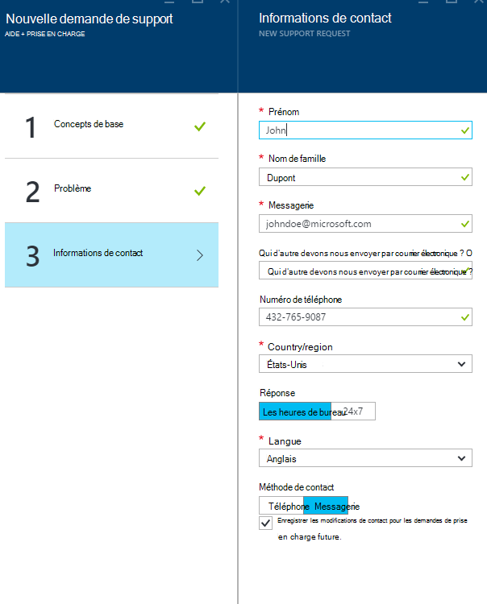

<properties
     pageTitle="Comment créer une demande de support Azure | Microsoft Azure"
     description="Comment créer une demande de support Azure."
     services="Azure Supportability"
     documentationCenter=""
     authors="ganganarayanan"
     manager="scotthit"
     editor=""/>

<tags
     ms.service="azure-supportability"
     ms.workload="na"
     ms.tgt_pltfrm="na"
     ms.devlang="na"
     ms.topic="article"
     ms.date="10/25/2016"
     ms.author="gangan"/>

# Comment créer une demande de support Azure

## Résumé
Clients Azure peuvent créer et gérer les demandes de prise en charge dans le portail Azure, [https://portal.azure.com](https://portal.azure.com).
>[AZURE.NOTE] Le portail Azure pour l’Allemagne est [https://portal.microsoftazure.de](https://portal.microsoftazure.de) ni portail pour le gouvernement Azure [https://portal.azure.us](https://portal.azure.us).

Selon les commentaires des clients, nous avons mis à jour l’expérience de demande de support pour se concentrer sur trois objectifs principaux :

- **Et rationalisée**: réduire les clics et cartes pour simplifier le processus de soumission d’une demande de support.
- **Intégré**: lorsque vous êtes à résoudre un problème avec une ressource d’Azure, il doit être facile à ouvrir une demande de support pour cette ressource sans changer de contexte.
- **Efficaces**: collecter les informations clées votre technicien devrez efficacement de résoudre le problème.

## Prise en main
Vous pouvez créer une demande de support à partir du menu de navigation supérieure ou directement à partir d’une carte de ressources.

**Dans la barre de navigation supérieure**

**À partir d’une carte de ressources**

## Concepts de base
La première étape du processus de demande de support recueille des informations de base sur votre problème et votre plan de prise en charge.

Prenons un exemple : vous êtes en difficulté technique avec votre machine virtuelle et pensez un problème de connectivité réseau.
Sélection du service (« Machine virtuelle exécutant Windows ») et la ressource (le nom de votre machine virtuelle) dans la première étape de l’Assistant démarre le processus d’accès à l’aide pour ce problème.

>[AZURE.NOTE] Azure prend en charge illimité gestion des abonnements (des éléments tels que la facturation, les ajustements de quota et les transferts de comptes). Pour le support technique, vous avez besoin d’un plan de prise en charge. [En savoir plus sur les offres de prise en charge](https://azure.microsoft.com/support/plans).

## Problème
La deuxième étape de l’Assistant recueille des informations supplémentaires sur le problème. Fournir des détails précis dans cette étape permet pour acheminer votre cas au technicien meilleures pour le problème et commencer diagnostiquer le problème dès que possible.

Poursuivre l’exemple de connectivité machine virtuelle ci-dessus, vous souhaitez remplir ce formulaire pour indiquer un problème de connectivité réseau et vous devez fournir plus de détails sur le problème, notamment le temps approximatif lorsque vous avez rencontré le problème.

## Aide connexe
Pour certains problèmes, nous fournissons des liens connexes aide pour résoudre le problème. Si les documents recommandés n’aident à pas, vous pouvez continuer à travers le processus pour créer une demande de support.

## Informations de contact
La dernière étape de l’Assistant confirme vos informations de contact pour savoir comment vous contacter.

Selon la gravité du problème, vous devrez peut-être indiquer si vous souhaitez que vous contacter pendant les heures de bureau ou si vous préférez une réponse 24 x 7, ce qui signifie que nous pouvons vous contacter à tout moment.

## Gérer les demandes de prise en charge
Après avoir créé la demande de support, vous pouvez afficher les détails de la page **Gérer les demandes de prise en charge** .

**Dans la barre de navigation supérieure**

Dans la page **Gérer les demandes d’assistance** , vous pouvez afficher toutes les demandes de prise en charge et leur statut.

Sélectionnez la demande de support pour afficher les détails, y compris la gravité et la durée prévue qu’il faudra pour un technicien pour répondre.

Si vous souhaitez modifier la gravité de la requête, cliquez sur la vignette de **l’impact sur l’entreprise** . Dans l’exemple précédent, la demande est actuellement définie sur gravité C.

En cliquant sur la vignette affiche la liste des niveaux de gravité que vous pouvez affecter à une demande de prise en charge ouverte.

>[AZURE.NOTE] Le niveau de gravité maximale dépend de votre plan de prise en charge. [En savoir plus sur les offres de prise en charge](https://azure.microsoft.com/support/plans).

## Commentaires
Nous sont toujours ouverts aux commentaires et suggestions ! Envoyez-nous vos [suggestions](https://feedback.azure.com/forums/266794-support-feedback). En outre, vous pouvez commencer avec contactez-nous via [Twitter](https://twitter.com/azuresupport) ou les [forums MSDN](https://social.msdn.microsoft.com/Forums/azure).

## Pour en savoir plus
[Forum aux questions de prise en charge Azure](https://azure.microsoft.com/support/faq)
