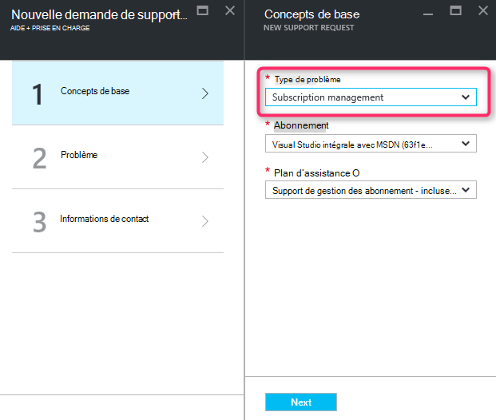
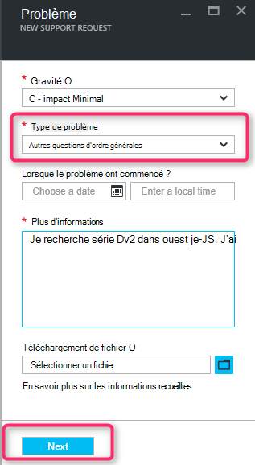
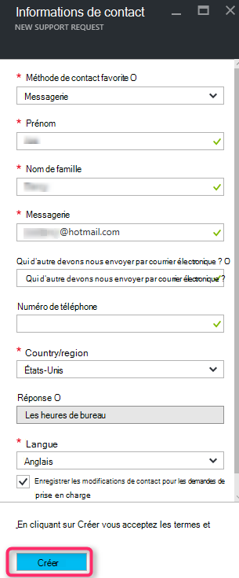

<properties
     pageTitle="Série de référence (SKU) indisponible | Microsoft Azure"
     description="Certaines séries de référence (SKU) ne sont pas disponibles pour l’abonnement sélectionné pour cette zone."
     services="Azure Supportability"
     documentationCenter=""
     authors="ganganarayanan"
     manager="scotthit"
     editor=""/>

<tags
     ms.service="azure-supportability"
     ms.workload="na"
     ms.tgt_pltfrm="na"
     ms.devlang="na"
     ms.topic="article"
     ms.date="08/12/2016"
     ms.author="gangan"/>

# Série de référence (SKU) non disponible

Dans certaines zones, certaines références SKU n’est pas automatiquement disponibles dans les nouveaux abonnements.  Cela peut se produire lorsque [plus puissante références SKU y est inclus dans une région](https://azure.microsoft.com/updates/announcing-new-dv2-series-virtual-machine-size/) et la popularité de l’héritage refuse de référence (SKU).
Le message «*série de référence (SKU) certains ne est pas disponibles pour l’abonnement sélectionné pour cette zone*» s’affiche lorsque vous créez une demande de support pour augmenter le quota de principal des feuilles de calcul.

Vous pouvez consulter la disponibilité de référence (SKU) dans la page [services Azure par région](https://azure.microsoft.com/regions/#services) . 

Pour demander l’accès à une référence SKU qui a été restreint de votre abonnement, créer une demande de support « Gestion des abonnements ».

- Dans la page concepts de base, sélectionnez type de problème en tant que « Gestion des abonnements » et cliquez sur « Suivant ».

- Dans la page problème, sélectionnez le type de problème en tant que « Autres questions d’ordre générales », entrez la région exacte et vous ne voyez pas de référence (SKU).
Cela permet d’accélérer le processus de prise en charge.

- Dans la page informations de Contact, entrez vos informations de contact, puis cliquez sur « Créer ».

## Commentaires
Nous sont toujours ouverts aux commentaires et suggestions ! Envoyez-nous vos [suggestions](https://feedback.azure.com/forums/266794-support-feedback). En outre, vous pouvez commencer avec contactez-nous via [Twitter](https://twitter.com/azuresupport) ou les [forums MSDN](https://social.msdn.microsoft.com/Forums/azure).

## Pour en savoir plus
[Forum aux questions de prise en charge Azure](https://azure.microsoft.com/support/faq)
