<properties
    pageTitle="Récupérer les données d’un autre serveur DPM dans l’archivage sécurisé sauvegarde | Microsoft Azure"
    description="Récupérer les données que vous avez protégé pour un archivage sécurisé sauvegarde Azure à partir de n’importe quel serveur DPM enregistré pour que l’archivage sécurisé."
    services="backup"
    documentationCenter=""
    authors="nkolli1"
    manager="shreeshd"
    editor=""/>

<tags
    ms.service="backup"
    ms.workload="storage-backup-recovery"
    ms.tgt_pltfrm="na"
    ms.devlang="na"
    ms.topic="article"
    ms.date="08/08/2016"
    ms.author="giridham;jimpark;trinadhk;markgal"/>

# Récupérer les données d’un autre serveur DPM dans l’archivage sécurisé sauvegarde
Vous pouvez maintenant récupérer les données que vous avez protégé pour un archivage sécurisé sauvegarde Azure à partir de n’importe quel serveur DPM enregistré pour que l’archivage sécurisé. Le processus pour ce faire est totalement intégré à la console de gestion DPM donc et revient à d’autres flux de travail récupération.

Pour récupérer les données d’un autre serveur DPM dans l’archivage sécurisé sauvegarde, vous devez [System Center Data Protection Manager Exclusion UR7](https://support.microsoft.com/en-us/kb/3065246) et l' [agent de sauvegarde Azure dernière](http://aka.ms/azurebackup_agent).

## Récupérer les données d’un autre serveur DPM
Pour récupérer les données d’un autre serveur DPM :

1. Sous l’onglet **récupération** de la console d’administration DPM, cliquez sur **« Ajouter externes DPM »** (en haut à gauche de l’écran).

    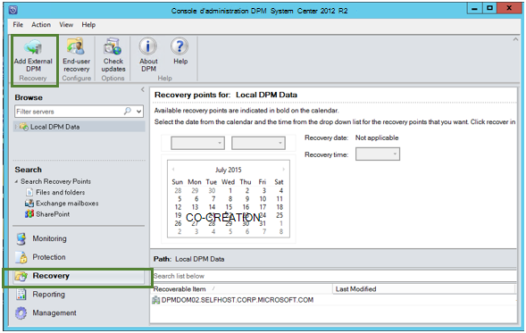

2. Télécharger les nouvelles **informations d’identification de l’archivage sécurisé** de l’archivage sécurisé associé au **serveur DPM** dans lequel les données sont en cours de restauration, cliquez sur le serveur DPM dans la liste des serveurs DPM inscrites auprès du archivage sécurisé sauvegarde et fournir le **mot de passe de chiffrement** associé au serveur DPM dont les données sont restaurées.

    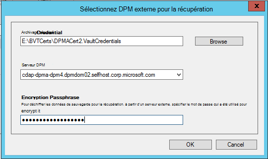

    >[AZURE.NOTE] Uniquement les serveurs DPM associées à l’archivage sécurisé d’inscription même pouvant récupérer les données de l’autre.

    Une fois que le serveur DPM externe est ajouté avec succès, vous pouvez parcourir les données du serveur DPM externe et serveur DPM local à partir de l’onglet **récupération** .

3. Parcourir la liste des serveurs de production protégé par le serveur DPM externes disponibles et sélectionnez la source de données appropriées.

    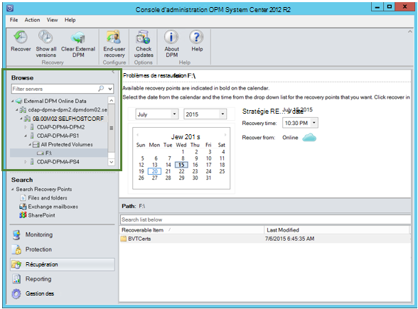

4. Sélectionner **le mois et l’année** à partir des **points de récupération** de liste déroulante, sélectionnez la **date de récupération** requis pour lorsque le point de récupération a été créé, puis sélectionnez le **temps de récupération**.

    Une liste de fichiers et dossiers s’affichent dans le volet inférieur qui peut être parcouru et restauré vers n’importe quel endroit.

    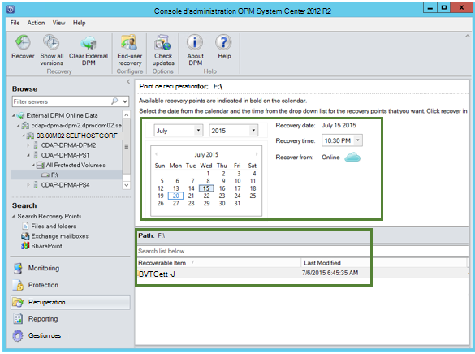

5. Cliquez avec le bouton droit sur l’élément approprié, puis cliquez sur **récupérer**.

    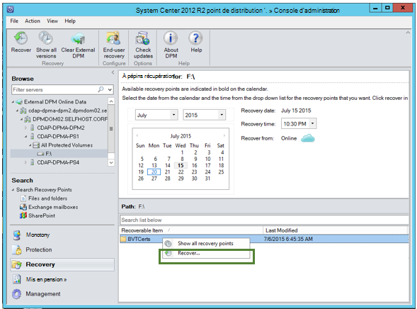

6. Passez en revue le **récupérer la sélection**. Vérifiez les données et heure de la copie de sauvegarde à restaurer, ainsi que la source à partir duquel la copie de sauvegarde a été créée. Si la sélection est incorrecte, cliquez sur **Annuler** pour revenir à l’onglet récupération pour sélectionner le point de récupération appropriée. Si la sélection est correcte, cliquez sur **suivant**.

    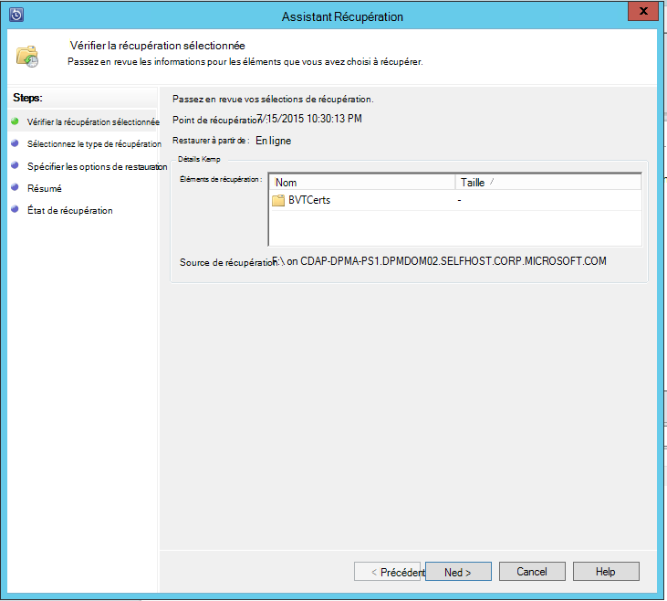

7. Sélectionnez **récupérer vers un autre emplacement**. **Accédez** à l’emplacement correct pour la récupération.

    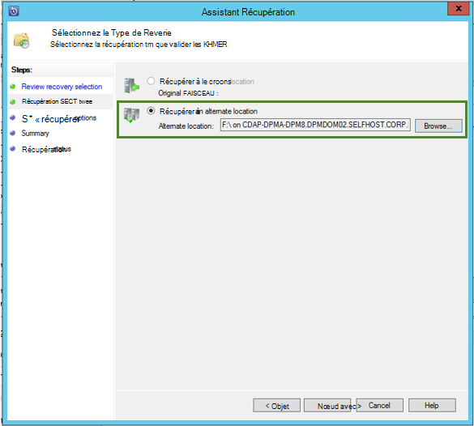

8. Choisissez l’option liée à **créer une copie**, **Ignorer**ou **Remplacer**.
    - **Créer une copie** crée une copie du fichier dans le cas il y a un conflit de nom.
    - **Ignorer** ignore récupérer le fichier dans le cas il y a un conflit de nom.
    - **Remplacer** remplace la copie existante à l’emplacement spécifié dans le cas d’un conflit de nom.

    Sélectionnez l’option appropriée pour **restaurer la sécurité**. Vous pouvez appliquer les paramètres de sécurité de l’ordinateur de destination dans laquelle les données sont en cours de restauration ou les paramètres de sécurité qui étaient applicables au produit à la fois que le point de récupération a été créé.

    Déterminer si une **Notification** est envoyée une fois la restauration terminée avec succès.

    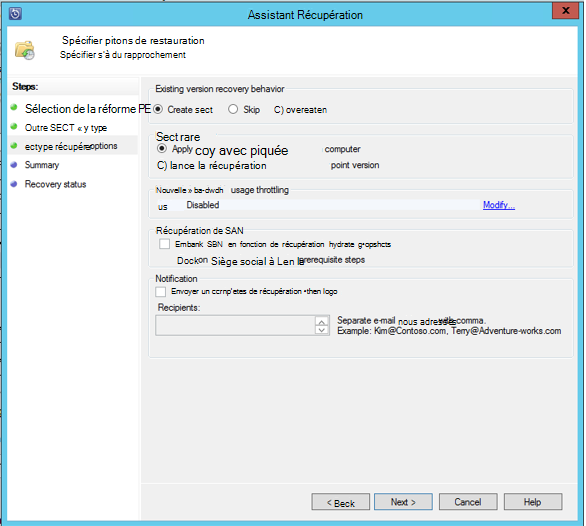

9. L’écran **Résumé** répertorie les options choisies jusqu'à présent. Une fois que vous cliquez sur **« Restaurer »**, les données seront récupérées à l’emplacement approprié en local.

    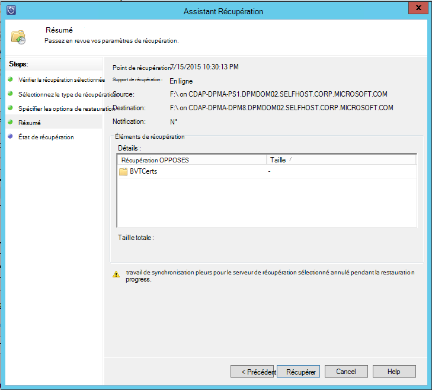

    >[AZURE.NOTE] La tâche de récupération peut être contrôlée dans l’onglet **analyse** du serveur DPM.

    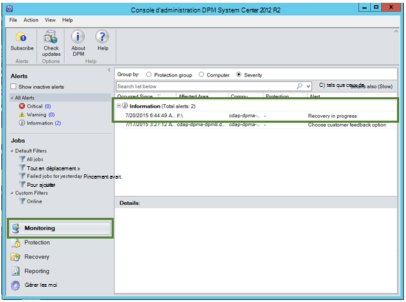

10. Vous pouvez cliquer sur **Effacer DPM externes** sous l’onglet **récupération** du serveur DPM pour supprimer l’affichage du serveur DPM externe.

    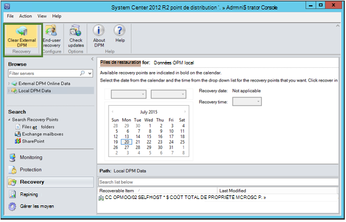

## Résolution des Messages d’erreur
|Non. |  Message d’erreur | Étapes de dépannage |
| :-------------: |:-------------| :-----|
|1.|        Ce serveur n’est pas enregistré dans l’archivage sécurisé spécifié par les informations d’identification de l’archivage sécurisé.|  **Cause :** Cette erreur s’affiche lorsque le fichier d’informations d’identification de l’archivage sécurisé sélectionné n’appartient pas à l’archivage sécurisé sauvegarde associé au serveur DPM sur lequel la récupération est lancée.   **Résolution :** Téléchargez le fichier d’informations d’identification de l’archivage sécurisé à partir de l’archivage sécurisé sauvegarde dans lequel le serveur DPM est inscrite.|
|2.|        Les données récupérables ne seront pas disponibles ou le serveur sélectionné n’est pas un serveur DPM.|   **Cause :** Il existe qu'aucun autre serveur DPM avec DPM 2012 R2 Exclusion UR7 n’inscrit à l’archivage sécurisé sauvegarde, ou les serveurs DPM avec DPM 2012 R2 Exclusion UR7 n’ont pas encore téléchargés les métadonnées, ou le serveur sélectionné n’est pas serveur DPM (également appelé Windows Server ou Client Windows).   **Résolution :** S’il existe d’autres serveurs DPM enregistrés à l’archivage sécurisé sauvegarde, vérifiez SCDPM 2012 R2 Exclusion UR7 et dernière sauvegarde Azure agent sont installés.  S’il existe d’autres serveurs DPM enregistrés à l’archivage sécurisé sauvegarde avec DPM 2012 R2 Exclusion UR7, attendez un jour après l’installation d’exclusion UR7 pour démarrer le processus de récupération. La nuit pour télécharger les métadonnées pour toutes les sauvegardes précédemment protégées vers le cloud. Les données seront disponibles pour la récupération.|
|3.|        Aucun autre serveur DPM n’est inscrit à cet archivage sécurisé.|   **Cause :** Il n’existe aucun autre DPM serveur avec DPM 2012 R2 Exclusion UR7 ou version ultérieure qui est enregistrés à l’archivage sécurisé à partir de laquelle la récupération est effectuée. **Résolution :** S’il existe d’autres serveurs DPM enregistrés à l’archivage sécurisé sauvegarde, vérifiez SCDPM 2012 R2 Exclusion UR7 et dernière sauvegarde Azure agent sont installés. S’il existe d’autres serveurs DPM enregistrés à l’archivage sécurisé sauvegarde avec DPM 2012 R2 Exclusion UR7, attendez un jour après l’installation d’exclusion UR7 pour démarrer le processus de récupération. La nuit pour télécharger les métadonnées pour toutes les sauvegardes précédemment protégées vers le cloud. Les données seront disponibles pour la récupération.|
|4.|        Le mot de passe de chiffrement fournie ne correspondre pas au mot de passe associé au serveur suivant :**<server name>**|  **Cause :** Le mot de passe de chiffrement utilisée dans le processus le chiffrement des données à partir de données du serveur DPM sont en cours de restauration ne correspond pas le mot de passe de chiffrement fourni. L’agent ne peut pas déchiffrer les données. Par conséquent, la restauration échoue. **Résolution :** Veuillez indiquer l’exacte même chiffrement mot de passe associé au serveur DPM dont les données sont restaurées.|

## Forum aux questions :
1. **Pourquoi ne puis-je pas ajouter un serveur DPM externe à partir d’un autre serveur DPM après l’installation Exclusion UR7 et dernière agent de sauvegarde Azure ?**

    A) pour les serveurs DPM existants des sources de données qui sont protégés dans le cloud (en utilisant une mise à jour cumulative antérieure à mettre à jour cumulative 7), vous devez attendre au moins un jour après l’installation Exclusion UR7 et dernière agent de sauvegarde Azure pour commencer à *Ajouter externes DPM server*. Cela est nécessaire pour télécharger les métadonnées des groupes de protection DPM sur Azure. Cela se produit la première fois par le biais nuit.

2. **Quelle est la version minimale de l’agent de sauvegarde Azure nécessité ?**

    A) la version minimale de l’agent de sauvegarde Azure pour activer cette fonctionnalité est 2.0.8719.0.  Version de l’agent de sauvegarde Azure peut être vérifiée en accédant au panneau de configuration **>** tous les éléments **>** programmes et fonctionnalités **>** Agent de Services Microsoft Azure récupération. Si la version est inférieure à 2.0.8719.0, téléchargez [dernière sauvegarde Azure agent](https://go.microsoft.com/fwLink/?LinkID=288905) et installez.

    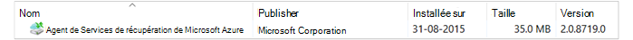

## Étapes suivantes :
• [Forum aux questions sur sauvegarde azure](backup-azure-backup-faq.md)
