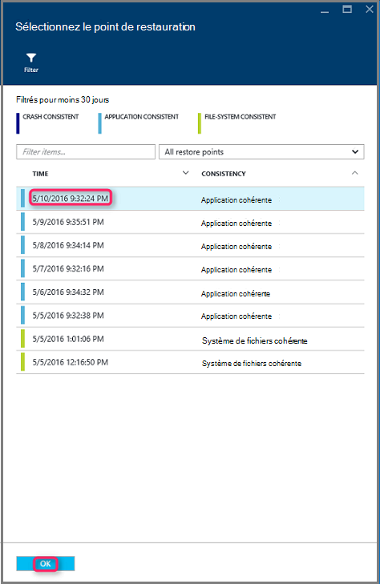

<properties
    pageTitle="Restaurer des machines virtuelles à partir de sauvegarde à l’aide du portail Azure | Microsoft Azure"
    description="Restaurer une machine virtuelle Azure à partir d’un point de récupération à l’aide du portail Azure"
    services="backup"
    documentationCenter=""
    authors="markgalioto"
    manager="cfreeman"
    editor=""
    keywords="restaurer la sauvegarde ; Comment restaurer ; point de récupération ;"/>

<tags
    ms.service="backup"
    ms.workload="storage-backup-recovery"
    ms.tgt_pltfrm="na"
    ms.devlang="na"
    ms.topic="article"
    ms.date="08/10/2016"
    ms.author="trinadhk; jimpark;"/>

# Portail Azure permet de restaurer des machines virtuelles

> [AZURE.SELECTOR]
- [Restaurer des machines virtuelles dans le portail classique](backup-azure-restore-vms.md)
- [Restaurer des machines virtuelles dans le portail Azure](backup-azure-arm-restore-vms.md)

Protéger vos données en prenant des instantanés de vos données à intervalles définis. Ces instantanés sont appelées des points de récupération, et ils sont stockés dans chambres fortes de services de récupération. Si ou lorsqu’il est nécessaire réparer ou régénérer une machine virtuelle, vous pouvez restaurer la machine virtuelle à partir d’un des points de récupération enregistré. Lorsque vous restaurez un point de récupération, vous revenez ou rétablissez la machine virtuelle à l’état lorsque le point de récupération a été pris. Cet article explique comment restaurer une machine virtuelle.

> [AZURE.NOTE] Azure comporte deux modèles de déploiement pour la création et utilisation des ressources : [Gestionnaire de ressources et classique](../resource-manager-deployment-model.md). Cet article fournit les informations et procédures pour la restauration des machines virtuelles déployées à l’aide du modèle de gestionnaire de ressources.

## Restaurer un point de récupération

1. Connectez-vous au [portail Azure](http://portal.azure.com/)

2. Dans le menu Azure, cliquez sur **Parcourir** , dans la liste des services, tapez **Les Services de récupération**. La liste des services s’adapte à ce que vous tapez. Lorsque vous voyez **les Services de récupération chambres fortes**, sélectionnez-le.

    

    La liste des chambres fortes dans l’abonnement s’affiche.

    

3. Dans la liste, sélectionnez l’archivage sécurisé associée à la machine virtuelle que vous souhaitez restaurer. Lorsque vous cliquez sur l’archivage sécurisé, son tableau de bord s’ouvre.

    

4. Maintenant que vous êtes dans le tableau de bord de l’archivage sécurisé. Dans les **Éléments de sauvegarde** vignette, puis sur **Machines virtuelles Azure** pour afficher les ordinateurs virtuels associées à l’archivage sécurisé.

    

    La carte de **Sauvegarde éléments** s’ouvre et affiche la liste des machines virtuelles Azure.

    

5. Dans la liste, sélectionnez une machine virtuelle pour ouvrir le tableau de bord. Le tableau de bord machine virtuelle s’ouvre à la zone analyse, qui contient la vignette de points de restauration.

    

6. Dans le menu Tableau de bord de la machine virtuelle, cliquez sur **restaurer**

    

    La carte de restauration s’ouvre.

    

7. Dans la carte **restaurer** , cliquez sur le **point de restauration** pour ouvrir la carte **point sélectionnez Restaurer** .

    

    Par défaut, la boîte de dialogue affiche tous les points de restauration d’au cours des 30 derniers jours. Utilisez le **filtre** pour modifier la plage horaire des points de restauration affichée. Par défaut, les points de restauration de cohérence tous les sont affichent. Modifier le filtre de **restaurer tous les points** pour sélectionner une cohérence spécifique de points de restauration. Pour plus d’informations sur chaque type de restauration, consultez la description de [la cohérence des données](./backup-azure-vms-introduction.md#data-consistency).  
    - Cliquez sur **restaurer point de cohérence** de cette liste :
        - Bloquer les points de restauration cohérentes,
        - Points de cohérence de restauration d’application,
        - Points de cohérence de restauration du système de fichiers
        - Tous les points de restauration.  

8. Choisissez un point de restauration, puis cliquez sur **OK**.

    

    La carte **restaurer** indique le point de restauration est défini.

    

9. Sur la carte **restaurer** , **restaurer la configuration** s’ouvre automatiquement à la valeur de point de restauration.

    

## Choix d’une configuration restaurer machine virtuelle

À présent que vous avez sélectionné le point de restauration, sélectionnez une configuration pour votre machine virtuelle restaurer. Les choix disponibles pour la configuration de la machine virtuelle restaurée sont à utiliser : portail Azure ou PowerShell.

> [AZURE.NOTE] Portail fournit une option de création rapide pour machine virtuelle restauré. Si vous souhaitez personnaliser la configuration de la machine virtuelle de la machine virtuelle restaurée tel qu’il sera, utiliser PowerShell pour restaurer des disques sauvegardées et associez-les à choix de la configuration de la machine virtuelle. Consultez [une machine virtuelle avec configurations réseau spécial en cours de restauration](#restoring-vms-with-special-network-configurations).

1. Si vous n’êtes pas déjà, accédez à la carte **restaurer** . Assurer un **point de restauration** a été sélectionné, puis cliquez sur **restaurer la configuration** pour ouvrir la carte de **configuration de la récupération** .

    

2. Dans la carte **restaurer la configuration** , entrez ou sélectionnez des valeurs pour chacun des champs suivants :
    - **Nom de la machine virtuelle** - Indiquez un nom pour la machine virtuelle. Le nom doit être unique pour le groupe de ressources (pour une machine virtuelle déployé le Gestionnaire de ressources) ou le service cloud (pour une machine virtuelle classique). Vous ne pouvez pas remplacer la machine virtuelle s’il existe déjà dans l’abonnement.
    - **Groupe de ressources** - utiliser un groupe de ressources existant ou créez-en un. Si vous restaurez une machine virtuelle classique, utilisez ce champ pour spécifier le nom d’un nouveau service cloud. Si vous créez un nouveau service de nuage/groupe de ressources, le nom doit être unique. En règle générale, le nom du service cloud est associé à une URL not - par exemple : [cloudservice]. cloudapp.net. Si vous essayez d’utiliser un nom pour le service de nuage/groupe de ressources de cloud qui a déjà été utilisé, Azure affecte le service de nuage/groupe de ressources le même nom que la machine virtuelle. Azure affiche les services en nuage/groupes ressources et machines virtuelles non associés avec tous les groupes affinité. Pour plus d’informations, voir [comment effectuer une migration à partir de groupes affinité à un réseau virtuel régionaux (VNet)](../virtual-network/virtual-networks-migrate-to-regional-vnet.md).
    - **Réseau virtuel** , sélectionnez le réseau virtuel (VNET) lors de la création de la machine virtuelle. Le champ permet de tous les VNETs associés à l’abonnement. Groupe de ressources de la machine virtuelle s’affiche entre parenthèses.
    - **Sous-réseau** - si le VNET a sous-réseaux, le premier sous-réseau est activée par défaut. S’il existe des sous-réseaux supplémentaires, sélectionnez le sous-réseau souhaité.
    - **Compte de stockage** - ce menu répertorie les comptes de stockage dans le même emplacement que l’archivage sécurisé aux Services de récupération. Lors du choix d’un compte de stockage, sélectionnez le compte qui partage au même emplacement que l’archivage sécurisé aux Services de récupération. Comptes de stockage qui sont redondante Zone ne sont pas pris en charge. S’il n’existe aucun compte de stockage avec le même emplacement que l’archivage sécurisé aux Services de récupération, vous devez créer un avant de commencer l’opération de restauration. Type de réplication de compte de stockage mentionné entre parenthèses.

    > [AZURE.NOTE] Si vous restaurez un ordinateur virtuel déployé le Gestionnaire de ressources, vous devez identifier un réseau virtuel (VNET). Un réseau virtuel (VNET) est facultatif pour une machine virtuelle classique.

3. Dans la carte **restaurer la configuration** , cliquez sur **OK** pour finaliser la configuration de restauration.

4. Dans la carte **restaurer** , cliquez sur **restaurer** pour déclencher l’opération de restauration.

    

## Effectuer le suivi de l’opération de restauration

Une fois que vous déclencher l’opération de restauration, le service de sauvegarde crée une tâche pour le suivi de l’opération de restauration. Le service de sauvegarde également crée et affiche temporairement la notification dans la zone de notification de portail. Si vous ne voyez pas la notification, vous pouvez toujours sur l’icône de Notifications pour afficher les notifications.

Pour afficher l’opération pendant le traitement, ou pour afficher lorsqu’il terminé, ouvrez la liste de travaux de sauvegarde.

1. Dans le menu Azure, cliquez sur **Parcourir** , dans la liste des services, tapez **Les Services de récupération**. La liste des services s’adapte à ce que vous tapez. Lorsque vous voyez **les Services de récupération chambres fortes**, sélectionnez-le.

    

    La liste des chambres fortes dans l’abonnement s’affiche.

    

2. Dans la liste, sélectionnez l’archivage sécurisé associée à la machine virtuelle que vous avez restauré. Lorsque vous cliquez sur l’archivage sécurisé, son tableau de bord s’ouvre.

3. Dans le tableau de bord de l’archivage sécurisé sur les **Travaux de sauvegarde** de mosaïque, cliquez sur **Machines virtuelles Azure** pour afficher les tâches associées à l’archivage sécurisé.

    

    La carte de **Travaux de sauvegarde** s’ouvre et affiche la liste des tâches.

    

## Restauration d’ordinateurs virtuels avec configurations réseau spécial
Il est possible sauvegarder et restaurer des machines virtuelles avec les configurations réseau spécial suivantes. Toutefois, ces configurations nécessitent quelques considérations particulières tout en passant par le processus de restauration.

- Machines virtuelles sous équilibrage de charge (interne et externe)
- Machines virtuelles avec plusieurs adresses IP réservé
- Machines virtuelles avec plusieurs cartes réseau

>[AZURE.IMPORTANT] Lorsque vous créez la configuration réseau spéciale pour les machines virtuelles, vous devez utiliser PowerShell pour créer des machines virtuelles à partir des disques restaurés.

Pour recréer entièrement machines virtuelles après la restauration sur le disque, procédez comme suit :

1. Restaurer les disques à partir d’un archivage sécurisé de services de récupération à l’aide de [PowerShell](../backup-azure-vms-automation.md#restore-an-azure-vm)

2. Créer la configuration de la mémoire virtuelle requise pour équilibrage de charge / plusieurs IP réservée multiple/carte réseau à l’aide d’utiliser les applets de commande PowerShell pour créer la machine virtuelle de vous le souhaitez configuration.
    - Créer des machines virtuelles dans un service cloud avec [équilibrage de charge interne](https://azure.microsoft.com/documentation/articles/load-balancer-internal-getstarted/)
    - Créer la machine virtuelle pour vous connecter à [Internet facing équilibrage de charge] (https://azure.microsoft.com/en-us/documentation/articles/load-balancer-internet-getstarted/)
    - Créer des machines virtuelles avec [plusieurs cartes réseau](https://azure.microsoft.com/documentation/articles/virtual-networks-multiple-nics/)
    - Créer des machines virtuelles avec [plusieurs adresses IP réservé](https://azure.microsoft.com/documentation/articles/virtual-networks-reserved-public-ip/)

## Étapes suivantes
À présent que vous pouvez restaurer vos ordinateurs virtuels, consultez l’article de résolution des problèmes pour plus d’informations sur les erreurs courantes avec machines virtuelles. En outre, consultez l’article sur la gestion des tâches avec vos ordinateurs virtuels.

- [Résolution des erreurs](backup-azure-vms-troubleshoot.md#restore)
- [Gérer des machines virtuelles](backup-azure-manage-vms.md)
