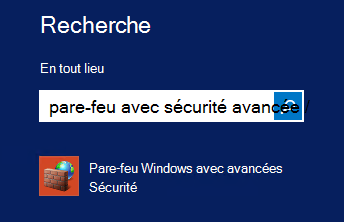
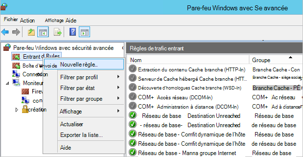
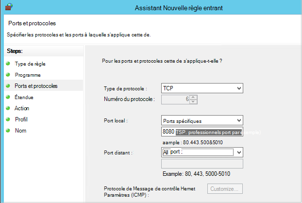

<properties
    pageTitle="Préparer votre environnement pour sauvegarder déployé le Gestionnaire de ressources des machines virtuelles | Microsoft Azure"
    description="Vous assurer que votre environnement est prêt pour la sauvegarde des machines virtuelles dans Azure"
    services="backup"
    documentationCenter=""
    authors="markgalioto"
    manager="cfreeman"
    editor=""
    keywords="sauvegardes ; sauvegarder ;"/>

<tags
    ms.service="backup"
    ms.workload="storage-backup-recovery"
    ms.tgt_pltfrm="na"
    ms.devlang="na"
    ms.topic="article"
    ms.date="08/21/2016"
    ms.author="trinadhk; jimpark; markgal;"/>


# <a name="prepare-your-environment-to-back-up-resource-manager-deployed-virtual-machines"></a>Préparer votre environnement pour sauvegarder déployé le Gestionnaire de ressources des machines virtuelles

> [AZURE.SELECTOR]
- [Modèle de gestionnaire de ressources](backup-azure-arm-vms-prepare.md)
- [Modèle classique](backup-azure-vms-prepare.md)

Cet article fournit les étapes pour préparer votre environnement pour sauvegarder une déployé le Gestionnaire de ressources machine virtuelle (). Les étapes présentées dans les procédures d’utilisent le portail Azure.  

Le service de sauvegarde Azure comporte deux types de chambres fortes (sauvegarder chambres fortes et chambres fortes récupération services) pour la protection de vos ordinateurs virtuels. Un archivage sécurisé sauvegarde protège machines virtuelles déployées à l’aide du modèle de déploiement classique. Un archivage sécurisé des services de récupération protège les **machines virtuelles à la fois déployé classique ou déployé le Gestionnaire de ressources** . Vous devez utiliser un archivage sécurisé aux Services de récupération pour protéger un ordinateur virtuel déployé le Gestionnaire de ressources.

>[AZURE.NOTE] Azure comporte deux modèles de déploiement pour la création et utilisation des ressources : [Gestionnaire de ressources et classique](../resource-manager-deployment-model.md). Pour plus d’informations sur l’utilisation de modèle de déploiement classique machines virtuelles, consultez la section [préparer votre environnement pour sauvegarder des machines virtuelles Azure](backup-azure-vms-prepare.md) .

Avant de pouvoir protéger ou sauvegarder une déployé le Gestionnaire de ressources machine virtuelle (), vérifiez que ces conditions préalables existent :

- Créez un archivage sécurisé des services de récupération (ou identifiez un existant l’archivage sécurisé de services de récupération) *dans le même emplacement que votre ordinateur virtuel*.
- Sélectionnez un scénario, définissez la stratégie de sauvegarde et définissez des éléments à protéger.
- Vérifier l’installation de l’Agent machine virtuelle sur machine virtuelle.
- Vérifiez la connectivité réseau

Si vous connaissez que ces conditions existent déjà dans votre environnement continuer à [sauvegarder votre article machines virtuelles](backup-azure-vms.md). Si vous avez besoin configurer ou vérifier une de ces conditions préalables, cet article vous guide à travers les étapes pour préparer cette condition requise.


## <a name="limitations-when-backing-up-and-restoring-a-vm"></a>Limitations lors de la sauvegarde et restauration une machine virtuelle

Avant de préparer votre environnement, veuillez compris les limitations.

- Sauvegarde des machines virtuelles avec plus de 16 disques de données n’est pas pris en charge.
- Sauvegarde des machines virtuelles avec une adresse IP réservée et aucun point de terminaison défini n’est pas pris en charge.
- Sauvegarde des machines virtuelles de Linux avec l’extension Docker n’est pas pris en charge. 
- Lecteurs réseau monté attachés à la machine virtuelle n’incluent pas les données de sauvegarde. 
- Remplacement d’une machine virtuelle existante au cours de restauration n’est pas pris en charge. Si vous essayez de restaurer la machine virtuelle lors de la machine virtuelle existe, l’opération de restauration échoue.
- Entre région sauvegarde et restauration n’est pas pris en charge.
- Vous pouvez sauvegarder des machines virtuelles dans toutes les régions publiques d’Azure (voir [liste de vérification](https://azure.microsoft.com/regions/#services) des régions pris en charge). Si la zone que vous recherchez est non prises en charge aujourd'hui, il n’apparaîtront pas dans la liste déroulante lors de la création de l’archivage sécurisé.
- Vous pouvez sauvegarder des machines virtuelles uniquement pour les versions sélectionnez système d’exploitation :
  - **Linux**: sauvegarde Azure prend en charge [une liste de distribution qui sont recommandés par Azure](../virtual-machines/virtual-machines-linux-endorsed-distros.md) à l’exception de base du système d’exploitation Linux.  Autres mettre-Your-appartient-éditions Linux peut également travailler dans la mesure où l’agent machine virtuelle est disponible sur l’ordinateur virtuel et prend en charge pour Python existe.
  - **Windows Server**: les Versions antérieures de Windows Server 2008 R2 ne sont pas pris en charge.
- Machine virtuelle (DC) qui fait partie d’une configuration multi-DC restauration d’un contrôleur de domaine est prise en charge uniquement par le biais de PowerShell. En savoir plus sur la [restauration d’un contrôleur de domaine multi-DC](backup-azure-restore-vms.md#restoring-domain-controller-vms).
- Machines virtuelles ayant les configurations réseau spécial suivantes en cours de restauration est prise en charge uniquement par le biais de PowerShell. Machines virtuelles créées à l’aide de la restauration du flux de travail dans l’interface utilisateur n’ont pas ces configurations réseau une fois la restauration terminée. Pour plus d’informations, voir [Restauration des machines virtuelles avec des configurations réseau spécial](backup-azure-restore-vms.md#restoring-vms-with-special-netwrok-configurations).
  - Machines virtuelles sous configuration d’équilibrage de charge (interne et externe)
  - Machines virtuelles avec plusieurs adresses IP réservées
  - Machines virtuelles avec plusieurs cartes réseau

## <a name="create-a-recovery-services-vault-for-a-vm"></a>Créer un archivage sécurisé des services de récupération pour une machine virtuelle

Un archivage sécurisé des services de récupération est une entité qui stocke les sauvegardes et les points de récupération qui ont été créées au fil du temps. L’archivage sécurisé des services de récupération contienne également les stratégies de sauvegarde associées machines virtuelles protégées.

Pour créer un archivage sécurisé des services de récupération :

1. Connectez-vous au [portail Azure](https://portal.azure.com/).

2. Dans le menu concentrateur, cliquez sur **Parcourir** , dans la liste des ressources, tapez **Les Services de récupération**. Lorsque vous commencez à taper, la liste filtre selon vos entrées. Cliquez sur **Services de récupération de l’archivage sécurisé**.

     <br/>

    La liste des Services de récupération chambres fortes s’affiche.

3. Dans le menu **chambres fortes Services de récupération** , cliquez sur **Ajouter**.

    

    La carte de l’archivage sécurisé aux Services de récupération s’ouvre et vous invite à fournir un **nom**, un **abonnement**, un **groupe de ressources**et un **emplacement**.

    

4. Pour **nom**, entrez un nom convivial pour identifier l’archivage sécurisé. Le nom doit être unique pour l’abonnement Azure. Tapez un nom qui contient entre 2 et 50 caractères. Il doit commencer par une lettre et peut contenir uniquement des lettres, des chiffres et des traits d’union.

5. Cliquez sur l' **abonnement** pour afficher la liste des abonnements disponibles. Si vous n’êtes pas sûr du type d’abonnement à utiliser, utilisez la valeur par défaut (ou suggérées) abonnement. Il sera plusieurs choix uniquement si votre compte professionnel est associé à plusieurs abonnements Azure.

6. Cliquez sur **groupe de ressources** pour afficher la liste des groupes de ressources disponibles, ou cliquez sur **Nouveau** pour créer un nouveau groupe de ressources. Pour plus d’informations sur les groupes de ressources, voir [vue d’ensemble du Gestionnaire de ressources Azure](../azure-resource-manager/resource-group-overview.md)

7. Cliquez sur l' **emplacement** pour sélectionner la zone géographique pour l’archivage sécurisé. L’archivage sécurisé **doit** être dans la même région en tant que les ordinateurs virtuels que vous voulez protéger.

    >[AZURE.IMPORTANT] Si vous n’êtes pas sûr de l’emplacement dans lequel se trouve votre machine virtuelle, fermer la boîte de dialogue de création de l’archivage sécurisé, puis accédez à la liste des Machines virtuelles dans le portail. Si vous avez machines virtuelles dans plusieurs régions, vous devrez créer un archivage sécurisé aux Services de récupération de chaque région. Créer l’archivage sécurisé dans le premier emplacement avant de passer à l’emplacement suivant. Il est inutile de spécifier des comptes de stockage pour stocker les données de sauvegarde--l’archivage sécurisé aux Services de récupération et le service de sauvegarde Azure gérer automatiquement.

8. Cliquez sur **créer**. Il peut prendre un certain temps pour l’archivage sécurisé de Services de récupération à créer. Surveiller les notifications d’état dans l’angle supérieur droit dans le portail. Une fois votre l’archivage sécurisé est créé, il apparaît dans la liste des Services de récupération chambres fortes.

    

    À présent que vous avez créé votre l’archivage sécurisé, découvrez comment définir la réplication de stockage.

## <a name="set-storage-replication"></a>Définir la réplication du stockage

L’option de réplication de stockage vous permet de choisir entre geo redondants et stockage localement redondant. Par défaut, votre l’archivage sécurisé comprend un stockage geo redondants. Laissez l’option définie sur stockage geo redondants s’il s’agit de votre sauvegarde principal. Choisissez le stockage localement redondant si vous souhaitez une option plus économique n’est pas tout à fait comme résistant. En savoir plus sur [geo redondants](../storage/storage-redundancy.md#geo-redundant-storage) et options de stockage [localement redondantes](../storage/storage-redundancy.md#locally-redundant-storage) dans [vue d’ensemble de la réplication de stockage Azure](../storage/storage-redundancy.md).

Pour modifier le paramètre de réplication de stockage :

1. Sélectionnez votre l’archivage sécurisé pour ouvrir le tableau de bord de l’archivage sécurisé et la carte de paramètres. Si la carte de **paramètres** ne s’ouvre, cliquez sur **tous les paramètres** dans le tableau de bord de l’archivage sécurisé.

2. Dans la carte de **paramètres** , cliquez sur **Sauvegarde Infrastructure** > **Backup Configuration** pour ouvrir la carte de **Configuration de sauvegarde** . Dans la carte de **Configuration de sauvegarde** , sélectionnez l’option de réplication de stockage pour votre l’archivage sécurisé.

    

    Après avoir choisi l’option de stockage pour votre l’archivage sécurisé, vous êtes prêt à associer la machine virtuelle l’archivage sécurisé. Pour commencer l’association, vous devez découvrir et enregistrer les machines virtuelles Azure.


## <a name="select-a-backup-goal-set-policy-and-define-items-to-protect"></a>Sélectionnez un objectif de sauvegarde, définir une stratégie et définir les éléments à protéger

Avant d’enregistrer une machine virtuelle avec un archivage sécurisé, exécutez le processus de détection pour vous assurer que les nouvelles machines virtuelles qui ont été ajoutés à l’abonnement sont identifiés. Les requêtes de processus Azure pour la liste des ordinateurs virtuels de l’abonnement, ainsi que des informations supplémentaires telles que le nom du service cloud et la région. Dans le portail Azure, scénario fait référence à ce que vous vous apprêtez à placer dans l’archivage sécurisé des services de récupération. La stratégie est l’Échéancier pour quand et à quelle fréquence les points de récupération sont prises. La stratégie inclut également la durée de rétention pour les points de récupération.

1. Si vous avez déjà un service de récupération l’archivage sécurisé est ouvert, passez à l’étape 2. Si vous avez un Services de récupération n’êtes pas vault ouvert, mais se trouvent dans le portail Azure, dans le menu concentrateur, cliquez sur **Parcourir**.

  - Dans la liste des ressources, tapez **Les Services de récupération**.
  - Lorsque vous commencez à taper, la liste filtre selon vos entrées. Lorsque vous voyez **les Services de récupération chambres fortes**, cliquez dessus.

     <br/>

    La liste des Services de récupération chambres fortes s’affiche.
  - Dans la liste des Services de récupération chambres fortes, sélectionnez un archivage sécurisé.

    Le tableau de bord sélectionné l’archivage sécurisé s’ouvre.

    

2. Dans le menu Tableau de bord de l’archivage sécurisé cliquez sur **sauvegarde** pour ouvrir la carte de sauvegarde.

    

    Lorsque la carte s’ouvre, le service de sauvegarde de recherche pour les nouvelles machines virtuelles dans l’abonnement.

    

3. Dans la carte de sauvegarde, cliquez sur **objectif de sauvegarde** pour ouvrir la carte de l’objectif de sauvegarde.

    

4. Sur la carte de sauvegarde objectif, définissez **l’endroit où votre charge de travail s’exécute** sur Azure et **que voulez-vous sauvegarder** à machine virtuelle, puis cliquez sur **OK**.

    La carte de sauvegarde objectif se ferme et la carte de stratégie de sauvegarde s’ouvre.

    

5. Dans la carte de stratégie de sauvegarde, sélectionnez la stratégie de sauvegarde que vous voulez appliquer à l’archivage sécurisé et cliquez sur **OK**.

    

    Les détails de la stratégie par défaut sont répertoriées dans les détails. Si vous voulez créer une nouvelle stratégie, sélectionnez **Créer un nouveau** dans le menu déroulant. Le menu déroulant fournit également une option pour changer l’heure lorsque l’instantané, 19 h. Pour obtenir des instructions sur la définition d’une stratégie de sauvegarde, voir [définir une stratégie de sauvegarde](backup-azure-vms-first-look-arm.md#defining-a-backup-policy). Une fois que vous cliquez sur **OK**, la stratégie de sauvegarde est associée à l’archivage sécurisé.

    Sélectionnez ensuite les ordinateurs virtuels à associer à l’archivage sécurisé.

6. Sélectionnez les machines virtuelles à associer à la stratégie spécifiée et cliquez sur **Sélectionner**.

    

    Si vous ne voyez pas la machine virtuelle souhaitée, vérifiez qu’il existe dans le même emplacement Azure que l’archivage sécurisé aux Services de récupération.

7. Maintenant que vous avez défini tous les paramètres pour l’archivage sécurisé, dans la carte de sauvegarde, cliquez sur **Activer la sauvegarde** dans la partie inférieure de la page. La stratégie est déployé à l’archivage sécurisé et les ordinateurs virtuels.

    

La phase suivante de préparation est l’installation de l’Agent machine virtuelle ou veillant l’Agent machine virtuelle est installé.


## <a name="install-the-vm-agent-on-the-virtual-machine"></a>Installer l’Agent machine virtuelle sur la machine virtuelle

L’Agent de machine virtuelle Azure doit être installé sur l’ordinateur virtuel Azure pour l’extension de sauvegarde à utiliser. Si votre ordinateur virtuel a été créé à partir de la galerie Azure, l’Agent de machine virtuelle est déjà présente sur l’ordinateur virtuel. Ces informations sont fournies dans les cas où vous vous trouvez *pas* à l’aide d’un ordinateur virtuel créé à partir de la galerie Azure - par exemple que migration une machine virtuelle à partir d’un centre de données locale. Dans ce cas, l’Agent machine virtuelle doit être installé afin de protéger l’ordinateur virtuel.

En savoir plus sur [l’Agent de machine virtuelle](https://go.microsoft.com/fwLink/?LinkID=390493&clcid=0x409) et [l’installation de l’Agent de machine virtuelle](../virtual-machines/virtual-machines-windows-classic-manage-extensions.md).

Si vous rencontrez des problèmes de sauvegarde de la machine virtuelle Azure, vérifiez que l’Agent de machine virtuelle Azure est correctement installé sur l’ordinateur virtuel (voir le tableau ci-dessous). Si vous avez créé une machine virtuelle personnalisée, [Vérifiez que la case à cocher **installer l’Agent machine virtuelle** est sélectionnée](../virtual-machines/virtual-machines-windows-classic-agents-and-extensions.md) avant la machine virtuelle est mis en service.

Le tableau suivant fournit des informations supplémentaires sur la mémoire virtuelle Agent pour Windows et machines virtuelles Linux.

| **Opération** | **Windows** | **Linux** |
| --- | --- | --- |
| Installation de l’Agent de machine virtuelle | <li>Téléchargez et installez l' [agent MSI](http://go.microsoft.com/fwlink/?LinkID=394789&clcid=0x409). Vous avez besoin des privilèges d’administrateur pour terminer l’installation. <li>[Mettre à jour la propriété machine virtuelle](http://blogs.msdn.com/b/mast/archive/2014/04/08/install-the-vm-agent-on-an-existing-azure-vm.aspx) pour indiquer que l’agent est installé. | <li> Installer dernière [agent Linux](https://github.com/Azure/WALinuxAgent) à partir de GitHub. Vous avez besoin des privilèges d’administrateur pour terminer l’installation. <li> [Mettre à jour la propriété machine virtuelle](http://blogs.msdn.com/b/mast/archive/2014/04/08/install-the-vm-agent-on-an-existing-azure-vm.aspx) pour indiquer que l’agent est installé. |
| Mise à jour de l’Agent de machine virtuelle | Mise à jour de l’Agent de machine virtuelle est aussi simple que les [fichiers binaires Agent machine virtuelle](http://go.microsoft.com/fwlink/?LinkID=394789&clcid=0x409)la réinstallation. <br>Vérifiez qu’aucune opération de sauvegarde ne s’exécute pendant que l’agent machine virtuelle est mis à jour. | Suivez les instructions de [mise à jour de l’Agent de machine virtuelle Linux ](../virtual-machines-linux-update-agent.md). <br>Vérifiez qu’aucune opération de sauvegarde ne s’exécute pendant que l’Agent machine virtuelle est mis à jour. |
| Validation de l’installation de l’Agent de machine virtuelle | <li>Accédez au dossier *C:\WindowsAzure\Packages* dans la machine virtuelle Azure. <li>Vous devriez trouver le fichier WaAppAgent.exe présenter.<li> Cliquez sur le fichier, accédez aux **Propriétés**et puis sélectionnez l’onglet **Détails** . Le champ Version du produit doit être 2.6.1198.718 ou une version ultérieure. | N/A |


### <a name="backup-extension"></a>Extension de sauvegarde

Une fois l’Agent machine virtuelle est installé sur l’ordinateur virtuel, le service de sauvegarde Azure installe l’extension de sauvegarde à l’Agent de machine virtuelle. Le service de sauvegarde Azure met à niveau en toute transparence et correctifs l’extension de sauvegarde.

L’extension de sauvegarde est installée par le service de sauvegarde que la machine virtuelle est en cours d’exécution ou non. Une machine virtuelle en cours d’exécution fournit les plus grande chances d’obtenir un point de récupération des applications. Toutefois, le service de sauvegarde Azure continue sauvegarder la machine virtuelle même si elle est désactivée, et l’extension n’a pas pu être installée. Il s’agit virtuelle en mode hors connexion. Dans ce cas, le point de récupération seront *blocage cohérente*.


## <a name="network-connectivity"></a>Connectivité réseau

Pour gérer les instantanés machine virtuelle, l’extension de sauvegarde doit connectivité aux adresses IP publics Azure. Sans la connectivité Internet, délai d’expiration des requêtes HTTP de la machine virtuelle et l’opération de sauvegarde échoue. Si votre déploiement comporte les restrictions d’accès en place (via un groupe de sécurité réseau (NSG), par exemple), puis choisissez une des options suivantes pour fournir un chemin clair pour le trafic de sauvegarde :

- [Plages d’autorisation du centre de données Azure IP](http://www.microsoft.com/en-us/download/details.aspx?id=41653) - consultez l’article pour obtenir des instructions sur comment à liste d’autorisation les adresses IP.
- Déploiement d’un serveur proxy HTTP pour acheminer le trafic.

Lors du choix de l’option à utiliser, les compromis soient comprises entre la facilité de gestion, un contrôle plus précis et coût.

|Option|Avantages|Inconvénients liés|
|------|----------|-------------|
|Plages Whitelist IP| Sans frais supplémentaires.<br><br>Pour l’ouverture access dans un NSG, utilisez l’applet de commande <i>Set-AzureNetworkSecurityRule</i> . | Complexe à gérer en tant que l’encadrement concernés plages d’adresses IP modifier dans le temps.<br><br>Permet d’accéder à l’ensemble de Azure et pas seulement de stockage.|
|Proxy HTTP| Contrôle précis dans le proxy sur le stockage URL autorisée.<br>Un seul point d’Internet d’accès aux machines virtuelles.<br>Ne fait l’objet de modifications d’adresses IP Azure.| Frais supplémentaires pour l’exécution d’une machine virtuelle avec le logiciel proxy.|

### <a name="whitelist-the-azure-datacenter-ip-ranges"></a>Plages d’adresses IP liste d’autorisation du centre de données Azure

À la liste d’autorisation les plages d’adresses IP Azure centre de données, voir le [site Web Azure](http://www.microsoft.com/en-us/download/details.aspx?id=41653) pour plus d’informations sur les plages d’adresses IP et les instructions.

### <a name="using-an-http-proxy-for-vm-backups"></a>À l’aide d’un proxy HTTP des sauvegardes machine virtuelle
Lorsque vous sauvegardez une machine virtuelle, l’extension de sauvegarde sur l’ordinateur virtuel envoie les commandes de gestion instantané au stockage Azure à l’aide d’une API HTTPS. Acheminer le trafic de sauvegarde extension via le serveur proxy HTTP car il est le seul composant configuré pour l’accès à l’Internet public.

>[AZURE.NOTE] Il n’existe aucune recommandation pour le logiciel de proxy qui doit être utilisé. Assurez-vous que vous sélectionnez un serveur proxy qui est compatible avec les étapes de configuration ci-dessous.

L’image d’exemple ci-dessous montre les étapes de trois configuration nécessaire d’utiliser un proxy HTTP :

- Machine virtuelle application achemine tout le trafic HTTP destiné à l’Internet public par le biais machine virtuelle Proxy.
- Proxy machine virtuelle autorise le trafic entrant à partir d’ordinateurs virtuels dans le réseau virtuel.
- Le groupe de sécurité réseau (NSG) nommé SP verrouillage doit un sécurité règle permettant Internet le trafic sortant de machine virtuelle Proxy.


Pour utiliser un serveur proxy HTTP pour communiquer à l’Internet public, procédez comme suit :

#### <a name="step-1-configure-outgoing-network-connections"></a>Étape 1. Configurer les connexions réseau sortantes

###### <a name="for-windows-machines"></a>Pour les ordinateurs Windows
Cela va configurer configuration du serveur proxy pour le compte système Local.

1. Télécharger [PsExec](https://technet.microsoft.com/sysinternals/bb897553)
2. Exécutez la commande suivante à partir de l’invite de commandes avec élévation de privilèges,

     ```
     psexec -i -s "c:\Program Files\Internet Explorer\iexplore.exe"
     ```
     Fenêtre internet explorer s’ouvre.
3. Accédez à outils -> Options Internet -> connexions -> Paramètres réseau.
4. Vérifiez les paramètres de proxy pour le compte système. Définir IP Proxy et le port.
5. Fermez Internet Explorer.

Cette option définit une configuration d’échelle de l’ordinateur proxy et sera utilisée pour le trafic sortant HTTP/HTTPS.

Si vous avez configuré un serveur proxy sur un compte d’utilisateur actuel (pas un compte système Local), utilisez le script suivant les appliquer aux SYSTEMACCOUNT :

```
   $obj = Get-ItemProperty -Path Registry::”HKEY_CURRENT_USER\Software\Microsoft\Windows\CurrentVersion\Internet Settings\Connections"
   Set-ItemProperty -Path Registry::”HKEY_USERS\S-1-5-18\Software\Microsoft\Windows\CurrentVersion\Internet Settings\Connections" -Name DefaultConnectionSettings -Value $obj.DefaultConnectionSettings
   Set-ItemProperty -Path Registry::”HKEY_USERS\S-1-5-18\Software\Microsoft\Windows\CurrentVersion\Internet Settings\Connections" -Name SavedLegacySettings -Value $obj.SavedLegacySettings
   $obj = Get-ItemProperty -Path Registry::”HKEY_CURRENT_USER\Software\Microsoft\Windows\CurrentVersion\Internet Settings"
   Set-ItemProperty -Path Registry::”HKEY_USERS\S-1-5-18\Software\Microsoft\Windows\CurrentVersion\Internet Settings" -Name ProxyEnable -Value $obj.ProxyEnable
   Set-ItemProperty -Path Registry::”HKEY_USERS\S-1-5-18\Software\Microsoft\Windows\CurrentVersion\Internet Settings" -Name Proxyserver -Value $obj.Proxyserver
```

>[AZURE.NOTE] Si vous observez « (407) authentification Proxy requise » dans le journal du serveur proxy, vérifiez que votre authentification est configuré correctement.

######<a name="for-linux-machines"></a>Pour les ordinateurs Linux

Ajoutez la ligne suivante à la ```/etc/environment``` fichier :

```
http_proxy=http://<proxy IP>:<proxy port>
```

Ajoutez les lignes suivantes à la ```/etc/waagent.conf``` fichier :

```
HttpProxy.Host=<proxy IP>
HttpProxy.Port=<proxy port>
```

#### <a name="step-2-allow-incoming-connections-on-the-proxy-server"></a>Étape 2. Autoriser les connexions entrantes sur le serveur proxy :

1. Sur le serveur proxy, ouvrez le pare-feu Windows. Pour accéder au pare-feu, le plus simple consiste à rechercher le pare-feu Windows avec fonctions avancées de sécurité.

    

2. Dans la boîte de dialogue Pare-feu Windows, cliquez sur **Règles de trafic entrant** , puis cliquez sur **Nouvelle règle...**.

    

3. Dans l' **Assistant Nouvelle règle de trafic entrant**, choisissez l’option **personnalisé** pour le **Type de règle** , puis cliquez sur **suivant**.
4. Dans la page pour sélectionner le **programme**, sélectionnez **Tous les programmes** , puis cliquez sur **suivant**.

5. Dans la page **protocole et les Ports** , entrez les informations suivantes, puis cliquez sur **suivant**:

    

    - pour *type de protocole* , sélectionnez *TCP*
    - choisir des *Ports spécifiques*pour le *port Local* , dans le champ ci-dessous spécifier la ```<Proxy Port>``` qui a été configuré.
    - pour les *ports à distance* , sélectionnez *Tous les Ports*

    Pour le reste de l’Assistant, cliquez sur tout à fait à la fin et donnez un nom à cette règle.

#### <a name="step-3-add-an-exception-rule-to-the-nsg"></a>Étape 3. Ajouter une règle d’exception à la NSG :

Dans une invite de commandes PowerShell Azure, entrez la commande suivante :

La commande suivante ajoute une exception à la NSG. Cette exception autorise le trafic TCP à partir de n’importe quel port 10.0.0.5 à n’importe quelle adresse Internet sur le port 80 (HTTP) ou 443 (HTTPS). Si vous avez besoin d’un port spécifique de l’Internet public, veillez à ajouter ce port pour le ```-DestinationPortRange``` également.

```
Get-AzureNetworkSecurityGroup -Name "NSG-lockdown" |
Set-AzureNetworkSecurityRule -Name "allow-proxy " -Action Allow -Protocol TCP -Type Outbound -Priority 200 -SourceAddressPrefix "10.0.0.5/32" -SourcePortRange "*" -DestinationAddressPrefix Internet -DestinationPortRange "80-443"
```


*Ces étapes utilisent des noms spécifiques et des valeurs pour cet exemple. Utilisez les noms et les valeurs à votre déploiement lors de la saisie, ou couper et coller des détails dans votre code.*


Maintenant que vous savez que vous possédez une connexion réseau, vous êtes prêt à sauvegarder votre machine virtuelle. Voir [sauvegarder des machines virtuelles déployé le Gestionnaire de ressources](backup-azure-arm-vms.md).

## <a name="questions"></a>Questions ?
Si vous avez des questions, ou s’il existe une fonctionnalité que vous voulez voir inclus, [envoyez-nous vos commentaires](http://aka.ms/azurebackup_feedback).

## <a name="next-steps"></a>Étapes suivantes
À présent que vous avez préparé votre environnement de sauvegarde de votre ordinateur virtuel, l’étape logique suivante consiste à créer une sauvegarde. L’article planification fournit des informations plus détaillées sur la sauvegarde des machines virtuelles.

- [Sauvegarder des machines virtuelles](backup-azure-vms.md)
- [Planifier votre infrastructure de sauvegarde machine virtuelle](backup-azure-vms-introduction.md)
- [Gérer les sauvegardes machine virtuelle](backup-azure-manage-vms.md)
