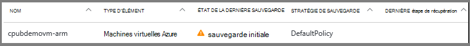
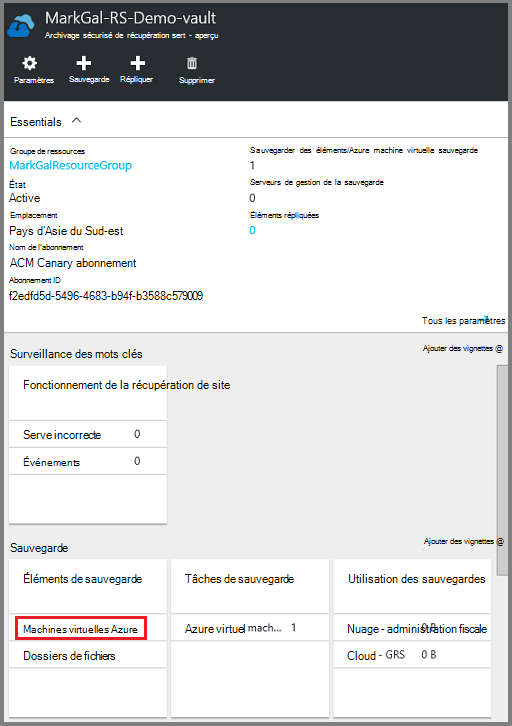
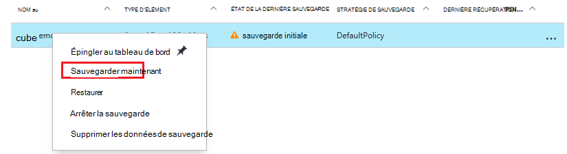
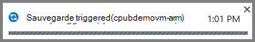
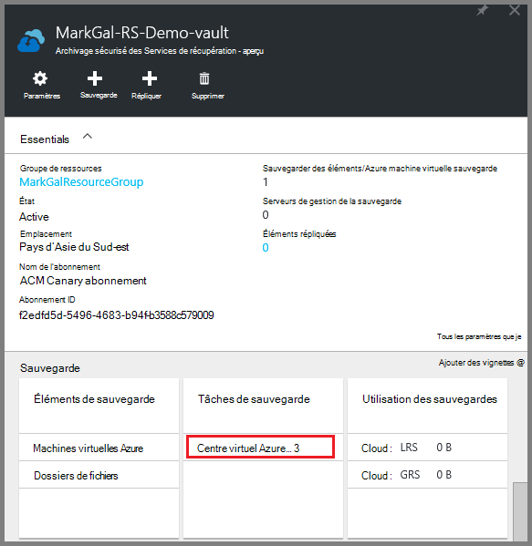
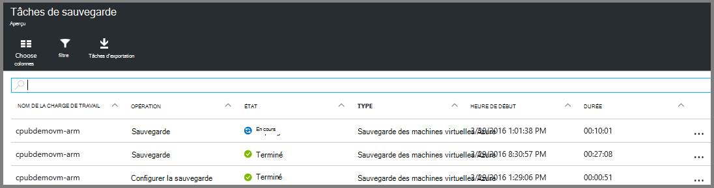

<properties
    pageTitle="Sauvegarder des machines virtuelles Azure à un archivage sécurisé aux Services de récupération | Microsoft Azure"
    description="Découvrir, enregistrer et sauvegarder Azure machines virtuelles à un archivage sécurisé des services de récupération avec ces procédures de sauvegarde des machines virtuelles Azure."
    services="backup"
    documentationCenter=""
    authors="markgalioto"
    manager="cfreeman"
    editor=""
    keywords="sauvegarde des machines virtuelles ; sauvegarder la machine virtuelle ; sauvegarde et récupération d’urgence ; sauvegarde de machine virtuelle processeur"/>

<tags
    ms.service="backup"
    ms.workload="storage-backup-recovery"
    ms.tgt_pltfrm="na"
    ms.devlang="na"
    ms.topic="article"
    ms.date="07/29/2016"
    ms.author="trinadhk; jimpark; markgal;"/>

# Sauvegarder des machines virtuelles Azure dans un archivage sécurisé aux Services de récupération

> [AZURE.SELECTOR]
- [Sauvegarder des machines virtuelles à l’archivage sécurisé des Services de récupération](backup-azure-arm-vms.md)
- [Sauvegarder des machines virtuelles à l’archivage sécurisé sauvegarde](backup-azure-vms.md)

Cet article fournit la procédure de sauvegarde des machines virtuelles Azure (déployé le Gestionnaire de ressources et déployé classique) à un archivage sécurisé aux Services de récupération. La plupart du travail de sauvegarde des machines virtuelles est placé dans la préparation. Avant de pouvoir sauvegarder ou protéger une machine virtuelle, vous devez suivre les [conditions préalables](backup-azure-arm-vms-prepare.md) pour préparer votre environnement pour protéger vos ordinateurs virtuels. Une fois que vous avez terminé la configuration requise, vous pouvez démarrer l’opération à prendre des instantanés de votre ordinateur virtuel sauvegarder.

>[AZURE.NOTE] Azure comporte deux modèles de déploiement pour la création et utilisation des ressources : [Gestionnaire de ressources et classique](../resource-manager-deployment-model.md). Vous pouvez protéger machines virtuelles déployé le Gestionnaire de ressources et machines virtuelles classique avec les Services de récupération chambres fortes. Pour plus d’informations sur l’utilisation de modèle de déploiement classique machines virtuelles, voir [sauvegarder des machines virtuelles Azure](backup-azure-vms.md) .

Pour plus d’informations, voir les articles sur la [planification votre infrastructure de sauvegarde machine virtuelle dans Azure](backup-azure-vms-introduction.md) et [Azure machines virtuelles](https://azure.microsoft.com/documentation/services/virtual-machines/).

## Déclencher le travail de sauvegarde

La stratégie associée à l’archivage sécurisé aux Services de récupération, sauvegarder définit la fréquence à laquelle et quand l’opération de sauvegarde s’exécute. Par défaut, la première sauvegarde planifiée est la sauvegarde initiale. Jusqu'à ce que la sauvegarde initiale se produit, le dernier état de sauvegarde sur la carte de **Travaux de sauvegarde** s’affiche comme **Avertissement (sauvegarde initiale en attente)**.

À moins que votre sauvegarde initiale est due à commencer très rapidement, il est recommandé d’exécuter **Sauvegarder maintenant**. La procédure suivante commence à partir du tableau de bord de l’archivage sécurisé. Cette procédure est utilisé pour exécuter le travail de sauvegarde initial après avoir effectué toutes les conditions préalables. Si le travail de sauvegarde initial a déjà été exécuté, cette procédure n’est pas disponible. La stratégie de sauvegarde associée détermine la prochaine tâche de sauvegarde.  

Pour exécuter l’opération de sauvegarde initiale :

1. Dans le tableau de bord de l’archivage sécurisé, sur la vignette de **sauvegarde** , cliquez sur **Machines virtuelles Azure**.  
    

    La carte **d’Éléments de sauvegarde** s’ouvre.

2. Sur la carte **d’Éléments de sauvegarde** , avec le bouton droit de l’archivage sécurisé que vous souhaitez sauvegarder, puis cliquez sur **Sauvegarder maintenant**.

    

    L’opération de sauvegarde se déclenche.  

    

3. Pour que votre sauvegarde initiale est terminée, dans le tableau de bord de l’archivage sécurisé, sur la vignette de **Travaux de sauvegarde** , cliquez sur **Azure machines virtuelles**.

    

    La carte de travaux de sauvegarde s’ouvre.

4. Dans la carte de **travaux de sauvegarde** , vous pouvez voir l’état de toutes les tâches.

    

    >[AZURE.NOTE] Dans le cadre de l’opération de sauvegarde, le service de sauvegarde Azure envoie une commande à l’extension de sauvegarde dans chaque machine virtuelle pour vider toutes les écritures et prendre une capture instantanée cohérente.

    Lorsque la sauvegarde est terminée, le statut est *terminé*.

## Résolution des erreurs
Si vous rencontrez des problèmes pendant la sauvegarde votre machine virtuelle, consultez l' [article de résolution des problèmes de mémoire virtuelle](backup-azure-vms-troubleshoot.md) pour vous aider.

## Étapes suivantes

À présent que vous avez protégé votre machine virtuelle, consultez les articles suivants pour supplémentaires de gestion des tâches que vous pouvez faire avec vos ordinateurs virtuels et comment restaurer des machines virtuelles.

- [Gérer et analyser vos machines virtuelles](backup-azure-manage-vms.md)
- [Restaurer des machines virtuelles](backup-azure-arm-restore-vms.md)
