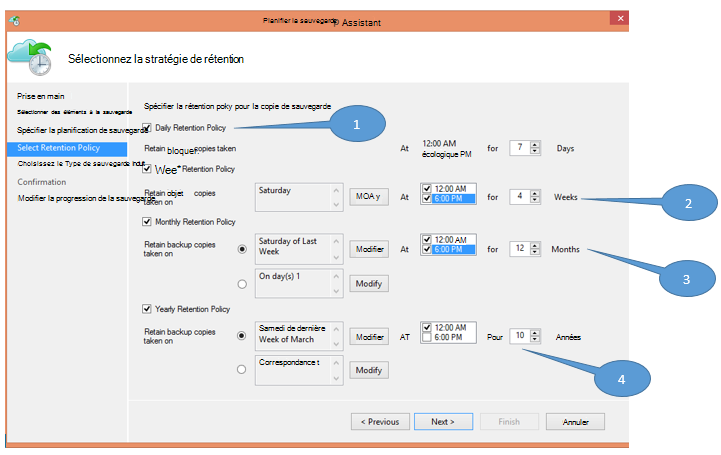

<properties
   pageTitle="Sauvegarde Azure permet de remplacer votre infrastructure bandes | Microsoft Azure"
   description="Découvrez comment Azure sauvegarde fournit une sémantique en forme de bande qui permet de sauvegarder et restaurer des données dans Azure"
   services="backup"
   documentationCenter=""
   authors="trinadhk"
   manager="vijayts"
   editor=""/>
<tags
   ms.service="backup"
   ms.devlang="na"
   ms.topic="article"
   ms.tgt_pltfrm="na"
   ms.workload="storage-backup-recovery"
   ms.date="09/27/2016"
   ms.author="jimpark;trinadhk;markgal"/>

# Sauvegarde Azure permet de remplacer votre infrastructure de bandes

Les clients de sauvegarde et de System Center Data Protection Manager Azure peuvent :

- Sauvegarder vos données dans les tableaux qui mieux répondre aux besoins d’organisation.
- Conserver les données de sauvegarde plus longtemps
- Vérifiez Azure une partie de leur conservation à long terme doit (au lieu de bande).

Cet article explique comment clients peuvent activer les stratégies de sauvegarde et de rétention. Les clients qui utilisent des bandes pour résoudre leur long-terme-rétention doivent ont désormais une alternative puissante et viable avec la disponibilité de cette fonctionnalité. La fonctionnalité est activée dans la dernière version de la sauvegarde Azure (qui est disponible [ici](http://aka.ms/azurebackup_agent)). Les clients System Center DPM doivent mettre à jour, au moins, DPM 2012 R2 UR5 avant d’utiliser DPM avec le service de sauvegarde Azure.

## Quelle est la planification de sauvegarde ?
La planification de sauvegarde indique la fréquence de l’opération de sauvegarde. Par exemple, les paramètres dans l’écran suivant indiquent que les sauvegardes sont effectuées tous les jours à 6 pm et à minuit.

Les clients peuvent également planifier une sauvegarde hebdomadaire. Par exemple, les paramètres dans l’écran suivant indiquent que des sauvegardes soient prises chaque autre dimanche et mercredi à 9:30 AM et 1:00 AM.

## Quelle est la stratégie de rétention ?
La stratégie de rétention indique la durée pour laquelle la sauvegarde doit être stockée. Au lieu de simplement spécifier une stratégie « plate » pour tous les points de sauvegarde, les clients peuvent indiquer autres stratégies de rétention basées sur lors de la sauvegarde est effectuée. Par exemple, le point de sauvegarde pris tous les jours, qui sert d’un point de restauration, est conservé pendant 90 jours. Le point de sauvegarde pris à la fin de chaque trimestre à des fins d’audit est conservé pendant une durée plus longue.

Le nombre total de « points de rétention « spécifiés dans cette stratégie est 90 (points quotidiennes) + 40 (celui chaque trimestre de dix ans) = 130.

## Exemple : placer les deux ensemble

1. **Stratégie de rétention quotidienne**: prises quotidiennement les sauvegardes sont stockées pendant sept jours.
2. **Stratégie de rétention hebdomadaire**: les sauvegardes effectuées quotidiennement à minuit et 6 PM samedi sont conservés pour les quatre semaines
3. **Stratégie de rétention mensuel**: les sauvegardes effectuées à minuit et 6 pm le dernier samedi de chaque mois sont conservés pour les 12 mois
4. **Stratégie de rétention annuel**: les sauvegardes effectuées à minuit le dernier samedi de chaque mars sont conservés de dix ans

Le nombre total de « points de rétention » (points à partir de laquelle un client peut restaurer les données) dans le diagramme précédent est calculée comme suit :

- deux points par jour pour sept jours = 14 points de récupération
- deux points par semaine pour quatre semaines = 8 points de récupération
- deux points par mois pour les 12 mois = 24 points de récupération
- un point par année par récupération 10 années = 10 points

Le nombre total de points de récupération est 56.

> [AZURE.NOTE] Sauvegarde Azure n’est pas une restriction sur le nombre de points de récupération.

## Configuration avancée
En cliquant sur **Modifier** dans l’écran précédent, clients ont plus de souplesse dans la spécification des planifications de rétention.

## Étapes suivantes
Pour plus d’informations sur la sauvegarde Azure, voir :

- [Introduction à la sauvegarde Azure](backup-introduction-to-azure-backup.md)
- [Essayez de sauvegarde Azure](backup-try-azure-backup-in-10-mins.md)
