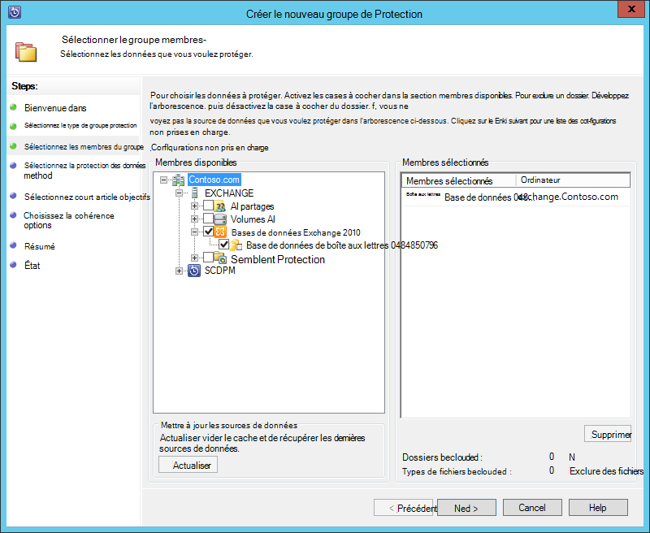
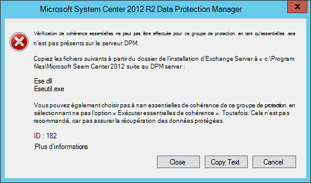
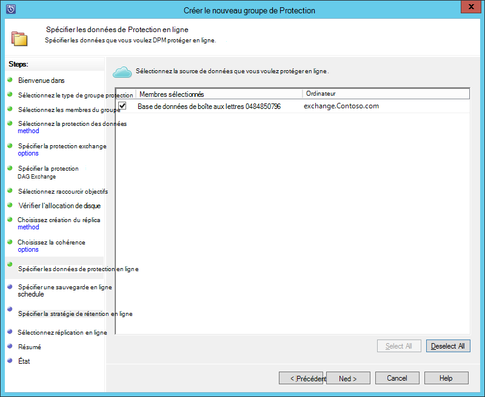
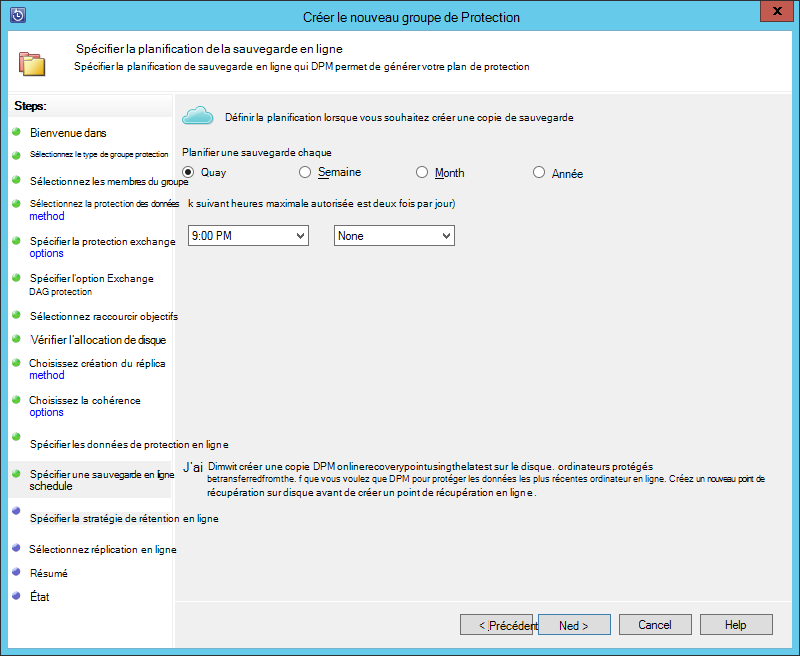
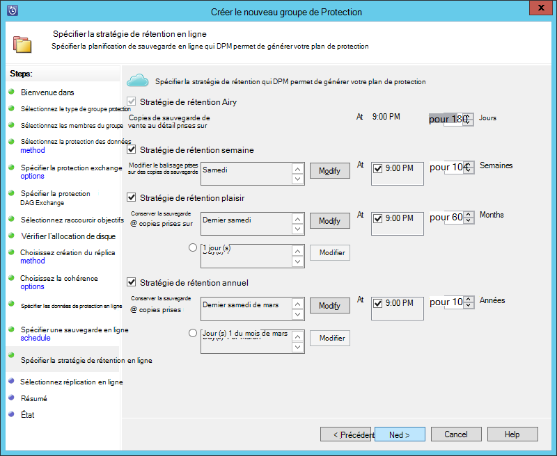
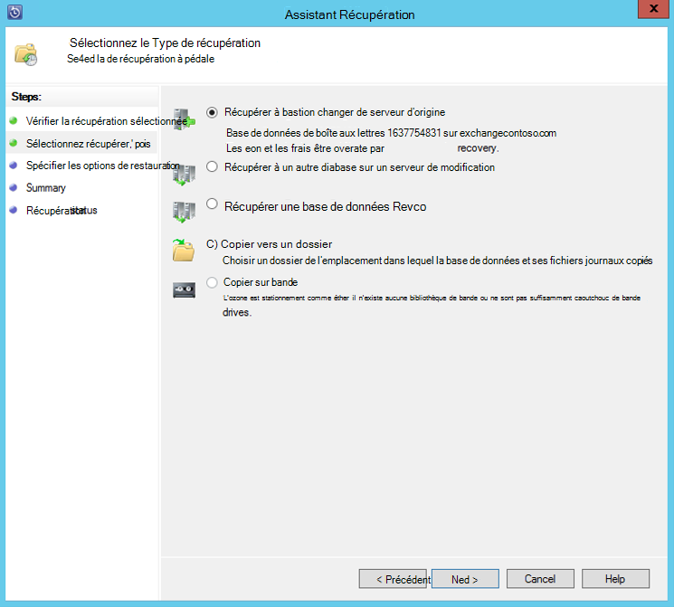

<properties
    pageTitle="Sauvegarder un serveur Exchange pour sauvegarde Azure avec System Center 2012 R2 DPM | Microsoft Azure"
    description="Découvrez comment faire pour sauvegarder un serveur Exchange sauvegarde Azure à l’aide de System Center 2012 R2 DPM"
    services="backup"
    documentationCenter=""
    authors="MaanasSaran"
    manager="NKolli1"
    editor=""/>

<tags
    ms.service="backup"
    ms.workload="storage-backup-recovery"
    ms.tgt_pltfrm="na"
    ms.devlang="na"
    ms.topic="article"
    ms.date="08/15/2016"
    ms.author="anuragm;jimpark;delhan;trinadhk;markgal"/>

# Sauvegarder un serveur Exchange pour sauvegarde Azure avec System Center 2012 R2 DPM
Cet article décrit comment configurer un serveur de System Center 2012 R2 Data Protection Manager (DPM) à l’arrière-plan d’un serveur Microsoft Exchange à sauvegarder Azure.  

## Mises à jour
Pour enregistrer correctement le serveur DPM avec sauvegarde Azure, vous devez installer la dernière mise à jour cumulative pour System Center 2012 R2 DPM et la dernière version de l’Agent de sauvegarde Azure. Obtenir la dernière mise à jour cumulative à partir du [Catalogue Microsoft](http://catalog.update.microsoft.com/v7/site/Search.aspx?q=System%20Center%202012%20R2%20Data%20protection%20manager).

>[AZURE.NOTE] Pour les exemples de cet article, version 2.0.8719.0 de l’Agent de sauvegarde Azure est installée et mise à jour cumulative 6 est installé sur System Center 2012 R2 DPM.

## Conditions préalables
Avant de poursuivre, assurez-vous que toutes les [conditions préalables](backup-azure-dpm-introduction.md#prerequisites) pour protéger les charges de travail à l’aide de Microsoft Azure Backup ont été satisfaites. Ces conditions préalables sont les suivantes :

- Un archivage sécurisé sauvegarde sur le site Azure a été créé.
- Informations d’identification de l’agent et l’archivage sécurisé ont été téléchargées sur le serveur DPM.
- L’agent est installé sur le serveur DPM.
- Les informations d’identification de l’archivage sécurisé ont été utilisées pour enregistrer le serveur DPM.
- Si vous protégez Exchange 2016, mettez à niveau vers DPM 2012 R2 UR9 ou version ultérieure

## Agent de protection DPM  
Pour installer l’agent de protection DPM sur le serveur Exchange, procédez comme suit :

1. Vérifiez que les pare-feu sont correctement configurés. Voir [configurer des exceptions de pare-feu pour l’agent](https://technet.microsoft.com/library/Hh758204.aspx).

2. Installer l’agent sur le serveur Exchange en cliquant sur **Gestion > Agents > installer** dans la Console Administrateur DPM. Pour plus d’informations, voir [installer l’agent de protection DPM](https://technet.microsoft.com/library/hh758186.aspx?f=255&MSPPError=-2147217396) .

## Créer un groupe de protection pour le serveur Exchange

1. Dans la Console Administrateur DPM, cliquez sur **Protection**, puis cliquez sur **Nouveau** dans le ruban pour ouvrir l’Assistant **Créer un nouveau groupe de Protection** .

2. Sur l’écran **d’accueil** de l’Assistant, cliquez sur **suivant**.

3. Dans l’écran **Sélectionner le type de groupe de protection** , sélectionnez **Servers** , puis cliquez sur **suivant**.

4. Sélectionnez la base de données du serveur Exchange que vous voulez protéger, cliquez sur **suivant**.

    >[AZURE.NOTE] Si vous protégez Exchange 2013, vérifier les [conditions préalables pour Exchange 2013](https://technet.microsoft.com/library/dn751029.aspx).

    Dans l’exemple suivant, la base de données Exchange 2010 est sélectionnée.

    

5. Sélectionnez la méthode de protection des données.

    Nommez le groupe de protection, puis sélectionnez les deux options suivantes :

    - Je souhaite une protection à court terme à l’aide de disque.
    - Je veux protection en ligne.

6. Cliquez sur **suivant**.

7. Sélectionnez l’option **Exécuter Eseutil pour vérifier l’intégrité des données** si vous souhaitez vérifier l’intégrité des bases de données Exchange Server.

    Après avoir sélectionné cette option, la sauvegarde cohérence sera exécutée sur le serveur DPM afin d’éviter le trafic e/s qui est généré en exécutant la commande **eseutil** sur le serveur Exchange.

    >[AZURE.NOTE]Pour utiliser cette option, vous devez copier les fichiers Ese.dll et Eseutil.exe dans le répertoire C:\Program Files\Microsoft System Center 2012 R2\DPM\DPM\bin sur le serveur DPM. Dans le cas contraire, l’erreur suivante se déclenche :  
    

8. Cliquez sur **suivant**.

9. Sélectionnez la base de données pour la **Copie de sauvegarde**, puis cliquez sur **suivant**.

    >[AZURE.NOTE] Si vous ne sélectionnez pas « Sauvegarde complète » pour au moins une copie DAG d’une base de données, les journaux ne seront pas tronqués.

10. Configurer les objectifs pour la **sauvegarde à court terme**, puis cliquez sur **suivant**.

11. Passez en revue l’espace disque disponible, puis cliquez sur **suivant**.

12. Sélectionnez l’heure à laquelle le serveur DPM créer la réplication initiale et puis cliquez sur **suivant**.

13. Sélectionnez les options de vérification de la cohérence, puis cliquez sur **suivant**.

14. Choisissez la base de données que vous souhaitez sauvegarder sur Azure, puis cliquez sur **suivant**. Par exemple :

    

15. Définir la planification de **Sauvegarde Azure**, puis cliquez sur **suivant**. Par exemple :

    

    >[AZURE.NOTE] Notez les points de récupération en ligne sont basés sur express complète des points de récupération. Par conséquent, vous devez planifier le point de récupération en ligne après l’heure spécifiée pour la version complète expresse des points de récupération.

16. Configurer la stratégie de rétention pour la **Sauvegarde Azure**, puis cliquez sur **suivant**.

17. Choisissez une option de réplication en ligne et cliquez sur **suivant**.

    Si vous avez une base de données volumineux, cela peut prendre beaucoup de temps pour la sauvegarde initiale à créer sur le réseau. Pour éviter ce problème, vous pouvez créer une sauvegarde en mode hors connexion.  

    

18. Confirmer les paramètres, puis cliquez sur **Créer un groupe**.

19. Cliquez sur **Fermer**.

## Restaurer la base de données Exchange

1. Pour restaurer une base de données Exchange, cliquez sur **récupération** dans la Console Administrateur DPM.

2. Recherchez la base de données Exchange que vous voulez récupérer.

3. Sélectionnez un point de récupération en ligne dans la liste déroulante de *temps de récupération* .

4. Cliquez sur **récupérer** pour démarrer l' **Assistant Récupération**.

Pour les points de récupération en ligne, il existe cinq types de récupération :

- **Récupérer à l’emplacement du serveur Exchange d’origine :** Les données seront récupérées au serveur Exchange d’origine.
- **Récupérer à une autre base de données sur un serveur Exchange :** Les données seront récupérées à une autre base de données sur un autre serveur Exchange.
- **Récupérer une base de données de récupération :** Les données seront récupérées à une base de données de récupération Exchange (relationnelle).
- **Copier vers un dossier réseau :** Les données seront récupérées dans un dossier réseau.
- **Copier sur bande :** Si vous avez une bibliothèque de bandes ou un lecteur de bande autonome joint et configuré sur le serveur DPM, le point de récupération est copié à une bande libre.

    

## Étapes suivantes

- [Forum aux questions sur sauvegarde Azure](backup-azure-backup-faq.md)
