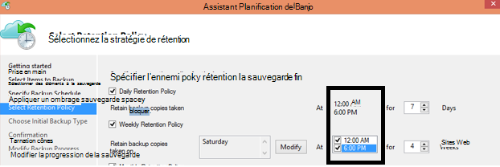

<properties
   pageTitle="Forum aux questions sur sauvegarde Azure | Microsoft Azure"
   description="Réponses aux questions fréquemment posées sur le service de sauvegarde, agent de sauvegarde, sauvegarde et rétention, récupération, sécurité et d’autres questions courantes sur la sauvegarde et restauration."
   services="backup"
   documentationCenter=""
   authors="markgalioto"
   manager="jwhit"
   editor=""
   keywords="sauvegarde et récupération d’urgence ; service de sauvegarde"/>

<tags
   ms.service="backup"
   ms.workload="storage-backup-recovery"
     ms.tgt_pltfrm="na"
     ms.devlang="na"
     ms.topic="get-started-article"
     ms.date="10/21/2016"
     ms.author="trinadhk; giridham; arunak; markgal; jimpark;"/>

# <a name="azure-backup-service--faq"></a>Azure sauvegarde service-Forum aux questions


Cet article est une liste des questions fréquemment posées (et les réponses correspondantes) sur le service de sauvegarde Azure. Notre communauté des réponses rapidement, et si une question est demandée souvent, nous l’ajouter à cet article. En général, les réponses aux questions fournissent des informations de référence ou informations de support technique. Vous pouvez poser des questions sur sauvegarde Azure dans la section Disqus de cet article ou un article connexe. Vous pouvez également publier des questions sur le service de sauvegarde Azure sur le [forum de discussion](https://social.msdn.microsoft.com/forums/azure/home?forum=windowsazureonlinebackup).


## <a name="what-is-the-list-of-supported-operating-systems-from-which-i-can-back-up-to-azure-using-azure-backup-br"></a>Quelle est la liste des systèmes d’exploitation pris en charge à partir de laquelle j’ai puis-je sauvegarder vers Azure à l’aide de sauvegarde Azure ? <br/>
Sauvegarde Azure prend en charge la liste suivante de systèmes d’exploitation pour la sauvegarde du dossier de fichiers, sauvegarde d’application à l’aide de serveur de sauvegarde Azure et SCDPM.

| Système d'exploitation        | Plateforme           | RÉFÉRENCE (SKU)  |
| :------------- |-------------| :-----|
| Windows 8 et les plus récentes SP      | 64 bits | Entreprise, Pro |
| Windows 7 et les plus récentes SP      | 64 bits | Intégrale, entreprise, Professionnel, Édition familiale Premium, Édition Familiale Basique, Starter |
| Windows 8.1 et dernière SP | 64 bits      |    Entreprise, Pro |
| Windows 10      | 64 bits | Entreprise, Pro, à domicile |
|Windows Server 2012 R2 et les plus récentes SP| 64 bits| Standard, centre de données, Foundation|
|Windows Server 2012 et les plus récentes SP|    64 bits| Centre de données, Foundation, Standard|
|Stockage de Windows Server 2012 R2 et les plus récentes SP  |64 bits|    Standard, groupe de travail|
|Stockage de Windows Server 2012 et les plus récentes SP |64 bits |Standard, groupe de travail
|Windows Server 2012 R2 et les plus récentes SP  |64 bits|    Essentiels|
|Windows Server 2008 R2 SP1 |64 bits|    Standard, entreprise, du centre de données, Foundation|
|Windows Server 2008 SP2    |64 bits|    Standard, entreprise, du centre de données, Foundation|

Pour la sauvegarde machine virtuelle Azure,

- **Linux**: sauvegarde Azure prend en charge [une liste de distribution qui sont recommandés par Azure](../virtual-machines/virtual-machines-linux-endorsed-distros.md) à l’exception de base du système d’exploitation Linux.  Autres mettre-Your-appartient-éditions Linux peut également travailler dans la mesure où l’agent machine virtuelle est disponible sur l’ordinateur virtuel et prend en charge pour Python existe.
- **Windows Server**: les Versions antérieures de Windows Server 2008 R2 ne sont pas pris en charge.

## <a name="where-can-i-download-the-latest-azure-backup-agent-br"></a>Où puis-je télécharger l’agent de sauvegarde Azure dernière ? <br/>
Vous pouvez télécharger l’agent de dernière pour la sauvegarde de Windows Server, System Center DPM ou client Windows, à partir [d’ici](http://aka.ms/azurebackup_agent). Si vous souhaitez sauvegarder une machine virtuelle, utilisez l’Agent de machine virtuelle (qui installe automatiquement l’extension appropriée). L’Agent de machine virtuelle est déjà présent sur machines virtuelles créées à partir de la galerie Azure.

## <a name="which-version-of-scdpm-server-is-supported-br"></a>Quelle version du serveur SCDPM est pris en charge ? <br/>
Nous vous conseillons d’installer l’agent de sauvegarde Azure [dernière](http://aka.ms/azurebackup_agent) sur la dernière mise à jour cumulative de SCDPM (UR11 à partir de 2016 août)

## <a name="when-configuring-the-azure-backup-agent-i-am-prompted-to-enter-the-vault-credentials-do-vault-credentials-expire"></a>Lorsque vous configurez l’agent de sauvegarde Azure, je suis invité à entrer les informations d’identification de l’archivage sécurisé. Informations d’identification de l’archivage sécurisé expirent ?
Oui, les informations d’identification de l’archivage sécurisé expirent après 48 heures. Si le fichier arrive à expiration, connectez-vous au portail Azure et télécharger les fichiers d’informations d’identification de l’archivage sécurisé de votre l’archivage sécurisé.

## <a name="is-there-any-limit-on-the-number-of-vaults-that-can-be-created-in-each-azure-subscription-br"></a>Existe-t-il une limite du nombre de chambres fortes pouvant être créées dans chaque abonnement Azure ? <br/>
Oui. À partir de septembre 2016, vous pouvez créer 25 chambres fortes sauvegarde par abonnement. Vous pouvez créer jusqu'à 25 chambres fortes de Services de récupération par chaque région pris en charge de la sauvegarde Azure par abonnement. Si vous avez besoin plus chambres fortes, puis créer un nouvel abonnement.

## <a name="are-there-any-limits-on-the-number-of-serversmachines-that-can-be-registered-against-each-vault-br"></a>Quels sont les limites du nombre de serveurs/machines qui peuvent être enregistrés par rapport à chaque l’archivage sécurisé ? <br/>
Oui, vous pouvez enregistrer jusqu'à 50 machines par l’archivage sécurisé. Pour les machines virtuelles Azure IaaS, limite est de 200 machines virtuelles par l’archivage sécurisé. Si vous avez besoin d’enregistrer plusieurs ordinateurs, créez un archivage sécurisé nouveau.

## <a name="how-do-i-register-my-server-to-another-datacenterbr"></a>Comment enregistrer mon serveur vers un autre centre de données ?<br/>
Données de sauvegarde sont envoyées au centre de données de l’archivage sécurisé dans lequel elle est inscrite. Pour modifier le centre de données, le plus simple consiste à désinstaller l’agent et réinstallez l’agent et inscrire à un archivage sécurisé nouveau appartenant au centre de données souhaité.

## <a name="what-happens-if-i-rename-a-windows-server-that-is-backing-up-data-to-azurebr"></a>Que se passe-t-il si je renomme un serveur de Windows qui est sauvegarder des données vers Azure ?<br/>
Lorsque vous renommez un serveur, toutes les sauvegardes actuellement configurés sont arrêtés.
Vous devez enregistrer le nouveau nom du serveur avec l’archivage sécurisé de sauvegarde. Lorsque vous créez un nouvel enregistrement, l’opération de sauvegarde première est une sauvegarde complète et non une sauvegarde incrémentielle. Si vous avez besoin récupérer les données qui ont été précédemment sauvegardées sur l’archivage sécurisé avec l’ancien nom de serveur, vous pouvez récupérer ces données à l’aide de l’option [**d’un autre serveur**](backup-azure-restore-windows-server.md#recover-to-an-alternate-machine) dans l’Assistant de **Récupérer des données** .

## <a name="what-types-of-drives-can-i-backup-files-and-folders-from-br"></a>Quels types de lecteurs puis-je sauvegarder les fichiers et dossiers à ? <br/>
L’ensemble des lecteurs/volumes suivantes ne peuvent pas accéder sauvegarde :

- Un support amovible : Le lecteur doit se présenter comme fixe à être utilisé comme source de sauvegarde élément.
- Volumes en lecture seule : le volume doit être accessible en écriture pour volume shadow copy service (VSS) de la fonction.
- En mode hors connexion Volumes : Le volume doit être en ligne pour VSS de la fonction.
- Partage réseau : le volume doit être local sur le serveur à sauvegarder à l’aide de la sauvegarde en ligne.
- BitLocker protégé volumes : le volume doit être déverrouillé que la sauvegarde puisse avoir lieu.
- Identification du système de fichiers : NTFS est le seul système de fichiers pris en charge pour cette version de sauvegarde service en ligne.

## <a name="what-file-and-folder-types-can-i-back-up-from-my-serverbr"></a>Quels types de fichiers et dossiers puis-je sauvegarder à partir de mon serveur ?<br/>
Les types suivants sont pris en charge :

- Chiffré
- Compressé
- Incomplet
- Compressé + incomplet
- Liens réels : Non pris en charge, ignoré
- Point d’analyse : Non pris en charge, ignoré
- Chiffrées + compressé : Non pris en charge, ignoré
- Chiffré + incomplets : Non pris en charge, ignoré
- Flux compressé : Non pris en charge, ignoré
- Flux incomplet : Non pris en charge, ignoré

## <a name="whats-the-minimum-size-requirement-for-the-cache-folder-br"></a>Quelle est la taille minimale requise pour le dossier cache ? <br/>
La taille du dossier du cache détermine la quantité de données que vous sauvegardez. Votre dossier cache doit être égal à 5 % de l’espace requis pour stocker les données.

## <a name="if-my-organization-has-one-vault-how-can-i-isolate-one-servers-data-from-another-server-when-restoring-databr"></a>Si mon organisation a un seul l’archivage sécurisé, comment puis-je j’ai isoler les données d’un serveur d’un autre serveur lors de la restauration des données ?<br/>
Tous les serveurs qui sont enregistrés à l’archivage sécurisé même peuvent récupérer les données sauvegardées par d’autres serveurs *qui utilisent le même mot de passe*. Si vous disposez de serveurs dont les données de sauvegarde que vous voulez isoler provenant d’autres serveurs de votre organisation, utilisez un mot de passe désigné pour ces serveurs. Par exemple, serveurs des ressources humaines peuvent utiliser un mot de passe chiffrement, accounting serveurs un autre et les serveurs de stockage à un tiers.

## <a name="can-i-migrate-my-backup-data-or-vault-between-subscriptions-br"></a>Puis-je « migrer « mes données de sauvegarde ou l’archivage sécurisé entre les abonnements ? <br/>
Non. L’archivage sécurisé est créé à un niveau d’abonnement et ne peut pas être réaffectée à un autre abonnement une fois qu’il est créé.

## <a name="does-the-azure-backup-agent-work-on-a-server-that-uses-windows-server-2012-deduplication-br"></a>L’Agent de sauvegarde Azure fonctionne sur un serveur qui utilise Windows Server 2012 déduplication ? <br/>
Oui. Le service agent convertit les données dédupliquées aux données normales quand il prépare l’opération de sauvegarde. Puis optimise les données de sauvegarde, chiffre les données et envoie ensuite les données chiffrées sur le service de sauvegarde en ligne.

## <a name="if-i-cancel-a-backup-job-once-it-has-started-is-the-transferred-backup-data-deleted-br"></a>Si j’annule une opération de sauvegarde lorsqu’elle a démarré, sont supprimées les données de sauvegarde transférées ? <br/>
Non. L’archivage sécurisé sauvegarde stocke les données sauvegardée qui avaient été transférées jusqu’au moment de l’annulation. Sauvegarde Azure utilise un mécanisme de point de contrôle parfois ajouter des points de contrôle aux données de sauvegarde lors de la sauvegarde. Étant donné que sont les points de contrôle dans les données de sauvegarde, le processus de sauvegarde suivant peut valider l’intégrité des fichiers. La prochaine sauvegarde déclenchée serait incrémentielle sur les données qui a déjà été sauvegardées précédemment. Une sauvegarde incrémentielle fournit une meilleure utilisation de la bande passante, afin que vous n’avez pas besoin de transférer les mêmes données à plusieurs reprises.

En cas de sauvegarde de la mémoire virtuelle Azure, une fois que le travail est annulé, données transférées sont ignorées et sauvegarde novateur transfère les données incrémentielles de sauvegarde précédemment réussie.

## <a name="why-am-i-seeing-the-warning-azure-backups-have-not-been-configured-for-this-server-even-though-i-had-scheduled-regular-backups-previously-br"></a>Pourquoi est-ce que je vois l’avertissement « Sauvegardes Azure n'ont pas été configurés pour ce serveur » alors que j’ai avais planifié des sauvegardes régulières précédemment ? <br/>
Ce message d’avertissement se produit lorsque les paramètres de planification de sauvegarde stockées sur le serveur local ne sont pas les mêmes que les paramètres stockés dans l’archivage sécurisé sauvegarde. Lorsque le serveur ou les paramètres ont été restaurées dans un état correct connu, les plannings de sauvegarde peuvent perdre la synchronisation. Si vous recevez ce message d’avertissement, [reconfigurer la stratégie de sauvegarde](backup-azure-manage-windows-server.md) , puis sur **Exécuter sauvegarder maintenant** pour resynchroniser le serveur local avec Azure.

## <a name="what-firewall-rules-should-be-configured-for-azure-backup-br"></a>Quels pare-feu règles doivent être configurés pour la sauvegarde Azure ? <br/>
Pour une protection transparente des données sur site-sur Azure et la charge de travail sur Azure, il est recommandé que vous autorisez votre pare-feu communiquer avec les URL suivantes :

- www.msftncsi.com
- \*. Microsoft.com
- \*. WindowsAzure.com
- \*. microsoftonline.com
- \*. Windows.NET

##<a name="can-i-install-the-azure-backup-agent-on-an-azure-vm-already-backed-by-the-azure-backup-service-using-the-vm-extension-br"></a>Puis-je installer l’agent de sauvegarde Azure sur un ordinateur virtuel Azure déjà sauvegardée par le service de sauvegarde Azure à l’aide de l’extension machine virtuelle ? <br/>
Absolument. Sauvegarde Azure fournit sauvegarde au niveau de la machine virtuelle pour les machines virtuelles Azure à l’aide de l’extension machine virtuelle. Vous pouvez installer l’agent de sauvegarde Azure sur un système d’exploitation Windows invité à protéger les fichiers et dossiers sur ce système d’exploitation invité.

## <a name="can-i-install-the-azure-backup-agent-on-an-azure-vm-to-back-up-files-and-folders-present-on-temporary-storage-provided-by-the-azure-vm-br"></a>Puis-je installer l’agent de sauvegarde Azure sur un ordinateur virtuel Azure pour sauvegarder des fichiers et dossiers présents sur le stockage temporaire fourni par la machine virtuelle Azure ? <br/>
Vous pouvez installer l’agent de sauvegarde Azure sur le système d’exploitation Windows invité et sauvegarder des fichiers et dossiers vers le stockage temporaire. Toutefois, notez que les sauvegardes échouent une fois que les données de stockage temporaire sont supprimées. En outre, si les données de stockage temporaire a été supprimées, vous pouvez uniquement restaurer vers stockage non volatiles.

## <a name="i-have-installed-azure-backup-agent-to-protect-my-files-and-folders-can-i-now-install-scdpm-to-work-with-azure-backup-agent-to-protect-on-premises-applicationvm-workloads-to-azure-br"></a>J’ai installé agent de sauvegarde Azure pour protéger mes fichiers et dossiers. Puis-je installer maintenant SCDPM pour fonctionner avec l’agent de sauvegarde Azure pour protéger local application/charges de travail vers Azure ? <br/>
Pour utiliser la sauvegarde Azure avec SCDPM, il est conseillé d’installer SCDPM tout d’abord puis uniquement pour installer l’agent de sauvegarde Azure. Cela garantit une intégration transparente de l’agent de sauvegarde Azure avec SCDPM et permet de protéger les fichiers/dossiers, des charges de travail et machines virtuelles à Azure, directement à partir de la console de gestion de SCDPM. L’installation SCDPM après l’installation d’Azure sauvegarde agent fins présentés ci-dessus n'est pas recommandé ou pris en charge.

## <a name="what-is-the-length-of-file-path-that-can-be-specified-as-part-of-azure-backup-policy-using-azure-backup-agent-br"></a>Quelle est la longueur du chemin d’accès qui peuvent être spécifiées dans le cadre de la stratégie de sauvegarde Azure à l’aide de l’agent de sauvegarde Azure ? <br/>  
Agent de sauvegarde Azure s’appuie sur NTFS. [Spécification de longueur de chemin d’accès est limitée par API Windows](https://msdn.microsoft.com/library/aa365247.aspx#fully_qualified_vs._relative_paths). En cas de sauvegarde des fichiers dont la longueur du chemin d’accès au fichier supérieur à celles spécifiées par API Windows, les clients peuvent choisir de sauvegarde du dossier parent ou le lecteur de disque des fichiers de sauvegarde.  

## <a name="what-characters-are-allowed-in-file-path-of-azure-backup-policy-using-azure-backup-agent-br"></a>Quels caractères sont autorisés dans chemin d’accès du fichier de stratégie de sauvegarde Azure à l’aide de l’agent de sauvegarde Azure ? <br>  
 Agent de sauvegarde Azure s’appuie sur NTFS. Il permet à [NTFS pris en charge les caractères](https://msdn.microsoft.com/library/aa365247.aspx#naming_conventions) dans le cadre de la spécification de fichier.  

## <a name="can-i-use-azure-backup-server-to-create-a-bare-metal-recovery-bmr-backup-for-a-physical-server-br"></a>Puis-je utiliser le serveur de sauvegarde Azure pour créer une sauvegarde de la récupération de métal vierge (vierge) pour un serveur physique ? <br/>
Oui.

## <a name="can-i-configure-the-backup-service-to-send-mail-if-a-backup-job-fails-br"></a>Puis-je configurer le service de sauvegarde pour envoyer des messages si une opération de sauvegarde échoue ? <br/>
Oui, le service de sauvegarde comporte plusieurs alertes basées sur les événements qui peuvent être utilisés avec un script PowerShell. Pour une description complète, voir [notifications d’alerte](backup-azure-manage-vms.md#alert-notifications)

## <a name="is-there-a-limit-on-the-size-of-each-data-source-being-backed-up-br"></a>Existe-t-il une limite de la taille de chaque source de données à sauvegarder ? <br/>
Au niveau de l’archivage sécurisé il n’existe aucune limite sur la quantité de données que vous pouvez sauvegarder, Azure sauvegarde impose une restriction (pour des raisons pratiques, ces limites sont très haute) sur la taille maximale de source de données. À partir d’août 2015, la source de données de taille maximale pour les systèmes d’exploitation pris en charge est la suivante :

|S.No | Système d'exploitation |  Taille maximale de source de données |
| :-------------: |:-------------| :-----|
|1| Windows Server 2012 ou une version ultérieure| 54400 GO|
|2| Windows 8 ou version ultérieure| 54400 GO|
|3| Windows Server 2008, Windows Server 2008 R2 | GO 1700|
|4| Windows 7 | GO 1700|

Le tableau suivant décrit comment chaque taille de source de données est déterminé.

|   Source de données  |   Plus d’informations |
| :-------------: |:-------------|
|Volume |La quantité de données sauvegardées depuis le volume unique d’un ordinateur serveur ou le client|
|Machine virtuelle Hyper-V | Somme des données de tous les disques durs virtuels de la machine virtuelle en cours de sauvegarde|
|Base de données Microsoft SQL Server | Taille de la taille de base de données SQL unique en cours de sauvegarde |
|Microsoft SharePoint |Somme des bases de données au sein d’une batterie de serveurs SharePoint sauvegardées contenu et de configuration|
|Microsoft Exchange |Somme de toutes les bases de données Exchange sur un serveur Exchange en cours de sauvegarde|
|État du système/vierge |Chaque copie individuelle du état vierge ou un système de l’ordinateur en cours de sauvegarde|

## <a name="are-there-limits-on-the-number-of-times-a-backup-job-can-be-scheduled-per-daybr"></a>Existe-t-il des limites du nombre de fois qu’une opération de sauvegarde peut être planifiée par jour ?<br/>
Oui, vous pouvez exécuter les tâches de sauvegarde sur Windows Server ou client Windows jusqu'à trois fois / jour. Vous pouvez exécuter des travaux de sauvegarde sur System Center DPM deux fois par jour. Vous pouvez exécuter une opération de sauvegarde pour les machines virtuelles IaaS une fois par jour.

## <a name="is-there-a-difference-between-the-scheduling-policy-for-dpm-and-windows-server-ie-on-windows-server-without-dpm-br"></a>Existe-t-il une différence entre la stratégie de planification pour DPM et Windows Server (c'est-à-dire sur Windows Server sans DPM) ? <br/>
Oui. À l’aide de DPM, vous pouvez spécifier des planifications quotidiennes, hebdomadaires, mensuelles et annuelles. Windows Server (sans DPM) vous permet de spécifier uniquement les plannings hebdomadaires et quotidiens.

## <a name="is-there-a-difference-between-the-retention-policy-for-dpm-and-windows-serverclient-ie-on-windows-server-without-dpmbr"></a>Existe-t-il une différence entre la stratégie de rétention pour DPM et Windows Server/client (c'est-à-dire sur Windows Server sans DPM) ?<br/>
Non, les deux DPM et client Windows Server sont quotidienne, hebdomadaire, mensuel et annuel stratégies de rétention.

## <a name="can-i-configure-my-retention-policies-selectively--ie-configure-weekly-and-daily-but-not-yearly-and-monthlybr"></a>Puis-je configurer mon rétention stratégies – c'est-à-dire configurent de manière sélective hebdomadaire et quotidienne, mais pas tous les ans et mensuelle ?<br/>
Oui, la structure de rétention de sauvegarde Azure permet que vous ayez complète flexibilité lors de la définition de la stratégie de rétention conformément à vos besoins.

## <a name="can-i-schedule-a-backup-at-6pm-and-specify-retention-policies-at-a-different-timebr"></a>Puis-je « planifier une sauvegarde » à 6 pm et spécifiez « stratégies de rétention » à un autre moment ?<br/>
Non. Stratégies de rétention peuvent être appliqués uniquement sur les points de sauvegarde. Dans l’image suivante, la stratégie de rétention est spécifiée pour les sauvegardes effectuées à 12 am et pm de 6. <br/>


<br/>

## <a name="is-an-incremental-copy-transferred-for-the-retention-policies-scheduled-br"></a>Une copie incrémentielle est transférée pour les stratégies de rétention planifiées ? <br/>
Non, la copie incrémentielle est envoyée en fonction de l’heure mentionnée dans la page Planification de la sauvegarde. Les points qui peuvent être conservés sont déterminées en fonction de la stratégie de rétention.

## <a name="if-a-backup-is-retained-for-a-long-duration-does-it-take-more-time-to-recover-an-older-data-point-br"></a>Si une sauvegarde est conservée pendant une durée de temps vous faut-il plus de temps pour récupérer un point de données plus ancien ? <br/>
 Non, le moment pour récupérer le plus ancien ou le plus récent point est la même. Chaque point de récupération se comporte comme un point complè.

## <a name="if-each-recovery-point-is-like-a-full-point-does-it-impact-the-total-billable-backup-storagebr"></a>Si chaque point de récupération est comme un point complè, est son impact sur le stockage de sauvegarde total facturable ?<br/>
Produits de point de rétention à long terme typiques stockent les données de sauvegarde en tant que points complètes. Les points complètes sont stockage *inefficace* mais plus simple et plus rapide à restaurer. Copies incrémentielles sont stockage *efficace* mais nécessitent que vous restaurer une chaîne de données, ce qui a un impact sur le temps de récupération. Architecture de stockage Windows Azure sauvegarde vous donne le meilleur des deux domaines en optimal le stockage de données en cas de restauration rapide et engager de frais de stockage limités. Cette approche de stockage des données garantit que votre bande passante entrant et sortant est utilisé efficacement. La quantité de stockage des données et le temps nécessaire pour récupérer les données sont conservées au minimum. Découvrez plus d’informations sur comment enregistrer [des sauvegardes incrémentielles](https://azure.microsoft.com/blog/microsoft-azure-backup-save-on-long-term-storage/) efficaces.

## <a name="is-there-a-limit-on-the-number-of-recovery-points-that-can-be-createdbr"></a>Existe-t-il une limite du nombre de points de récupération pouvant être créées ?<br/>
Non. Nous avons supprimée limites sur les points de récupération. Vous pouvez créer des points de récupération autant que vous le souhaitez.

## <a name="why-is-the-amount-of-data-transferred-in-backup-not-equal-to-the-amount-of-data-i-backed-upbr"></a>Pourquoi la quantité de données est transférée dans sauvegarde pas égale à la quantité de données que j’ai sauvegardé ?<br/>
 Toutes les données sont sauvegardées à partir de l’Agent de sauvegarde Azure ou SCDPM ou serveur de sauvegarde Azure, sont compressées et chiffrées avant d’être transférées. Une fois la compression et chiffrement est appliqué, les données dans l’archivage sécurisé sauvegarde sont inférieure à 30-40 %.

## <a name="is-there-a-way-to-adjust-the-amount-of-bandwidth-used-by-the-backup-servicebr"></a>Est-il possible d’ajuster la quantité de bande passante utilisée par le service de sauvegarde ?<br/>
 Oui, utiliser l’option **Modifier les propriétés** de l’Agent de sauvegarde pour régler la bande passante. Ajuster la quantité de bande passante et les heures lorsque vous utilisez cette bande passante. Pour plus d’informations, voir [La limitation de réseau](../backup-configure-vault.md#enable-network-throttling).

## <a name="my-internet-bandwidth-is-limited-for-the-amount-of-data-i-need-to-back-up-is-there-a-way-i-can-move-data-to-a-certain-location-with-a-large-network-pipe-and-push-that-data-into-azure-br"></a>Ma bande passante internet est limitée pour la quantité de données qu'ai-je besoin pour sauvegarder. Est-il possible de puis-je déplacer des données à un emplacement donné avec un grand réseau canal et transmission des données dans Azure ? <br/>
Vous pouvez sauvegarder vos données dans Azure via le processus de sauvegarde standard, ou vous pouvez utiliser le service Azure importer/exporter pour transférer des données pour le stockage dans Azure blob. Il n’existe aucune autres moyens d’obtenir une date de sauvegarde dans le stockage Azure. Pour plus d’informations sur l’utilisation du service Azure importer/exporter avec sauvegarde Azure, consultez l’article de [flux de travail de sauvegarde en mode hors connexion](backup-azure-backup-import-export.md) .

## <a name="how-many-recoveries-can-i-perform-on-the-data-that-is-backed-up-to-azurebr"></a>Combien récupérations puis-je effectuer sur les données sont sauvegardées sur Azure ?<br/>
Il n’existe aucune limite sur le nombre de récupérations à partir d’Azure sauvegarde.

## <a name="do-i-have-to-pay-for-the-egress-traffic-from-azure-data-center-during-recoveriesbr"></a>Je dois payer pour le trafic de sortie à partir du centre de données Azure au cours de restauration<br/>
 Non. Votre récupérations sont gratuites et vous ne seront pas imputés pour le trafic de sortie.

## <a name="is-the-data-sent-to-azure-encrypted-br"></a>Les données sont envoyées à Azure chiffré ? <br/>
Oui. Les données sont chiffrées sur l’ordinateur client/serveur/SCDPM locales à l’aide de AES256 et les données sont envoyées sur un lien HTTPS sécurisé.

## <a name="is-the-backup-data-on-azure-encrypted-as-wellbr"></a>Contient les données de sauvegarde Azure chiffré également ?<br/>
 Oui. Les données envoyées à Azure restent chiffrées (au repos). Microsoft ne déchiffre pas les données de sauvegarde à tout moment. Pour la sauvegarde machine virtuelle Azure, Azure sauvegarde s’appuie sur le chiffrement de la machine virtuelle par exemple, si votre ordinateur virtuel est chiffré à l’aide de chiffrement des disques Azure ou une autre technologie de chiffrement, Azure sauvegarde utilise le chiffrement pour sécuriser vos données.

## <a name="what-is-the-minimum-length-of-encryption-key-used-to-encrypt-backup-data-br"></a>Quelle est la longueur minimale de clé de chiffrement utilisée pour chiffrer les données de sauvegarde ? <br/>
 La clé de chiffrement doit avoir au moins 16 caractères.

## <a name="what-happens-if-i-misplace-the-encryption-key-can-i-recover-the-data-or-can-microsoft-recover-the-data-br"></a>Que se passe-t-il si j’ai égaré la clé de chiffrement ? Puis-je récupérer les données (ou) pouvez Microsoft récupérer les données ? <br/>
La clé utilisée pour chiffrer les données de sauvegarde est présente uniquement sur les locaux du client. Microsoft ne conserve pas une copie dans Azure et n’a pas accès à la clé. Si le client égare la clé, Microsoft ne peut pas récupérer les données de sauvegarde.

## <a name="how-do-i-change-the-cache-location-specified-for-the-azure-backup-agentbr"></a>Comment modifier l’emplacement du cache spécifiée pour l’agent de sauvegarde Azure ?<br/>
 Traitée dans un ordre séquentiel la liste à puces ci-dessous pour modifier l’emplacement du cache.
- Arrêter le moteur de sauvegarde en exécutant la commande suivante dans une invite de commandes avec élévation de privilèges :

  ```PS C:\> Net stop obengine```

- Ne déplacez pas les fichiers. Au lieu de cela, copiez le dossier d’espace de cache sur un autre lecteur avec suffisamment d’espace. L’espace de cache d’origine peut être supprimé après avoir confirmé que les sauvegardes travaillez avec le nouvel espace de cache.

- Mettre à jour les entrées de Registre suivantes avec le chemin d’accès dans le nouveau dossier d’espace de cache.<br/>

|Chemin d’accès du Registre | Clé de Registre | Valeur |
| ------ | ------- | ------|
| `HKEY_LOCAL_MACHINE\SOFTWARE\Microsoft\Windows Azure Backup\Config` | ScratchLocation | *Nouvel emplacement de dossier cache* |
| `HKEY_LOCAL_MACHINE\SOFTWARE\Microsoft\Windows Azure Backup\Config\CloudBackupProvider` | ScratchLocation | *Nouvel emplacement de dossier cache* |

- Redémarrez le moteur de sauvegarde en exécutant la commande suivante dans une invite de commandes avec élévation de privilèges :

  ```PS C:\> Net start obengine```

  Une fois que la création de la sauvegarde a bien été effectuée dans le nouvel emplacement de cache, vous pouvez supprimer le dossier cache d’origine.

## <a name="where-can-i-put-the-cache-folder-for-the-azure-backup-agent-to-work-as-expectedbr"></a>Où puis-je placer le dossier cache de l’Agent de sauvegarde Azure fonctionne comme prévu ?<br/>
Emplacements suivants pour le dossier cache ne sont pas recommandés :

- Réseau partager ou un support amovible : le dossier cache doit être local sur le serveur qui doit sauvegarder à l’aide de la sauvegarde en ligne. Emplacements réseau ou un support amovible comme les lecteurs USB n’est pas pris en charge.
- En mode hors connexion Volumes : Le dossier cache doit être en ligne pour la sauvegarde attendue à l’aide de l’Agent de sauvegarde Azure.

## <a name="are-there-any-attributes-of-the-cache-folder-that-are-not-supportedbr"></a>Existe-t-il des tous les attributs du dossier du cache ne sont pas pris en charge ?<br/>
 Les attributs suivants ou leurs combinaisons ne sont pas prises en charge pour le dossier cache :

- Chiffré
- Désélectionnez dupliqué
- Compressé
- Incomplet
- Point d’analyse

Il est recommandé du dossier cache ni les métadonnées disque dur virtuel comporte les attributs au-dessus de fonctionnement attendu de l’agent de sauvegarde Azure.
