<properties
   pageTitle="Azure sauvegarde - sauvegarde en mode hors connexion ou la distribution initiale au moyen du service Azure importer/exporter | Microsoft Azure"
   description="Découvrez comment sauvegarde Azure permet d’envoyer des données à partir du réseau au moyen du service Azure importer/exporter. Cet article explique la distribution en mode hors connexion des données de sauvegarde initiales en utilisant le service Azure importer exporter."
   services="backup"
   documentationCenter=""
   authors="saurabhsensharma"
   manager="shivamg"
   editor=""/>
<tags
   ms.service="backup"
   ms.devlang="na"
   ms.topic="article"
   ms.tgt_pltfrm="na"
   ms.workload="storage-backup-recovery"
   ms.date="08/16/2016"
   ms.author="jimpark;saurabhsensharma;nkolli;trinadhk"/>

# Flux de travail de sauvegarde hors connexion dans Azure sauvegarde
Sauvegarde Azure comporte plusieurs efficacité intégrées qui les coûts réseau et stockage durant les sauvegardes initiales complètes des données à Azure. En règle générale, sauvegardes complètes initiales transfèrent de grandes quantités de données et exigent la bande passante réseau plus lorsqu’elles sont comparées à des sauvegardes suivantes qui transfèrent le delta uniquement/incrémentielles. Sauvegarde Azure compresse les sauvegardes initiales. Par le biais du processus d’amorçage en mode hors connexion, Azure sauvegarde peut utiliser disques pour télécharger les initiales sauvegarde données compressées en mode hors connexion sur Azure.  

Le processus de sauvegarde Azure ensemencement en mode hors connexion est étroitement intégré avec le [service d’importation/exportation Azure](../storage/storage-import-export-service.md) qui vous permet de transférer des données vers Azure à l’aide de disques. Si vous avez to (To) de données de sauvegarde initiales devant être transférées via un réseau à latence élevée et faible bande passante, vous pouvez utiliser le flux de travail en mode hors connexion ensemencement pour envoyer la copie de sauvegarde initiale sur un ou plusieurs disques durs sur un centre de données Azure. Cet article fournit une vue d’ensemble de la procédure à suivre ce flux de travail.

## Vue d’ensemble

Avec la fonction en mode hors connexion ensemencement de sauvegarde Azure et Azure importer/exporter, il est très simple télécharger les données en mode hors connexion sur Azure à l’aide de disques. Au lieu de transférer la copie initiale complète sur le réseau, les données de sauvegarde sont écrites dans un *emplacement intermédiaire*. Une fois la copie à l’emplacement intermédiaire terminée à l’aide de l’outil Azure importer/exporter, ces données sont écrites dans un ou plusieurs lecteurs SATA, selon la quantité de données. Ces lecteurs sont fournis par la suite au centre de données Azure le plus proche.

Le [août 2016 mettre à jour de sauvegarde Azure (et versions ultérieures)](http://go.microsoft.com/fwlink/?LinkID=229525) comprend l' *outil de préparation du disque Azure*, nommé AzureOfflineBackupDiskPrep, qui :

   - Vous permet de préparer vos lecteurs à importer Azure à l’aide de l’outil Azure importer/exporter.
   - Crée automatiquement une tâche d’importation de Azure pour le service Azure importer/exporter dans le [portail classique Azure](https://manage.windowsazure.com) au lieu de la même créer manuellement avec les anciennes versions de sauvegarde Azure.

Une fois le téléchargement des données de sauvegarde à Azure terminé, Azure sauvegarde copie les données de sauvegarde dans l’archivage sécurisé sauvegarde et les sauvegardes incrémentielles sont planifiées.

  > [AZURE.NOTE] Pour utiliser l’outil de préparation du disque Azure, assurez-vous que vous avez installé la mise à jour août 2016 de sauvegarde Azure (ou version ultérieure) et effectuerez toutes les étapes du flux de travail avec lui. Si vous utilisez une version antérieure de sauvegarde Azure, vous pouvez préparer le SATA à l’aide de l’outil Azure importer/exporter comme indiqué dans les sections suivantes de cet article.

## Conditions préalables

- [Se familiariser avec le flux de travail Azure importer/exporter](../storage/storage-import-export-service.md).
- Avant de lancer le flux de travail, vérifiez les points suivants :
    - Un archivage sécurisé Azure sauvegarde a été créée.
    - Informations d’identification de l’archivage sécurisé ont été téléchargées.
    - L’agent de sauvegarde Azure a été installé sur Windows Server et Windows client ou du serveur de System Center Data Protection Manager, et l’ordinateur est enregistré avec l’archivage sécurisé sauvegarde Azure.
- [Télécharger les paramètres du fichier Azure publier](https://manage.windowsazure.com/publishsettings) sur l’ordinateur à partir duquel vous prévoyez de sauvegarder vos données.
- Préparer un emplacement intermédiaire, qui peut être un partage réseau ou un disque supplémentaire sur l’ordinateur. L’emplacement intermédiaire est stockage transitoire et est utilisé temporairement pendant ce flux de travail. Assurez-vous que l’emplacement intermédiaire dispose de suffisamment d’espace disque pour conserver votre copie initiale. Par exemple, si vous tentez de sauvegarder un serveur de fichiers de 500 Go, vérifiez que la zone de travail est au moins 500 Go. (Une quantité inférieure est utilisée en raison de compression).
- Vérifiez que vous utilisez un lecteur pris en charge. Disques durs 3,5 uniquement SATA II/III sont prises en charge pour une utilisation avec le service d’importation/exportation. Disques durs supérieures à 8 To ne sont pas pris en charge. Vous pouvez joindre un disque SATA II/III avec l’extérieur à la plupart des ordinateurs au moyen d’une carte SATA II/III USB. Consultez la documentation Azure importer/exporter pour le dernier jeu de lecteurs qui prend en charge le service.
- Activer BitLocker sur l’ordinateur sur lequel l’enregistreur de lecteur SATA est connecté.
- [Téléchargez l’outil Azure importer/exporter](http://go.microsoft.com/fwlink/?LinkID=301900&clcid=0x409) vers l’ordinateur auquel le SATA lecteur writer est connecté. Cette étape n’est pas obligatoire si vous avez téléchargé et installé la mise à jour août 2016 de sauvegarde Azure (ou version ultérieure).

## Flux de travail
Les informations contenues dans cette section vous permet d’exécuter le flux de travail de sauvegarde hors connexion afin que vos données peuvent être remies à un centre de données Azure et téléchargées sur le stockage Azure. Si vous avez des questions sur le service d’importation ou n’importe quel aspect du processus, consultez la documentation de [vue d’ensemble du service d’importation](../storage/storage-import-export-service.md) mentionnée précédemment.

### Initier la sauvegarde en mode hors connexion

1. Lorsque vous planifiez une sauvegarde, vous voyez l’écran suivant (dans Windows Server, client Windows ou System Center Data Protection Manager).

    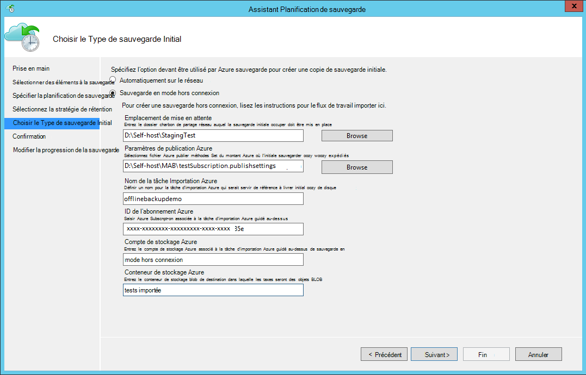

    Voici l’écran correspondante dans System Center Data Protection Manager :  
    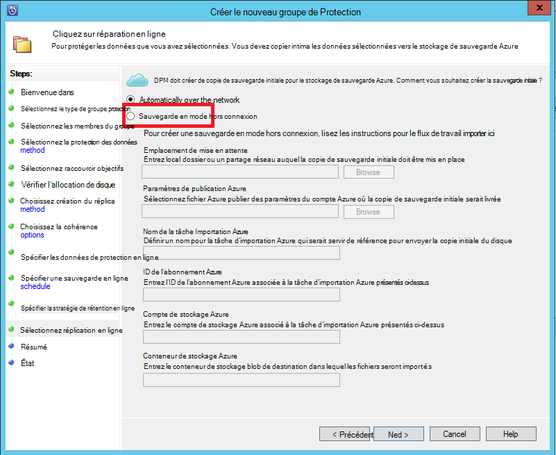

    La description des entrées est la suivante :

    - **Emplacement de mise en attente**: l’emplacement de stockage temporaire dans lequel la copie de sauvegarde initiale est écrit. Il peut s’agir sur un partage réseau ou un ordinateur local. Si l’ordinateur de copie et de l’ordinateur source sont différents, il est recommandé que vous spécifiez le chemin d’accès complet du réseau de l’emplacement de mise en attente.
    - **Nom de la tâche Importation Azure**: le nom unique par importation Azure Azure sauvegarde et service suivre le transfert de données envoyées sur disques à Azure.
    - **Paramètres de publication Azure**: fichier XML qui contient des informations sur votre profil de l’abonnement. Il contienne également des informations d’identification sécurisées qui sont associées à votre abonnement. Vous pouvez [Télécharger le fichier](https://manage.windowsazure.com/publishsettings). Fournir le chemin d’accès local pour le fichier de paramètres de publication.
    - **ID de l’abonnement Azure**: Azure l’ID de l’abonnement de l’abonnement dans lequel vous prévoyez de lancer la tâche d’importation Azure. Si vous avez plusieurs abonnements Azure, utilisez l’ID de l’abonnement auquel vous souhaitez associer à la tâche d’importation.
    - **Compte de stockage Azure**: le compte de stockage de type classique dans l’abonnement Azure fourni qui sera associé à la tâche d’importation Azure.
    - **Conteneur de stockage Azure**: le nom du blob de stockage de destination dans le compte de stockage Azure dans lequel les données de cette tâche sont importées.

    > [AZURE.NOTE] Si vous avez enregistré votre serveur à un archivage sécurisé Azure les Services de récupération à partir du [portail Azure](https://portal.azure.com) pour vos sauvegardes et se trouvent pas sur un abonnement Cloud Solution fournisseur (fournisseur), vous pouvez toujours créer un compte de stockage de type classique à partir du portail Azure et utilisez-le pour le flux de travail de sauvegarde hors connexion.

    Enregistrer toutes ces informations, car vous devrez entrer à nouveau les étapes suivantes. Uniquement l' *emplacement intermédiaire* est obligatoire si vous avez utilisé l’outil de préparation du disque Azure pour préparer les disques.    

2. Terminer le flux de travail, puis **Sauvegarder maintenant** dans la console de gestion de sauvegarde Azure pour lancer la copie de sauvegarde en mode hors connexion. La sauvegarde initiale est écrites dans la zone de travail dans le cadre de cette étape.

    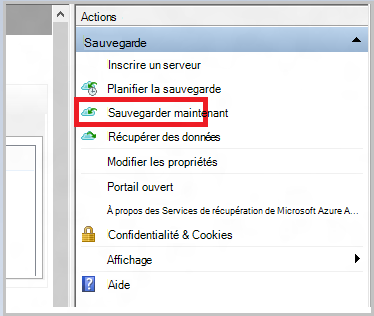

    Pour terminer le flux de travail correspondant dans System Center Data Protection Manager, avec le bouton droit du **Groupe de Protection**, puis choisissez l’option **point de récupération de créer** . Vous puis choisissez l’option **Protection en ligne** .

    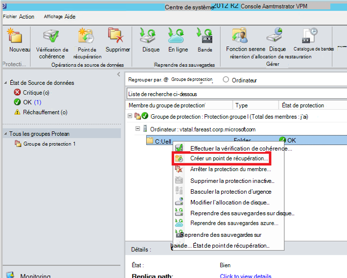

    Une fois l’opération terminée, l’emplacement intermédiaire est prêt à être utilisé pour la préparation du disque.

    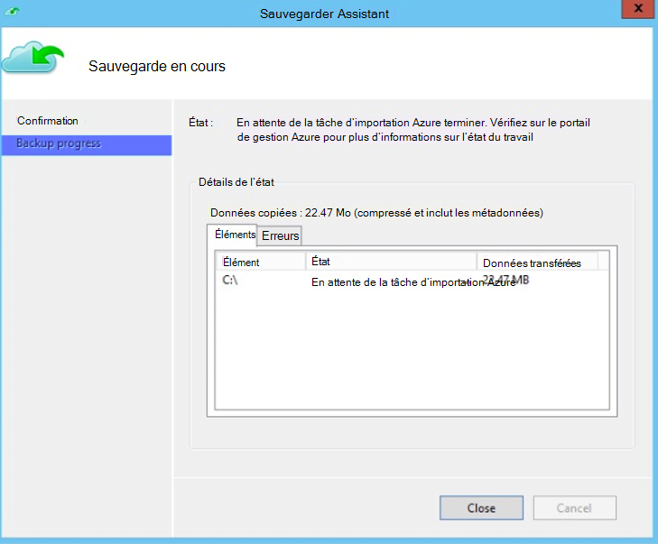

### Préparer un disque et créer une tâche d’importation Azure à l’aide de l’outil de préparation du disque Azure
L’outil de préparation du disque Azure est disponible dans le répertoire d’installation de l’agent de Services de récupération (mettre à jour août 2016 et versions ultérieures) à l’emplacement suivant.

   *\Microsoft* *Azure* *Récupération* *Services* * Agent\Utils\*

1. Accédez à l’annuaire et copiez le répertoire **AzureOfflineBackupDiskPrep** sur un ordinateur de copie montage sur lequel les lecteurs à être préparé. Vérifiez les points suivants en ce qui concerne l’ordinateur de copie :

      - L’ordinateur copie peut accéder à l’emplacement intermédiaire pour le flux de travail en mode hors connexion ensemencement en utilisant le même chemin d’accès réseau qui ont été fournie dans le flux de travail **initier sauvegarde en mode hors connexion** .

      - BitLocker est activé sur l’ordinateur.

      - L’ordinateur peut accéder au portail Azure.

      Si nécessaire, l’ordinateur copie peut être identique à l’ordinateur source.

2. Ouvrez une invite de commandes avec élévation de privilèges sur l’ordinateur de copie avec l’annuaire de l’outil préparation du disque Azure en tant que le répertoire en cours, puis exécutez la commande suivante :

      S *.\AzureOfflineBackupDiskPrep.exe* : <*Chemin d’accès intermédiaire*> [p : <*chemin d’accès au PublishSettingsFile*>]

| Paramètre | Description
|-------------|-------------|
|s : <*Chemin d’accès de mise en attente*> | Entrée obligatoire qui est utilisée pour fournir le chemin d’accès à l’emplacement intermédiaire que vous avez entrées dans le flux de travail **initier sauvegarde en mode hors connexion** . |
|p : <*chemin d’accès au PublishSettingsFile*> | Entrée facultative qui est utilisée pour fournir le chemin d’accès au fichier de **Paramètres de publication Azure** que vous avez entrées dans le flux de travail **initier sauvegarde en mode hors connexion** . |

> [AZURE.NOTE] La &lt;chemin d’accès au PublishSettingFile&gt; valeur est obligatoire lors de l’ordinateur de copie et de l’ordinateur source sont différents.

Lorsque vous exécutez la commande, l’outil demande la sélection de l’importation Azure qui correspond aux lecteurs qui doivent être ouverts. Si une seule une tâche d’importation unique est associée à l’emplacement intermédiaire fourni, vous voyez un écran semblable à celui qui suit.

   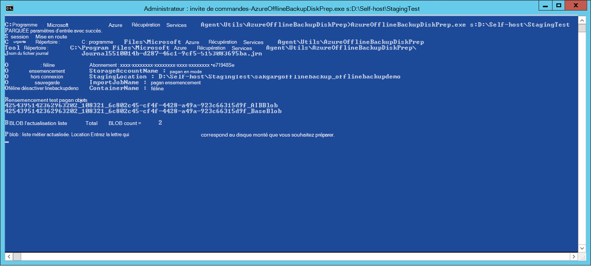  
3. Entrez la lettre sans le symbole : à droite pour le disque monté que vous souhaitez préparer pour le transfert dans Azure. Fournir une confirmation pour la mise en forme du lecteur lorsque vous y êtes invité.

L’outil commence alors préparer le disque avec les données de sauvegarde. Vous devrez peut-être joindre des disques supplémentaires lorsque vous y êtes invité par l’outil au cas où le disque fourni ne dispose pas de suffisamment d’espace pour les données de sauvegarde.  

À la fin de réussite de l’exécution de l’outil, un ou plusieurs disques que vous avez fourni sont prêtes pour l’envoi vers Azure. En outre, une tâche d’importation avec le nom que vous avez fourni pendant le flux de travail **initier sauvegarde en mode hors connexion** est créée dans le portail classique Azure. Enfin, l’outil affiche l’adresse d’expédition au centre de données Azure où les disques doivent être expédiés et le lien pour localiser la tâche d’importation dans le portail classique Azure.

    
4. Envoyer les disques à l’adresse de l’outil fourni et conserver le numéro de suivi pour référence ultérieure. 
5. Lorsque vous accédez au lien qui affiche l’outil, vous voyez le compte de stockage Azure que vous avez spécifié dans le flux de travail **initier sauvegarde en mode hors connexion** . Vous pouvez visualiser ici la tâche d’importation nouvellement créé sous l’onglet **Importer/exporter** du compte de stockage.

   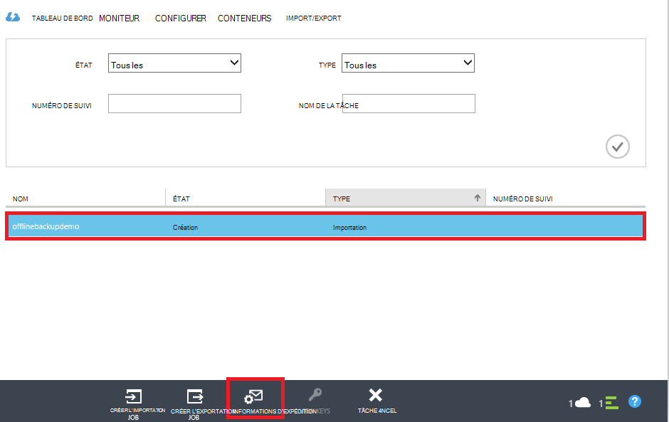 
6. Cliquez sur **Informations de livraison** dans la partie inférieure de la page pour mettre à jour vos coordonnées, comme indiqué dans l’écran suivant. Microsoft utilise ces informations pour envoyer vos disques avec vous lorsque la tâche d’importation est terminée.

   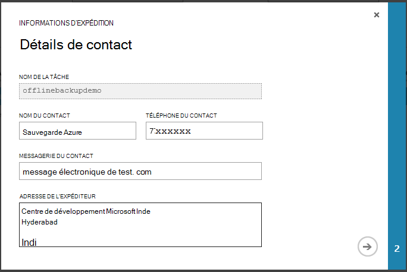 
7. Entrez les détails d’expédition dans l’écran suivant. Fournissez les informations de **Remise Carrier** et **Numéro de référence** qui correspondent aux disques duquel vous avez acheté au centre de données Azure.

   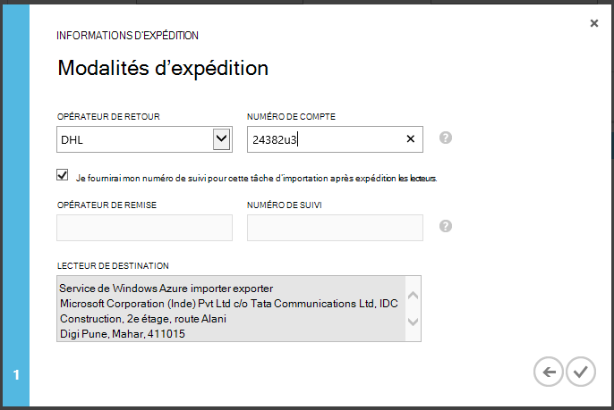 

### Terminer le flux de travail
Une fois la tâche d’importation terminée, les données de sauvegarde initiales sont disponibles dans votre compte de stockage. L’agent de Services de récupération puis copie la valeur des données à partir de ce compte à l’archivage sécurisé sauvegarde ou les Services de récupération vault, selon ce qui est applicable. Dans la prochaine fois sauvegarde planifiée, l’agent de sauvegarde Azure effectue la sauvegarde incrémentielle sur la copie de sauvegarde initiale.

> [AZURE.NOTE] Les sections suivantes s’appliquent aux utilisateurs des versions antérieures de sauvegarde Azure qui n’ont pas accès à l’outil de préparation du disque Azure.

### Préparer un disque

1. Téléchargez l' [Outil d’importation/exportation de Microsoft Azure](http://go.microsoft.com/fwlink/?linkid=301900&clcid=0x409) sur l’ordinateur de copie. Vérifiez que l’emplacement intermédiaire est accessible à partir de l’ordinateur dans lequel vous souhaitez exécuter le jeu de commandes suivant. Si nécessaire, l’ordinateur copie peut être identique à l’ordinateur source.

2. Décompressez le fichier WAImportExport.zip. Exécutez l’outil WAImportExport qui met en forme le SATA, écrit les données de sauvegarde et au disque et le chiffre. Avant d’exécuter la commande suivante, vérifiez que BitLocker est activé sur l’ordinateur.  

    *.\WAImportExport.exe PrepImport /j: <* JournalFile*> .jrn /id : <*ID de session*> /sk : <*StorageAccountKey*> /BlobType :**PageBlob* * /t: <*TargetDriveLetter*>/mettre en forme / chiffrer /srcdir : <*emplacement intermédiaire*> /dstdir : <*DestinationBlobVirtualDirectory*>/*

    > [AZURE.NOTE] Si vous avez installé la mise à jour août 2016 de sauvegarde Azure (ou version ultérieure), vérifiez que l’emplacement intermédiaire que vous avez entré est identique à celle de l’écran **Sauvegarder maintenant** et contient des fichiers AIB et Blob de Base.

| Paramètre | Description
|-------------|-------------|
| /j: <*JournalFile*>| Le chemin d’accès au fichier journal. Chaque lecteur doit disposer d’un fichier journal. Le fichier journal ne doit pas être sur le lecteur cible. L’extension de fichier journal est .jrn et est créée dans le cadre de l’exécution de cette commande.|
|/ID : <*ID de session*> | L’ID de session identifie une session de copie. Il est utilisé pour garantir la restauration précise d’une session de copie interrompue. Fichiers qui sont copiés dans une session de copie sont stockés dans un répertoire nommé après l’ID de session sur le lecteur cible.|
| /SK : <*StorageAccountKey*> | La clé de compte pour le compte de stockage à laquelle les données sont importées. La clé doit être identique à celle qu’il a été entré lors de la création de groupes de sauvegarde/protection de la stratégie.|
| / BlobType | Le type d’objets blob. Ce flux de travail a réussi uniquement si **PageBlob** est spécifié. Ce n’est pas l’option par défaut et doit être mentionné dans cette commande. |
|/ t: <*TargetDriveLetter*> | La lettre sans le symbole : à droite du disque dur cible de la session de copie active.|
|/ format | L’option pour mettre en forme le lecteur. Spécifiez ce paramètre lorsque le lecteur doit être mis en forme ; dans le cas contraire, omettez. Avant de l’outil met en forme le lecteur, il vous invite à une confirmation de la console. Pour supprimer la confirmation, spécifiez le paramètre /silentmode.|
|/ chiffrer | L’option pour chiffrer le lecteur. Spécifiez ce paramètre lorsque le lecteur n’a pas encore été chiffré avec BitLocker et doit être chiffrée par l’outil. Si le lecteur a déjà été chiffré avec BitLocker, omettez ce paramètre, spécifiez le paramètre /bk et fournir la clé BitLocker existante. Si vous définissez le paramètre/Format, vous devez également spécifier le / chiffrer paramètre. |
|/srcdir : <*SourceDirectory*> | Le répertoire source qui contient des fichiers à copier dans le lecteur de destination. Assurez-vous que le nom du répertoire spécifié dispose d’un chemin d’accès complet au lieu de relative.|
|/dstdir : <*DestinationBlobVirtualDirectory*> | Le chemin d’accès au répertoire virtuel de destination dans votre compte de stockage Azure. Veillez à utiliser des noms de conteneur valide lorsque vous spécifiez les répertoires virtuels de destination ou des objets BLOB. N’oubliez pas que les noms de conteneurs doivent être en minuscules.  Ce nom de conteneur doit être celle que vous avez entré lors de la création de groupes de sauvegarde/protection de la stratégie.|

  > [AZURE.NOTE] Un fichier journal est créé dans le dossier WAImportExport qui comporte les informations du flux de travail entiers. Vous avez besoin de ce fichier lorsque vous créez une tâche d’importation dans le portail Azure.

  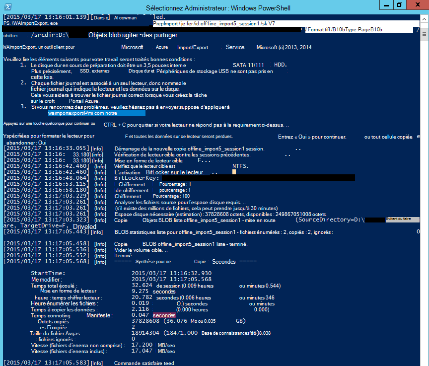

### Créer une tâche d’importation dans le portail Azure
1. Accédez à votre compte de stockage sur le [portail classique Azure](https://manage.windowsazure.com/), cliquez sur **Importer/exporter**, puis sur **Créer un travail importer** dans le volet Office.

    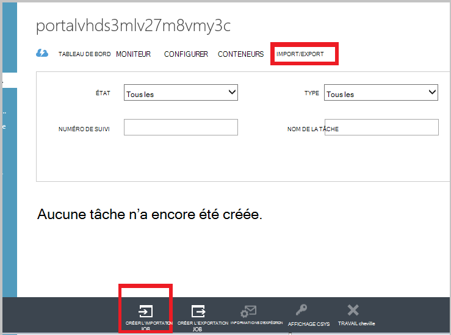

2. À l’étape 1 de l’Assistant, indiquent que vous avez préparé votre lecteur et que vous avez le fichier de feuille de lecteur disponible.
3. Étape 2 de l’Assistant, fournissent des informations de contact pour la personne qui est chargée de cette tâche d’importation.
4. À l’étape 3, téléchargez les fichiers de feuille de lecteur que vous avez obtenu dans la section précédente.
5. À l’étape 4, entrez un nom descriptif pour la tâche d’importation que vous avez entré lors de la création de groupes de sauvegarde/protection de la stratégie. Le nom que vous entrez peut contenir uniquement des lettres minuscules, des nombres, des tirets et des traits de soulignement, doit commencer par une lettre et ne peut pas contenir d’espaces. Le nom que vous choisissez est utilisé pour effectuer le suivi de vos tâches lorsqu’ils sont en cours et lorsqu’elles sont terminées.
6. Ensuite, sélectionnez votre région centre de données dans la liste. La zone Centre de données indique le centre de données et l’adresse vers lesquelles vous devez livrer votre package.

    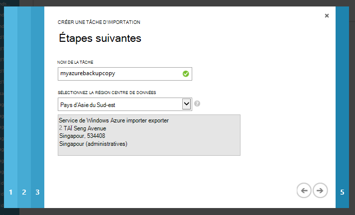

7. À l’étape 5, sélectionnez votre opérateur expéditeur dans la liste et entrez votre numéro de compte transporteur. Microsoft utilise ce compte pour envoyer vos lecteurs vous une fois votre tâche d’importation est terminé.

8. Envoyer le disque et entrez le numéro de suivi pour effectuer le suivi de l’état de la livraison. Une fois le disque arrive dans le centre de données, il est copié dans le compte de stockage et l’état est mis à jour.

    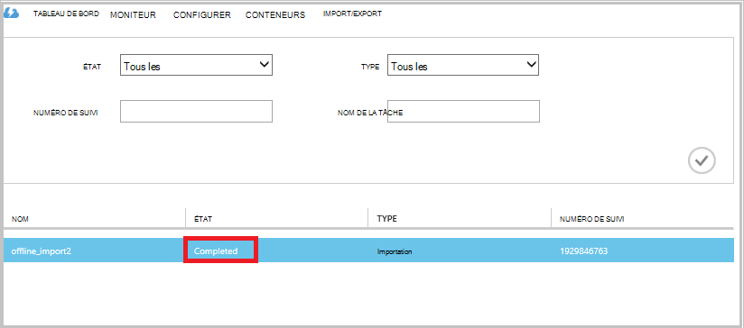

### Terminer le flux de travail
Une fois que les données de sauvegarde initiales sont disponibles dans votre compte de stockage, l’agent de Services de récupération de Microsoft Azure copie la valeur des données à partir de ce compte dans l’archivage sécurisé sauvegarde ou vault de Services de récupération, selon ce qui est applicable. Dans la prochaine fois sauvegarde planification, l’agent de sauvegarde Azure effectue la sauvegarde incrémentielle sur la copie de sauvegarde initiale.

## Étapes suivantes
- Vous avez des questions sur le flux de travail Azure importer/exporter, reportez-vous à [utiliser le service Microsoft Azure importer/exporter pour transférer des données vers le stockage Blob](../storage/storage-import-export-service.md).
- Reportez-vous à la section sauvegarde hors connexion de la sauvegarde Azure [Forum aux questions sur](backup-azure-backup-faq.md) vous avez des questions sur le flux de travail.
